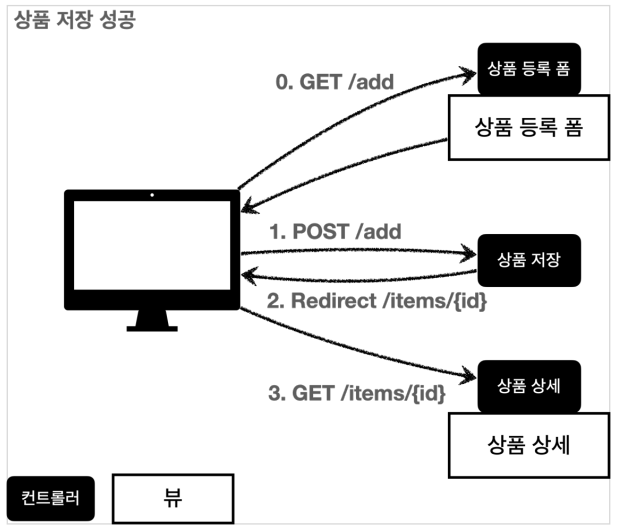

# 10. 검증1 - Validation

## 검증 요구사항

지금까지 만들었던 상품 관리 시스템에 새로운 로직을 추가한다.

### 요구사항: 검증 로직 추가
- 타입 검증
    - 가격, 수량에 문자가 들어가면 검증 오류 처리
- 필드 검증
    - 상품명: 필수, 공백X
    - 가격: 1000원 이상, 1백만원 이하
    - 수량: 최대 9999
- 특정 필드의 범위를 넘어서는 검증
    - 가격 * 수량의 합은 10,000원 이상

지금까지 만든 웹 어플리케이션은 폼 입력시 숫자를 문자로 작성하거나해서 검증 오류가 발생하면 오류 화면으로 바로 이동한다.  

웹 서비스는 폼 입력시 오류가 발생하면, 고객이 입력한 데이터를 유지한 상태로 어떤 오류가 발생했는지 친절하게 알려주어야 한다.

## 참고
- 클라이언트 검증은 조작할 수 있으므로 보안에 취약하다.
- 서버만으로 검증하면, 즉각적인 고객 사용성이 부족하다.
- 둘을 적절히 섞어서 사용하되, 최종적으로 서버 검증은 필수다.
- API 방식을 사용하면 API 스펙을 잘 정의해서 검증 오류를 API 응답 결과를 잘 남겨주어야 한다.

---

## 검증 직접 처리 - 소개

**상품 저장 성공**  

사용자가 상품 등록 폼에서 정상 범위의 데이터를 입력하면,  
서버에서는 검증 로직이 통과하고, 상품을 저장하고, 상품 상세화면으로 redirect한다.

**상품 저장 검증 실패**

서버 검증 로직에 실패했을 경우 고객에게 다시 상품 등록 폼을 보여주고, 어떤 값을 잘못 입력했는지 친절하게 알려주어야 한다.

---

## 검증 직접 처리 - 개발

