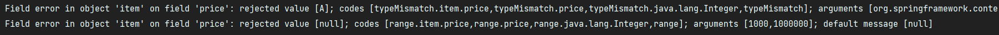
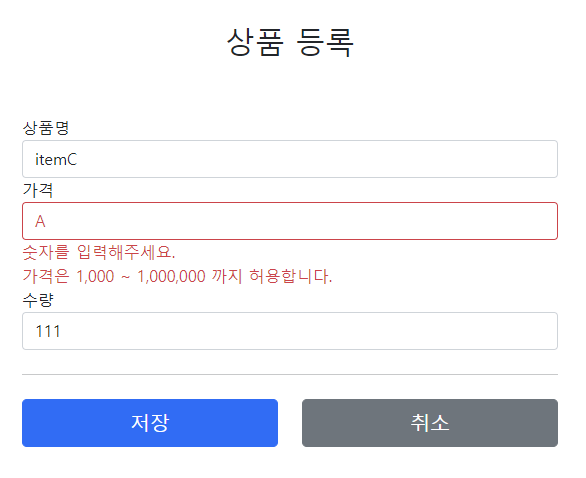

# 10. 검증1 - Validation

## 오류 코드와 메시지 처리1

```java
public FieldError(String objectName, String field, String defaultMessage);

public FieldError(String objectName, String field, @Nullable Object 
rejectedValue, boolean bindingFailure, @Nullable String[] codes, @Nullable
Object[] arguments, @Nullable String defaultMessage)
```

FieldError, ObjectError의 생성자는 errorCode, arguments를 제공한다. 이것은 오류 발생시 오류 코드로 메시지를 찾기 위해 사용된다.

### errors.properties 추가
```properties
required.item.itemName=상품 이름은 필수입니다.
range.item.price=가격은 {0} ~ {1} 까지 허용합니다.
max.item.quantity=수량은 최대 {0} 까지 허용합니다.
totalPriceMin=가격 * 수량의 합은 {0}원 이상이어야 합니다. 현재 값 = {1}
```

### 스프링 부트 메시지 설정 추가
```spring.messaages.basename=messages, errors```

스프링 부트가 해당 메시지 파일을 인식할 수 있게 다음 설정을 추가한다.  
이렇게 하면 messages.properties, errors.properties 두 파일을 모두 인식한다. (생략하면 messages.properties를 기본으로 인식한다.)  
  
errors에 등록한 메시지를 사용하도록 코드를 변경하자

```java
@PostMapping("/add")
public String addItemV3(@ModelAttribute Item item, BindingResult bindingResult, RedirectAttributes redirectAttributes) {

    if (!StringUtils.hasText(item.getItemName())) {
        bindingResult.addError(new FieldError("item", "itemName", item.getItemName(), false,
            new String[]{"required.item.itemName"}, null, null));
    }
    if (item.getPrice() == null || item.getPrice() < 1000 || item.getPrice() > 1000000) {
        bindingResult.addError(new FieldError("item", "price", item.getPrice(), false,
            new String[]{"range.item.price"}, new Object[]{1000, 1000000}, null));
    }
    if (item.getQuantity() == null || item.getQuantity() > 10000) {
        bindingResult.addError(new FieldError("item", "quantity", item.getQuantity(), false,
            new String[]{"max.item.quantity"}, new Object[]{9999}, null));
    }

    if (item.getPrice() != null && item.getQuantity() != null) {
        int resultPrice = item.getPrice() * item.getQuantity();
        if (resultPrice < 10000) {
            bindingResult.addError(new ObjectError("item", new String[]{"totalPriceMin"},  new Object[]{10000, resultPrice}, null));
        }
    }
    
    if (bindingResult.hasErrors()) {
        log.info("errors={}", bindingResult);
        return "validation/v2/addForm";
    }


    Item savedItem = itemRepository.save(item);
    redirectAttributes.addAttribute("itemId", savedItem.getId());
    redirectAttributes.addAttribute("status", true);
    return "redirect:/validation/v2/items/{itemId}";
}
```

- new String codes\[]: 메시지 코드를 지정한다. 메시지 코드는 하나가 아니라 배열로 여러 값을 전달할 수 있는데 순서대로 매칭해서 처음 매칭되는 메시지가 사용된다.
- arguments: Object\[]{1000, 1000000}를 사용해서 코드의 {0}, {1}로 치환할 값을 전달한다.

---

## 오류 코드와 메시지 처리2

FieldError, ObjectError는 다루기 너무 번거롭다.  
  
컨트롤러에서 BindingResult는 검증해야 할 객체인 target 바로 다음에 온다.  
따라서 BindingResult는 이미 본인이 검증해야 할 객체인 target을 알고있다.  
  
BindingResult가 제공하는 rejectValue(), reject()를 사용하면  
FieldError, ObjectError를 직접 생성하지 않고 깔끔하게 검증 오류를 다룰 수 있다  
  
rejectValue(), reject()를 사용해서 기존 코드를 단순화해보자.

```java
if (!StringUtils.hasText(item.getItemName())) {
    bindingResult.rejectValue("itemName", "required");
}
if (item.getPrice() == null || item.getPrice() < 1000 || item.getPrice() > 1000000) {
    bindingResult.rejectValue("price", "range", new Object[]{1000, 1000000}, null);
}
if (item.getQuantity() == null || item.getQuantity() > 10000) {
    bindingResult.rejectValue("quantity", "max", new Object[]{9999}, null);
}

if (item.getPrice() != null && item.getQuantity() != null) {
    int resultPrice = item.getPrice() * item.getQuantity();
    if (resultPrice < 10000) {
        bindingResult.reject("totalPriceMin", new Object[]{10000, resultPrice}, null);
    }
}
```

### rejectValue()
```java
void rejectValue(@Nullable String field, String errorCode,
        @Nullable Object[] errorArgs, @Nullable String defaultMessage);
```

BindingResult는 어떤 객체를 대상으로 검증하는지 target을 이미 알고 있기 때문에 target(item)에 대한 정보는 없어도 된다.  
  
FieldError()를 직접 다룰 때는 오류 코드를 range.item.price와 같이 모두 입력했다.  
그런데 rejectValue를 사용하고 부터는 오류 코드를 range로 간단하게 입력했다. 그래도 오류 메시지를 잘 찾아서 출력한다.  
이 부분을 이해하려면 MessageCodesResolver를 이해해야한다.

---

## 오류 코드와 메시지 처리3

오류 코드를 만들 때 자세히 만들 수도 있고, 단순하게 만들 수도 있다.

- required.item.itemName: 상품 이름은 필수 입니다.
- range.item.price: 상품의 가격 범위 오류입니다.
- required: 필수 값 입니다.
- range: 범위 오류 입니다.

단순하게 만들면 범용성이 좋아서 여러곳에서 사용할 수 있지만, 메시지를 세밀하게 작성하기 어렵다.  
가장 좋은 방법은 범용성으로 사용하다가, 세밀하게 작성해야 하는 경우에는 세밀한 내용이 적용되도록 메시지에 단계를 두는 방법이다.

```properties
#Level1
required.item.itemName: 상품 이름은 필수 입니다.

#Level2
required: 필수 값 입니다.
```

스프링은 MessageCodesResolber라는 것으로 이러한 기능을 지원한다.

---

## 오류 코드와 메시지 처리4

### MessageCodesResolverTest
```java
package hello.itemservice.validation;

import org.assertj.core.api.Assertions;
import org.junit.jupiter.api.Test;
import org.springframework.validation.DefaultMessageCodesResolver;
import org.springframework.validation.MessageCodesResolver;

import static org.assertj.core.api.Assertions.*;

public class MessageCodesResolverTest {

    MessageCodesResolver codesResolver = new DefaultMessageCodesResolver();
    
    @Test
    void messageCodesResolverObject() {
        String[] messageCodes = codesResolver.resolveMessageCodes("required", "item");
        assertThat(messageCodes).containsExactly("required.item", "required");
    }

    @Test
    void messageCodesResolverField() {
        String[] messageCodes = codesResolver.resolveMessageCodes("required", "item", "itemName", String.class);
        assertThat(messageCodes).containsExactly(
                "required.item.itemName",
                "required.itemName",
                "required.java.lang.String",
                "required"
        );
    }
}
```

### MessageCodesResolver
- 검증 오류 코드로 메시지 코드들을 생성한다.
- MessageCodesResolver 인터페이스이고 DefaultMessageCodesResolver는 기본 구현체이다.
- 주로 다음과 함께 사용한다 ObjectError, FieldError

### DefaultMessageCodesResolver의 기본 메시지 생성 규칙
- 객체 오류의 경우 다음 순서로 2가지 생성
    - 1: code + "." + object name
    - 2: code
- 필드 오류의 경우 다음 순서로 4가지 메시지 코드 생성
    - 1: code + "." + object name + "." + field
    - 2: code + "." + field
    - 3: code + "." + field type
    - 4: code


rejcetValue(), reject()는 내부에서 MessageCodesResolver를 사용한다. 여기에서 메시지 코드들을 생성한다.  
FieldError, ObjectError의 생성자를 보면 오류 코드를 하나가 아니라 여러 오류 코드를 가질 수 있다.  
MessageCodesResolver를 통해서 생성된 순서대로 오류 코드를 보관한다.

### 오류 메시지 출력
타임리프 화면을 렌더링 할 때 th:errors가 실행된다.  
만약 이때 오류가 있다면 생성된 오류 메시지 코드를 순서대로 돌아가면서 메시지를 찾는다. 그리고 없으면 디폴트 메시지를 출력한다.

---

## 오류 코드와 메시지 처리5

MessageCodesResolver는 required.item.itemName처럼 구체적인 것을 먼저 만들어주고,
required처럼 덜 구체적인 것을 가장 나중에 만든다.  
  
모든 오류 코드에 대해서 메시지를 각각 다 정의하면 개발자 입장에서 너무 힘들기 때문에 크게 중요하지 않은 메시지는  
범용성 있는 required 같은 메시지로 끝내고, 정말 중요한 메시지는 꼭 필요할 때 구체적으로 적어서 사용하는 방식이 더 효과적이다.

```properties
#required.item.itemName=상품 이름은 필수입니다.
#range.item.price=가격은 {0} ~ {1} 까지 허용합니다.
#max.item.quantity=수량은 최대 {0} 까지 허용합니다.
#totalPriceMin=가격 * 수량의 합은 {0}원 이상이어야 합니다. 현재 값 = {1}

#==ObjectError==
#Level1
totalPriceMin.item=상품의 가격 * 수량의 합은 {0}원 이상이어야 합니다. 현재 값 = {1}

#Level2 - 생략
totalPriceMin=전체 가격은 {0}원 이상이어야 합니다. 현재 값 = {1}


#==FieldError==
#Level1
required.item.itemName=상품 이름은 필수입니다.
range.item.price=가격은 {0} ~ {1} 까지 허용합니다.
max.item.quantity=수량은 최대 {0}까지 허용합니다.

#Level2 - 생략

#Level3
required.java.lang.String = 필수 문자입니다.
required.java.lang.Integer = 필수 숫자입니다.
min.java.lang.String = {0} 이상의 문자를 입력해주세요.
min.java.lang.Integer = {0} 이상의 숫자를 입력해주세요.
range.java.lang.String = {0} ~ {1} 까지의 문자를 입력해주세요.
range.java.lang.Integer = {0} ~ {1} 까지의 숫자를 입력해주세요.
max.java.lang.String = {0} 까지의 문자를 허용합니다.
max.java.lang.Integer = {0} 까지의 숫자를 허용합니다.

#Level4
required = 필수 값 입니다.
min = {0} 이상이어야 합니다.
range = {0} ~ {1} 범위를 허용합니다.
max = {0} 까지 허용합니다.
```

크게 객체 오류와 필드 오류를 나눈다, 그리고 범용성에 따라 레벨을 나누었다.

itemName의 경우 required 검증 오류 메시지가 발생하면 다음 코드 순서대로 메시지가 생성된다.
1. required.item.itemName
2. required.itemName
3. required.java.lang.String
4. required

그리고 이렇게 생성된 메시지 코드를 기반으로 순서대로 MessageSource에서 메시지를 찾는다.

---

## 오류 코드와 메시지 처리6

검증 오류 코드는 다음과 같이 2가지로 나눌 수 있다.
- 개발자가 직접 설정한 오류 코드: rejectValue()를 직접 호출
- 스프링이 직접 검증 오류에 추가한 경우

price 필드에 문자를 입력해보자  
로그를 확인해보면 BindingResult에 FieldError가 담겨있고, 다음과 같은 메시지 코드들이 생성된 것을 확인할 수 있다.



다음과 같이 4가지 메시지 코드가 입력되어 있는 것을 볼 수 있다.
- typeMismatch.item.price
- typeMismatch.price
- typeMismatch.java.lang.Integer
- typeMismatch

스프링은 타입 오류가 발생하면 typeMismatch라는 오류 코드를 사용하는 것을 알 수 있다.  
이 오류 코드가 MessageCodesResolver를 통하면서 4가지 메시지 코드가 생성된 것이다.  
  
error.properties에 typeMismatch에 관한 메시지 코드를 추가한다.

```properties
typeMismatch.java.lang.Integer=숫자를 입력해주세요.
typeMismatch=타입 오류입니다.
```



결과적으로 소스코드를 하나도 건들지 않고, 원하는 메시지를 단계별로 설정할 수 있다.

---

### Reference
- [스프링 MVC 2편 - 백엔드 웹 개발 핵심 기술](https://www.inflearn.com/course/%EC%8A%A4%ED%94%84%EB%A7%81-mvc-2/dashboard)
