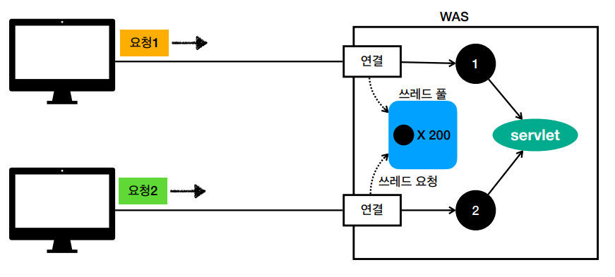

# 웹 애플리케이션 이해


## 서블릿

- 만약 개발자가 웹 애플리케이션 서버를 직접 구현해야 한다면?
  - 서버 TCP/TP 연결 대기, 소켓 연결
  - HTTP 요청 데이터를 파싱, 읽어들임
  - POST 방식, /save URL 인지...
  - ....
  - 개발자가 해야 할 일이 너무 많다.
- 서블릿은 개발자가 비즈니스 로직을 설계하는데 집중 할 수 있도록 다양한 로직들을 자동화를 지원한다.


```java
@WebServlet(name = "helloServlet", urlPatterns = "/hello")
public class HelloServlet extends HttpServlet {

  @Override
  protected void service(HttpServletRequest request, HttpServletResponse response){
    //애플리케이션 로직
  }
}
```

- Http 요청 정보를 편리하게 사용할 수 있는 HttpServletRequest
- Http 요청 정보를 편리하게 제공할 수 있는 HttpServletResponse
- 개발자는 Http 스펙을 매우 편리하게 사용할 수 있다.

### 서블릿 컨테이너
- 톰캣처럼 서블릿을 지원하는 WAS를 서블릿 컨테이너라 한다.
- 서블릿 컨테이너는 서블릿 객체를 생성, 초기화, 호출, 종료하는 생명주기를 관리해준다.
- 서블릿 객체는 싱글톤으로 관리.
  - 요청이 올 때 마다 계속 객체를 생성하는것은 비효율
  - 최초 로딩 시점에 서블릿 객체를 미리 만들어두고 재활용
  - 모든 고객 요청은 동일한 서블릿 객체 인스턴스에 접근
  - !! 공유 변수 사용을 주의해야한다.
  - 서블릿 컨테이너 종료시 함께 종료
- JSP도 서블릿으로 변환되어서 사용이 된다.
- !! 동시 요청을 위한 멀티 쓰레드 지원을 해주는게 가장 핵심.
---
## 쓰레드

### 요청 마다 쓰레드 생성

- 장점
  - 동시 요청을 처리할 수 있다.
  - 리소스(CPU, 메모리)가 허용할 때 까지 처리가능
  - 하나의 쓰레드가 지연 되어도, 나머지 쓰레드는 정상 동작
- 단점
  - 쓰레드의 생성 비용은 매우 비쌈 -> 고객의 요청이 올 때 마다 쓰레드를 생성하면, 응답 속도가 늦어짐
  - 쓰레드는 컨텍스트 스위칭 비용이 발생
  - 쓰레드 생성에 제한이 없다 -> 고객 요청이 너무 많이 오면, CPU, 메모리 임게점을 넘어서 서버가 다운될 수 있다.

  
### 쓰레드 풀

- 특징
  - 쓰레드를 쓰레드 풀에 보관하고 관리한다.
  - 쓰레드 풀에 생성 가능한 쓰레드의 최대치를 관리한다.
- 사용
  - 쓰레드가 필요하면, 이미 생성되어 있는 쓰레드를 풀에서 꺼내서 사용한다.
  - 사용을 종료하면 풀에 해당 쓰레드를 반납한다.
- 장점
  - 쓰레드가 미리 생성되어 있어 비용이 절약되고 응답시간이 빠르다.
  - 생성 가능한 쓰레드의 최대치가 있으므로 너무 많은 요청이 들어와도 기존 요청은 안전하게 처리할 수 있다.

### WAS의 멀티 쓰레드 지원
- WAS가 멀티 쓰레드를 지원해 주어 개발자가 멀티 쓰레드 관련 코드를 신경쓰지 않아도 된다.
- 마치 싱글 쓰레드 프로그래밍을 하듯이 편리하게 소스 코드 개발이 가능하다.
- 멀티 쓰레드 환경이므로 싱글톤 객체는 주의해서 사용해야 한다.
---

## HTML, HTTP API, CSR, SSR

### 정적 리소스
- 묘청이 오면 그냥 단순히 Web 서버에서 고정된 HTML 파일, CSS, JS, 이미지, 영상 등을 제공
- 주로 웹 브라우저

### 동적 HTML 페이지
- 요청이 오면 동적으로 필요한 HTML 파일을 WAS 서버에서 생성해서 전달
- 웹 브라우저: HTML 해석만

### HTTP API
- 다양한 시스템에서 호출
- 데이터만 주고 받고 UI 화면이 필요하면 클라이언트가 별도 처리
- 앱, 웹 클라이언트, 서버 to 서버

- 주로 JSON 형태로 데이터 통신 ex) JSON {"주문번호": 100, "금액": 5000}
- UI 클라이언트 접점
  - 앱 클라이언트(아이폰, 안드로이드, PC 앱)
  - 웹 브라우저에서 자바스크립트를 통한 HTTP API 호출
  - React, Vue.js 같은 웹 클라이언트
- 서버 to 서버
  - 주문 서버 -> 결제 서버
  - 기업간 데이터 통신


## 서버사이드 렌더링, 클라이언트 사이드 렌더링

### SSR - 서버 사이드 렌더링
  - HTML 최종 결과를 서버에서 만들어서 웹 브라우저에 전달
  - 주로 정적인 화면에 사용
  - 관련기술: JSP, 타임리프 -> 백엔드 개발자

### CSR - 클라이언트 사이드 랜더링
  - HTML 결과를 자바스크립트를 이용해 웹 브라우저에서 동적으로 생성해서 적용
  - 주로 동적인 화면에 사용
  - ex) 구글 지도, Gmail, 구글 캘린더
  - 관련기술: React, Vue.js -> 웹 프론트엔드 개발자

React, Vue.js를 CSR+SSR 동시에 지원하는 웹 프레임워크도 있다.
SSR을 사용하더라도, 자바스크립트를 통해서 화면 일부를 동적으로 변경 가능.

---

## 자바 웹 기술의 역사

### 과거 기술

- 서블릿 - 1997
  - HTML 생성이 어려움
- JSP - 1999
  - HTML 생성은 편리하지만, 비즈니스 로직까지 너무 많은 역할 담당
- 서블릿, JSP 조합 MVC 패턴 사용
  - 모델, 뷰, 컨트롤러로 역할을 나누어 개발
- MVC 프레임워크 춘추 전국 시대- 2000년초 ~ 2010년초
  - MVC 패턴 자동화, 복잡한 웹 기술을 편리하게 사용할 수 있는 다양한 기능 지원
  - 스트럿츠, 웹워크, 스프링 MVC(과거)

### 현재 사용 기술

- 애노테이션 기반의 스프링 MVC 등장
  - @Controller
  - MVC 프레임워크의 춘추 전국 시대 마무리
 
 - 스프링 부트의 등장
  - 스프링 부트는 서버를 내장
  - 스프링 부트는 빌드 결과(Jar)에 WAS 서버 포함 -> 빌드 배포 단순화

---
### 정리
- 서블릿의 등장으로 다양한 로직들이 자동화 되면서 개발자는 http 스펙을 매우 편리하게 사용할 수 있게 되었고, 비즈니스 로직에 집중할 수 있게 되었다.
- 서블릿을 지원하는 WAS를 서블릿 컨테이너라고 부르고, 개발자를 위해 매우 다양한 기능들을 제공한다.(객체 생성, 초기화, 생명주기관리, 멀티쓰레드 지원 등등..)
#
- 백엔드 개발자가 서비스를 제공할 때 고민해야할 부분은 3가지이다.
  - 정적 리소스를 어떻게 제공할 건지?
  - 동적으로 제공되는 HTML 페이지를 어떻게 제공할 건지?
  - HTTP API 어떻게 제공할 건지?
#
- 서블릿의 등장 이후 JSP, MVC 패턴, 다양한 기술들이 등장하였고 결국 현 시점에는 서블릿 기반 기술인 Spring MVC, Spring Boot가 주류를 차지하고 있다.
- Spring MVC 와 매우 좋은 시너지를 내는 뷰 템플릿, 내추럴 템플릿인 타임리프(Thymeleaf)가 등장하였다.
 ---
### Reference
- [스프링 MVC 1편 - 백엔드 웹 개발 핵심 기술](https://www.inflearn.com/course/%EC%8A%A4%ED%94%84%EB%A7%81-mvc-1/dashboard)

