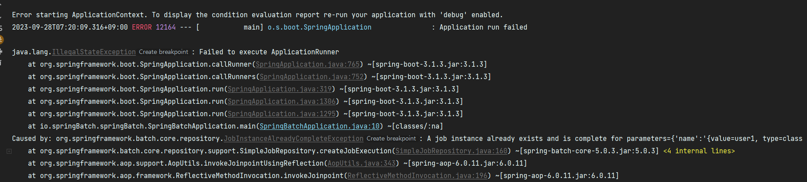
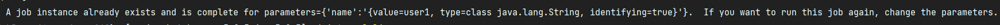
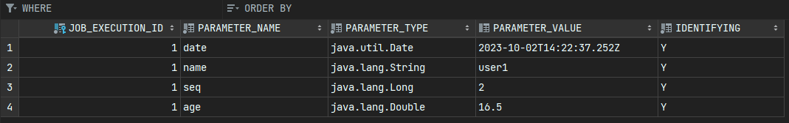
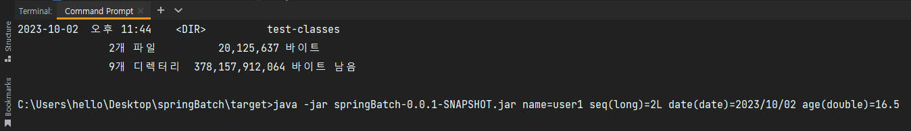

# 스프링 배치 도메인 이해

## Job

Job은 하나의 명세서, 설계도라고 볼 수 있으며  
여러 Step을 포함하고 있는 일종의 컨테이너의 역할을 한다.  

```java
public interface Job {
    String getName();
    default boolean isRestartable() {return true;}
    void execute(JobExecution execution);

    @Nullable
    default JobParametersIncrementer getJobParametersIncrementer() {return null;}
    default JobParametersValidator getJobParametersValidator() {return new DefaultJobParametersValidator();}
}
```
  
배치 계층 구조에서 가장 상위에 있는 개념으로서 하나의 배치작업 자체를 의미하고,  
배치 Job을 구성하기 위한 최상위 인테페이스이며 스프링 배치가 기본 구현체를 제공한다.

#

Job의 기본 구현체로는 *SimpleJob*과 *FlowJob*이 존재한다.  

```java
public class SimpleJob extends AbstractJob {
    private final List<Step> steps;
    ... 생략

    public void addStep(Step step) {
        this.steps.add(step);
    }

    protected void doExecute(JobExecution execution) throws JobInterruptedException, JobRestartException, StartLimitExceededException {
        StepExecution stepExecution = null;
        Iterator var3 = this.steps.iterator();

        while(var3.hasNext()) {
            Step step = (Step)var3.next();
            stepExecution = this.handleStep(step, execution);
            if (stepExecution.getStatus() != BatchStatus.COMPLETED) {
                break;
            }
        }
    ... 생략
  }
}
```

기본 구현체들은 Job을 상속받은 추상클래스 AbstractJob을 상속받은 구조인데,  
이 중에서 SimpleJob의 경우 내부적으로 steps라고 불리는 List변수를 가지고 있고  
Job이 execute되면 순차적으로 Step이 실행되는 형태를 띄고있다.  

---

## Metadata DB Schema


스프링 배치 메타 데이터 테이블은 자동으로 생성되는 테이블 중에 SEQ 테이블 3개를 제외하고  
총 6개가 존재하는데 이 중 Job과 관련된 테이블은 네 가지가 존재한다.  

- BATCH_JOB_INSTANCE
- BATCH_JOB_EXECUTION
- BATCH_JOB_EXECUTION_PARAMS
- BATCH_JOB_EXECUTION_CONTEXT

#

## BATCH_JOB_INSTANCE


BATCH_JOB_INSTANCE 테이블의 정보는 다음과 같다  
> JOB_INSTANCE_ID = 기본 키  
> VERSION = 업데이트 될 때마다 1씩 증가  
> JOB_NAME = Job을 구성할 때 부여하는 Job의 이름  
> JOB_KEY = job_name과 jobParameter를 직렬화하여 해싱한 값을 저장  

  
JobInstance는 Job이 실행될 때 생성되는 Job의 논리적 실행 단위 객체로서 고유하게 식별 가능한 작업 실행을 나타낸다.  
Job의 설정과 구성은 동일하지만 Job이 실행되는 시점에 처리하는 내용은 다르기 때문에 Job의 실행을 구분해줘야한다.  

```java
@Override
public void run(ApplicationArguments args) throws Exception {
    JobParameters jobParameters = new JobParametersBuilder()
            .addString("name", "user1")
            .toJobParameters();

    jobLauncher.run(job, jobParameters);
}
```

JobLauncher는 배치 Job을 실행시킬 때 Job + JobParameter라는 두 개의 인자를 필요로 하며, 
JobRepository는 DB로 부터 JobName과 JobParameter에 해당되는 JobInstance를 확인해서 현재 실행중인 Job이 처음 실행하는 Job인지 확인하는 과정을 거친다.  
  
이 때 만약 해당되는 JobInstance가 없을 경우에는 객체를 새로 만들어 반환하고  
실행시점에 해당되는 JobInstance가 존재한다면 기존 인스턴스를 반환한다음 더이상 Job이 실행되지않고 예외를 발생시킨다.


  

이미 동일한 내용의 Job과 JobParameter로 이루어진 JobInstance가 이미 존재하므로(이전에 실행된 이력이 있으므로)  
다시 실행하고 싶으면 JobParameter의 값을 변경하라는 의미다.  
  
  


JobParameter의 값은 BATCH_JOB_EXECUTION_PARAMS 테이블을 조회하면 쉽게 확인이 가능하다.  
  
위와같은 에러로 JOB_NAME(job)과 JOB_KEY(JobParameter 해시값)이 동일한 값은 중복해서 저장할 수 없고,  
Job과 JobInstance는 근본적으로 1대N 관계를 이루게 된다.

#

## BATCH_JOB_PARAMETER

### JobParameter의 용도 (1)

Job을 실행시키는 클래스 JobLauncher는 Job과 JobParameter 두 개의 인자를 필요로 한다.  
그 중 JobParameter는 Key와 Value로 구성된 Map을 포함하고 있고, 우리가 지정한 Key와 Value는 데이터베이스에 저장된다.  
덕분에 우리는 Job의 실행 단계예서 지정한 Key로 Value를 참조하여 비즈니스 로직에 사용이 가능하다.

### JobParameter의 용도 (2)

JobParameter 덕분에 하나의 Job의 존재할 수 있는 여러개의 JobInstance를 구분이 가능하다.  
그렇기 때문에 JobInstance와 JobParameter는 1대1 관계를 이룬다.

#

```java
@Component
@RequiredArgsConstructor
public class JobRunner implements ApplicationRunner {

    private final JobLauncher jobLauncher;
    private final Job job;

    @Override
    public void run(ApplicationArguments args) throws Exception {

        JobParameters jobParameters = new JobParametersBuilder()
                .addString("name", "user1")
                .addLong("seq", 2L)
                .addDate("date", new Date())
                .addDouble("age", 16.5)
                .toJobParameters();

        jobLauncher.run(job, jobParameters);
    }
}
```

JobParameter의 래퍼 클래스인 JobParamters는 LinkedHashMap<String, JobParameter>를 내부에 포함하고 있는데  
스프링 배치는 우리가 지정할 수 있는 4개의(String, Long, Date, Double) 파라미터 타입을 지원한다.  



#

### JobParameter 참조

```java
@Bean
public Step step1(JobRepository jobRepository, PlatformTransactionManager transactionManager) {
    return new StepBuilder("step1", jobRepository)
            .tasklet(new Tasklet() {
                @Override
                public RepeatStatus execute(StepContribution contribution, ChunkContext chunkContext) throws Exception {
                    System.out.println("step1 was executed");
                    return RepeatStatus.FINISHED;
                }
            }, transactionManager)
            .build();
}
```

우리는 Step단계에서 JobParameters를 참조하여 사용할 수 있다.  
StepContribution와 ChunkContext는 내부에 각각 StepExecution 클래스를 참조하고 있고, StepExecution는   
JobParameters를 속성으로 가지고 있는 JobExecution를 참조하고 있기 때문에  
StepExecution -> JobExecution -> JobParamters 형태로 참조하여 사용할 수 있다.  

```java
JobParameters jobParameters = contribution.getStepExecution().getJobExecution().getJobParameters();
jobParameters.getString("name");
jobParameters.getLong("seq");
jobParameters.getDate("date");
jobParameters.getDouble("age");

Map<String, Object> jobParameters1 = chunkContext.getStepContext().getJobParameters();
```

다만 두 방식에서의 차이점은 위는 JobParameters 객체를 반환하고, 밑은 Map 객체를 반환한다는 점이다.  

#

### Batch jar 실행 시 파라미터 바인딩

JobParameter를 jar 파일 실행 시 주입하여 배치를 실행시킬 수도 있다.  



주의할 점은 실행할 때 파라미터 데이터 타입을 괄호안에 명시해주어야 한다.  
타입을 제대로 명시하지 않거나, 문장에 오류가 있을시에는 에러를 발생시키고 Job이 실행되지 않는다.
