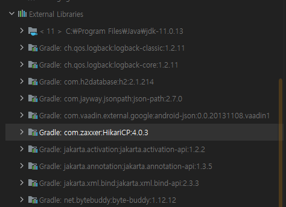
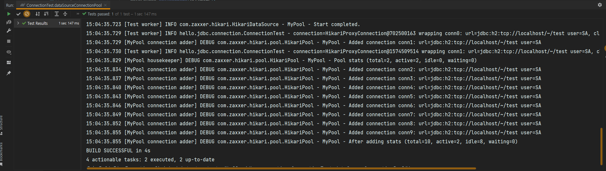
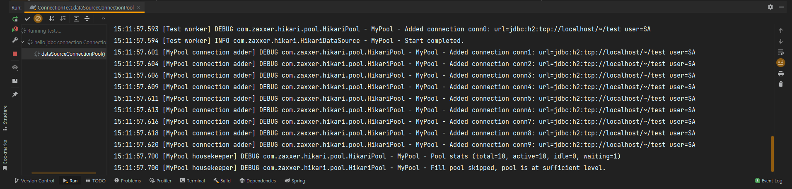
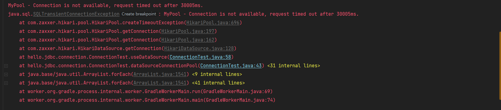

# 2. 커넥션 풀과 데이터소스 이해

## DriverManager vs DataSource

DriverManager와 DataSource의 커넥션을 획득하는 방법 차이

### ConnectionConst
```java
package hello.jdbc.connection;

public class ConnectionConst {
    public static final String URL = "jdbc:h2:tcp://localhost/~/test";
    public static final String USERNAME = "sa";
    public static final String PASSWORD = "";
}
```

### ConnectionTest
```java
package hello.jdbc.connection;

import lombok.extern.slf4j.Slf4j;
import org.junit.jupiter.api.Test;
import org.springframework.jdbc.datasource.DriverManagerDataSource;

import javax.sql.DataSource;
import java.sql.Connection;
import java.sql.DriverManager;
import java.sql.SQLException;

import static hello.jdbc.connection.ConnectionConst.*;

@Slf4j
public class ConnectionTest {

    @Test
    void driveManager() throws SQLException {
        Connection con1 = DriverManager.getConnection(URL, USERNAME, PASSWORD);
        Connection con2 = DriverManager.getConnection(URL, USERNAME, PASSWORD);
        log.info("connection={}, class={}", con1, con1.getClass());
        log.info("connection={}, class={}", con2, con2.getClass());
    }

    @Test
    void dataSourceDriverManager() throws SQLException {
        DriverManagerDataSource dataSource = new DriverManagerDataSource(URL, USERNAME, PASSWORD);
        useDataSource(dataSource);

    }

    private void useDataSource(DataSource dataSource) throws SQLException {
        Connection con1 = dataSource.getConnection();
        Connection con2 = dataSource.getConnection();
        log.info("connection={}, class={}", con1, con1.getClass());
        log.info("connection={}, class={}", con2, con2.getClass());
    }
}
```

DriverManager는 커넥션을 획득할 때 마다 USE, USERNAME, PASSWORD 같은 파라미터를 계속 전달해야 한다.  
반면 DataSource를 사용할 때에는 처음 객체를 생성할 때만 필요한 파라미터를 전달하고,  
커넥션을 획득할 때는 단순히 getConnection() 메소드만 호출하면 된다.  
  
DataSource는 DriverManager와 다르게 설정과 사용이 분리되는 장점이 있다.  
설정과 사용이 분리되면 DataSource를 사용하는 곳에서는 USER, USERNAME, PASSWORD와 같은 속성들에 의존할 필요가 없어진다.  
  
리포지토리는 DataSource에만 의존할 수 있고, 속성은 몰라도 되며  
보통 설정은 한 곳에서 하지만, 사용은 수 많은 곳에서 하기 때문에 향후 설정 코드 변경에 유연하게 대처할 수 있다.

---

## DataSource - 커넥션 풀

### ConnectionTest - DataSource 커넥션 풀

```java
import com.zaxxer.hikari.HikariDataSource;

@Test
void dataSourceConnectionPool() throws SQLException, InterruptedException {
    //커넥션 풀링: HikariProxyConnection(Proxy) -> JdbcConnection(Target)
    HikariDataSource dataSource = new HikariDataSource();
    dataSource.setJdbcUrl(URL);
    dataSource.setUsername(USERNAME);
    dataSource.setPassword(PASSWORD);
    dataSource.setMaximumPoolSize(10);
    dataSource.setPoolName("MyPool");

    useDataSource(dataSource);
    Thread.sleep(1000); // 커넥션이 생성되는 로그를 확인하기 위해 커넥션 생성 시간 대기
}
```

Jdbc를 사용하면 스프링은 자동으로 HikariCP를 임포트 해준다.  
  

HikariDataSource는 DataSource 인터페이스를 구현하고 있다.  
커넥션을 생성하는 작업은 별도의 쓰레드에서 작동한다.  
쓰레드 풀에 커넥션이 생성되는 로그를 확인하려면 Thread.sleep으로 대기시간을 설정해주어야 한다.  
  

결과를 보면 MyPool connection adder라는 별도의 쓰레드가 커넥션 풀에 커넥션을 채우고 있는 것을 알 수 있다.  
setMaximumPoolSize를 이용해 최대 풀 수를 지정할 수 있고,  
코드에서 커넥션 2개를 획득하고 반환하지 않았기 때문에 결과에서 active = 2, idle = 8을 확인할 수 있다.  
  
만약 최대 풀 갯수는 10인데 11개를 획득하게되면  
  
결과와 같이 테스트가 종료되지 않고 계속 기다리게 되다가 오류가 뜨면서 종료된다.

  
풀이 가득 찼을 때 클라이언트가 어느정도 대기하다가 예외를 발생시킬건지 따로 설정할 수 있다.  
코드에서는 아무것도 설정하지 않았기 때문에 30초 정도를 기다렸다가 예외가 발생하면서 종료된 것을 확인할 수 있었다.  
  
https://github.com/brettwooldridge/HikariCP

---

## Reference
- [스프링 DB 1편 - 데이터 접근 핵심 원리](https://www.inflearn.com/course/%EC%8A%A4%ED%94%84%EB%A7%81-db-1/dashboard)
