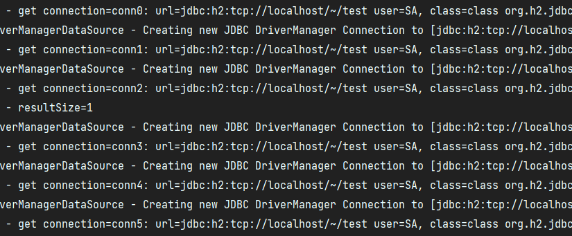

# 2. 커넥션 풀과 데이터 소스 이해

## DataSource 애플리케이션 적용

### MemberRepositoryV1
```java
package hello.jdbc.repository;

import hello.jdbc.connection.DBConnectionUtil;
import hello.jdbc.domain.Member;
import lombok.extern.slf4j.Slf4j;
import org.springframework.jdbc.support.JdbcUtils;

import javax.sql.DataSource;
import java.sql.*;
import java.util.NoSuchElementException;


/**
 * JDBC - DataSource 사용, JdbcUtils 사용
 */
@Slf4j
public class MemberRepositoryV1 {

    private final DataSource dataSource;

    public MemberRepositoryV1(DataSource dataSource) {
        this.dataSource = dataSource;
    }


    public Member save(Member member) throws SQLException {
        String sql = "insert into member(member_id, money) values(?, ?)"; // 데이터베이스에 전달할 SQL 정의

        Connection con = null;
        PreparedStatement pstmt = null;

        try {
            con = getConnection(); // 데이터베이스 커넥션 획득
            pstmt = con.prepareStatement(sql);
            pstmt.setString(1, member.getMemberId()); // SQL 의 첫번째 ?에 값을 지정. 문자이므로 setString
            pstmt.setInt(2, member.getMoney()); // SQL 의 두번째 ?에 값을 지정. Int 형 값이므로 setInt
            pstmt.executeUpdate(); // Statement 를 통해 준비된 SQL 을 커넥션을 이용하여 실제 데이터베이스에 전달
            return member;
        } catch (SQLException e) {
            log.error("db error", e);
            throw e;
        } finally {
            close(con, pstmt, null);
        }
    }

    public Member findById(String memberId) throws SQLException {
        String sql = "select * from member where member_id = ?";

        Connection con = null;
        PreparedStatement pstmt = null;
        ResultSet rs = null; // executeQuery()의 결과를 반환

        try {
            con = getConnection();
            pstmt = con.prepareStatement(sql);
            pstmt.setString(1, memberId);

            rs = pstmt.executeQuery(); // 데이터를 조회할 때는 executeQuery()를 사용한다.

            if (rs.next()) {
                Member member = new Member();
                member.setMemberId(rs.getString("member_id"));
                member.setMoney(rs.getInt("money"));
                return member;
            } else {
                throw new NoSuchElementException("member not found memberId=" + memberId);
            }

        } catch (SQLException e) {
            log.error("db error", e);
            throw e;
        } finally {
            close(con, pstmt, rs);
        }
    }

    public void update(String memberId, int money) throws SQLException {
        String sql = "update member set money=? where member_id=?";

        Connection con = null;
        PreparedStatement pstmt = null;
        try {
            con = getConnection();
            pstmt = con.prepareStatement(sql);
            pstmt.setInt(1, money);
            pstmt.setString(2, memberId);
            int resultSize = pstmt.executeUpdate();
            log.info("resultSize={}", resultSize);
        } catch (SQLException e) {
            log.error("db error", e);
            throw e;
        } finally {
            close(con, pstmt, null);
        }
    }

    public void delete(String memberId) throws SQLException {
        String sql = "delete from member where member_id=?";

        Connection con = null;
        PreparedStatement pstmt = null;

        try {
            con = getConnection();
            pstmt = con.prepareStatement(sql);
            pstmt.setString(1, memberId);
            pstmt.executeUpdate();
        } catch (SQLException e) {
            log.error("db error", e);
            throw e;
        } finally {
            close(con, pstmt, null);
        }
    }

    private void close(Connection con, Statement stmt, ResultSet rs) { // 커넥션 종료
        JdbcUtils.closeResultSet(rs); // 스프링이 JDBC를 편리하게 다룰 수 있는 jdbcUtils라는 편의 메서드 제공
        JdbcUtils.closeStatement(stmt); // 연결의 역순으로 커넥션을 종료시킨다. rs -> stmt -> con
        JdbcUtils.closeConnection(con);
    }

    private Connection getConnection() throws SQLException {
        Connection con = dataSource.getConnection();
        log.info("get connection={}, class={}", con, con.getClass());
        return con;
    }
}
```

### MemberRepositoryV1Test
```java
package hello.jdbc.repository;

import com.zaxxer.hikari.HikariDataSource;
import hello.jdbc.domain.Member;
import lombok.extern.slf4j.Slf4j;
import org.assertj.core.api.Assertions;
import org.junit.jupiter.api.BeforeEach;
import org.junit.jupiter.api.Test;
import org.springframework.jdbc.datasource.DriverManagerDataSource;

import java.sql.SQLException;
import java.util.NoSuchElementException;

import static hello.jdbc.connection.ConnectionConst.*;
import static org.assertj.core.api.Assertions.*;

@Slf4j
class MemberRepositoryV1Test {

    MemberRepositoryV1 repository;

    @BeforeEach
    void beforeEach() {
        //기본 DriverManager - 항상 새로운 커넥션 획득
        //DriverManagerDataSource dataSource = new DriverManagerDataSource(URL, USERNAME, PASSWORD);

        //커넥션 풀링: HikariProxyConnection -> JdbcConnection
        HikariDataSource dataSource = new HikariDataSource();
        dataSource.setJdbcUrl(URL);
        dataSource.setUsername(USERNAME);
        dataSource.setPassword(PASSWORD);

        repository = new MemberRepositoryV1(dataSource);
    }

    @Test
    void crud() throws SQLException, InterruptedException {
        log.info("start");

        //save
        Member member = new Member("memberV3", 10000);
        repository.save(member);

        //findById
        Member findMember = repository.findById(member.getMemberId());
        assertThat(findMember).isEqualTo(member);

        //update: money 10000 -> 20000
        repository.update(member.getMemberId(), 20000);
        Member updatedMember = repository.findById(member.getMemberId());
        assertThat(updatedMember.getMoney()).isEqualTo(20000);

        //delete
        repository.delete(member.getMemberId());
        assertThatThrownBy(() -> repository.findById(member.getMemberId()))
                .isInstanceOf(NoSuchElementException.class);

        Thread.sleep(1000);
    }
}
```

---

## 결과

### DriverManager 사용
  
  
DriverManagerDataSource를 사용하면 conn0~5 번호를 통해서 항상 새로운 커넥션이 생성되어 사용되는 것을 확인할 수 있다.


### ConnectionPool 사용
  
  
커넥션 풀 사용시 conn0 커넥션이 계속 재사용 된 것을 확인할 수 있다.  
테스트가 순서대로 진행되어 커넥션을 사용하고 다시 돌려주는 것을 반복한다.  
  
만약 웹 어플리케이션에 동시 여러 요청이 들어오면 여러 쓰레드에서 커넥션 풀의 커넥션을 다양하게 가져간다.  

#

## DI

DiverManagerDataSource -> HikariDataSource로 변경해도 MemberRepositoryV1의 코드는 전혀 변경하지 않아도 된다.  
MemberRepositoryV1은 DataSource 인터페이스에만 의존하기 때문이다

```java
private final DataSource dataSource;

public MemberRepositoryV1(DataSource dataSource) {
    this.dataSource = dataSource;
}
```

이게 바로 DataSource를 사용하는 장점이다! (DI + OCP)

---

## Reference
- [스프링 DB 1편 - 데이터 접근 핵심 원리](https://www.inflearn.com/course/%EC%8A%A4%ED%94%84%EB%A7%81-db-1/dashboard)
