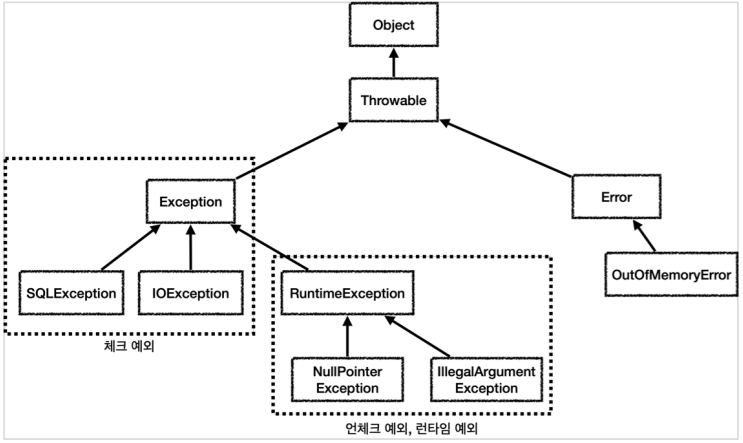
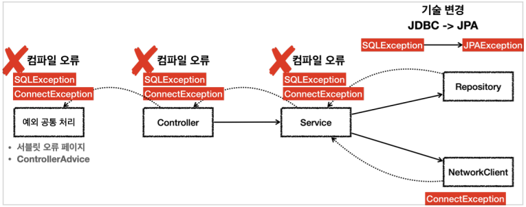
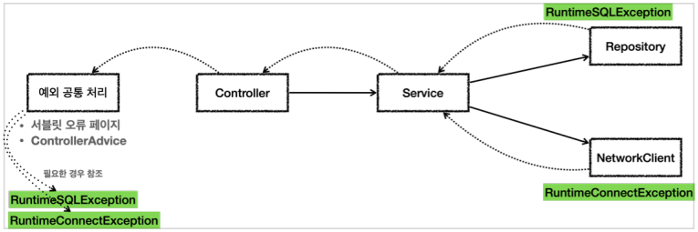
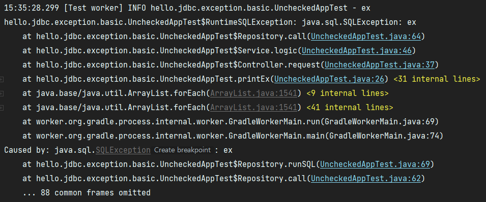

# 4. 자바 예외 이해



모든 객체의 최상위 부모는 Object이고, 예외의 최상위 부모도 Object 이다.  
그 밑 최상위 예외로 Throwable 클래스가 있고, 하위에 Exception과 Error가 있다.  
  
Error는 메모리 부족이나 심각한 시스템 오류와 같이 애플리케이션에서 복구 불가능한 시스템 예외를 말하고,  
그 중 우리가 애플리케이션에서 다룰 수 있는 예외는 보통 Exception과 그 하위 예외이다.  
  
Exception과 그 하위 예외중 RuntimeException을 제외하고는 모두 컴파일러가 체크하는 체크 예외이다.  
RuntimeException과 그 자식 예외는 모두 언체크 예외이고, 보통 런타임 예외라고 부른다.

#

## 예외 활용

### 기본적으로 언체크 예외를 사용하자.

- 체크 예외는 비즈니스 로직상 의도적으로 던지는 예외에만 사용하자.
    - 해당 예외를 잡아서 반드시 처리해야 하는 문제일 떄만 체크 예외를 사용해야 한다.
- 예시)
    - 계좌 이체 실패 예외
    - 결제시 포인트 부족 예외
    - 로그인 ID, PW 불일치 예외
- 이 경우에도 100% 체크 예외로 만들어야 하는 것은 아니지만, 계좌 이체 실패처럼 매우 심각한 문제는 개발자가 실수로 예외를 놓치면 안된다고 판단할 수 있다.


#

## 체크 예외의 문제점



### 1. 복구 불가능한 예외

대부분의 예외는 복구가 불가능하다. 일부 복구가 가능한 예외도 있지만 아주 적다.  
서비스나 컨트롤러에서는 예외 문제들을 해결할 수 없기 때문에, 일관성 있게 공통으로 처리해야 한다.  
오류 로그를 남기고 개발자가 해당 오류를 빠르게 인지하는 것이 필요하다.  
서블릿 필터, 스프링 인터셉터, 스프링의 ControllerAdvice를 이용한다.

### 2. 불필요한 의존 관계 문제

시스템 레벨에서 올라온 대부분의 예외는 복구가 불가능하기 때문에,  
컨트롤러나 서비스 입장에서는 본인이 처리할 수 없어도 어쩔 수 없이 throws를 통해 던지는 예외를 선언하게 된다.  
그러면 서비스나 컨트롤러에서 java.sql.SQLException과 같은 예외들을 의존하게 되고  
향후 리포지토리에서 기술 변경이 이루어질 때 SQLException에 의존하던 모든 서비스, 컨트롤러의 코드를 고쳐야 한다.  
이처럼 체크 예외 사용은 본인이 처리할 수 도 없는 예외를 의존하게 되는 큰 단점이 있다.

### throws Exception

SQLException, ConnectException 같은 시스템 예외는 컨트롤러나 서비스에서는 대부분 복구가 불가능하고 처리할 수 없는 체크 예외이다. 
throws 로 처리해주어야 하는데 이 때 체크 예외의 최상위 타입인 Exception을 던지게 되면  
다른 체크 예외를 체크할 수 있는 기능이 무효화되고, 중요한 체크 예외를 다 놓치게 된다.  
이 방법은 모든 예외를 다 던지기 때문에 체크 예외를 의도한 대로 사용하는 것이 아니다.


---

## 언체크 예외 활용



```java
package hello.jdbc.exception.basic;

import lombok.extern.slf4j.Slf4j;
import org.assertj.core.api.Assertions;
import org.junit.jupiter.api.Test;

import java.sql.SQLException;

@Slf4j
public class UncheckedAppTest {

    @Test
    void unchecked() {
        Controller controller = new Controller();

        Assertions.assertThatThrownBy(() -> controller.request())
                .isInstanceOf(Exception.class);
    }

    @Test
    void printEx() {
        Controller controller = new Controller();

        try {
            controller.request();
        } catch (Exception e) {
            log.info("ex", e);
        }

    }

    static class Controller {
        Service service = new Service();

        public void request() {
            service.logic();
        }
    }

    static class Service {
        Repository repository = new Repository();
        NetworkClient networkClient = new NetworkClient();

        public void logic() {
            repository.call();
            networkClient.call();
        }

    }

    static class NetworkClient {
        public void call() {
            throw new RuntimeConnectException("연결 실패");
        }
    }

    static class Repository {
        public void call() {
            try {
                runSQL();
            } catch (SQLException e) {
                throw new RuntimeSQLException(e); //SQLException을 런타임 예외인 RuntimeSQLExceptuon으로 변환한다.
            }
        }

        public void runSQL() throws SQLException {
            throw new SQLException("ex");
        }
    }

    static class RuntimeConnectException extends RuntimeException {
        public RuntimeConnectException(String message) {
            super(message);
        }
    }

    static class RuntimeSQLException extends RuntimeException {
        public RuntimeSQLException() {
        }

        public RuntimeSQLException(Throwable cause) {
            super(cause);
        }
    }
}
```

이 처럼 런타임 에러로 변환해서 던지게 되면 서비스나 컨트롤러가 이런 복구 불가능한 예외를 신경쓰지 않아도 된다.  
만약 나중에 기술이 변경되어도 해당 예외를 사용하지 않는 컨트롤러, 서비스에서는 코드를 변경하지 않아도 된다.  
구현 기술이 변경되는 경우, 공통처리하는 한곳만 변경하면 되기 때문에 변경의 영향 범위는 최소화된다.

---

## 예외를 전환할 시 꼭 기존 예외를 포함하자.

예외를 전환할 때는 꼭!!!!! 기존 예외를 포함해야 한다.  
그렇지 않으면 스택 트레이스를 확인할 때 심각한 문제가 발생한다.

```java
@Test
void printEx() {
    Controller controller = new Controller();

    try {
        controller.request();
    } catch (Exception e) {
        //e.printStackTrace();
        log.info("ex", e);
    }
}
```
```java
public void call() {
    try {
        runSQL();
    } catch (SQLException e) {
        throw new RuntimeSQLException(e); //기존 예외 포함
    }
}
```

위 코드처럼 로그를 출력할 때 마지막 파라미터에 예외를 전달해서 던진다음 출력하면 로그에 스택 트레이스를 출력할 수 있다.  
System.out에 스택 트레이스를 출력하려면 e.printStackTrace()를 사용하면 된다.



---

## Reference
- [스프링 DB 1편 - 데이터 접근 핵심 원리](https://www.inflearn.com/course/%EC%8A%A4%ED%94%84%EB%A7%81-db-1/dashboard)


