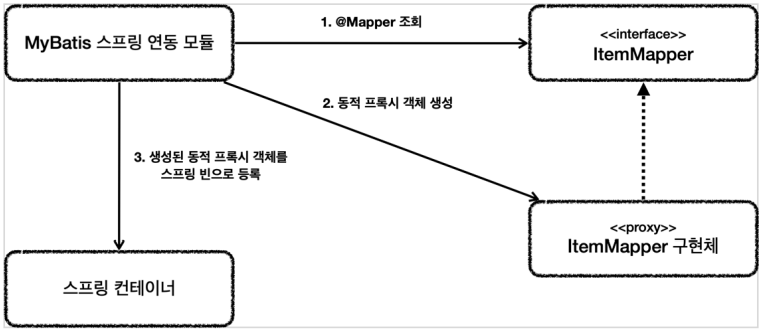

# MyBatis

MyBatis는 JdbcTemplate보다 더 많은 기능을 제공하는 SQL Mapper이다.  
기본적으로 JdbcTemplate가 제공하는 대부분의 기능을 제공한다.  
  
JdbcTemplate과 비교해서 MyBatis의 가장 매력적인 점은 SQL을 XML에 편리하게 작성할 수 있고  
동적 쿼리를 매우 편리하게 작성할 수 있다는 점이다.

---

## MyBatis 설정

```mybatis-spring-boot-starter``` 라이브러리를 사용하면 MyBatis를 스프링과 통합하고, 설정도 간편하게 할 수 있다.

### build.gradle
```gradle
plugins {
	id 'org.springframework.boot' version '2.6.5'
	id 'io.spring.dependency-management' version '1.0.11.RELEASE'
	id 'java'
}

group = 'com.example'
version = '0.0.1-SNAPSHOT'
sourceCompatibility = '11'

configurations {
	compileOnly {
		extendsFrom annotationProcessor
	}
}

repositories {
	mavenCentral()
}

dependencies {
	implementation 'org.springframework.boot:spring-boot-starter-thymeleaf'
	implementation 'org.springframework.boot:spring-boot-starter-web'

	//JdbcTemplate 추가
	implementation 'org.springframework.boot:spring-boot-starter-jdbc'
	//MyBatis 추가
	implementation 'org.mybatis.spring.boot:mybatis-spring-boot-starter:2.2.0'

	//H2 데이터베이스 추가
	runtimeOnly 'com.h2database:h2'
	compileOnly 'org.projectlombok:lombok'
	annotationProcessor 'org.projectlombok:lombok'
	testImplementation 'org.springframework.boot:spring-boot-starter-test'

	//테스트에서 lombok 사용
	testCompileOnly 'org.projectlombok:lombok'
	testAnnotationProcessor 'org.projectlombok:lombok'
}

tasks.named('test') {
	useJUnitPlatform()
}
```

\* mybatis 의존 관계 뒤에 버전 정보가 붙는 이유는 스프링 부트가 버전은 관리해주는 공식 라이브러리가 아니기 때문이다.  

#

### application.properties

```properties
spring.profiles.active=local
spring.datasource.url=jdbc:h2:tcp://localhost/~/test
spring.datasource.username=sa

#jdbcTemplate sql log
logging.level.org.springframework.jdbc=debug

#MyBatis
mybatis.type-aliases-package=hello.itemservice.domain
mybatis.configuration.map-underscore-to-camel-case=true
logging.level.hello.itemservice.repository.mybatis=trace
```

- `mybatis.type-aliases-package`
    - 마이바티스에서 타입 정보를 사용할 때는 패키지 이름을 적어주어야 하는데, 여기에 경로를 명시하면 패키지 이름을 생략할 수 있다.
    - 지정한 패키지와 그 하위 패키지가 자동으로 인식된다.
    - 여러 위치를 지정하려면 `,`, `;`로 구분하면 된다.
- `mybatis.configuration.map-underscore-to-camel-case`
    - JdbcTemplate의 BeanPropertyRowMapper에서 처럼 언더바를 카멜로 자동 변경해주는 기능을 활성화 한다.
- `logging.level.hello.itemservice.repository.mybatis`
    - 마이바티스에서 실행되는 쿼리 로그를 확인한다.

---

## MyBatis 적용

XML에 작성한다는 점을 제외하고는 JDBC 반복을 줄여준다는 점에서 JdbcTemplate와 거의 유사하다.

### ItemMapper
```java
package hello.itemservice.repository.mybatis;

import hello.itemservice.domain.Item;
import hello.itemservice.repository.ItemSearchCond;
import hello.itemservice.repository.ItemUpdateDto;
import org.apache.ibatis.annotations.Mapper;
import org.apache.ibatis.annotations.Param;

import java.util.List;
import java.util.Optional;

@Mapper
public interface ItemMapper {

    void save(Item item);

    void update(@Param("id") Long id, @Param("updateParam") ItemUpdateDto updateParam);

    Optional<Item> findById(Long id);

    List<Item> findAll(ItemSearchCond itemSearch);
}
```

- 마이바티스 매핑 XML을 호출해주는 매퍼 인터페이스이다.
- 인터패이스에 @Mapper 애노테이션을 붙여주어야 MyBatis에서 인식이 가능하다.
- 이 인터페이스의 메서드를 호출하면 xml의 해당 SQL을 실행하고 결과를 돌려준다.  

### src/main/resoures/hello/itemservice/repository/mybatis/ItemMapper.xml
```xml
<?xml version="1.0" encoding="UTF-8"?>
<!DOCTYPE mapper PUBLIC "-//mybatis.org//DTD Mapper 3.0//EN"
        "http://mybatis.org/dtd/mybatis-3-mapper.dtd">
<mapper namespace="hello.itemservice.repository.mybatis.ItemMapper">

    <insert id="save" useGeneratedKeys="true" keyProperty="id">
        insert into item (item_name, price, quantity)
        values (#{itemName}, #{price}, #{quantity})
    </insert>

    <update id="update">
        update item
        set item_name=#{updateParam.itemName},
            price=#{updateParam.price},
            quantity=#{updateParam.quantity}
        where id = #{id}
    </update>

    <select id="findById" resultType="Item">
        select id, item_name, price, quantity
        from item
        where id = #{id}
    </select>

    <select id="findAll" resultType="Item">
        select id, item_name, price, quantity
        from item
        <where>
            <if test="itemName != null and itemName != ''">
                and item_name like concat('%', #{itemName}, '%')
            </if>
            <if test="maxPrice != null">
                and price &lt;= #{maxPrice}
            </if>
        </where>
    </select>

</mapper>
```

SQL이 있는 XML 매핑 파일은 src/main/resources 하위에 만들되, 패키지 위치를 맞추어 주어야 한다.

#

### insert - save

```xml
void save(Item item);


<insert id="save" useGeneratedKeys="true" keyProperty="id">
    insert into item (item_name, price, quantity)
    values (#{itemName}, #{price}, #{quantity})
</insert>
```

- Insert SQL은 \<insert>를 사용한다.
- id에는 매퍼 인터페이스에서 설정한 메서드 이름을 지정한다. 메서드 이름이 save() 이므로 save로 지정했다.
- 파라미터는 #{} 문법을 사용하면 된다. 안에는 매퍼에서 넘긴 객체의 프로퍼티 이름을 적어준다.
- #{} 문법을 사용하면 PreparedStatement를 사용한다. JDBC의 ?를 치환하는 것과 비슷하다.
- useGeneratedKeys는 데이터베이스가 키를 생성하는 IDENTITY 전략일 때 사용한다.
    - keyProperty는 생성되는 키의 속성 이름을 지정한다.
    - Insert가 끝나면 item 객체의 id 속성에 생성된 값이 입력된다.

#

### update - update

```xml
void update(@Param("id") Long id, @Param("updateParam") ItemUpdateDto updateParam);


<update id="update">
    update item
    set item_name=#{updateParam.itemName},
        price=#{updateParam.price},
        quantity=#{updateParam.quantity}
    where id = #{id}
</update>
```

- Update SQL은 \<update>를 사용한다.
- 파라미터가 2개 이상이면 \@Param으로 이름을 지정해서 파라미터를 구분해야 한다.

#

### select - findById

```xml
Optional<Item> findById(Long id);
    
    
<select id="findById" resultType="Item">
    select id, item_name, price, quantity
    from item
    where id = #{id}
</select>
```

- Select SQL은 \<select>를 사용한다.
- resultType은 반환 타입을 명시하면 된다.
    - 앞서 application.properties에 `mybatis.type-aliases-package` 속성을 지정했기 때문에 모든 패키지 명을 다 적지 않아도 된다.
    - JdbcTemplate의 BeanPropertyRowMapper처럼 SELECT SQL의 결과를 편리하게 객체로 바로 변환해준다.
    - `mybatis.configuration.map-underscore-to-camel-case` 속성을 지정한 덕분에 언더스코어를 카멜 표기법으로 자동으로 처리해준다
    
#

### select - findAll

```xml
List<Item> findAll(ItenSearchCond itemSearch);
    

<select id="findAll" resultType="Item">
    select id, item_name, price, quantity
    from item
    <where>
        <if test="itemName != null and itemName != ''">
            and item_name like concat('%', #{itemName}, '%')
        </if>
        <if test="maxPrice != null">
            and price &lt;= #{maxPrice}
        </if>
    </where>
</select>
```

- Mybatis의 가장 큰 장점은 \<where>, \<if> 같은 동적 쿼리 문법을 통해 편리한 동적 쿼리를 작성할 수 있다는 점이다.
- \<if>는 해당 조건이 만족하면 SQL 구문을 추가한다.
- \<where>은 적절하게 where문장을 만들어 준다.
    - 예제에서 \<if>가 모두 실패하게 되면 SQL where를 만들지 않는다.
    - 예제에서 \<if>가 하나라도 성공하면 처음 나타나는 and를 where로 변환해준다.

---

##

### MyBatisItemRepository

```java
package hello.itemservice.repository.mybatis;

import hello.itemservice.domain.Item;
import hello.itemservice.repository.ItemRepository;
import hello.itemservice.repository.ItemSearchCond;
import hello.itemservice.repository.ItemUpdateDto;
import lombok.RequiredArgsConstructor;
import org.springframework.stereotype.Repository;

import java.util.List;
import java.util.Optional;

@Repository
@RequiredArgsConstructor
public class MyBatisItemRepository implements ItemRepository {

    private final ItemMapper itemMapper;

    @Override
    public Item save(Item item) {
        itemMapper.save(item);
        return item;
    }

    @Override
    public void update(Long itemId, ItemUpdateDto updateParam) {
        itemMapper.update(itemId, updateParam);
    }

    @Override
    public Optional<Item> findById(Long id) {
        return itemMapper.findById(id);
    }

    @Override
    public List<Item> findAll(ItemSearchCond cond) {
        return itemMapper.findAll(cond);
    }
}
```

ItemRepository를 상속받는 MyBatisItemRepository이다. 기능을 단순하게 ItemMapper에 위임한다.

---

## ItemMapper 인터페이스 구현체

  
ItemMapper의 구현은 개발자가 직접 하지않아도 되고, MyBatis 스프링 연동 모듈에서 자동으로 처리해준다.

- 애플리케이션 로딩 시점에 MyBatis 스프링 연동 모듈은 @Mapper가 붙어있는 인터페이스를 조사한다.
- 해당 인터페이스가 발견되면 동적 프록시 기술을 사용해서 ItemMapper 인터페이스의 구현체를 만든다.
- 생성된 구현체를 스프링 빈으로 등록한다.

MyBatisItemRepository 클래스에 주입받은 ItemMapper 클래스를 출력하면 JDK 동적 프록시가 적용된 것을 확인할 수 있다.  
  
  
MyBatis 스프링 연동 모듈이 만들어주는 ItemMapper 구현체 덕분에 인터페이스 만으로 편리하게 XML의 데이터를 찾아서 호출할 수 있다.

매퍼 구현체는 예외 변환까지 처리해준다.  
MyBatis에서 발생한 예외를 스프링 예외 추상화인 `DataAccessException`에 맞게 변환해서 처리해준다.  
  
MyBatis 스프링 연동 모듈은 데이터베이스 커넥션, 트랜잭션과 관련된 기능도 MyBatis와 함께 연동하고, 동기화해준다.  

#

- MyBatis 공식 메뉴얼: https://mybatis.org/mybatis-3/ko/index.html  
- MyBatis 스프링 공식 메뉴얼: https://mybatis.org/spring/ko/index.html

---

## Reference
- [스프링 DB 2편 - 데이터 접근 활용 기술](https://www.inflearn.com/course/%EC%8A%A4%ED%94%84%EB%A7%81-db-2/dashboard)
