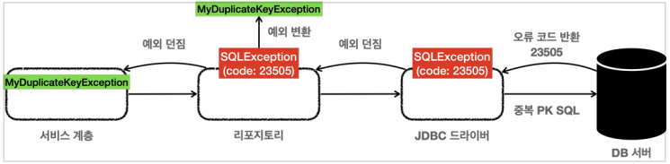
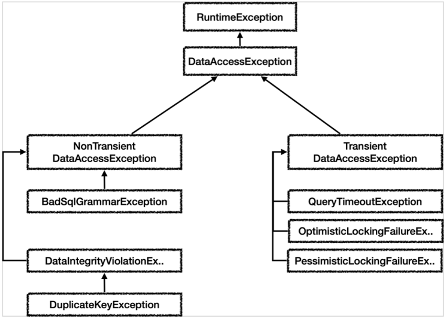

# 5. 스프링 문제 해결 - 예외 처리

서비스 계층은 특정 구현 기술에 의존하지 않고, 순수하게 유지하는 것이 좋다.  
  
예외 의존에서 벗어나기 위해 SQLException을 런타임 예외로 전환해서 서비스 계층에 던지면,  
서비스 계층에서 해당 예외를 무시할 수 있기 때문에 특정 구현 기술에 의존하지 않고 순수하게 유지할 수 있다.

#

학습 코드에서 MemberRepository 인터페이스를 도입시킨다음  
클래스에서 발생하는 SQLException을 런타임 예외로 전환시키고, MemberService는 이 순수한 인터페이스를 의존하도록 하자

### MemberRepository 인터페이스
```java
package hello.jdbc.repository;

import hello.jdbc.domain.Member;

public interface MemberRepository {
    Member save(Member member);
    Member findById(String memberId);
    void update(String memberId, int money);
    void delete(String memberId);
}
```

구현 클래스에서 체크 예외를 사용하면 인터페이스에도 해당 체크 예외가 선언 되어 있어야 한다.  
그러면 특정 기술에 종속되는 인터페이스가 되어 순수한 인터페이스의 의미가 퇴색되고,  
향후 JDBC가 아닌 다른 기술로 변경하고 싶을 때 인터페이스 자체를 변경해야 한다.  
  
런타임 예외를 사용하면 인터페이스에 따로 런타임 예외를 선언하지 않아도 되므로 이런 부분에서 매우 자유롭다.

---

## 스프링 예외 추상화 이해



예를 들어 데이터를 DB에 저장할 때 같은 ID가 이미 데이터베이스에 저장이 되어 있다면,  
데이터베이스는 오류 코드를 반환하고, 이 오류 코드를 받은 JDBC 드라이버는 SQLException을 던진다.  
SQLException에는 데이터베이스가 제공하는 errorcode라는 것이 들어있다.

SQLException 내부에 들어있는 errorcode를 활용하면 데이터베이스에서 어떤 문제가 발생했는지 확인할 수 있다.  
서비스 계층에서 이 errorcode를 확인하여 키 중복 오류와 같은 것들을 해결할 수 있다.  
  
그런데 리포지토리에서 서비스 계층으로 예외를 던질 때 SQLException으로 던지게 되면, 서비스 계층의 순수성이 무너지게 된다.  
따라서 예외들을 런타임 예외로 변환시켜서 던져야 한다.

#



SQL ErrorCode는 데이터베이스들 마다 다르기 때문에 스프링은 데이터 접근과 관련된 예외를 추상화해서 제공한다.  
  
스프링은 데이터 접근 계층에 대한 수십 가지 예외를 정리해서 일관된 예외 계층을 제공한다.  
예외의 최고 상위는 런타임 예외를 상속받는 org.springframework.dao.DataAccessException 이다.  
  
DataAccessException은 NonTransient예외와 Transient예외로 구분된다.  
- Transient는 일시적이라는 뜻으로, Transient 하위 예외는 동일한 SQL을 다시 시도했을 때 성공할 가능성이 있다.
    - 쿼리 타임아웃, 락과 관련된 오류들
- NonTransient는 일시적이지 않다는 뜻으로, 같은 SQL을 그대로 반복해서 실행하면 실패한다.
    - SQL 문법오류, 데이터베이스 제약조건 위배 등

#

스프링은 데이터베이스에서 발생하는 오류 코드를 스프링이 정의한 예외로 자동으로 변환해주는 변환기를 제공한다.  
  
SQL ErrorCode를 직접 확인해서 스프링이 만들어준 예외로 하나하나 다 변환하는 것은 현실성이 없다  
스프링이 제공하는 SQL 예외 변환기를 사용하자

```java
SQLExceptionTranslator exTranslator =
new SQLErrorCodeSQLExceptionTranslator(dataSource);
DataAccessException resultEx = exTranslator.translate("select", sql, e);
```

눈에 보이는 반환 타입은 최상위 타입인 DataAccessException이지만,  
실제로는 SQL문법이 잘못 되었으므로 BadSqlGrammarException을 반환한다.  
  
스프링 SQL 예외 변환기는 ErrorCode를 sql-error-codes.xml 이 파일에 대입해서  
어떤 스프링 데이터 접근 예외로 전환해야 할지 찾아낸다.  

### sql-error-codes.xml

```xml
<bean id="H2" class="org.springframework.jdbc.support.SQLErrorCodes">
    <property name="badSqlGrammarCodes">
        <value>42000,42001,42101,42102,42111,42112,42121,42122,42132</value>
    </property>
    <property name="duplicateKeyCodes">
        <value>23001,23505</value>
    </property>
</bean>
<bean id="MySQL" class="org.springframework.jdbc.support.SQLErrorCodes">
    <property name="badSqlGrammarCodes">
        <value>1054,1064,1146</value>
    </property>
    <property name="duplicateKeyCodes">
        <value>1062</value>
    </property>
</bean>
```

서비스 계층에서 예외를 잡아서 복구하는 경우, 예외가 스프링이 제공하는 데이터 접근 예외로 변경되어서  
서비스 계층에 넘어오기 때문에 필요한 경우 예외를 잡아서 복구하면 된다.

---

## Reference
- [스프링 DB 1편 - 데이터 접근 핵심 원리](https://www.inflearn.com/course/%EC%8A%A4%ED%94%84%EB%A7%81-db-1/dashboard)
