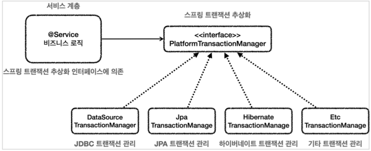
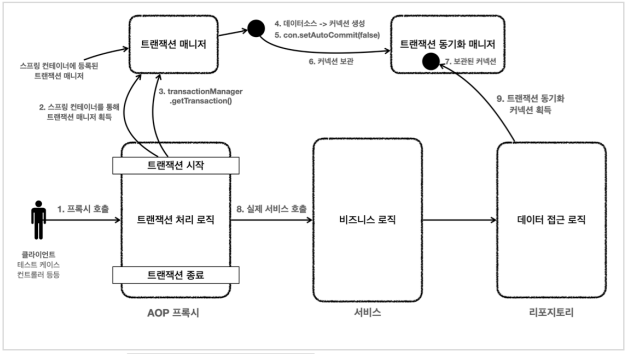
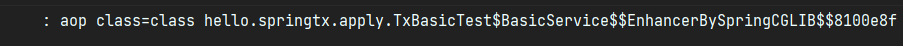
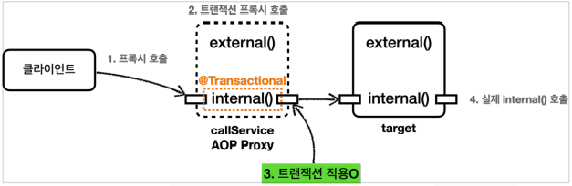
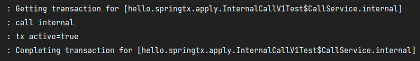
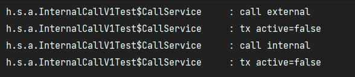
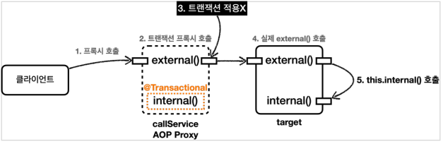
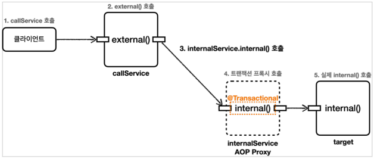
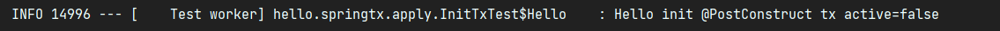
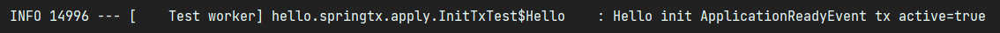

# Spring Transcation

## 1. 트랜잭션 추상화

스프링은 ***PlatformTransactionManager*** 인터페이스를 통해 트랜잭션을 추상화 한다.

### PlatformTransactionManager 인터페이스
```java
package org.springframework.transaction;

public interface PlatformTransactionManager extends TransactionManager {
   
   TransactionStatus getTransaction(@Nullable TransactionDefinition definition)
        throws TransactionException;

    void commit(TransactionStatus status) throws TransactionException;
    void rollback(TransactionStatus status) throws TransactionException;
}
```



스프링은 트랜잭션을 추상화해서 제공하는 것 뿐만 아니라, 데이터 접근 기술에 대한 트랜잭션 매니저의 구현체도 제공한다.  
  
여기에 더해, 스프링 부트가 어떤 데이터 접근 기술을 사용하는지 자동으로 인식해서   
적절한 매니저를 선택하여 스프링 빈으로 등록해주기 때문에, 우리가 트랜잭션 매니저를 선택하고 등록하는 과정도 생략이 가능하다.

---

## 2. 선언적 트랜잭션, AOP

***@Transactional*** 을 통한 선언적 트랜잭션 관리 방식을 사용하면, 프록시 방식의 AOP가 적용된다.  
트랜잭션 프록시가 트랜잭션 처리 로직을 모두 가져가고, 트랜잭션을 시작한 후에 실제 서비스를 대신 호출한다.  

  

같은 트랜잭션을 유지하려면 같은 데이터베이스 커넥션을 사용해야 하는데,  
이를 위해 스프링 내부에서 트랜잭션 동기화 매니저가 사용되어 커넥션을 보관하고, 반환한다.

#

***@Transactional*** 애노테이션이 특정 클래스나 메서드에 하나라도 있으면 해당 객체는 트랜잭션 AOP의 적용 대상이 된다.  
결과적으로 트랜잭션 AOP는 프록시를 만들어서 프록시는 내부에 실제 클래스를 참조하고,  
  
**실제 객체 대신 프록시를 스프링 컨테이너에 스프링 빈으로 등록, 의존관계를 주입한다.**  
  


주입 받은 클래스 이름을 출력해보면 실제 객체인 *basicService* 대신 뒤에 $Enhancer가 붙은 프록시 클래스의 이름이 출력된다.

---

## 3. 트랜잭션 AOP 주의 사항 - 프록시 내부 호출

**프록시 내부 호출은 트랜잭션을 다룰 때 매우 중요한 사안이다.  
실무에서도 많이 만나는 주제이고, 트랜잭션을 사용하기 전에 충분한 이해와 학습이 선행되어야 한다.**

#

프록시 내부 호출이란, 대상 객체의 내부에서 메서드 호출이 발생하여 프록시를 거치지 않고 대상 객체를 직접 호출하는 문제를 말한다.  
이러면 @Transactioanl 이 붙어있어도 트랜잭션이 적용되지 않는 상황이 일어난다.
  
```java
@Slf4j
static class CallService {

    public void external() {
        log.info("call external");
        printTxInfo();
        internal();
    }

    @Transactional
    public void internal() {
        log.info("call internal");
        printTxInfo();
    }
    
    private void printTxInfo() {
        boolean txActive = TransactionSynchronizationManager.isActualTransactionActive();
        log.info("tx active={}", txActive);
    }
}
```

***@Transactional*** 이 하나라도 붙어있으면 트랜잭션 프록시 객체가 만들어지고, callService 빈을 주입받으면 프록시 객체가 대신 주입된다.  

```java
@Test
void internalCall() {
    callService.internal();
}
```



여기서 internal()을 바로 호출하면 예상하는대로 ***@Transactional***이 붙어있으므로 프록시는 트랜잭션을 적용한다.  
  
트랜잭션 적용 후 실제 callService 객체 인스턴스의 internal()을 호출하여  
실제 callService가 처리를 완료하면 응답이 트랜잭션 프록시로 돌아오고, 트랜잭션 프록시는 트랜잭션을 완료한다.



#

```java
@Test
void externalCall() {
    callService.external();
}
```

external()은 ***@Transactional*** 애노테이션이 없기 때문에 트랜잭션 없이 시작한다.  
그런데 external() 은 메소드 내부에 ***@Transactional***이 붙어있는 internal() 을 호출한다.  
  


실행 로그를 보면 internal()을 호출했을 때와는 달리  
internal() 전과 후에 트랜잭션 관련 코드가 전혀 없고, tx active = false 로그를 확인할 수 있다.  
  


프록시가 빈으로 등록 되어있어서 프록시를 호출하기는 하지만,  
extneral() 메서드에는 ***@Transactional*** 이 없으므로 최종적으로 트랜잭션 프록시는 트랜잭션을 적용하지 않는다.  
  
트랜잭션을 적용하지 않고, 실제 callService 객체 인스턴스의 external()을 호출하는데, 
extnernal()은 내부에서 internal()을 호출한다.  
  
이 때 자바 문법에 따라 internal()은 this.internal()과 같으므로, 실제 객체 인스턴스의 internal()을 호출하는 것과 같다.  
결과적으로 프록시를 거치지 않았기 때문에 트랜잭션을 적용하지 않고 사진의 target에 있는 internal() 을 그냥 호출하게 된 것이다.

#

### 프록시 방식의 AOP 한계

***@Transactional*** 을 사용하는 트랜잭션 AOP는 프록시를 사용하는데, 프록시를 사용하면 메서드 내부 호출에 프록시를 적용할 수 없다.
  
가장 단순한 해결 방법으로 internal() 메서드를 별도의 클래스로 분리하는 방법이 있다.

```java

@Slf4j
@RequiredArgsConstructor
static class CallService {

    private final InternalService internalService;

    public void external() {
        log.info("call external");
        printTxInfo();
        internalService.internal();
    }

    private void printTxInfo() {
        boolean txActive = TransactionSynchronizationManager.isActualTransactionActive();
        log.info("tx active={}", txActive);
    }

}

@Slf4j
static class InternalService {

    @Transactional
    public void internal() {
        log.info("call internal");
        printTxInfo();
    }

    private void printTxInfo() {
        boolean txActive = TransactionSynchronizationManager.isActualTransactionActive();
        log.info("tx active={}", txActive);
    }
}
```

이렇게 ***@Transactional*** 메서드를 별도의 클래스로 분리시켜서, 메서드 내부 호출을 외부 호출로 변경시켰다.  
  
  
***CallService*** 는 트랜잭션 프록시가 적용되지 않지만 ***InternalService***는 트랜잭션 프록시가 적용된다.  

---

## 4. 트랜잭션 AOP 주의사항 - 초기화 시점

***@PostConstruct*** 와 ***@Transactional*** 을 같이 사용하면 트랜잭션이 적용되지 않을 수 있다.  
  
```java
@PostConstruct
@Transactional
public void initV1() {
    boolean isActive = TransactionSynchronizationManager.isActualTransactionActive();
    log.info("Hello init @PostConstruct tx active={}", isActive);
}
```  
  
  
스프링 초기화 시점에는 트랜잭션 AOP가 적용되지 않는다.  
이럴 경우에는 ***@PostConstruct*** 대신 ***ApplicationReadyEvent*** 를 사용하면 된다.  

```java
@EventListener(value = ApplicationReadyEvent.class)
 @Transactional
 public void initV2() {
     boolean isActive = TransactionSynchronizationManager.isActualTransactionActive();
     log.info("Hello init ApplicationReadyEvent tx active={}", isActive);
 }
```
  
  

***ApplicationReadyEvent*** 이벤트는 트랜잭션 AOP를 포함한 스프링 컨테이너가 완전히 생성되고 난 다음에  
이벤트가 붙은 메서드를 호출해준다.

---

## Reference
- [스프링 DB 2편 - 데이터 접근 활용 기술](https://www.inflearn.com/course/%EC%8A%A4%ED%94%84%EB%A7%81-db-2/dashboard)
