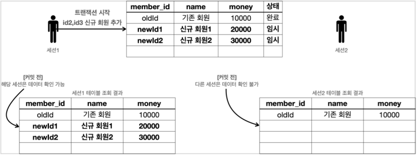
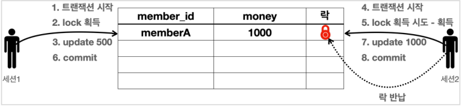

# 3. 트랜잭션 - 이해

## 트랜잭션이란?

데이터를 저장할 때, 굳이 데이터베이스에 저장하는 이유는 무엇일까.  
대표적인 이유는 데이터베이스는 트랜잭션이라는 개념을 지원하기 때문이다.  
  
트랜잭션은 그대로 해석하면 거래라는 뜻인데,  
데이터베이스 측면에서 트랜잭션은 하나의 거래를 안전하게 처리하도록 보장해주는 것을 말한다.  
데이터베이스에 로직을 실행시켰을 때 하나라도 오류가 발생하거나 실패하면, 트랜잭션을 이용해서 거래 전의 상태로 완전히 돌아갈 수 있다.  
  
모든 작업이 성공해서 데이터베이스에 정상 반영하는 것을 커밋(Commit)이라 하고,  
작업 중 하나라도 실패해서 거래 이전으로 되돌리는 것을 롤백(Rollback)이라 한다.

#

## 트랜잭션 ACID

트랜잭션은 ACID라 하는 원자성(Atomicity), 일관성(Consistency), 격리성(Isolation), 지속성(Durability)을 보장해야 한다.  
  
- 원자성: 트랜잭션 내에서 실행한 작업들은 마치 하나의 작업인 것처럼 모두 성공하거나 모두 실패해야 한다.
- 일관성: 모든 트랜잭션은 일관성 있는 데이터베이스 상태를 유지해야한다.
- 격리성: 동시에 실행되는 트랜잭션들이 서로에게 영향을 미치지 않도록 격리한다.
- 지속성: 트랜잭션을 성공적으로 끝내면 그 결과가 항상 기록되어야 한다.

트랜잭션은 원자성, 일관성, 지속성을 보장한다.  
그런데 트랜잭션 간에 격리성을 완벽히 보장하려면 트랜잭션을 거의 순서대로 실행해야 하는데,  
이렇게 하면 동시 처리 성능이 매우 나빠지기 때문에 ANSI 표준은 트랜잭션의 격리 수준을 4단계로 나누어 정의했다.  

- *Isolation level*
- READ UNCOMMITED (커밋되지 않은 읽기)
- READ COMMITTED (커밋된 읽기)
- REPEATABLE READ (반복 가능한 읽기)
- SERIALIZABLE (직렬화 기능)

#

## 트랜잭션 동작

- 데이터 변경 쿼리를 실행하고 데이터베이스에 그 결과를 반영하려면 커밋 명령어인 commit을 호출, 원하지 않으면 rollback을 호출한다.
- 커밋을 호출하기 전까지는 임시로 데이터를 저장하는 것일 뿐이다
- 따라서 해당 트랜잭션을 시작한 세션에게만 변경 데이터가 보이고 다른 세션에게는 변경 데이터가 보이지 않는다.



#

### 수동 커밋

트랜잭션을 이용하려면 쿼리를 실행 전에 반드시 수동 커밋 설정을 해야 한다.
```
set autocommit false
```

보통 자동 커밋 모드가 기본으로 설정된 경우가 많기 때문에, 수동 커밋 모드로 설정하는 것을 트랜잭션을 시작한다고 표현할 수 있다.  
수동 커밋 설정을 하면 이후에 꼭 commit, rollback을 호출해야 한다.  
수동 커밋 모드나 자동 커밋 모드는 한번 설정하면 해당 세션에서는 계속 유지된다.  

---

## DB 락 - 이해

세션1이 트랜잭션을 시작하고 데이터를 수정하는 동안, 세션 2에서 동시에 같은 데이터를 수정하게 되면 트랜잭션의 원자성이 깨지게 된다.  
이런 문제를 방지하기 위해 데이터베이스는 락(Lock)이라는 개념을 제공한다.  
  
세션1과 세션2가 있다고 가정하고  
세션1이 2보다 매우 조금이라도 더 빨리 트랜잭션을 시작해서 데이터 변경을 시도하면, 세션 1이 락을 획득하게 된다.  
이 때 세션2도 같은 데이터에 트랜잭션을 시작해서 데이터를 변경하려고 시도하면,  
이미 세션 1이 락을 획득했기 때문에, 세션 1이 커밋이나 롤백을 마칠 때 까지 세션 2는 기다리게 된다.  
기다리다가 일정 시간이 지나면 락 타임아웃 예외가 발생한다.  



#

## DB 락 - 조회

일반적인 조회는 락을 사용하지 않는다.  
그런데 데이터를 조회할 때도 락을 획득해서 다른 세션에서 해당 데이터를 변경하지 못하도록 하고 싶을 때가 있다.  
이럴 때는 select for update 구문을 사용한다.  
  
```sql
set autocommit false;
select * from member where member_id='memberA' for update;
```

select for update 구문을 사용하면 조회를 하면서 동시에 선택한 로우의 락도 획득할 수 있다.  
물론 락이 이미 없다면 락을 획득할 때 까지 대기해야 한다.  

---

## Reference
- [스프링 DB 1편 - 데이터 접근 핵심 원리](https://www.inflearn.com/course/%EC%8A%A4%ED%94%84%EB%A7%81-db-1/dashboard)
