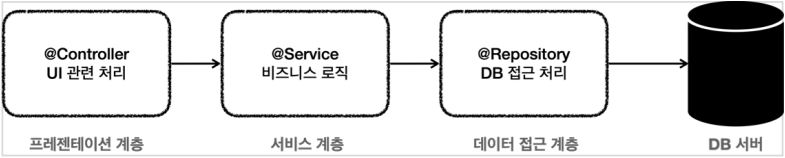

# 3. 트랜잭션 매니저

## 애플리케이션 구조


  
- 프레젠테이션 계층
    - UI와 관련된 처리 담당
    - 웹 요청과 응답
    - 사용자 요청을 검증
    - 주 사용 기술: 서블릿과 HTTP 같은 웹 기술, 스프링 MVC
- 서비스 계층
    - 비즈니스 로직을 담당
    - 주 사용 기술: 가급적 특정 기술에 의존하지 않고, 순수 자바 코드로 작성
- 데이터 접근 계층
    - 실제 데이터베이스에 접근하는 코드
    - 주 사용 기술: JDBC, JPA, File, Redis, Mongo..

#

### 순수한 서비스 계층

서비스 계층은 특정 기술에 종속되지 않도록, 최대한 순수 비즈니스 로직만 구현해야 한다.  
그러면 비즈니스 로직을 유지보수 하기도 쉽고, 테스트도 쉽다.  
또한 향후 구현 기술이 변경될 때 변경의 영향 범위를 최소화 할 수 있다.  
  
스프링은 트랜잭션을 사용하는 서비스 계층을 순수하게 유지할 수 있도록 다양한 방법과 기술들을 제공한다.

---

## 트랜잭션 매니저


서비스 계층이 특정 기술에 종속되지 않도록 스프링은 트랜잭션 기능을 추상화 한 인터페이스를 제공한다.  
이렇게 되면 서비스는 특정 트랜잭션 기술에 직접 의존하는 것이 아니라, 추상화 된 인터페이스에 의존한다.  
JDBC, JPA 등등 원하는 구현체를 의존성 주입(DI)을 통해 주입하기만 하면 된다.

### PlatformTransactionManager 인터페이스
```java
package org.springframework.transaction;

public interface PlatformTransactionManager extends TransactionManager {

    TransactionStatus getTransaction(@Nullable TransactionDefinition definition) throws TransactionException;

    void commit(TransactionStatus status) throws TransactionException;
    
    void rollback(TransactionStatus status) throws TransactionException;
}
```
