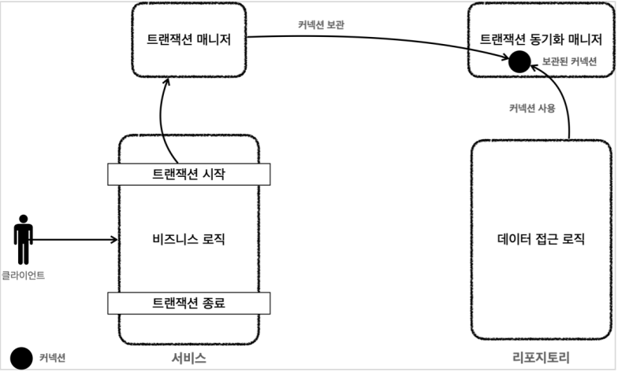

# 3. 트랜잭션 매니저

## 애플리케이션 구조


  
- 프레젠테이션 계층
    - UI와 관련된 처리 담당
    - 웹 요청과 응답
    - 사용자 요청을 검증
    - 주 사용 기술: 서블릿과 HTTP 같은 웹 기술, 스프링 MVC
- 서비스 계층
    - 비즈니스 로직을 담당
    - 주 사용 기술: 가급적 특정 기술에 의존하지 않고, 순수 자바 코드로 작성
- 데이터 접근 계층
    - 실제 데이터베이스에 접근하는 코드
    - 주 사용 기술: JDBC, JPA, File, Redis, Mongo..

#

### 순수한 서비스 계층

서비스 계층은 특정 기술에 종속되지 않도록, 최대한 순수 비즈니스 로직만 구현해야 한다.  
그러면 비즈니스 로직을 유지보수 하기도 쉽고, 테스트도 쉽다.  
또한 향후 구현 기술이 변경될 때 변경의 영향 범위를 최소화 할 수 있다.  
  
스프링은 트랜잭션을 사용하는 서비스 계층을 순수하게 유지할 수 있도록 다양한 방법과 기술들을 제공한다.

---

## 트랜잭션 매니저


서비스 계층이 특정 기술에 종속되지 않도록 스프링은 트랜잭션 기능을 추상화 한 인터페이스를 제공한다.  
이렇게 되면 서비스는 특정 트랜잭션 기술에 직접 의존하는 것이 아니라, 추상화 된 인터페이스에 의존한다.  
JDBC, JPA 등등 원하는 구현체를 의존성 주입(DI)을 통해 주입하기만 하면 된다.

### PlatformTransactionManager 인터페이스
```java
package org.springframework.transaction;

public interface PlatformTransactionManager extends TransactionManager {

    TransactionStatus getTransaction(@Nullable TransactionDefinition definition) throws TransactionException;

    void commit(TransactionStatus status) throws TransactionException;
    
    void rollback(TransactionStatus status) throws TransactionException;
}
```

#

트랜잭션을 유지하려면 트랜잭션 시작부터 끝까지 같은 데이터베이스 커넥션을 유지해야한다.  
그런데 파라미터를 커넥션으로 전달하는 방법을 사용하면 코드가 지저분해지는 등 단점들이 많다.  



스프링은 트랜잭션 동기화 매니저를 제공한다. 이것은 쓰레드 로컬(ThreadLocal)을 사용해서 커넥션을 동기화해준다.  
트랜잭션 매니저는 내부에서 이 트랜잭션 동기화 매니저를 사용한다.

### MemeberServiceV3_1
```java
package hello.jdbc.service;

import hello.jdbc.domain.Member;
import hello.jdbc.repository.MemberRepositoryV3;
import lombok.RequiredArgsConstructor;
import lombok.extern.slf4j.Slf4j;
import org.springframework.transaction.PlatformTransactionManager;
import org.springframework.transaction.TransactionStatus;
import org.springframework.transaction.support.DefaultTransactionDefinition;

import java.sql.SQLException;

/**
 * 트랜잭션 - 트랜잭션 매니저
 */
@Slf4j
@RequiredArgsConstructor
public class MemberServiceV3_1 {

    //트랜잭션 매니저를 주입 받는다.
    private final PlatformTransactionManager transactionManager;
    private final MemberRepositoryV3 memberRepository;

    public void accountTransfer(String fromId, String toId, int money) throws SQLException {
        //트랜잭션을 시작한다. 현재 트랜잭션의 상태 정보가 포함되어 있다. 이후 트랜잭션을 커밋, 롤백할 때 필요하다.
        TransactionStatus status = transactionManager.getTransaction(new DefaultTransactionDefinition());

        try {
            //비즈니스 로직
            bizLogic(fromId, toId, money);
            //트랜잭션이 성공하면 이 로직을 호출해서 커밋하면 된다.
            transactionManager.commit(status);
        } catch (Exception e) {
            //문제가 발생하면 이 로직을 호출해서 트랜잭션을 롤백한다.
            transactionManager.rollback(status);
            throw new IllegalStateException(e);
        }
    }

    private void bizLogic(String fromId, String toId, int money) throws SQLException {
        Member fromMember = memberRepository.findById(fromId);
        Member toMember = memberRepository.findById(toId);

        memberRepository.update(fromId, fromMember.getMoney() - money);
        validation(toMember);
        memberRepository.update(toId, fromMember.getMoney() + money);
    }

    private void validation(Member toMember) {
        if (toMember.getMemberId().equals("ex")) {
            throw new IllegalStateException("이체중 예외 발생");
        }
    }
}
```

### MemberServiceV3_1Test
```java
package hello.jdbc.service;

import hello.jdbc.domain.Member;
import hello.jdbc.repository.MemberRepositoryV2;
import hello.jdbc.repository.MemberRepositoryV3;
import org.junit.jupiter.api.AfterEach;
import org.junit.jupiter.api.BeforeEach;
import org.junit.jupiter.api.DisplayName;
import org.junit.jupiter.api.Test;
import org.springframework.jdbc.datasource.DataSourceTransactionManager;
import org.springframework.jdbc.datasource.DriverManagerDataSource;
import org.springframework.transaction.PlatformTransactionManager;

import java.sql.SQLException;

import static hello.jdbc.connection.ConnectionConst.*;
import static org.assertj.core.api.Assertions.assertThat;
import static org.assertj.core.api.Assertions.assertThatThrownBy;

/**
 * 트랜잭션 - 트랜잭션 매니저
 */
public class MemberServiceV3_1Test {

    public static final String MEMBER_A = "memberA";
    public static final String MEMBER_B = "memberB";
    public static final String MEMBER_EX = "ex";

    private MemberRepositoryV3 memberRepository;
    private MemberServiceV3_1 memberService;

    @BeforeEach
    void before() {
        DriverManagerDataSource dataSource = new DriverManagerDataSource(URL, USERNAME, PASSWORD);
        //현재 JDBC 기술을 사용하므로, JDBC용 트랜잭션 매니저(DataSourceTransactionManager)를 선택해서 서비스에 주입한다.
        //트랜잭션 매니저는 데이터소스를 통해 커넥션을 생성하므로 DataSource가 필요하다.
        PlatformTransactionManager transactionManager = new DataSourceTransactionManager(dataSource);
        memberRepository = new MemberRepositoryV3(dataSource);
        memberService = new MemberServiceV3_1(transactionManager, memberRepository);
    }

    @AfterEach
    void after() throws SQLException {
        memberRepository.delete("memberA");
        memberRepository.delete("memberB");
        memberRepository.delete("memberEx");
    }

    @Test
    @DisplayName("정상 이체")
    void accountTransfer() throws SQLException {
        //given
        Member memberA = new Member("memberA", 10000);
        Member memberB = new Member("memberB", 10000);
        memberRepository.save(memberA);
        memberRepository.save(memberB);
        //when
        memberService.accountTransfer(memberA.getMemberId(),
                memberB.getMemberId(), 2000);
        //then
        Member findMemberA = memberRepository.findById(memberA.getMemberId());
        Member findMemberB = memberRepository.findById(memberB.getMemberId());
        assertThat(findMemberA.getMoney()).isEqualTo(8000);
        assertThat(findMemberB.getMoney()).isEqualTo(12000);
    }

    @Test
    @DisplayName("이체중 예외 발생")
    void accountTransferEx() throws SQLException {
        //given
        Member memberA = new Member("memberA", 10000);
        Member memberEx = new Member("ex", 10000);
        memberRepository.save(memberA);
        memberRepository.save(memberEx);
        //when
        assertThatThrownBy(() ->
                memberService.accountTransfer(memberA.getMemberId(), memberEx.getMemberId(),
                        2000))
                .isInstanceOf(IllegalStateException.class);
        //then
        Member findMemberA = memberRepository.findById(memberA.getMemberId());
        Member findMemberEx =
                memberRepository.findById(memberEx.getMemberId());
        //memberA의 돈이 롤백 되어야함
        assertThat(findMemberA.getMoney()).isEqualTo(10000);
        assertThat(findMemberEx.getMoney()).isEqualTo(10000);
    }
}
```

### 동작 흐름


- 클라이언트의 요청으로 서비스 로직 실행
- 트랜잭션 시작
    - 서비스 계층에서 transactionManager.getTransaction()을 호출해서 트랜잭션을 시작한다.
    - 트랜잭션을 시작하려면 먼저 데이터베이스 커넥션이 필요하다.
    - 트랜잭션 매니저는 내부에서 데이터소스를 사용해서 커넥션을 생성한다.
    - 커넥션을 수동 커밋 모드로 변경해서 실제 데이터베이스 트랜잭션을 시작한다.
    - 커넥션을 트랜잭션 동기화 매니저에 보관한다.
    - 트랜잭션 동기화 매니저는 쓰레드 로컬에 커넥션을 보관한다. 따라서 멀티 쓰레드 환경에 안전하게 커넥션을 보관할 수 있다.
- 로직 실행
    - 서비스는 비즈니스 로직을 실행하면서 리포지토리의 메서드들을 호출한다. (이때 커넥션을 파라미터로 전달하지 않는다)
    - 리포지토리 메서드들은 트랜잭션이 시작된 커넥션이 필요하다.
    - 리포지토리는 DataSourceUtils.getConnection()을 사용해서 트랜잭션 동기화 매니저에 보관된 커넥션을 꺼내서 사용한다.
    - 이 과정을 통해서 자연스럽게 같은 커넥션을 사용하고, 트랜잭션도 유지된다.
    - 획득한 커넥션을 사용해서 SQL을 데이터베이스에 전달해서 실행한다.
- 트랜잭션 종료
    - 비즈니스 로직이 끝나고 트랜잭션을 종료한다. 트랜잭션은 커밋하거나 롤백하면 종료된다.
    - 트랜잭션을 종료하려면 동기화된 커넥션이 필요하다.
    - 트랜잭션 동기화 매니저를 통해 동기화된 커넥션을 획득한다.
    - 획득한 커넥션을 통해 데이터베이스에 트랜잭션을 커밋하거나 롤백한다.
    - 전체 리소스를 정리한다.
    - 트랜잭션 동기화 매니저를 정리한다. 쓰레드 로컬은 사용후 꼭 정리해야 한다.
    - con.setAutoCommit(true)로 되돌린다. 커넥션 풀을 고려해야 한다.
    - con.close()를 호출해서 커넥션을 종료한다.
    - 커넥션 풀을 사용하는 경우 con.close()를 호출하면 커넥션 풀에 반환된다.

---

## 트랜잭션 템플릿

템플릿 콜백 패턴을 활용하면 트랜잭션을 시작할 때마다 반복되는 코드들(성공시 커밋, 실패시 롤백)을 줄일 수 있다.  
  
템플릿 콜백 패턴을 적용하려면 템플릿을 제공하는 클래스를 작성해야 하는데,  
스프링은 TransactionTemplate라는 템플릿 클래스를 제공한다.

### TransactionTemplate

```java
public class TransactionTemplate {
    
    private PlatformTransactionManager transactionManager;
 
    public <T> T execute(TransactionCallback<T> action){..} //응답 값이 있을 때 사용한다.
    void executeWithoutResult(Consumer<TransactionStatus> action){..} //응답 값이 없을 때 사용한다.
}
```

### 트랜잭션 템플릿 사용

```java
private final TransactionTemplate txTemplate;
private final MemberRepositoryV3 memberRepository;

public MemberServiceV3_2(PlatformTransactionManager transactionManager, MemberRepositoryV3 memberRepository) {
    this.txTemplate = new TransactionTemplate(transactionManager);
    this.memberRepository = memberRepository;
}

public void accountTransfer(String fromId, String toId, int money) throws SQLException {
    txTemplate.executeWithoutResult((status) -> {
        try {
            //비즈니스 로직
            bizLogic(fromId, toId, money);
        } catch (SQLException e) {
            throw new IllegalStateException(e);
        }
    });
}
```

트랜잭션 템플릿 덕분에 트랜잭션을 시작하고, 커밋하거나 롤백하는 코드가 모두 제거되었다.  

- 트랜잭션 템플릿 기본 동작
    - 비즈니스 로직이 정상 수행되면 커밋한다.
    - 언체크 예외가 발생하면 롤백한다. 그 예외의 경우 커밋한다.
 
---

## Reference
- [스프링 DB 1편 - 데이터 접근 핵심 원리](https://www.inflearn.com/course/%EC%8A%A4%ED%94%84%EB%A7%81-db-1/dashboard)
