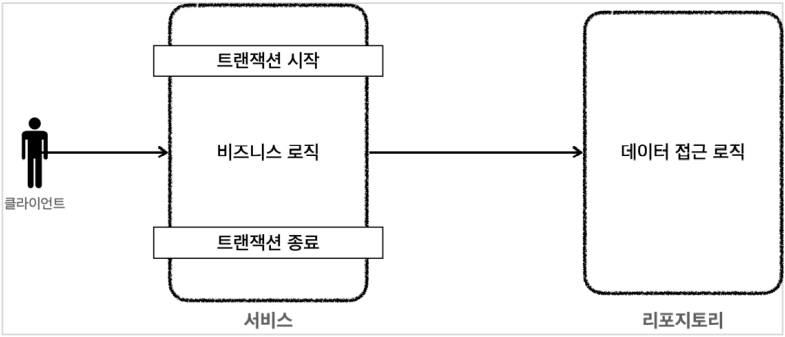
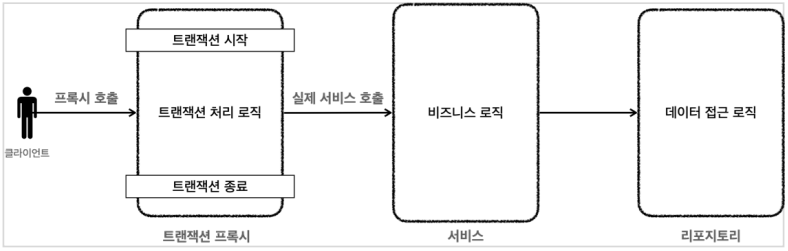

# 3. 트랜잭션 AOP

트랜잭션 템플릿을 이용하면 트랜잭션을 사용할 때 반복하는 코드를 제거할 수 있다.  
하지만 아직 코드를 보면 서비스 로직에 비즈니스 로직 뿐만 아니라 트랜잭션을 처리하는 기술 로직이 함께 포함되어 있다.  
이렇게 비즈니스 로직과 트랜잭션을 처리하는 기술 로직이 한 곳에 있으면 코드를 유지보수하기 어려워진다.  

서비스 로직은 가급적 핵심 비즈니스 로직만 있어야한다.  
스프링 AOP를 통해 프록시를 도입하면 앞서 언급한 문제들을 깔끔하게 해결할 수 있다.

### 프록시 도입 전

### 프록시 도입 후

프록시를 사용하면 트랜잭션을 처리하는 객체와 비즈니스 로직을 처리하는 서비스 객체를 명확하게 분리할 수 있다.
