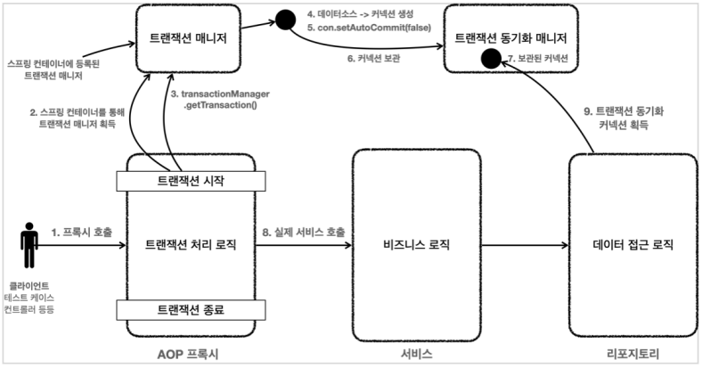
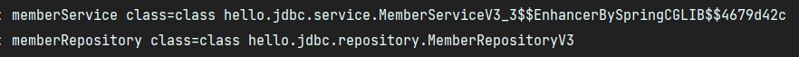

# 3. 트랜잭션 AOP

트랜잭션 템플릿을 이용하면 트랜잭션을 사용할 때 반복하는 코드를 제거할 수 있다.  
하지만 아직 코드를 보면 서비스 로직에 비즈니스 로직 뿐만 아니라 트랜잭션을 처리하는 기술 로직이 함께 포함되어 있다.  
이렇게 비즈니스 로직과 트랜잭션을 처리하는 기술 로직이 한 곳에 있으면 코드를 유지보수하기 어려워진다.  

서비스 로직은 가급적 핵심 비즈니스 로직만 있어야한다.  
스프링 AOP를 통해 프록시를 도입하면 앞서 언급한 문제들을 깔끔하게 해결할 수 있다.

### 프록시 도입 전


### 프록시 도입 후



프록시를 사용하면 트랜잭션을 처리하는 객체와 비즈니스 로직을 처리하는 서비스 객체를 명확하게 분리할 수 있다.  
  
트랜잭션 프록시가 트랜잭션 처리 로직을 모두 가져가고, 트랜잭션 시작 후 실제 서비스를 대신 호출한다.

---

## @Transactional

### MemberServiceV3_3
```java
package hello.jdbc.service;

import hello.jdbc.domain.Member;
import hello.jdbc.repository.MemberRepositoryV3;
import lombok.RequiredArgsConstructor;
import lombok.extern.slf4j.Slf4j;
import org.springframework.transaction.annotation.Transactional;

import java.sql.SQLException;

/**
 * 트랜잭션 - @Transactional AOP
 */
@Slf4j
@RequiredArgsConstructor
public class MemberServiceV3_3 {

    private final MemberRepositoryV3 memberRepository;

    @Transactional
    public void accountTransfer(String fromId, String toId, int money) throws SQLException {
        bizLogic(fromId, toId, money);
    }

    private void bizLogic(String fromId, String toId, int money) throws SQLException {
        Member fromMember = memberRepository.findById(fromId);
        Member toMember = memberRepository.findById(toId);

        memberRepository.update(fromId, fromMember.getMoney() - money);
        validation(toMember);
        memberRepository.update(toId, fromMember.getMoney() + money);
    }

    private void validation(Member toMember) {
        if (toMember.getMemberId().equals("ex")) {
            throw new IllegalStateException("이체중 예외 발생");
        }
    }
}
```

@Transactional 애노테이션은 메소드에 붙여도 되고, 클래스에 붙여도 된다.  
클래스에 붙이면 외부에서 호출 가능한 public 클래스가 AOP 적용 대상이 된다.

### MemberServiceV3_3Test
```java
package hello.jdbc.service;

import hello.jdbc.domain.Member;
import hello.jdbc.repository.MemberRepositoryV3;
import lombok.extern.slf4j.Slf4j;
import org.junit.jupiter.api.AfterEach;
import org.junit.jupiter.api.DisplayName;
import org.junit.jupiter.api.Test;
import org.springframework.aop.support.AopUtils;
import org.springframework.beans.factory.annotation.Autowired;
import org.springframework.boot.test.context.SpringBootTest;
import org.springframework.boot.test.context.TestConfiguration;
import org.springframework.context.annotation.Bean;
import org.springframework.jdbc.datasource.DataSourceTransactionManager;
import org.springframework.jdbc.datasource.DriverManagerDataSource;
import org.springframework.transaction.PlatformTransactionManager;

import javax.sql.DataSource;
import java.sql.SQLException;

import static hello.jdbc.connection.ConnectionConst.*;
import static org.assertj.core.api.Assertions.assertThat;
import static org.assertj.core.api.Assertions.assertThatThrownBy;

/**
 * 트랜잭션 - @Transactional AOP, DataSource, transactionalManager 자동 등록
 */
@Slf4j
@SpringBootTest
public class MemberServiceV3_3Test {
    public static final String MEMBER_A = "memberA";
    public static final String MEMBER_B = "memberB";
    public static final String MEMBER_EX = "ex";

    @Autowired
    private MemberRepositoryV3 memberRepository;
    @Autowired
    private MemberServiceV3_3 memberService;

    @AfterEach
    void after() throws SQLException {
        memberRepository.delete(MEMBER_A);
        memberRepository.delete(MEMBER_B);
        memberRepository.delete(MEMBER_EX);
    }

    @TestConfiguration
    static class TestConfig {

        private final DataSource dataSource;

        public TestConfig(DataSource datasource){
            this.dataSource = datasource;
        }

        @Bean
        MemberRepositoryV3 memberRepositoryV3() {
            return new MemberRepositoryV3(dataSource);
        }
        @Bean
        MemberServiceV3_3 memberServiceV3_3() {
            return new MemberServiceV3_3(memberRepositoryV3());
        }
    }

    @Test
    void AopCheck() {
        log.info("memberService class={}", memberService.getClass());
        log.info("memberRepository class={}", memberRepository.getClass());
        assertThat(AopUtils.isAopProxy(memberService)).isTrue();
        assertThat(AopUtils.isAopProxy(memberRepository)).isFalse();
    }


    @Test
    @DisplayName("정상 이체")
    void accountTransfer() throws SQLException {
        //given
        Member memberA = new Member("memberA", 10000);
        Member memberB = new Member("memberB", 10000);
        memberRepository.save(memberA);
        memberRepository.save(memberB);
        //when
        memberService.accountTransfer(memberA.getMemberId(),
                memberB.getMemberId(), 2000);
        //then
        Member findMemberA = memberRepository.findById(memberA.getMemberId());
        Member findMemberB = memberRepository.findById(memberB.getMemberId());
        assertThat(findMemberA.getMoney()).isEqualTo(8000);
        assertThat(findMemberB.getMoney()).isEqualTo(12000);
    }

    @Test
    @DisplayName("이체중 예외 발생")
    void accountTransferEx() throws SQLException {
        //given
        Member memberA = new Member(MEMBER_A, 10000);
        Member memberEx = new Member(MEMBER_EX, 10000);
        memberRepository.save(memberA);
        memberRepository.save(memberEx);
        //when
        assertThatThrownBy(() ->
                memberService.accountTransfer(memberA.getMemberId(), memberEx.getMemberId(),
                        2000))
                .isInstanceOf(IllegalStateException.class);
        //then
        Member findMemberA = memberRepository.findById(memberA.getMemberId());
        Member findMemberEx =
                memberRepository.findById(memberEx.getMemberId());
        //memberA의 돈이 롤백 되어야함
        assertThat(findMemberA.getMoney()).isEqualTo(10000);
        assertThat(findMemberEx.getMoney()).isEqualTo(10000);
    }
}
```

### AopCheck()

  
실행 결과를 보면 memberService에 EnhancerBySpringCGLIB 라는 부분을 통해 프록시가 적용된 것을 확인할 수 있다.

#

### 스프링 부트의 자동 리소스 등록

스프링 부트가 등장하기 이전에는 데이터소스와 트랜잭션 매니저를 개발자가 직접 스프링 빈으로 등록해서 사용했다.

```java
@TestConfiguration
static class TestConfig {

    @Bean
    DataSource dataSource() {
        return new DriverManagerDataSource(URL, USERNAME, PASSWORD);
    }
    @Bean
    PlatformTransactionManager transactionManager() {
        return new DataSourceTransactionManager(dataSource());
    }
    @Bean
    MemberRepositoryV3 memberRepositoryV3() {
        return new MemberRepositoryV3(dataSource());
    }
    @Bean
    MemberServiceV3_3 memberServiceV3_3() {
        return new MemberServiceV3_3(memberRepositoryV3());
    }
}
```

스프링 부트가 등장하면서 데이터 소스와 트랜잭션 매니저를 자동 등록 해주어 사용자가 직접 등록할 필요가 없어졌다.

```properties
spring.datasource.url=jdbc:h2:tcp://localhost/~/test
spring.datasource.username=sa
spring.datasource.password=
```

스프링 부트는 application.properties에 있는 속성을 사용해서 DataSource를 생성하고 스프링 빈에 등록해준다.  
그리고 적절한 트랜잭션 매니저를 자동으로 스프링 빈에 등록한다.  
어떤 트랜잭션 매니저를 선택할지는 현재 등록된 라이브러리를 보고 판단한다.  
  
스프링 부트의 데이터소스 자동 등록에 대한 더 자세한 내용  
https://docs.spring.io/spring-boot/docs/current/reference/html/data.html#data.sql.datasource.production  
  
자세한 설정 속성  
https://docs.spring.io/spring-boot/docs/current/reference/html/application-properties.html

---

## Reference
- [스프링 DB 1편 - 데이터 접근 핵심 원리](https://www.inflearn.com/course/%EC%8A%A4%ED%94%84%EB%A7%81-db-1/dashboard)
