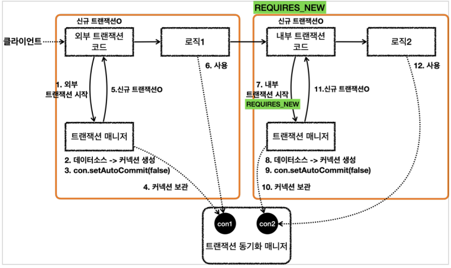

# 트랜잭션 전파(Transaction Propagation)

## 트랜잭션 전파란?

트랜잭션을 각각 사용하는 것이 아니라,  
이미 트랜잭션이 진행중인데 추가로 트랜잭션을 수행하는 경우에 어떻게 동작할지 결정하는 것을 트랜잭션 전파라 한다.

## 스프링 트랜잭션 전파 기본(REQUIRED)


- 외부 트랜잭션 수행중에 내부 트랜잭션이 추가로 수행되는 경우, 스프링은 하나의 물리 트랜잭션이라는 개념으로 두 트랜잭션을 묶어준다.
- 이 때 내부 트랜잭션이 외부 트랜잭션에 참여하게 된다.
- 물리 트랜잭션은 우리가 실제 데이터베이스에 적용되는 트랜잭션을 뜻한다. 실제 커넥션을 통해 트랜잭션을 시작, 커밋, 롤백하는 단위이다.
- 논리 트랜잭션은 트랜잭션 매니저를 통해 트랜잭션을 사용하는 단위이다.

트랜잭션 전파 원칙은 다음과 같다.

### 원칙

- **모든 논리 트랜잭션이 커밋되어야 물리 트랜잭션이 커밋된다.**
- **하나의 논리 트랜잭션이라도 롤백되면 물리 트랜잭션은 롤백된다.**

#

## 트랜잭션 전파 실제 동작


- 스프링은 여러 트랜잭션이 함꼐 사용되는 경우, 처음 트랜잭션을 시작한 외부 트랜잭션이 실제 물리 트랜잭션을 관리하도록 한다.
- 트랜잭션 매니저는 트랜잭션 생성 결과를 `TransactionStatus`에 담아서 반환하고, 여기에는 신규 트랜잭션의 여부가 담겨 있다.
    - `isNewTransaction()`을 사용하면 신규 트랜잭션 여부를 확인할 수 있다.(true, false)
- 내부 트랜잭션의 트랜잭션 매니저가 기존 트랜잭션이 존재하는지 확인하고, 기존 트랜잭션에 참여하도록 한다.
    - 외부 트랜잭션에서 물리 트랜잭션을 시작했다.
    - 그리고 물리 트랜잭션이 시작된 커넥션을 트랜잭션 동기화 매니저에 담아두었다.
    - 이미 물리 트랜잭션이 진행중이므로, 이후 로직이 기존 커넥션을 사용하게 만드는 것이다. 


- 로직이 끝나고 트랜잭션 매니저는 커밋 시점에 신규 트랜잭션 여부에 따라 다르게 동작하게 된다.
    - 내부 트랜잭션인 경우 신규 트랜잭션이 아니기 때문에 트랜잭션 매니저는 실제 커밋이나 롤백을 호출하지 않는다.
    - 실제 커넥션에 커밋이나 롤백을 호출하게 되면 물리 트랜잭션이 끝나버리기 때문에 실제 커밋 롤백을 호출하면 안된다.
    - 외부 트랜잭션인 경우에 신규 트랜잭션이므로 트랜잭션 매니저는 DB 커넥션에 실제 커밋 롤백을 호출한다.
- 트랜잭션 매니저에 커밋을 호출한다고 해서 항상 실제 커넥션에 물리 커밋이 발생하지는 않는다!!.

#

## 트랜잭션 전파 내부 롤백 상황

내부 트랜잭션이 롤백을 하는데 외부 트랜잭션이 커밋을 하게 된다면 스프링 트랜잭션 전파 원칙에 따라 물리 트랜잭션은 최종 롤백된다.


- 내부 트랜잭션을 롤백하면 실제 물리 트랜잭션을 롤백하지는 않는다. 대신 기존 트랜잭션을 `rollback-only`로 마킹한다.
- 외부 트랜잭션 코드가 커밋을 요청해도 트랜잭션 매니저가 동기화 매니저에 `rollback-only`표시가 있는지 확인한다.
- `rollback-only` 표시가 있으면 커밋 요청이 와도 롤백을 호출한다.
-
- 이 때 트랜잭션 매니저는 커밋을 호출한 개발자에게 예기치 못한 이유로 롤백이 되었다는 것을 알려주어야한다.
- 스프링은 이 경우 `UnexpectedRollbackException` 런타임 예외를 던져서 개발자에게 명확하게 알려주게 된다.

---

## 스프링 트랜잭션 전파 REQUIRES_NEW

트랜잭션 전파 옵션인 REQUIRES_NEW를 사용하면 외부 트랜잭션과 내부 트랜잭션을 완전히 분리시킬 수 있다.  
그러면 커밋과 롤백도 각각 별도로 이루어지게 되고, 각각에 문제가 발생해도 서로에게 영향을 주지 않는다.

```java
DefaultTransactionAttribute definition = new DefaultTransactionAttribute();
definition.setPropagationBehavior(TransactionDefinition.PROPAGATION_REQUIRES_NEW)
TransactionStatus inner = txManager.getTransaction(definition);
```



- 내부 트랜잭션 매니저는 `REQUIRES_NEW` 옵션을 확인하고 기존 트랜잭션에 참여하는 것이 아니라 새로운 트랜잭션에 참여한다.
- 트랜잭션 매니저는 데이터소스를 통해 커넥션을 생성하고, 생성한 커넥션을 수동 커밋 모드로 설정해서 물리 트랜잭션을 시작한다.
- 트랜잭션 매니저는 트랜잭션 동기화 매니저에 커넥션을 보관한다.
    - 이 때 외부 트랜잭션에서 사용하던 `con1`은 잠시 보류되고, 내부 트랜잭션에서는 `con2`가 사용된다.
- 트랜잭션 매니저는 신규 트랜잭션 여부인 `isNewTransaction == true`를 반환해서 실제 커밋 롤백이 호출된다.
- 이처럼 `REQUIRES_NEW` 옵션을 사용하면 데이터베이스 커넥션이 동시에 2개가 사용된다는 점을 주의해야 한다.

---

## 개발자가 많이 하는 실수


- `MemberService`, `MemberRepository`, `LogRepository` 세 논리 트랜잭션이 하나의 물리 트랜잭션으로 묶여있는 상황에서
- 내부 트랜잭션 `LogRepository` 에서 발생한 예외를 `MemberService` 에서 잡는다면
- `MemberService` 의 트랜잭션 AOP 에서 정상 흐름으로 커밋을 수행할 수 있을 것만 같다.

하지만 이 방법은 실패하는 방법이다.  
항상 `rollback_only`를 신경써야하고, `UnexpectedRollbackException`를 생각해야 한다.


- `LogRepository`에서 예외가 발생하고 예외를 던지면, `LogRepository` 트랜잭션 AOP가 예외를 받는다.
- 신규 트랜잭션이 아니므로 물리 트래잭션을 롤백하지 않고, `rollback_only` 마킹을 한다.
- 예외가 `MemberService`에 던져지고, `MemberService`에서 해당 예외를 복구해서 정상적으로 리턴하면 
- `MemberService`의 트랜잭션 AOP는 커밋을 호출한다.
-
- 신규 트랜잭션이므로 트랜잭션 매니저는 `rollback_only`를 체크하게되고 물리 트랜잭션을 롤백시킨다.
- 그리고 트랜잭션 매니저와 AOP는 `UnexpectedRollbackException` 예외를 던진다.

결과적으로 내부에서 발생해서 올라오는 예외를 외부 클래스에서 복구해도, 결과적으로 물리 트랜잭션은 롤백되고 `UnexpectedRollbackException`이 발생한다.  

---

## Reference
- [스프링 DB 2편 - 데이터 접근 활용 기술](https://www.inflearn.com/course/%EC%8A%A4%ED%94%84%EB%A7%81-db-2/dashboard)
