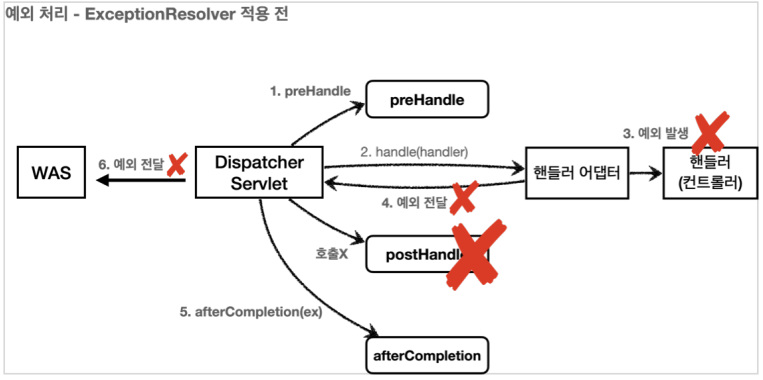
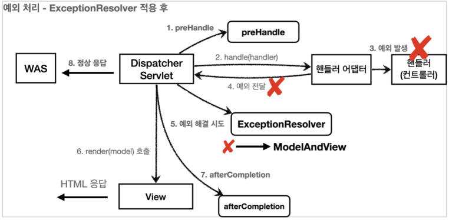
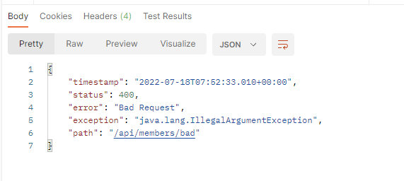
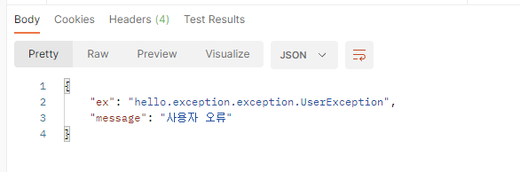
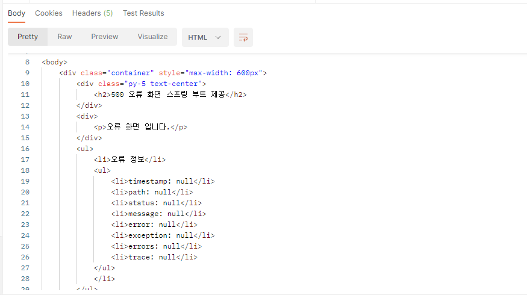

# 14. API 예외 처리

HTML 페이지의 경우 4xx, 5xx와 같은 단순 오류 페이지만 있으면 대부분의 문제를 해결할 수 있었다.  
그런데 API의 경우에는 생각할 내용이 더 많다. API는 각 오류 상황에 맞는 오류 응답 스펙을 정하고, JSON으로 데이터를 내려주어야 한다.

## HandlerExceptionResolver

스프링 MVC는 컨트롤러 밖으로 예외가 던져진 경우 예외를 해결하고, 동작을 새로 정의할 수 있는 방법을 제공한다.  
`HandlerExceptionResolver`를 사용해서 동작 방식을 변경할 수 있다. 줄여서 ExceptionResolver라 한다.

- 예외 상태 코드 변환
    - 예외를 response.sendError(xxx) 호출로 변경해서 서블릿에서 상태 코드에 따른 오류를 처리하도록 위임
    - 이후 WAS는 서블릿 오류 페이지를 찾아서 내부 호출
- 뷰 템플릿 처리
    - ModelAndView에 값을 채워서 예외에 따른 새로운 오류 화면 뷰 렌더링 해서 고객에게 제공
- API 응답 처리
    - response.getWriter().prinln("hello"); 처럼 HTTP 응답 바디에 직접 데이터를 넣어주는게 가능
    - JSON으로 응답하면 API 응답 처리 가능

#

### 상태 코드 변환

`IllegalArgumentException`을 처리하지 못해서 컨트롤러 밖으로 넘어가는 일이 발생하면 HTTP 상태코드를 400으로 처리할 수 있다.

  
  

ExceptionResolver로 예외를 해결해도 컨트롤러가 호출이 되는건 아니기 때문에 postHandle()은 호출되지 않는다.

### HandlerExceptionResolver 인터페이스
```java
public interface HandlerExceptionResolver {
    ModelAndView resolveException(HttpServletRequest request, HttpServletResponse response,
                                 Object handler, Exception ex);
}
```

### MyHandlerExceptionResolver
```java
package hello.exception.resolver;

import lombok.extern.slf4j.Slf4j;
import org.springframework.web.servlet.HandlerExceptionResolver;
import org.springframework.web.servlet.ModelAndView;

import javax.servlet.http.HttpServletRequest;
import javax.servlet.http.HttpServletResponse;
import java.io.IOException;

@Slf4j
public class MyHandlerExceptionResolver implements HandlerExceptionResolver {

    @Override
    public ModelAndView resolveException(HttpServletRequest request, HttpServletResponse response, Object handler, Exception ex) {
        try {
            if (ex instanceof IllegalArgumentException) {
                log.info("IllegalArgumentException resolver to 400");
                response.sendError(HttpServletResponse.SC_BAD_REQUEST, ex.getMessage());

                return new ModelAndView();
            }
        } catch (IOException e) {
            log.error("resolver ex", e);
        }

        return null;
    }
}
```

ExceptionResolver가 빈 ModelAndView를 반환하는 이유는 마치 try, catch를 하듯이,  
Exception을 처리해서 정상 흐름 처럼 변경하는 것이 목적이다.  
  
IllegalArgumentException이 발생하면 response.sendError(400)을 호출해서 HTTP 상태 코드를 400으로 지정하고, 빈 ModelAndView를 반환한다.
  
- `빈 ModelAndView`
    - new ModelAndView()처럼 빈 ModelAndView를 반환하면 뷰를 렌더링 하지 않고, 정상 흐름으로 서블릿이 리턴된다.
- `ModelAndView 지정`
    - ModelAndView에 View, Model 등의 정보를 지정해서 반환하면 뷰를 렌더링 한다.
- `null`
    - null을 반환하면, 다음 ExceptionResolver를 찾아서 실행한다.
    - 만약 처리할 수 있는 ExceptionResolver가 없으면 예외 처리가 안되고, 기존에 발생한 예외를 서블릿 밖으로 던진다.


### WebConfig 수정 (WebMvcConfigurer를 통해 등록)
```java
@Override
public void extendHandlerExceptionResolvers(List<HandlerExceptionResolver> resolvers) {
    resolvers.add(new MyHandlerExceptionResolver());
}
```

Postman으로 확인해보면 상태 코드가 400으로 바뀐 것을 볼 수 있다.  


---

## HandlerExceptionResolver 활용
 
예외가 발생하면 WAS까지 예외가 던져지고, WAS에서 오류 페이지 정보를 찾아서 다시 /error를 호출하는 과정은 너무 복잡하다.  
ExceptionResolver를 활용하면 예외가 발생했을 때 이런 복잡한 과정 없이 Resolver에서 문제를 해결할 수 있다.

http://localhost:8080/api/members/user-ex 호출시 UserException이 발생하도록 한다.  

### 예외를 처리하는 UserHandlerExceptionResolver
```java
package hello.exception.resolver;

import com.fasterxml.jackson.databind.ObjectMapper;
import hello.exception.exception.UserException;
import lombok.extern.slf4j.Slf4j;
import org.springframework.web.servlet.HandlerExceptionResolver;
import org.springframework.web.servlet.ModelAndView;

import javax.servlet.http.HttpServletRequest;
import javax.servlet.http.HttpServletResponse;
import java.io.IOException;
import java.util.HashMap;
import java.util.Map;

@Slf4j
public class UserHandlerExceptionResolver implements HandlerExceptionResolver {
    private final ObjectMapper objectMapper = new ObjectMapper();

    @Override
    public ModelAndView resolveException(HttpServletRequest request, HttpServletResponse response,
                                         Object handler, Exception ex) {

        try {
            if (ex instanceof UserException) {
                log.info("UserException resolver to 400");
                String acceptHeader = request.getHeader("accept"); // 요청 접근방법 조회
                response.setStatus(HttpServletResponse.SC_BAD_REQUEST); // 응답 http 상태 코드를 400으로 설정
                
                if ("application/json".equals(acceptHeader)) { // 요청이 JSON 형식일 경우
                    Map<String, Object> errorResult = new HashMap<>();
                    errorResult.put("ex", ex.getClass()); // UserException
                    errorResult.put("message", ex.getMessage()); // "사용자 오류"
                    String result = objectMapper.writeValueAsString(errorResult);
                    response.setContentType("application/json");
                    response.setCharacterEncoding("utf-8");
                    response.getWriter().write(result); // HTTP 응답 바디에 직접 데이터를 넣어 JSON으로 처리가 가능 (핵심) 
                    return new ModelAndView(); // 빈 ModelAndView 반환: 정상 흐름으로 리턴
                } else {
                    // 요청 형식이 TEXT/HTML 일 경우
                    return new ModelAndView("error/500"); // 그냥 HTML 오류 페이지를 보여준다.
                }
            }
        } catch (IOException e) {
            log.error("resolver ex", e);
        }
        return null;
    }
}
```

### WebConfig에 UserHandlerExceptionResolver를 추가
```java
@Override
public void extendHandlerExceptionResolvers(List<HandlerExceptionResolver> resolvers) {
    resolvers.add(new MyHandlerExceptionResolver());
    resolvers.add(new UserHandlerExceptionResolver());
}
```

  
ACCEPT: application/json  
  
  
ACCEPT: text/html  
  
  
ExceptionResolver를 사용하면 컨트롤러에서 예외가 발생해도 ExceptionResolver에서 예외를 처리할 수 있다.  
따라서 예외가 발생해도 서블릿 컨테이너까지 예외가 전달되지 않고, 스프링 MVC에서 예외 처리가 끝이 난다.  
결과적으로 WAS 입장에서는 정상 처리가 된 것이다.  
  
이렇게 예외를 이곳에서 모두 처리할 수 있다는 것이 핵심이다.

---

### Reference
- [스프링 MVC 2편 - 백엔드 웹 개발 핵심 기술](https://www.inflearn.com/course/%EC%8A%A4%ED%94%84%EB%A7%81-mvc-2/dashboard)
