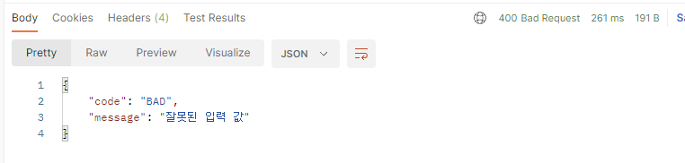

# API 예외처리 - ExceptionHandlerExceptionResolver

## 스프링이 제공하는 ExceptionResolver

스프링 부트가 기본으로 제공하는 `ExceptionResolver` 및 우선 순위는 다음과 같다.
> HandlerExceptionResolverComposite에 등록 되어있다.
> 
> public class HandlerExceptionResolverComposite implements HandlerExceptionResolver, Ordered {...}

- 1\. `ExceptionHandlerExceptionResolver` -> @ExceptionHandler 처리
- 2\. `ResponseStatusExceptionResolver`  -> HTTP 상태 코드 지정
- 3\. `DefaultHandlerExceptionResolver` -> 스프링 내부 기본 예외 처리

---

## 1. ExceptionHandlerExceptionResolver

### 기존 API 예외 처리의 어려운 점

스프링 MVC가 제공해 준 HandlerExceptionResolver는 ModelAndView를 반환하도록 설계되어 있었다.  
  
하지만 ModelAndView를 반환하는 프로세스는 API 응답과 매칭이 잘 되지 않으며  
HandlerExceptionResolver를 직접 구현하는 과정에서 HttpServletResponse에 직접 응답 데이터를 넣어주는 것 역시 매우 불편했다.

#
  
스프링은 API 예외 문제 처리를 해결하기 위해 `ExceptionHandlerExceptionResolver`를 기본으로 제공한다.  
이를 어노테이션 `@ExceptionHandler`로 매우 간편하게 사용할 수 있고, 기본으로 제공하는 ExceptionResolver 중에 우선순위도 가장 높다.  
  
실무에서 API 예외 처리는 대부분 이 기능을 사용한다.

#

```java
@Slf4j
@RestController
public class ApiExceptionV2Controller {

    /**
     * ExceptionHandler
     */

    @ResponseStatus(HttpStatus.BAD_REQUEST)
    @ExceptionHandler(IllegalArgumentException.class)
    public ErrorResult illegalExHandle(IllegalArgumentException e) {
        log.error("[exceptionHandle] ex", e);
        return new ErrorResult("BAD", e.getMessage());
    }

    @ExceptionHandler //예외를 생략할 수 있다. 생략하면 메서드 파라미터의 예외가 지정된다. (UserException.class)
    public ResponseEntity<ErrorResult> userExhandle(UserException e) {
        log.error("[exceptionHandle] ex", e);
        ErrorResult errorResult = new ErrorResult("USER-EX", e.getMessage());
        return new ResponseEntity<>(errorResult, HttpStatus.BAD_REQUEST);
    }

    @ResponseStatus(HttpStatus.INTERNAL_SERVER_ERROR)
    @ExceptionHandler
    public ErrorResult exHandle(Exception e) {
        log.error("[exceptionHandle] ex", e);
        return new ErrorResult("EX", "내부 오류");
    }

    /**
     * 실제 컨트롤러 메서드
     */

    @GetMapping("/api2/members/{id}")
    public MemberDto getMember(@PathVariable("id") String id) {
        if (id.equals("ex")) {
            throw new RuntimeException("잘못된 사용자");
        }
        if (id.equals("bad")) {
            throw new IllegalArgumentException("잘못된 입력 값");
        }
        if (id.equals("user-ex")) {
            throw new UserException("사용자 오류");
        }
        return new MemberDto(id, "hello " + id);
    }

    @Data
    @AllArgsConstructor
    static class MemberDto {
        private String memberId;
        private String name;
    }
}

```

`@ExceptionHandler` 어노테이션을 선언하고, 해당 컨트롤러에서 처리하고 싶은 예외를 지정해주면 된다.  
해당 컨트롤러에서 예외가 발생하면 이 메서드가 호출된다. 지정한 예외 또는 그 예외의 자식 클래스는 모두 잡을 수 있다.

> @ExceptionHandler에는 마치 스프링의 컨트롤러의 파라미터 응답처럼 다양한 파라미터와 응답을 지정할 수 있다.     
> https://docs.spring.io/spring-framework/docs/current/reference/html/web.html#mvc-ann-exceptionhandler-args

#

### 실행 흐름

```java
@ResponseStatus(HttpStatus.BAD_REQUEST)
@ExceptionHandler(IllegalArgumentException.class)
public ErrorResult illegalExHandle(IllegalArgumentException e) {
    log.error("[exceptionHandle] ex", e);
    return new ErrorResult("BAD", e.getMessage());
}
```

- 컨트롤러를 호출한 결과 `IllegalArgumentException`이 컨트롤러 밖으로 던져진다.
- 예외가 발생했으므로 ExceptionResolver가 작동하고, 가장 우선순위가 높은 `ExceptionHandlerExceptionResolver`가 실행된다.
- `ExceptionHandlerExceptionResolver`는 해당 컨트롤러에 `IllegalArgumentException`을 처리할 수 있는 `@ExceptionHandler`가 있는지 확인한다.
- 존재하므로 `illegalExHandle()`를 실행한다.
    - `@RestController` 이므로 illegalExHandle()에도 `@ResponseBody`가 적용된다.
    - 따라서 `HttpMessageConvertor`가 사용되고, 응답이 다음과 같은 JSON으로 반환된다.
- `@ResponseStatus(HttpStatus.BAD_REQUEST)`를 지정했으므로 HTTP 상태 코드 400으로 응답한다.



---

## API 예외 처리 - @ControllerAdvice

`@ControllerAdvice` 또는 `@RestControllerAdvice`를 사용해서 정상 코드와 예외 처리 코드를 분리할 수 있다.

```java
@Slf4j
@RestControllerAdvice
public class ExControllerAdvice {
    /**
     * ExceptionHandler
     */

    @ResponseStatus(HttpStatus.BAD_REQUEST)
    @ExceptionHandler(IllegalArgumentException.class)
    public ErrorResult illegalExHandle(IllegalArgumentException e) {
        log.error("[exceptionHandle] ex", e);
        return new ErrorResult("BAD", e.getMessage());
    }

    @ExceptionHandler //예외를 생략할 수 있다. 생략하면 메서드 파라미터의 예외가 지정된다. (UserException.class)
    public ResponseEntity<ErrorResult> userExhandle(UserException e) {
        log.error("[exceptionHandle] ex", e);
        ErrorResult errorResult = new ErrorResult("USER-EX", e.getMessage());
        return new ResponseEntity<>(errorResult, HttpStatus.BAD_REQUEST);
    }

    @ResponseStatus(HttpStatus.INTERNAL_SERVER_ERROR)
    @ExceptionHandler
    public ErrorResult exHandle(Exception e) {
        log.error("[exceptionHandle] ex", e);
        return new ErrorResult("EX", "내부 오류");
    }
}
```

### @ControllerAdvice
- `@ControllerAdvice`는 대상으로 지정한 여러 컨트롤러에 `@ExceptionHandler`, `@InitBinder`기능을 부여한다.
- `@ControllerAdvice`에 대상을 지정하지 않으면 모든 컨트롤러에 적용된다. (글로벌)
- `@RestControllerAdvice`는 `@ControllerAdvice`에 `@ResponseBody`가 추가되어 있다.

#

```java
// Target all Controllers annotated with @RestController
@ControllerAdvice(annotations = RestController.class)
public class ExampleAdvice1 {}

// Target all Controllers within specific packages
@ControllerAdvice("org.example.controllers")
public class ExampleAdvice2 {}

// Target all Controllers assignable to specific classes
@ControllerAdvice(assignableTypes = {ControllerInterface.class,
AbstractController.class})
public class ExampleAdvice3 {}
```

특정 애노테이션이 있는 컨트롤러, 특정 패키지, 특정 클래스를 원하는 방법으로 지정할 수 있다.  
대상 컨트롤러 지정을 생략하면 모든 컨트롤러에 적용된다.  
  
따라서 코드의 관심사를 명확하게 분리할 수 있다.
  
스프링 공식 문서:  
https://docs.spring.io/spring-framework/docs/current/reference/html/web.html#mvc-ann-controller-advice

---

### Reference
- [스프링 MVC 2편 - 백엔드 웹 개발 핵심 기술](https://www.inflearn.com/course/%EC%8A%A4%ED%94%84%EB%A7%81-mvc-2/dashboard)
