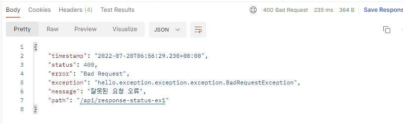
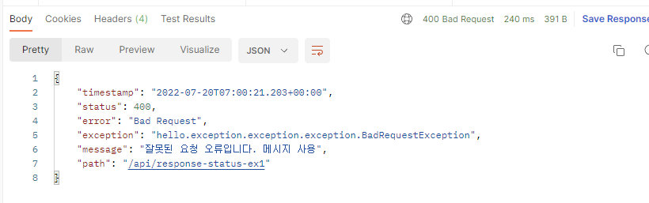
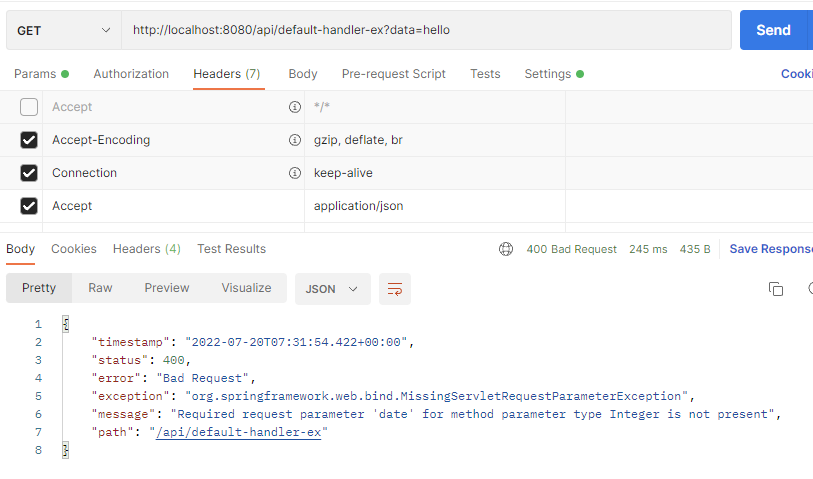

# 14. API 예외처리

## 스프링이 기본으로 제공하는 ExceptionResolver

스프링 부트가 기본으로 제공하는 ExceptionResolver는  
HandlerExceptionResolverComposite에 다음과 같은 우선 순위로 등록되어 있다.  

- 1\. ExceptionHandlerExceptionResolver  (@ExceptionHandler 처리, API 예외 처리는 대부분 이 기능으로 해결)
- 2\. ResponseStatusExceptionResolver  (HTTP 상태 코드 지정)
- 3\. DefaultHandlerExceptionResolver  (스프링 내부 기본 예외 처리)

---

## 2. ResponseStatusExceptionResolver

ResponseStatusExceptionResolver는 예외에 따라 HTTP 상태 코드를 지정해주는 역할을 한다.

### @ResponseStatus가 달려있는 예외
```java
package hello.exception.exception.exception;

import org.springframework.http.HttpStatus;
import org.springframework.web.bind.annotation.ResponseStatus;

@ResponseStatus(code = HttpStatus.BAD_REQUEST, reason = "잘못된 요청 오류")
//@ResponseStatus(code = HttpStatus.BAD_REQUEST, reason = "error.bad")
public class BadRequestException extends RuntimeException {
}
```

BadRequestException 예외가 컨트롤러 밖으로 넘어가면  
ResponseStatusExceptionResolver가 해당 애노테이션을 확인해서 오류 코드를 원하는 코드로 변경하고, 메시지도 담는다.  
  
ResponseStatusExceptionResolver 코드를 확인해 보면 response.sendError(StatusCode, resolvedReason)를 호출하도록 되어있다.
sendError()를 호출하는 것이기 때문에 WAS에서 다시 오류페이지를 내부 요청한다.  

```java
@GetMapping("/api/response-status-ex1")
public String responseStatusEx1() {
    throw new BadRequestException();
}
```

  

reasone을 MessageSource에서 찾는 기능도 제공한다.

```properties
error.bad=잘못된 요청 오류입니다. 메시지 사용
```

 

#

### ResponseStatusException

@ResponseStatus는 개발자가 직접 변경할 수 없는 예외에는 적용할 수 없다. (내가 코드를 수정할 수 없는 라이브러리의 예외 코드)  
추가로 애노테이션을 사용하기 때문에 조건에 따라 동적으로 변경하는 것도 어렵다.  
이때는 ResponseStatusException 예외를 사용하면 된다.

```java
@GetMapping("/api/response-status-ex2")
public String responseStatusEx2() {
    throw new ResponseStatusException(HttpStatus.NOT_FOUND, "error.bad", new IllegalArgumentException());
}
```

 

---

## 3. DefaultHandlerExceptionResolver

DefaultHandlerExceptionResolver는 스프링 내부에서 발생하는 스프링 예외를 해결한다.  
  
대표적으로 파라미터 바인딩 시점에 타입이 맞지 않으면 내부에서 TypeMismatchException이 발생하는데,  
이 경우 예외가 발생했기 때문에 그냥 두면 서블릿 컨테이너까지 오류가 올라가고, 결과적으로 500 오류가 발생한다.  
  
그런데 파라미터 바인딩은 대부분 클라이언트가 HTTP 요청 정보를 잘못 호출해서 발생하는 문제이다.  
HTTP 에서는 이런 경우 HTTP 상태 코드 400을 사용하도록 되어 있다.  
DefaultHandlerExceptionResolver는 이것을 500 오류가 아니라 400 오류로 자동으로 변경해준다.  
  
```java
@GetMapping("/api/default-handler-ex")
public String defaultException(@RequestParam Integer date) {
    return "ok";
}
```

 

Integer data에 문자를 파라미터로 넘겨주면 TypeMismatchException이 발생한다.  
DefaultHandlerExceptionResolver 덕분에 상태코드가 400인 것을 확인할 수 있다.

---

## 1. ExceptionHandlerExceptionResolver


