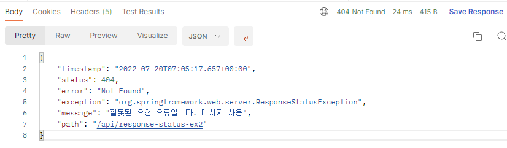

# 14. API 예외처리

## 스프링이 기본으로 제공하는 ExceptionResolver

스프링 부트가 기본으로 제공하는 ExceptionResolver는  
HandlerExceptionResolverComposite에 다음과 같은 우선 순위로 등록되어 있다.  

- 1\. ExceptionHandlerExceptionResolver  (@ExceptionHandler 처리, API 예외 처리는 대부분 이 기능으로 해결)
- 2\. ResponseStatusExceptionResolver  (HTTP 상태 코드 지정)
- 3\. DefaultHandlerExceptionResolver  (스프링 내부 기본 예외 처리)

---

## 2. ResponseStatusExceptionResolver

ResponseStatusExceptionResolver는 예외에 따라 HTTP 상태 코드를 지정해주는 역할을 한다.

### @ResponseStatus가 달려있는 예외
```java
package hello.exception.exception;

import org.springframework.http.HttpStatus;
import org.springframework.web.bind.annotation.ResponseStatus;

@ResponseStatus(code = HttpStatus.BAD_REQUEST, reason = "잘못된 요청 오류")
//@ResponseStatus(code = HttpStatus.BAD_REQUEST, reason = "error.bad")
public class BadRequestException extends RuntimeException {
}
```
 
BadRequestException 예외가 컨트롤러 밖으로 넘어가면  
ResponseStatusExceptionResolver가 해당 애노테이션을 확인해서 오류 코드를 원하는 코드로 변경하고, 메시지도 담는다.  
  
ResponseStatusExceptionResolver 코드를 확인해 보면 response.sendError(StatusCode, resolvedReason)를 호출하도록 되어있다.
sendError()를 호출하는 것이기 때문에 WAS에서 다시 오류페이지를 내부 요청한다.  

```java
@GetMapping("/api/response-status-ex1")
public String responseStatusEx1() {
    throw new BadRequestException();
}
```

  

reasone을 MessageSource에서 찾는 기능도 제공한다.

```properties
error.bad=잘못된 요청 오류입니다. 메시지 사용
```

 

#

### ResponseStatusException

@ResponseStatus는 개발자가 직접 변경할 수 없는 예외에는 적용할 수 없다. (내가 코드를 수정할 수 없는 라이브러리의 예외 코드)  
추가로 애노테이션을 사용하기 때문에 조건에 따라 동적으로 변경하는 것도 어렵다.  
이때는 ResponseStatusException 예외를 사용하면 된다.

```java
@GetMapping("/api/response-status-ex2")
public String responseStatusEx2() {
    throw new ResponseStatusException(HttpStatus.NOT_FOUND, "error.bad", new IllegalArgumentException());
}
```

 

---

## 3. DefaultHandlerExceptionResolver

DefaultHandlerExceptionResolver는 스프링 내부에서 발생하는 스프링 예외를 해결한다.  
  
대표적으로 파라미터 바인딩 시점에 타입이 맞지 않으면 내부에서 TypeMismatchException이 발생하는데,  
이 경우 예외가 발생했기 때문에 그냥 두면 서블릿 컨테이너까지 오류가 올라가고, 결과적으로 500 오류가 발생한다.  
  
그런데 파라미터 바인딩은 대부분 클라이언트가 HTTP 요청 정보를 잘못 호출해서 발생하는 문제이다.  
HTTP 에서는 이런 경우 HTTP 상태 코드 400을 사용하도록 되어 있다.  
DefaultHandlerExceptionResolver는 이것을 500 오류가 아니라 400 오류로 자동으로 변경해준다.  
  
```java
@GetMapping("/api/default-handler-ex")
public String defaultException(@RequestParam Integer date) {
    return "ok";
}
```

 

Integer data에 문자를 파라미터로 넘겨주면 TypeMismatchException이 발생한다.  
DefaultHandlerExceptionResolver 덕분에 상태코드가 400인 것을 확인할 수 있다.

---

## 1. ExceptionHandlerExceptionResolver

### API 예외처리의 어려운 점
- HandlerExceptionResolver를 떠올려 보면 ModelAndView를 반환해야 했다. 이것은 API 응답에는 필요하지 않다
- API 응답을 위해서 HttpServletResponse에 직접 응답 데이터를 넣어주었다. 이것은 매우 불편하다
    - 스프링 컨트롤러에 비유하면 마치 과거 서블릿을 사용하던 시절로 돌아간 것 같다.
- 특정 컨트롤러에서만 발생하는 예외를 별도로 처리하기 어렵다.

### @ExceptionHandler
스프링은 API 예외 문제 처리를 해결하기 위해 @ExceptionHandler라는 애노테이션을 사용하는 매우 편리한 기능을 제공한다.  
스프링은 ExceptionHandlerExceptionResolver를 기본으로 제공하고,  
기본으로 제공하는 ExceptionResolver중에 우선순위도 가장 높다. 실무에서 API 예외 처리는 대부분 이 기능을 사용한다.


#

```java
package hello.exception.exhandler;

import lombok.AllArgsConstructor;
import lombok.Data;

@Data
@AllArgsConstructor
public class ErrorResult {
    private String code;
    private String message;
}
```
예외가 발생했을 때 API 응답으로 사용하는 객체를 정의했다.

#

```java
@ResponseStatus(HttpStatus.BAD_REQUEST)
@ExceptionHandler(IllegalArgumentException.class)
public ErrorResult illegalExHandle(IllegalArgumentException e) {
    log.error("[exceptionHandle] ex", e);
    return new ErrorResult("BAD", e.getMessage());
}

@ExceptionHandler
public ResponseEntity<ErrorResult> userExhandle(UserException e) {
    log.error("[exceptionHandle] ex", e);
    ErrorResult errorResult = new ErrorResult("USER-EX", e.getMessage());
    return new ResponseEntity<>(errorResult, HttpStatus.BAD_REQUEST);
}

@ResponseStatus(HttpStatus.INTERNAL_SERVER_ERROR)
@ExceptionHandler
public ErrorResult exHandle(Exception e) {
    log.error("[exceptionHandle] ex", e);
    return new ErrorResult("EX", "내부 오류");
}

```

### @ExceptionHandler 예외 처리 방법
@ExceptionHandler 애노테이션을 선언한 다음, 해당 컨트롤러에서 처리하고 싶은 예외를 지정해주면 된다.  
해당 컨트롤러에서 예외가 발생하면 이 메서드가 호출된다. 지정한 예외 또는 그 예외의 자식 클래스는 모두 잡을 수 있다.
  
예외를 생략할 수도 있는데, 생략하면 메서드 파라미터의 예외가 지정된다.

### 파라미터와 응답
@ExceptionHandler에는 마치 스프링의 컨트롤러의 파라미터 응답처럼 다양한 파라미터와 응답을 지정할 수 있다.  
스프링 공식 문서:  
https://docs.spring.io/spring-framework/docs/current/reference/html/web.html#mvc-ann-exceptionhandler-args

#

### 실행 흐름
```java
@ResponseStatus(HttpStatus.BAD_REQUEST)
@ExceptionHandler(IllegalArgumentException.class)
public ErrorResult illegalExHandle(IllegalArgumentException e) {
    log.error("[exceptionHandle] ex", e);
    return new ErrorResult("BAD", e.getMessage());
}
```

- 컨트롤러를 호출한 결과 IllegalArgumentException 예외가 컨트롤러 밖으로 던져진다.
- 예외가 발생했으므로 ExceptionResolver가 작동한다.
    - 가장 우선순위가 높은 ExceptionHandlerExceptionResolver가 실행된다.
- ExceptionHandlerExceptionResolver는 해당 컨트롤러에 IllegalArgumentException을 처리할 수 있는 @ExceptionHandler가 있는지 확인한다.
- illegalExHandle()를 실행한다.
    - @RestController 이므로 illegalExHandle()에도 @ResponseBody가 적용된다.
    - 따라서 HTTP 컨버터가 사용되고, 응답이 다음과 같은 JSON으로 반환된다.
- @ResponseStatus(HttpStatus.BAD_REQUEST)를 지정했으므로 HTTP 상태 코드 400으로 응답한다.


---

## API 예외 처리 - @ControllerAdvice

@ControllerAdvice 또는 @RestControllerAdvice를 사용하면 정상코드와 예외 처리 코드 둘을 분리할 수 있다.

### ExControllerAdvice

```java
@Slf4j
@RestControllerAdvice
public class ExControllerAdvice {
}
```

### @ControllerAdvice
- @ControllerAdvice는 대상으로 지정한 여러 컨트롤러에 @ExceptionHandler, @InitBinder기능을 부여해주는 역할을 한다.
- @ControllerAdvice에 대상을 지정하지 않으면 모든 컨트롤러에 적용된다. (글로벌)
- @RestControllerAdvice는 @ControllerAdvice와 같고, @ResponseBody가 추가되어 있다.

#

```java
// Target all Controllers annotated with @RestController
@ControllerAdvice(annotations = RestController.class)
public class ExampleAdvice1 {}

// Target all Controllers within specific packages
@ControllerAdvice("org.example.controllers")
public class ExampleAdvice2 {}

// Target all Controllers assignable to specific classes
@ControllerAdvice(assignableTypes = {ControllerInterface.class,
AbstractController.class})
public class ExampleAdvice3 {}
```

특정 애노테이션이 있는 컨트롤러, 특정 패키지, 특정 클래스를 원하는 방법으로 지정할 수 있다.  
대상 컨트롤러 지정을 생략하면 모든 컨트롤러에 적용된다.  
  
스프링 공식 문서:  
https://docs.spring.io/spring-framework/docs/current/reference/html/web.html#mvc-ann-controller-advice

---

## 정리

- HTML 화면 오류의 경우 BasicErrorController를 사용하는게 제일 편하다.
- 단순히 5xx, 4xx 관련된 오류 화면을 등록해서 보여주기만 하면 된다.
- API 오류의 경우 ExceptionHandlerExceptionResolver, @ExceptionHandler 기능을 적극 사용하자

---

### Reference
- [스프링 MVC 2편 - 백엔드 웹 개발 핵심 기술](https://www.inflearn.com/course/%EC%8A%A4%ED%94%84%EB%A7%81-mvc-2/dashboard)
