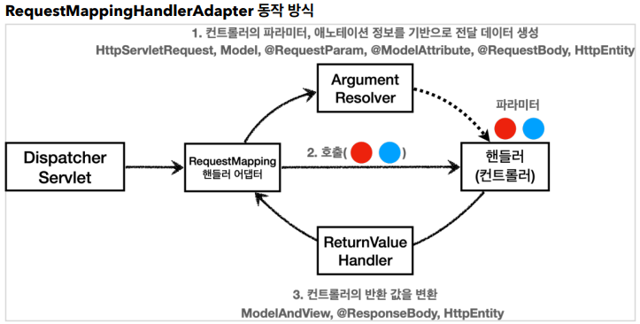

# ArgumentResolver

`ArgumentResolver`는 컨트롤러의 메서드 파라미터를 처리하고 필요한 데이터 변환 및 바인딩 작업을 담당하는 인터페이스이다.  
  
사용자는 `ArgumentResolver`를 구현함으로써 `다양한 방식으로 파라미터를 처리`하여 유연성을 높일 수 있고  
이로 인해 `코드 중복을 제거` 및 `특정 데이터 처리 로직을 재사용`할 수 있다.  

지금까지 `HttpServletRequest`, `Model`, `@RequestParam`, `@ModelAttribute`, `@ResponseBody` 등  
매우 다양한 파라미터를 사용할 수 있었던 것도 스프링이 기본적으로 30개가 넘는 `ArgumnetResolver`를 지원하기 때문이다.
> https://docs.spring.io/spring-framework/reference/web/webmvc/mvc-controller/ann-methods/arguments.html



`@RequestMapping`을 처리하는 핸들러 어댑터 `RequestMappingHandlerAdapter`는  
HTTP 요청이 들어오면 핸들러가 필요로 하는 다양한 파라미터의 값을 생성하는데  
이 때 `ArugmentResolver`를 호출해서 필요한 데이터를 생성하고 핸들러를 호출하면서 생성한 데이터를 전달한다.

```java
public interface HandlerMethodArgumentResolver {

    boolean supportsParameter(MethodParameter parameter);

    @Nullable
    Object resolveArgument(MethodParameter parameter, @Nullable ModelAndViewContainer mavContainer,
        NativeWebRequest webRequest, @Nullable WebDataBinderFactory binderFactory) throws Exception;

}
```

`RequestMappingHandlerAdapter`가 `supportsParameter()`를 통해 해당 파라미터를 지원하는지 여부를 확인하고
`resolveArgument()`를 호출해서 실제 객체를 생성한다.  

사용자는 위 `HandlerMethodArgumentResolver` 인터페이스를 구현해서 사용자 정의 `ArgumentResolver`를 통해  
파라미터에 대한 값 변환, 데이터 바인딩, 원하는 파라미터 처리 로직을 커스텀 구현할 수 있다.  

#

## 활용 예시

### 어노테이션 생성
```java
@Target(ElementType.PARAMETER)
@Retention(RetentionPolicy.RUNTIME)
public @interface Login {
}
```

`@Target`으로 어노테이션이 적용될 수 있는 대상을 지정한다.  
`@Retention`으로 어노테이션 정보가 유지되는 기간을 설정할 수 있다. `RUNTIME`으로 설정할 경우 컴파일 이후 런타임 시점에도 정보가 유지되고, Reflection을 사용해서 어노테이션이 적용된 요소에 접근할 수 있다.

### ArgumentResolver 구현
```java
@Slf4j
public class LoginMemberArgumentResolver implements HandlerMethodArgumentResolver {

    @Override
    public boolean supportsParameter(MethodParameter parameter) {
        log.info("supportsParameter 실행");

        //@Login 어노테이션이 있는지
        boolean hasLoginAnnotation = parameter.hasParameterAnnotation(Login.class);
        //파라미터 타입이 Member인지
        boolean hasMemberType = Member.class.isAssignableFrom(parameter.getParameterType());

        return hasLoginAnnotation && hasMemberType;
    }

    @Override
    public Object resolveArgument(MethodParameter parameter, ModelAndViewContainer mavContainer,
                                  NativeWebRequest webRequest, WebDataBinderFactory binderFactory) throws Exception {
        log.info("resolveArgument 실행");

        HttpServletRequest request = (HttpServletRequest) webRequest.getNativeRequest();
        HttpSession session = request.getSession(false);

        if (session == null) {
            return null;
        }

        return session.getAttribute(SessionConst.LOGIN_MEMBER);
    }
}
```

`RequestMappingHandlerAdapter`는 `supportsParameter`를 통해 지원 여부를 확인하고  
`resolveArgument()`를 호출해서 `Member` 파라미터에 전달할 값을 생성하고 반환한다.


### ArgumentResolver 추가 및 적용
```java
@Configuration
public class WebConfig implements WebMvcConfigurer {
    @Override
    public void addArgumentResolvers(List<HandlerMethodArgumentResolver> resolvers) {
        resolvers.add(new LoginMemberArgumentResolver());
    }
}
```
```java
@GetMapping("/")
public String homeLoginV3ArgumentResolver(@Login Member loginMember, Model model) {
    ...
}
```

#

## ReturnValueHandler

컨트롤러 메서드가 반환하는 값을 적절한 형태, HTTP 응답으로 변환하는 역할을 수행하는 `ReturnValueHandler` 인터페이스도 존재한다.  

예를 들면 문자열로 View 이름을 반환해도 정상적으로 View가 렌더링되는 경우가 있다.  
스프링은 10여개가 넘는 `ReturnValueHandler`를 지원하고 `ModelAndView`, `@ResponseBody`, `HttpEntity`등이 있다.
> https://docs.spring.io/spring-framework/reference/web/webmvc/mvc-controller/ann-methods/return-types.html

새로운 반환 형식이나 커스텀 반환 로직이 필요한 경우  
`HandlerMethodReturnValueHandler` 인터페이스를 구현해서 사용자 지정 반환 동작을 구현할 수 있다.

```java
public interface HandlerMethodReturnValueHandler {

    boolean supportsReturnType(MethodParameter returnType);

    void handleReturnValue(@Nullable Object returnValue, MethodParameter returnType,
        ModelAndViewContainer mavContainer, NativeWebRequest webRequest) throws Exception;

}
```

---

### Reference
- [스프링 MVC 2편 - 백엔드 웹 개발 핵심 기술](https://www.inflearn.com/course/%EC%8A%A4%ED%94%84%EB%A7%81-mvc-2/dashboard)
