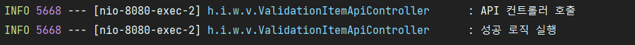
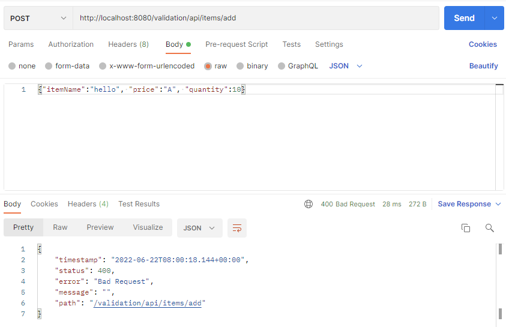
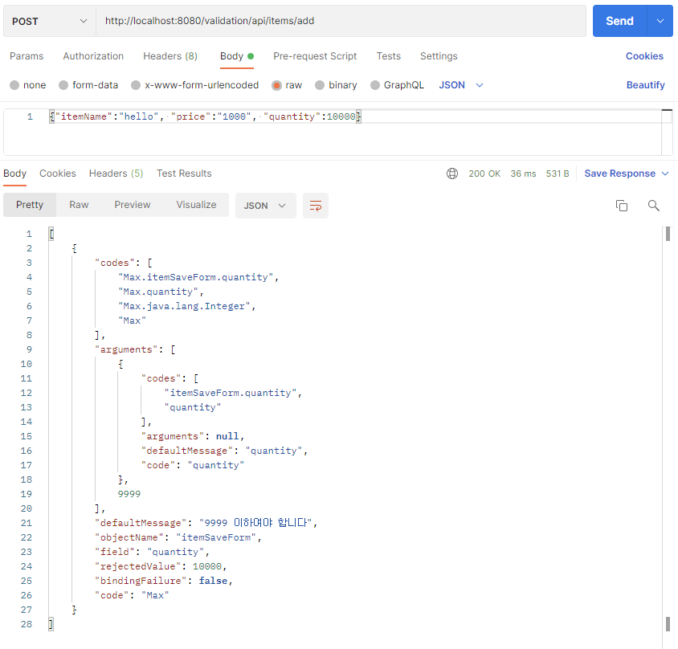

# 11. 검증2 - Bean Validation

## Form 전송 객체 분리

실무에서는 앞서 배운 groups를 잘 사용하지 않는다.  
그 이유는 바로 등록시 폼에서 전달하는 데이터가 Item 도메인 객체와 딱 맞지 않기 때문이다.  
  
실무에서는 회원 등록시 회원과 관련된 데이터만 전달받는 것이 아니라,  
약관 정보도 추가로 받는 등 Item과 관계없는 수 많은 부가 데이터가 넘어온다.  
  
그래서 보통 Item을 직접 전달받는 것이 아니라, 복잡한 폼의 데이터를 컨트롤러까지 전달할 별도의 객체를 만들어 전달한다.

#

### 폼 데이터 전달을 위한 별도의 객체 사용
- HTML Form -> ItemSaveForm -> Controller -> Item 생성 -> Repository
  - 장점: 전송하는 폼 데이터가 복잡해도 거기에 맞춘 별도의 폼 객체를 사용해서 데이터를 전달 받을 수 있다.
  - 단점: 폼 데이터를 기반으로 컨트롤러에서 Item 객체를 생성하는 변환 과정이 추가된다.

---

## Form 전송 객체 분리 - 개발

### ITEM

```java
package hello.itemservice.domain.item;

import lombok.Data;

@Data
public class Item {

    private Long id;
    private String itemName;
    private Integer price;
    private Integer quantity;
}
```

이제 Item의 검증은 사용하지 않으므로 검증 코드를 제거한다.

### ItemSaveForm
```java
package hello.itemservice.web.validation.form;

import lombok.Data;
import org.hibernate.validator.constraints.Range;

import javax.validation.constraints.Max;
import javax.validation.constraints.NotBlank;
import javax.validation.constraints.NotNull;

@Data
public class ItemSaveForm {

    @NotBlank
    private String itemName;

    @NotNull
    @Range(min = 1000, max = 1000000)
    private Integer price;

    @NotNull
    @Max(value = 9999)
    private Integer quantity;

}
```

### ItemUpdateForm
```java
package hello.itemservice.web.validation.form;

import lombok.Data;
import org.hibernate.validator.constraints.Range;

import javax.validation.constraints.NotBlank;
import javax.validation.constraints.NotNull;

@Data
public class ItemUpdateForm {

    @NotNull
    private Long id;

    @NotBlank
    private String itemName;

    @NotNull
    @Range(min = 1000, max = 1000000)
    private Integer price;

    private Integer quantity;
}
```

상품 등록과 수정 각각의 검증 요구조건에 맞도록 폼 객체를 따로 만든다.

### ValidationItemControllerV4

```java
@PostMapping("/add")
public String addItemV6(@Validated @ModelAttribute("item") ItemSaveForm form, BindingResult bindingResult, RedirectAttributes redirectAttributes) {

    if (form.getPrice() != null && form.getQuantity() != null) {
        int resultPrice = form.getPrice() * form.getQuantity();
        if (resultPrice < 10000) {
            bindingResult.reject("totalPriceMin", new Object[]{10000, resultPrice}, null);
        }
    }

    if (bindingResult.hasErrors()) {
        log.info("errors={}", bindingResult);
        return "validation/v4/addForm";
    }

    Item item = new Item();
    item.setItemName(form.getItemName());
    item.setPrice(form.getPrice());
    item.setQuantity(form.getQuantity());

    Item savedItem = itemRepository.save(item);
    redirectAttributes.addAttribute("itemId", savedItem.getId());
    redirectAttributes.addAttribute("status", true);
    return "redirect:/validation/v4/items/{itemId}";
}
```

Item 대신 ItemSaveForm 전달 받는다. 대신 기존 뷰 템플릿에서 접근하던 th:object를 유지하도록 @ModelAttribute에 "item" 이름을 넣어준다.  
폼 객체의 데이터를 기반으로 Item 객체를 생성한다. 이렇게 폼 객체 처럼 중간에 다른 객체가 추가되면 변환하는 과정이 추가된다.

```java
@PostMapping("/{itemId}/edit")
public String edit(@PathVariable Long itemId, @Validated @ModelAttribute("item") ItemUpdateForm form, BindingResult bindingResult) {

    if (form.getPrice() != null && form.getQuantity() != null) {
        int resultPrice = form.getPrice() * form.getQuantity();
        if (resultPrice < 10000) {
            bindingResult.reject("totalPriceMin", new Object[]{10000, resultPrice}, null);
        }
    }

    if (bindingResult.hasErrors()) {
        log.info("errors={}", bindingResult);
        return "validation/v4/editForm";
    }

    Item itemParam = new Item();
    itemParam.setItemName(form.getItemName());
    itemParam.setPrice(form.getPrice());
    itemParam.setQuantity(form.getQuantity());

    itemRepository.update(itemId, itemParam);
    return "redirect:/validation/v4/items/{itemId}";
}
```

---

## Bean Validation - HTTP 메시지 컨버터

@Valid, @Validated는 HttpMessageConverter (@RequestBody)에도 적용할 수 있다.

### ValidationItemApiController
```java
package hello.itemservice.web.validation;

import hello.itemservice.web.validation.form.ItemSaveForm;
import lombok.extern.slf4j.Slf4j;
import org.springframework.validation.BindingResult;
import org.springframework.validation.annotation.Validated;
import org.springframework.web.bind.annotation.PostMapping;
import org.springframework.web.bind.annotation.RequestBody;
import org.springframework.web.bind.annotation.RequestMapping;
import org.springframework.web.bind.annotation.RestController;

@Slf4j
@RestController
@RequestMapping("/validation/api/items")
public class ValidationItemApiController {

    @PostMapping("/add")
    public Object addItem(@RequestBody @Validated ItemSaveForm form, BindingResult bindingResult) {
        log.info("API 컨트롤러 호출");

        if (bindingResult.hasErrors()) {
            log.info("검증 오류 발생 errors={}", bindingResult);
            return bindingResult.getAllErrors();
        }

        log.info("성공 로직 실행");
        return form;
    }
}
```

API의 경우 3가지 경우를 나누어 생각해야 한다.
- 성공 요청: 성공
- 실패 요청: JSON을 객체로 생성하는 것 자체가 실패함
- 검증 오류 요청: JSON을 객체로 생성하는 것은 성공했고, 검증에서 실패함

### 성공 요청 로그


### 실패 요청 결과
prica 값에 숫자가 아닌 문자를 전달해서 실패하게 만들어본다.



### 실패 요청 로그

WARN 5668 --- \[nio-8080-exec-7] .w.s.m.s.DefaultHandlerExceptionResolver : Resolved \[org.springframework.http.converter.HttpMessageNotReadableException: JSON parse error: Cannot deserialize value of type `java.lang.Integer` from String "A": not a valid Integer value; nested exception is com.fasterxml.jackson.databind.exc.InvalidFormatException: Cannot deserialize value of type `java.lang.Integer` from String "A": not a valid Integer value
 at \[Source: (PushbackInputStream); line: 1, column: 30] (through reference chain: hello.itemservice.web.validation.form.ItemSaveForm["price"])]  
 
HttpMessageConverter에서 요청 JSON을 Item 객체로 생성하는데 실패한다.  
이 경우는 Item 객체를 만들지 못하기 때문에 컨트롤러 자체가 호출되지 않고 그 전에 예외가 발생한다. 물론 Validator도 실행되지 않는다.

### 검증 오류 요청, 결과
이번에는 HttpMessageConverter는 성공하지만 검증에서 오류가 발생하는 경우를 확인한다.


return bindingResult.getAllErrors();는 ObjectError와 FieldError를 반환한다.  
스프링이 이 객체를 JSON으로 변환해서 클라이언트에 전달했다.  
  
학습이 아닌 실제 개발할 때는 이 객체들을 그대로 사용하지 말고, 필요한 데이터만 뽑아서 별도의 API 스펙을 정의하고, 그에 맞는 객체를 만들어서 반환해야 한다.


### 검증 오류 요청 로그
API 컨트롤러 호출  
검증 오류 발생 errors=org.springframework.validation.BeanPropertyBindingResult: 1 errors
Field error in object 'itemSaveForm' on field 'quantity': rejected value [10000]; codes [Max.itemSaveForm.quantity,Max.quantity,Max.java.lang.Integer,Max]; arguments [org.springframework.context.support.DefaultMessageSourceResolvable: codes [itemSaveForm.quantity,quantity]; arguments []; default message [quantity],9999]; default message [9999 이하여야 합니다]

### @ModelAttribute vs @RequestBody

- @ModelAttribute는 필드 단위로 정교하게 바인딩이 적용된다. 특정 필드가 바인딩 되지 않아도 나머지 필드는 정상 바인딩 되고, Validator를 사용한 검증도 적용할 수 있다.
- @RequestBody는 HttpMessageConverter 단계에서 JSON 데이터를 객체로 변경하지 못하면 이후 단계 자체가 진행되지 않고 예외가 발생한다. 컨트롤러도 호출되지 않고, Validator도 적용할 수 없다.

---

### Reference
- [스프링 MVC 2편 - 백엔드 웹 개발 핵심 기술](https://www.inflearn.com/course/%EC%8A%A4%ED%94%84%EB%A7%81-mvc-2/dashboard)
