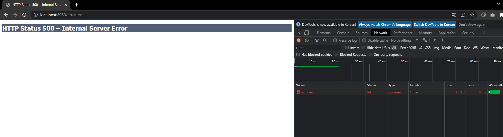
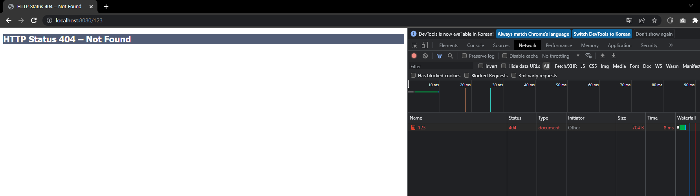
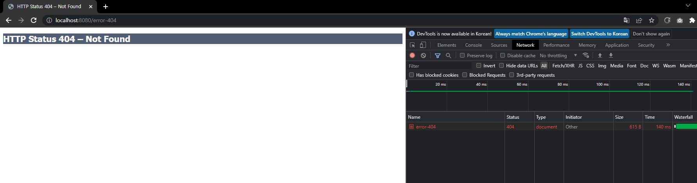
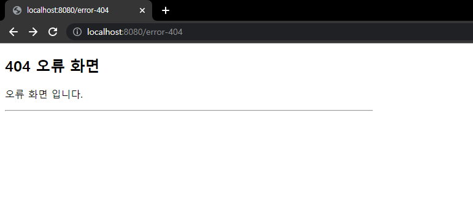
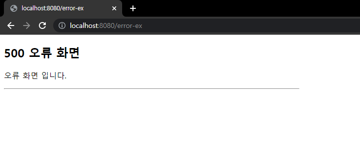
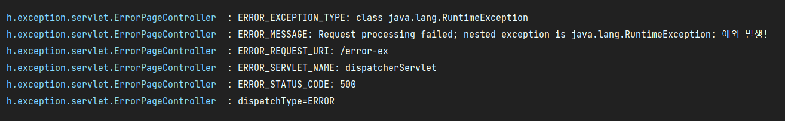

# 13. 예외 처리와 오류 페이지

## 서블릿 예외 처리 - 시작

먼저 스프링이 아닌 순수 서블릿 컨테이너가 예외를 어떻게 처리하는지 알아보자.  
  
서블릿이 지원하는 예외 처리 방식은 2가지가 있다.
- Exception(예외)
- response.sendError(HTTP 상태 코드, 오류 메시지)

### Exception(예외)

- 자바 직접 실행
    - 자바의 메인 메서드를 직접 실행하는 경우 main 이라는 이름의 쓰레드가 실행된다.
    - 실행 도중에 예외를 잡지 못하고 처음 실행한 main() 메서드를 넘어서 예외가 던저지면, 예외 정보를 남기고 해당 쓰레드는 종료된다.
- 웹 어플리케이션
    - 웹 어플리케이션은 사용자 요청별로 별도의 쓰레드가 할당되고, 서블릿 컨테이너 안에서 실행된다.
    - 만약 애플리케이션에서 try-catch로 예외를 잡지 못하고, 서블릿 밖으로 까지 예외가 전달되면 어떻게 동작할까?

```
WAS(여기까지 전파) <- 필터 <- 서블릿 <- 인터셉터 <- 컨트롤러(예외발생)
```

예외를 잡지 못하면 결국 톰캣 같은 WAS 까지 예외가 전달된다.  
 
#

### applicaiton.properties
```
server.error.whitelabel.enabled=false
```

WAS에서는 예외가 올라오면 어떻게 처리하는지 테스트 해보기위해 스프링 부트가 제공하는 기본 예외 페이지를 잠시 꺼두도록 하자.

### ServletExController - 서블릿 예외 컨트롤러
```java
package hello.exception.servlet;

import lombok.extern.slf4j.Slf4j;
import org.springframework.stereotype.Controller;
import org.springframework.web.bind.annotation.GetMapping;

@Slf4j
@Controller
public class ServletExController {

    @GetMapping("/error-ex")
    public void errorEx() {
        throw new RuntimeException("예외 발생!");
    }
}
```



실행해보면 개발자 모드로 확인해보면 HTTP 상태코드가 500으로 보이고, tomcat이 기본으로 제공하는 오류 화면을 볼 수 있다.  
Exception의 경우 서버 내부에서 처리할 수 없는 오류가 발생한 것으로 생각해서 HTTP 상태 코드 500을 반환한다.



아무 페이지나 호출해보면 톰캣이 기본으로 제공하는 404 오류 화면이 나타난다.

#

### response.sendError(HTTP 상태코드, 오류 메시지)

오류가 발생했을 때 HttpServletResponse가 제공하는 sendError라는 메서드를 사용해도 된다.  
이것을 호출한다고 당장 예외가 발생하는 것은 아니지만, 서블릿 컨테이너에게 오류가 발생했다는 점을 전달할 수 있다.

### ServletExController - 추가
```java
@GetMapping("/error-404")
public void error404(HttpServletResponse response) throws IOException {
    response.sendError(404, "404 오류!");
}

@GetMapping("/error-500")
public void error500(HttpServletResponse response) throws IOException {
    response.sendError(500);
}
```

### sendError 흐름
```
WAS(sendError 호출 기록 확인) <- 필터 <- 서블릿 <- 인터셉터 <- 컨트롤러(response.sendError())
```

response.sendError()를 호출하면 response 내부에는 오류가 발생했다는 상태를 저장해둔다.  
그리고 서블릿 컨테이너는 고객에게 응답 전에 response에 sendError()가 호출되었는지 확인하고  
설정한 오류 코드에 맞추어 기본 오류 페이지를 보여준다.



---

## 서블릿 예외 처리 - 오류 화면 제공

서블릿 컨테이너가 제공하는 기본 예외 처리 화면은 고객 친화적이지 않다.  
스프링 부트를 통해서 서블릿이 제공하는 오류 화면 기능을 사용해보자.

### 서블릿 오류 페이지 등록
```java
package hello.exception;

import org.springframework.boot.web.server.ConfigurableWebServerFactory;
import org.springframework.boot.web.server.ErrorPage;
import org.springframework.boot.web.server.WebServerFactoryCustomizer;
import org.springframework.http.HttpStatus;
import org.springframework.stereotype.Component;

@Component
public class WebServerCustomizer implements WebServerFactoryCustomizer<ConfigurableWebServerFactory> {

    @Override
    public void customize(ConfigurableWebServerFactory factory) {

        ErrorPage errorPage404 = new ErrorPage(HttpStatus.NOT_FOUND, "/error-page.404");
        ErrorPage errorPage500 = new ErrorPage(HttpStatus.INTERNAL_SERVER_ERROR, "/error-page.500");
        ErrorPage errorPageEx = new ErrorPage(RuntimeException.class, "/error-page.500");
        
        factory.addErrorPages(errorPage404, errorPage500, errorPageEx);
    }
}
```

오류 페이지는 예외를 다룰 때 해당 예외와 그 자식 타입의 오류를 함께 처리한다.  
예를 들어 위의 경우 RuntimeException은 물론이고 RuntimeException의 자식도 함께 처리한다.

### 오류 처리 컨트롤러
```java
package hello.exception.servlet;

import lombok.extern.slf4j.Slf4j;
import org.springframework.stereotype.Controller;
import org.springframework.web.bind.annotation.RequestMapping;

import javax.servlet.http.HttpServletRequest;
import javax.servlet.http.HttpServletResponse;

@Slf4j
@Controller
public class ErrorPageController {

    @RequestMapping("/error-page/404")
    public String errorPage404(HttpServletRequest request, HttpServletResponse response) {
        log.info("errorPage 404");
        return "error-page/404";
    }
    
    @RequestMapping("/error-page/500")
    public String errorPage500(HttpServletRequest request, HttpServletResponse response) {
        log.info("errorPage 500");
        return "error-page/500";
    }
}
```

### 오류 처리 View
```html
<!DOCTYPE HTML>
<html xmlns:th="http://www.thymeleaf.org">
<head>
    <meta charset="utf-8">
</head>
<body>
<div class="container" style="max-width: 600px">
    <div class="py-5 text-center">
        <h2>404 오류 화면</h2>
    </div>
    <div>
        <p>오류 화면 입니다.</p>
    </div>
    <hr class="my-4">
</div> <!-- /container -->
</body>
</html>
```

```html
<!DOCTYPE HTML>
<html xmlns:th="http://www.thymeleaf.org">
<head>
    <meta charset="utf-8">
</head>
<body>
<div class="container" style="max-width: 600px">
    <div class="py-5 text-center">
        <h2>500 오류 화면</h2>
    </div>
    <div>
        <p>오류 화면 입니다.</p>
    </div>
    <hr class="my-4">
</div> <!-- /container -->
</body>
</html>
```


### 테스트

  


---

## 서블릿 예외 처리 - 오류 페이지 작동 원리

서블릿은 예외가 발생해서 서블릿 밖으로 전달되거나 또는 response.sendError()가 호출 되었을 때 설정된 오류 페이지를 찾는다.

### 예외 발생 흐름
```
WAS(여기까지 전파) <- 필터 <- 서블릿 <- 인터셉터 <- 컨트롤러(예외발생)
```

### sendError 흐름
```
WAS(sendError 호출 기록 확인) <- 필터 <- 서블리 <- 인터셉터 <- 컨트롤러((response.sendError())
```

RuntimeException이나 sendError()가 WAS까지 전달되면, WAS는 오류 페이지 정보를 확인한다.  
예를 들어 RuntimeException의 오류 페이지로 /error-page/500이 지정되어 있다면, (new ErrorPage(RuntimeException.class, "/error-page/500") 
WAS는 오류 페이지를 출력하기 위해 /error-page/500을 다시 요청한다.

```
1. WAS(여기까지 전파) <- 필터 <- 서블릿 <- 인터셉터 <- 컨트롤러(예외발생)
2. WAS '/error-page/500' 다시 요청 -> 필터 -> 서블릿 -> 인터셉터 -> 컨트롤러(/error-page/500) -> View
```

**중요한 점은 웹 브라우저(클라이언트)는 서버 내부에서 이런 일이 일어나는지 전혀 모른다는 점이다.  
오직 서버 내부에서 오류 페이지를 찾기 위해 추가적인 호출을 한다.**


#

WAS는 오류 페이지를 단순히 다시 요청만 하는 것이 아니라, 오류 정보를 request의 attribtue에 추가해서 넘겨준다.  
필요하면 오류 페이지에서 전달된 오류 정보를 사용할 수 있다.


### ErrorPageController

```java
package hello.exception.servlet;

import lombok.extern.slf4j.Slf4j;
import org.springframework.stereotype.Controller;
import org.springframework.web.bind.annotation.RequestMapping;

import javax.servlet.http.HttpServletRequest;
import javax.servlet.http.HttpServletResponse;

@Slf4j
@Controller
public class ErrorPageController {

    //RequestDispatcher 상수로 정의되어 있음
    public static final String ERROR_EXCEPTION = "javax.servlet.error.exception";
    public static final String ERROR_EXCEPTION_TYPE = "javax.servlet.error.exception_type";
    public static final String ERROR_MESSAGE = "javax.servlet.error.message";
    public static final String ERROR_REQUEST_URI = "javax.servlet.error.request_uri";
    public static final String ERROR_SERVLET_NAME = "javax.servlet.error.servlet_name";
    public static final String ERROR_STATUS_CODE = "javax.servlet.error.status_code";

    @RequestMapping("/error-page/404")
    public String errorPage404(HttpServletRequest request, HttpServletResponse response) {
        log.info("errorPage 404");
        printErrorInfo(request);
        return "error-page/404";
    }

    @RequestMapping("/error-page/500")
    public String errorPage500(HttpServletRequest request, HttpServletResponse response) {
        log.info("errorPage 500");
        printErrorInfo(request);
        return "error-page/500";
    }

    private void printErrorInfo(HttpServletRequest request) {
        log.info("ERROR_EXCEPTION: ex=",        request.getAttribute(ERROR_EXCEPTION));
        log.info("ERROR_EXCEPTION_TYPE: {}",    request.getAttribute(ERROR_EXCEPTION_TYPE));
        log.info("ERROR_MESSAGE: {}",           request.getAttribute(ERROR_MESSAGE));
        log.info("ERROR_REQUEST_URI: {}",       request.getAttribute(ERROR_REQUEST_URI));
        log.info("ERROR_SERVLET_NAME: {}",      request.getAttribute(ERROR_SERVLET_NAME));
        log.info("ERROR_STATUS_CODE: {}",       request.getAttribute(ERROR_STATUS_CODE));
        log.info("dispatchType={}",             request.getDispatcherType());
    }
}
```

### 테스트



---

## 서블릿 예외 처리 - 필터

```
1. WAS(여기까지 전파) <- 필터 <- 서블릿 <- 인터셉터 <- 컨트롤러(예외발생)
2. WAS '/error-page/500' 다시 요청 -> 필터 -> 서블릿 -> 인터셉터 -> 컨트롤러(/error-page/500) -> View
```

오류가 발생하면 오류 페이지를 출력하기 위해 WAS 내부에서 다시 한번 호출이 발생한다.  
이때 필터, 서블릿, 인터셉터도 모두 다시 호출되는데, 클라이언트 요청 시 이미 호출되었던 필터나 인터셉터를  
서버 내부에서 오류 페이지를 호출한다고 해서 한번 더 호출 되는 것은 매우 비효율 적이다.  
  
그렇기 때문에 클라이언트로 부터 발생한 정상 요청인지, 아니면 오류 페이지를 출력하기 위한 내부 요청인지 구분할 수 있어야 한다.  
서블릿은 이러한 문제를 해결하기 위해 DispatcherType이라는 추가 정보를 제공한다.

#

### DispatcherType

필터는 정상요청, 오류 내부요청인지 구분할 수 있도록 dispatcherType이라는 옵션을 제공한다.  

```
javax.servlet.DispatcherType

public enum DispatcherType {
    FORWARD,
    INCLUDE,
    REQUEST,
    ASYNC,
    ERROR
}
```

- REQUEST: 클라이언트 
- ERROR: 오류 요청
- FORWARD: 다른 서블릿이나 JSP를 호출할 때 (EX: RequsetDispatcher.forward(request, response))
- INCLUDE: 서블릿에서 다른 서블릿이나 JSP 결과를 포함할 때 (EX: RequestDispatcher.include(request, response))
- ASYNC: 서블릿 비동기 호출

### WebConfig
```java
package hello.exception;

import hello.exception.filter.LogFilter;
import org.springframework.boot.web.servlet.FilterRegistrationBean;
import org.springframework.context.annotation.Bean;
import org.springframework.context.annotation.Configuration;
import org.springframework.web.servlet.config.annotation.WebMvcConfigurer;

import javax.servlet.DispatcherType;
import javax.servlet.Filter;

@Configuration
public class WebConfig {

    @Bean
    public FilterRegistrationBean logFilter() {
        FilterRegistrationBean<Filter> filterRegistrationBean = new FilterRegistrationBean<>();
        filterRegistrationBean.setFilter(new LogFilter());
        filterRegistrationBean.setOrder(1);
        filterRegistrationBean.addUrlPatterns("/*");
        filterRegistrationBean.setDispatcherTypes(DispatcherType.REQUEST, DispatcherType.ERROR);
        return filterRegistrationBean;
    }
}
```

filterRegistrationBean.setDispatcherTypes()에 위 처럼 두가지를 모두 넣으면 클라이언트 요청, 오류 페이지 요청에서도 필터가 호출된다.  
아무것도 넣지 않으면 기본 값이 DispatcherType.REQUEST이다. 그러면 클라이언트의 요청 때만 필터가 적용된다.  
오류 페이지 요청 전용 필터를 적용하고 싶으면 DispatcherType.ERROR만 지정하면 된다.

#

## 서블릿 예외 처리 - 인터셉터

앞서 필터의 경우에는 필터를 등록할 때 어떤 DispatcherType인 경우에 필터를 적용할 지 선택할 수 있었다.  
그런데 인터셉터는 서블릿이 제공하는 기능이 아니라 스프링이 제공하는 기능이기 때문에 DispatcherType과 무관하게 항상 호출된다.  
  
대신 인터셉터는 excludePathPatterns 기능을 이용해서 오류 페이지 경로를 쉽게 추가하거나 제외할 수 있다.

```java
package hello.exception;

import hello.exception.filter.LogFilter;
import hello.exception.interceptor.LogInterceptor;
import org.springframework.boot.web.servlet.FilterRegistrationBean;
import org.springframework.context.annotation.Bean;
import org.springframework.context.annotation.Configuration;
import org.springframework.web.servlet.config.annotation.InterceptorRegistry;
import org.springframework.web.servlet.config.annotation.WebMvcConfigurer;

import javax.servlet.DispatcherType;
import javax.servlet.Filter;

@Configuration
public class WebConfig implements WebMvcConfigurer {

    @Override
    public void addInterceptors(InterceptorRegistry registry) {
        registry.addInterceptor(new LogInterceptor())
                .order(1)
                .addPathPatterns("/**")
                .excludePathPatterns("/css/**", "/*.ico"
                        , "/error", "/error-page/**");
    }


//    @Bean
    public FilterRegistrationBean logFilter() {
        FilterRegistrationBean<Filter> filterRegistrationBean = new FilterRegistrationBean<>();
        filterRegistrationBean.setFilter(new LogFilter());
        filterRegistrationBean.setOrder(1);
        filterRegistrationBean.addUrlPatterns("/*");
        filterRegistrationBean.setDispatcherTypes(DispatcherType.REQUEST, DispatcherType.ERROR);
        return filterRegistrationBean;
    }
}
```

만약 /error-ex 요청이 들어오게 되면  
필터는 DispatcherType으로 중복 호출을 제거할 수 있고,  
인터셉터는 경로 정보로 중복 호출을 제거할 수 있다.

```
1. WAS(/error-ex, dispatchType=REQUEST) -> 필터 -> 서블릿 -> 인터셉터 -> 컨트롤러
2. WAS(여기까지 전파) <- 필터 <- 서블릿 <- 인터셉터 <- 컨트롤러(예외발생)
3. WAS 오류 페이지 확인
4. WAS(/error-page/500, dispatchType=ERROR) -> 필터(x) -> 서블릿 -> 인터셉터(x) -> 컨트롤러(/error-page/500) -> View
```

---

### Reference
- [스프링 MVC 2편 - 백엔드 웹 개발 핵심 기술](https://www.inflearn.com/course/%EC%8A%A4%ED%94%84%EB%A7%81-mvc-2/dashboard)
