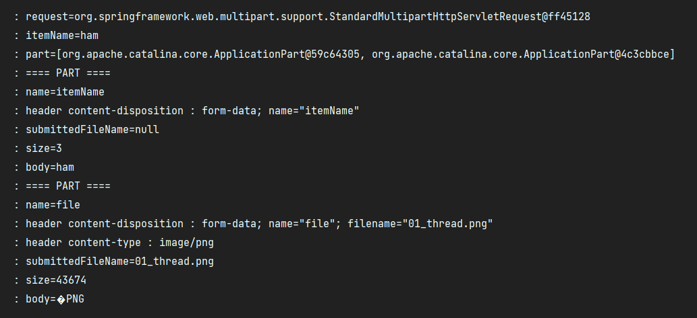

# 16. 파일 업로드

## HTML 폼 전송 방식
- application/x-www-form-urlencoded
- multipart/form-data

#

### application/x-www-form-urlencoded

HTML 폼 데이터를 서버로 전송하는 가장 기본적인 방법이다.  
enctype 옵션이 없으면 웹 브라우저는 요청 HTTP 메시지의 헤더에 다음 내용을 추가한다.  
```Content-Type: application/x-www-form-urlencoded```  
  
폼에 입력한 전송할 항목을 HTTP Body에 문자로 username=kim&age=20 과 같이 &로 구분해서 전송한다.

### multipart/form-data

파일을 업로드 하기위해선 문자가 아니라 바이너리 데이터를 전송해야 하는데,  
HTTP는 문자와 바이너리를 동시에 전송해야 하는 상황을 위해 multipart/form-data라는 전송 방식을 제공한다.  
  
이 방식을 사용하려면 Form 태그에 별도의 enctype="multipart/form-data"를 지정해야 한다.
multipart/form-data 방식은 다른 종류의 여러 파일과 폼의 내용 함께 전송할 수 있다.  
  
폼의 입력 결과로 생성된 HTTP 메시지를 보면 각각의 전송 항목이 구분 되어있다.  
Content-Disposition이라는 항목별 헤더가 추가되어 있고 여기에 부가 정보가 있다.

---

## 파일 업로드 - 서블릿

파일을 업로드 하려면 실제 파일이 저장되는 경로가 필요하다.

### application.properties
```properties
file.dir=/C:/Study/file/
```

### 업로드 폼
```html
<!DOCTYPE HTML>
<html xmlns:th="http://www.thymeleaf.org">
<head>
    <meta charset="utf-8">
</head>
<body>
<div class="container">
    <div class="py-5 text-center">
        <h2>상품 등록 폼</h2>
    </div>
    <h4 class="mb-3">상품 입력</h4>
    <form th:action method="post" enctype="multipart/form-data">
        <ul>
            <li>상품명 <input type="text" name="itemName"></li>
            <li>파일<input type="file" name="file" ></li>
        </ul>
        <input type="submit"/>
    </form>
</div> <!-- /container -->
</body>
</html>
```

### ServletUploadControllerV2
```java
package hello.upload.controller;

import lombok.extern.slf4j.Slf4j;
import org.springframework.beans.factory.annotation.Value;
import org.springframework.stereotype.Controller;
import org.springframework.util.StreamUtils;
import org.springframework.util.StringUtils;
import org.springframework.web.bind.annotation.GetMapping;
import org.springframework.web.bind.annotation.PostMapping;
import org.springframework.web.bind.annotation.RequestMapping;

import javax.servlet.ServletException;
import javax.servlet.http.HttpServletRequest;
import javax.servlet.http.Part;
import java.io.IOException;
import java.io.InputStream;
import java.nio.charset.StandardCharsets;
import java.util.Collection;

@Slf4j
@Controller
@RequestMapping("/servlet/v2")
public class ServletUploadControllerV2 {

    @Value("${file.dir}")
    private String fileDir; // application.properties에서 설정한 file.dir 값

    @GetMapping("/upload")
    public String newFile() {
        return "upload-form";
    }

    @PostMapping("/upload")
    public String saveFileV1(HttpServletRequest request) throws ServletException, IOException {
        log.info("request={}", request);

        String itmeName = request.getParameter("itemName");
        log.info("itemName={}", itmeName);

        Collection<Part> parts = request.getParts();
        log.info("part={}", parts);
        for (Part part : parts) {

            log.info("==== PART ====");
            log.info("name={}", part.getName());
            Collection<String> headerNames = part.getHeaderNames();
            for (String headerName : headerNames) {
                log.info("header {} : {}", headerName, part.getHeader(headerName));
            }

                //편의 메서드
                //content-disposition; filename
                log.info("submittedFileName={}", part.getSubmittedFileName());
                log.info("size={}", part.getSize());

                //데이터 읽기
                InputStream inputStream = part.getInputStream();
                String body = StreamUtils.copyToString(inputStream, StandardCharsets.UTF_8);
                log.info("body={}", body);

                //파일에 저장하기
                if (StringUtils.hasText(part.getSubmittedFileName())) {
                    String fullPath = fileDir + part.getSubmittedFileName();
                    log.info("파일 저장 fullPath={}", fullPath);
                    part.write(fullPath);
                }
        }

        return "upload-form";
    }
}
```

- part.getSubmittedFileName(): 클라이언트가 전달한 파일명
- part.getInputStream(): Part의 전송 데이터를 읽을 수 있다.
- part.write(..): Part를 통해 전송된 데이터를 저장할 수 있다.


request.getParts(): multipart/form-data 전송 방식에서 각각 나누어진 부분을 받아서 확인할 수 있다.

### 결과


#

### 멀티파트 사용 옵션
```properties
spring.servlet.multipart.max-file-size=1MB // 파일 하나의 최대 사이즈
spring.servlet.multipart.max-request-size=10MB // 전체 파일 사이즈의 합
```

```properties
spring.servlet.multipart.enabled=false 
// 옵션을 false로 설정하면 서블릿 컨테이너는 멀티파트와 관련된 처리를 하지 않는다.
```

---

