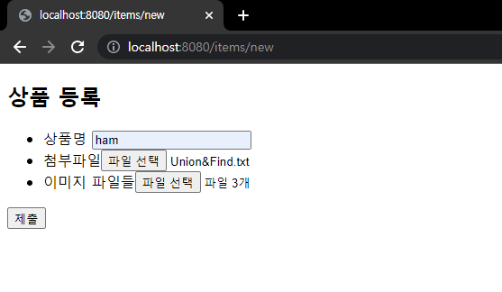
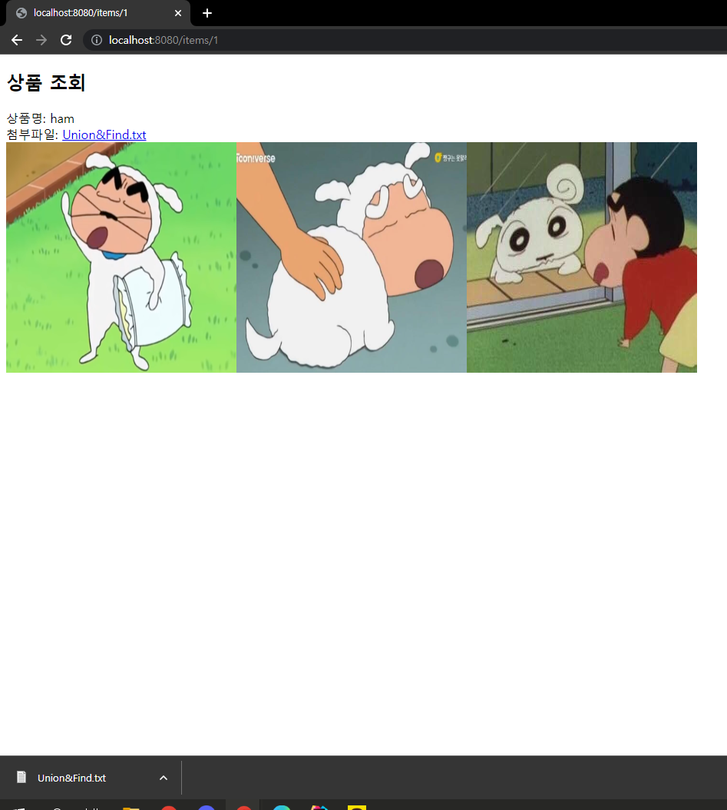

# 16. 파일 업로드 - 예제 실습
 
## 요구사항
- 상품 관리
    - 상품 이름
    - 첨부파일 하나
    - 이미지 파일 여러개
- 첨부파일을 업로드 다운로드 할 수 있다.
- 업로드한 이미지를 웹 브라우저에서 확인 가능하다.

---
- controller
    - ItemController
    - ItemForm
- domain
    - Item
    - ItemRepository
    - UploadFile
- file
    - FileStore
---
### Item - 상품 도메인
```java
package hello.upload.domain;

import lombok.Data;

import java.util.List;

@Data
public class Item {

    private Long id;
    private String itemName;
    private UploadFile attachFile; // 첨부파일
    private List<UploadFile> imageFiles; // 이미지 파일들
}
```

#

### ItemRepository - 상품 리포지토리
```java
package hello.upload.domain;

import org.springframework.stereotype.Repository;

import java.util.HashMap;
import java.util.Map;

@Repository
public class ItemRepository {

    private final Map<Long, Item> store = new HashMap<>();
    private long sequence = 0L;

    public Item save(Item item) {
        item.setId(++sequence);
        store.put(item.getId(), item);
        return item;
    }

    public Item findById(Long id) {
        return store.get(id);
    }
}
```

#

### UploadFile - 업로드 파일 정보 보관
```java
package hello.upload.domain;

import lombok.Data;

@Data
public class UploadFile {

    private String uploadFileName; // 고객이 업로드한 파일명
    private String storeFileName; // 서버 내부에서 관리하는 파일명

    public UploadFile(String uploadFileName, String storeFileName) {
        this.uploadFileName = uploadFileName;
        this.storeFileName = storeFileName;
    }
}
```

---

### FileStore - 파일 저장과 관련된 업무 처리
```java
package hello.upload.file;

import hello.upload.domain.UploadFile;
import org.springframework.beans.factory.annotation.Value;
import org.springframework.stereotype.Component;
import org.springframework.web.multipart.MultipartFile;

import java.io.File;
import java.io.IOException;
import java.util.ArrayList;
import java.util.List;
import java.util.UUID;

@Component
public class FileStore {

    @Value("${file.dir}")
    private String fileDir; // application.properties에 입력한 파일 저장 경로

    public String getFullPath(String filename) {
        return fileDir + filename; // 폴더 경로 + 파일 이름
    }

    public List<UploadFile> storeFiles(List<MultipartFile> multipartFiles) throws IOException { // 파일 여러개 저장
        List<UploadFile> storeFileResult = new ArrayList<>(); 
        for (MultipartFile multipartFile : multipartFiles) {
            if (!multipartFile.isEmpty()) {
                storeFileResult.add(storeFile(multipartFile));
            }
        }
        return storeFileResult;
    }

    public UploadFile storeFile(MultipartFile multipartFile) throws IOException {
        if (multipartFile.isEmpty()) {
            return null;
        }

        String originalFilename = multipartFile.getOriginalFilename(); // 고객이 보는 파일명
        String storeFileName = createStoreFileName(originalFilename); // 서부 내부에서 관리하는 파일명
        multipartFile.transferTo(new File(getFullPath(storeFileName))); // UUID.확장자의 이름으로 파일 저장
        return new UploadFile(originalFilename, storeFileName); // (고객이 보는 파일명, 서버 내부 관리 파일명)
    }

    private String createStoreFileName(String originalFilename) { // 서버 내부에서 관리할 파일 이름 생성
        String ext = extractExt(originalFilename); // 파일의 확장자
        String uuid = UUID.randomUUID().toString(); // 랜덤 UUID 생성
        return uuid + "." + ext;
    }

    private String extractExt(String originalFilename) { // abc.png에서 .이후 파일의 확장자 추출
        int pos = originalFilename.lastIndexOf(".");
        return originalFilename.substring(pos + 1);
    }
}
```

---

### ItemForm
```java
package hello.upload.controller;

import lombok.Data;
import org.springframework.web.multipart.MultipartFile;

import java.util.List;

@Data
public class ItemForm {
    private Long itemId;
    private String itemName;
    private List<MultipartFile> imageFiles; // 이미지를 다중 업로드하기 위해 MultipartFile 사용
    private MultipartFile attachFile; // 첨부 파일
}
```

#

### ItemController
```java
package hello.upload.controller;

import hello.upload.domain.Item;
import hello.upload.domain.ItemRepository;
import hello.upload.domain.UploadFile;
import hello.upload.file.FileStore;
import lombok.RequiredArgsConstructor;
import lombok.extern.slf4j.Slf4j;
import org.springframework.core.io.Resource;
import org.springframework.core.io.UrlResource;
import org.springframework.http.HttpHeaders;
import org.springframework.http.ResponseEntity;
import org.springframework.stereotype.Controller;
import org.springframework.ui.Model;
import org.springframework.web.bind.annotation.*;
import org.springframework.web.servlet.mvc.support.RedirectAttributes;
import org.springframework.web.util.UriUtils;

import java.io.IOException;
import java.net.MalformedURLException;
import java.nio.charset.StandardCharsets;
import java.util.List;

@Slf4j
@Controller
@RequiredArgsConstructor
public class ItemController {

    private final ItemRepository itemRepository;
    private final FileStore fileStore;

    @GetMapping("/items/new") // 등록 폼을 보여주는 화면
    public String newItem(@ModelAttribute ItemForm form) {
        return "item-form"; // 등록 폼
    }

    @PostMapping("/items/new") // 폼의 데이터를 저장한다
    public String saveItem(@ModelAttribute ItemForm form,
                           RedirectAttributes redirectAttributes) throws IOException {

        UploadFile attachFile = fileStore.storeFile(form.getAttachFile()); // 첨부파일
        List<UploadFile> storeImageFiles = fileStore.storeFiles(form.getImageFiles()); // 이미지파일들

        //데이터베이스에 저장
        Item item = new Item();
        item.setItemName(form.getItemName());
        item.setAttachFile(attachFile);
        item.setImageFiles(storeImageFiles);
        itemRepository.save(item); // item = 첨부파일 + 이미지파일들

        redirectAttributes.addAttribute("itemId", item.getId());
        return "redirect:/items/{itemId}"; // 저장한 아이템을 보여주는 화면으로 리다이렉트
    }

    @GetMapping("/items/{id}")
    public String items(@PathVariable Long id, Model model) {
        Item item = itemRepository.findById(id);
        model.addAttribute("item", item);
        return "item-view"; // 상품을 보여주는 화면
    }

    @ResponseBody
    @GetMapping("/images/{filename}") // 이미지 다운로드
    public Resource downloadImage(@PathVariable String filename) throws MalformedURLException {
        return new UrlResource("file:" + fileStore.getFullPath(filename));
        // UrlResource로 이미지 파일을 읽어서 @ResponseBody로 이미지 바이너리를 반환
    }

    @GetMapping("/attach/{itemId}") // 파일 다운로드
    public ResponseEntity<Resource> downloadAttach(@PathVariable Long itemId) throws MalformedURLException {
        Item item = itemRepository.findById(itemId); // 저장소에서 itemId로 아이템 조회
        String storeFileName = item.getAttachFile().getStoreFileName(); // 아이템 첨부파일의 고객이 보는 파일 이름 조회
        String uploadFileName = item.getAttachFile().getUploadFileName(); // 아이템 첨부파일의 서버에 저장되는 파일 이름 조회

        UrlResource resource = new UrlResource("file:" + fileStore.getFullPath(storeFileName));


        //고객이 업로드한 파일 이름으로 다운로드
        log.info("uploadFileName={}", uploadFileName);
        String encodedUploadFileName = UriUtils.encode(uploadFileName, StandardCharsets.UTF_8);
        String contentDisposition = "attachment; filename=\"" + encodedUploadFileName + "\"";

        return ResponseEntity.ok()
                .header(HttpHeaders.CONTENT_DISPOSITION, contentDisposition)
                .body(resource);
    }
}
```

---

### 등록 폼 뷰
```html
<!DOCTYPE html>
<html xmlns:th="http://www.thymeleaf.org">
<head>
    <meta charset="UTF-8">
</head>
<body>
<div class="container">


    <div class="py-5 text-center">
        <h2>상품 등록</h2>
    </div>


    <form th:action method="post" enctype="multipart/form-data">
        <ul>
            <li>상품명 <input type="text" name="itemName"></li>
            <li>첨부파일<input type="file" name="attachFile"></li>
            <li>이미지 파일들<input type="file" multiple="multiple" name="imageFiles"></li>
        </ul>
        <input type="submit"/>
    </form>


</div>
</body>
</html>
```

#

### 조회 뷰
```html
<!DOCTYPE HTML>
<html xmlns:th="http://www.thymeleaf.org">
<head>
    <meta charset="utf-8">
</head>
<body>
<div class="container">


    <div class="py-5 text-center">
        <h2>상품 조회</h2>
    </div>

    상품명: <span th:text="${item.itemName}">상품명</span><br/>
    첨부파일: <a th:if="${item.attachFile}" th:href="|/attach/${item.id}|" th:text="${item.getAttachFile().getUploadFileName()}" /><br/>
    

</div> <!-- /container -->
</body>
</html>
```

---

## 예제 실습 결과




---

### Reference
- [스프링 MVC 2편 - 백엔드 웹 개발 핵심 기술](https://www.inflearn.com/course/%EC%8A%A4%ED%94%84%EB%A7%81-mvc-2/dashboard)
