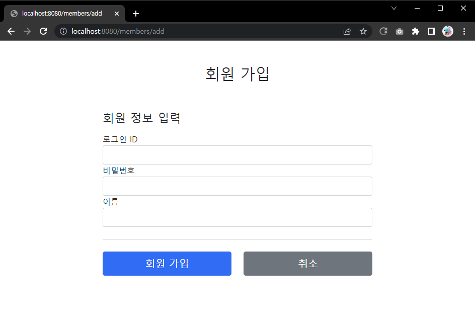
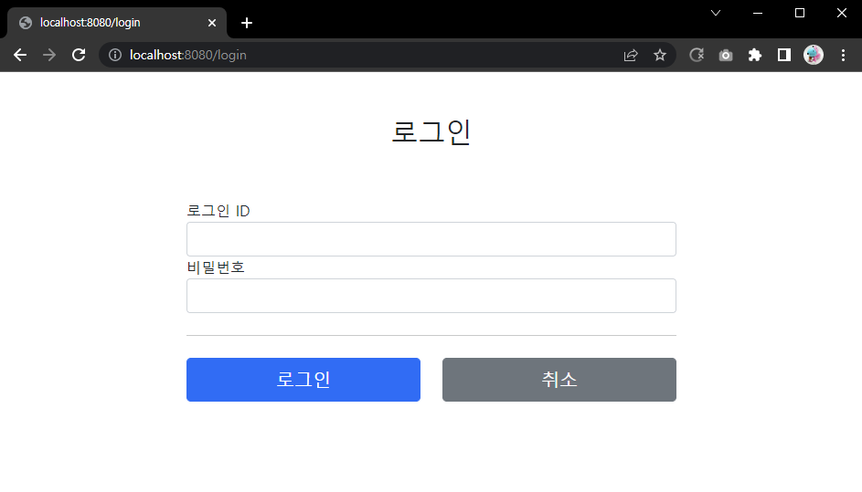
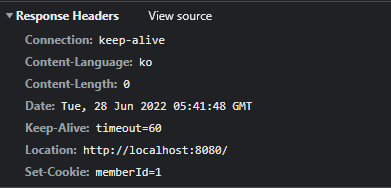
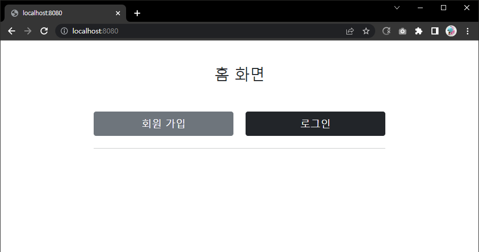
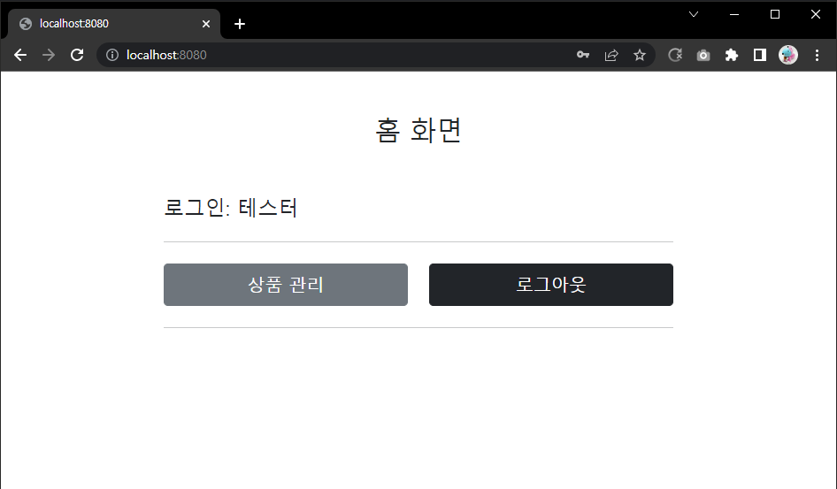

# 12. 로그인 처리 - 쿠키

## 로그인 요구사항

- 홈 화면 - 로그인 전
    - 회원 가입
    - 로그인
- 홈 화면 - 로그인 후
    - 본인 이름
    - 상품 관리
    - 로그 아웃
- 보안 요구사항
    - 로그인 사용자만 상품에 접근하고, 관리할 수 있음
    - 로그인 하지 않은 사용자가 상품 관리에 접근하면 로그인 화면으로 이동
- 회원 가입, 상품 관리

#

## 패키지 구조 설계

### package 구조
- domian
    - item
    - member
    - login
- web
    - item
    - member
    - login

### 도메인이 가장 중요하다

도메인 = 화면, UI, 기술 인프라 등등의 영역을 제외한, 시스템이 구현해야 하는 핵심 비즈니스 업무 영역을 말한다.  
  
향후 web을 다른 기술로 바꾸어도 도메인은 그대로 유지할 수 있어야 한다.  
이렇게 하려면 web은 domain을 알고있지만 domain은 web을 모르도록 설계해야 한다.  
이것을 web은 domain을 의존하지만, domain은 web을 의존하지 않는다고 표현한다.

---

## 회원가입

### Member
```java
package hello.login.domain.member;

import lombok.Data;

import javax.validation.constraints.NotEmpty;

@Data
public class Member {

    private Long id;

    @NotEmpty
    private String loginId;
    @NotEmpty
    private String name;
    @NotEmpty
    private String password;
}
```

### MemberRepository
```java
package hello.login.domain.member;

import lombok.extern.slf4j.Slf4j;
import org.springframework.stereotype.Repository;

import java.util.*;

@Slf4j
@Repository
public class MemberRepository {

    private static Map<Long, Member> store = new HashMap<>();
    private static long sequence = 0L;

    public Member save(Member member) {
        member.setId(++sequence);
        log.info("save: member={}", member);
        store.put(member.getId(), member);
        return member;
    }

    public Member findById(Long id) {
        return store.get(id);
    }

    public List<Member> findAll() {
        return new ArrayList<>(store.values());
    }

    public Optional<Member> findByLoginId(String loginId) {
        return findAll().stream()
                .filter(m -> m.getLoginId().equals(loginId))
                .findFirst();
    }

    public void clearStore() {
        store.clear();
    }
}
```

### MemberController
```java
package hello.login.web.member;

import hello.login.domain.member.Member;
import hello.login.domain.member.MemberRepository;
import lombok.RequiredArgsConstructor;
import org.springframework.stereotype.Controller;
import org.springframework.validation.BindingResult;
import org.springframework.web.bind.annotation.GetMapping;
import org.springframework.web.bind.annotation.ModelAttribute;
import org.springframework.web.bind.annotation.PostMapping;
import org.springframework.web.bind.annotation.RequestMapping;

import javax.validation.Valid;

@Controller
@RequiredArgsConstructor
@RequestMapping("/members")
public class MemberController {

    private final MemberRepository memberRepository;

    @GetMapping("/add")
    public String addForm(@ModelAttribute("member") Member member) {
        return "members/addMemberForm";
    }

    @PostMapping("/add")
    public String save(@Valid @ModelAttribute Member member, BindingResult result) {
        if (result.hasErrors()) {
            return "members/addMemberForm";
        }

        memberRepository.save(member);
        return "redirect:/";
    }
}
```

### 회원 가입 뷰 템플릿
```html
<!DOCTYPE HTML>
<html xmlns:th="http://www.thymeleaf.org">
<head>
    <meta charset="utf-8">
    <link th:href="@{/css/bootstrap.min.css}"
          href="../css/bootstrap.min.css" rel="stylesheet">
    <style>
        .container {
            max-width: 560px;
        }
        .field-error {
            border-color: #dc3545;
            color: #dc3545;
        }
    </style>
</head>
<body>
<div class="container">
    <div class="py-5 text-center">
        <h2>회원 가입</h2>
    </div>
    <h4 class="mb-3">회원 정보 입력</h4>
    <form action="" th:action th:object="${member}" method="post">
        <div th:if="${#fields.hasGlobalErrors()}">
            <p class="field-error" th:each="err : ${#fields.globalErrors()}"
               th:text="${err}">전체 오류 메시지</p>
        </div>
        <div>
            <label for="loginId">로그인 ID</label>
            <input type="text" id="loginId" th:field="*{loginId}" class="form-control"
                   th:errorclass="field-error">
            <div class="field-error" th:errors="*{loginId}" />
        </div>
        <div>
            <label for="password">비밀번호</label>
            <input type="password" id="password" th:field="*{password}"
                   class="form-control"
                   th:errorclass="field-error">
            <div class="field-error" th:errors="*{password}" />
        </div>
        <div>
            <label for="name">이름</label>
            <input type="text" id="name" th:field="*{name}" class="form-control"
                   th:errorclass="field-error">
            <div class="field-error" th:errors="*{name}" />
        </div>
        <hr class="my-4">
        <div class="row">
            <div class="col">
                <button class="w-100 btn btn-primary btn-lg" type="submit">회원
                    가입</button>
            </div>
            <div class="col">
                <button class="w-100 btn btn-secondary btn-lg"
                        onclick="location.href='items.html'"
                        th:onclick="|location.href='@{/}'|"
                        type="button">취소</button>
            </div>
        </div>
    </form>
</div> <!-- /container -->
</body>
</html>
```

### 회원용 테스트 데이터 추가 TestDataInit
```java
package hello.login;

import hello.login.domain.item.Item;
import hello.login.domain.item.ItemRepository;
import hello.login.domain.member.Member;
import hello.login.domain.member.MemberRepository;
import lombok.RequiredArgsConstructor;
import org.springframework.stereotype.Component;

import javax.annotation.PostConstruct;

@Component
@RequiredArgsConstructor
public class TestDataInit {

    private final ItemRepository itemRepository;
    private final MemberRepository memberRepository;

    /**
     * 테스트용 데이터 추가
     */
    @PostConstruct
    public void init() {
        itemRepository.save(new Item("itemA", 10000, 10));
        itemRepository.save(new Item("itemB", 20000, 20));

        Member member = new Member();
        member.setLoginId("test");
        member.setPassword("test!");
        member.setName("테스터");
        memberRepository.save(member);
    }

}
```

  

---

## 로그인 기능

### LoginService
```java
package hello.login.domain.login;

import hello.login.domain.member.Member;
import hello.login.domain.member.MemberRepository;
import lombok.RequiredArgsConstructor;
import org.springframework.stereotype.Service;

@Service
@RequiredArgsConstructor
public class LoginService {

    private final MemberRepository memberRepository;

    public Member login(String loginId, String password) {
        return memberRepository.findByLoginId(loginId)
                .filter(m -> m.getPassword().equals(password))
                .orElse(null);
    }
}
```

loginId로 회원을 조회한 다음 파라미터로 넘어온 password와 비교해서 같으면 회원을 반환하고, 만약 다르면 null을 반환한다.

### LoginForm
```java
package hello.login.web.login;

import lombok.Data;

import javax.validation.constraints.NotEmpty;

@Data
public class LoginForm {

    @NotEmpty
    private String loginId;
    @NotEmpty
    private String password;
}
```

### LoginController
```java
package hello.login.web.login;


import hello.login.domain.login.LoginService;
import hello.login.domain.member.Member;
import lombok.RequiredArgsConstructor;
import lombok.extern.slf4j.Slf4j;
import org.springframework.stereotype.Controller;
import org.springframework.validation.BindingResult;
import org.springframework.web.bind.annotation.GetMapping;
import org.springframework.web.bind.annotation.ModelAttribute;
import org.springframework.web.bind.annotation.PostMapping;

import javax.servlet.http.Cookie;
import javax.servlet.http.HttpServletResponse;
import javax.validation.Valid;

@Slf4j
@Controller
@RequiredArgsConstructor
public class LoginController {

    private final LoginService loginService;

    @GetMapping("/login")
    public String loginForm(@ModelAttribute("loginForm") LoginForm form) {
        return "login/loginForm";
    }

    @PostMapping("/login")
    public String login(@Valid @ModelAttribute LoginForm form, BindingResult bindingResult) {
        if (bindingResult.hasErrors()) {
            return "login/loginForm";
        }

        Member loginMember = loginService.login(form.getLoginId(), form.getPassword());
        log.info("login? {}", loginMember);

        if (loginMember == null) {
            bindingResult.reject("loginFail", "아이디 또는 비밀번호가 맞지 않습니다.");
            return "login/loginForm";
        }
        
        return "redirect:/";
    }

}
```

- 로그인 성공 -> redirect:/ 홈 화면으로 이동
- 로그인 실패 -> bindingResult.rejecct()를 사용, 글로벌 오류 생성.
    - 정보를 다시 입력하도록 로그인 폼 리턴

### 로그인 폼 뷰 템플릿
```html
<!DOCTYPE HTML>
<html xmlns:th="http://www.thymeleaf.org">
<head>
    <meta charset="utf-8">
    <link th:href="@{/css/bootstrap.min.css}"
          href="../css/bootstrap.min.css" rel="stylesheet">
    <style>
        .container {
            max-width: 560px;
        }
        .field-error {
            border-color: #dc3545;
            color: #dc3545;
        }
    </style>
</head>
<body>
<div class="container">
    <div class="py-5 text-center">
        <h2>로그인</h2>
    </div>
    <form action="item.html" th:action th:object="${loginForm}" method="post">
        <div th:if="${#fields.hasGlobalErrors()}">
            <p class="field-error" th:each="err : ${#fields.globalErrors()}"
               th:text="${err}">전체 오류 메시지</p>
        </div>
        <div>
            <label for="loginId">로그인 ID</label>
            <input type="text" id="loginId" th:field="*{loginId}" class="form-control"
                   th:errorclass="field-error">
            <div class="field-error" th:errors="*{loginId}" />
        </div>
        <div>
            <label for="password">비밀번호</label>
            <input type="password" id="password" th:field="*{password}"
                   class="form-control"
                   th:errorclass="field-error">
            <div class="field-error" th:errors="*{password}" />
        </div>
        <hr class="my-4">
        <div class="row">
            <div class="col">
                <button class="w-100 btn btn-primary btn-lg" type="submit">
                    로그인</button>
            </div>
            <div class="col">
                <button class="w-100 btn btn-secondary btn-lg"
                        onclick="location.href='items.html'"
                        th:onclick="|location.href='@{/}'|"
                        type="button">취소</button>
            </div>
        </div>
    </form>
</div> <!-- /container -->
</body>
</html>
```
 

---

## 로그인 처리하기 - 쿠키 사용

쿠키를 사용해서 로그인, 로그아웃 기능을 구현해보자.

### 로그인 상태 유지하기

서버에서 로그인에 성공하면 HTTP 응답에 쿠키를 담아서 브라우저에 전달하자.  
그러면 브라우저는 앞으로 해당 쿠키를 지속해서 보내준다.

### 영속 쿠키, 세션 쿠키
- 영속 쿠키: 만료 날짜를 입력하면 해당 날짜까지 유지
- 세션 쿠키: 만료 날짜를 생략하면 브라우저 종료시 까지만 유지

브라우저 종료시 로그아웃이 되길 기대하므로, 현재 개발에 필요한 것은 세션 쿠키이다.

```java
@PostMapping("/login")
public String login(@Valid @ModelAttribute LoginForm form, BindingResult bindingResult, HttpServletResponse response) {
    if (bindingResult.hasErrors()) {
        return "login/loginForm";
    }

    Member loginMember = loginService.login(form.getLoginId(), form.getPassword());
    log.info("login? {}", loginMember);

    if (loginMember == null) {
        bindingResult.reject("loginFail", "아이디 또는 비밀번호가 맞지 않습니다.");
        return "login/loginForm";
    }

    Cookie idCookie = new Cookie("memberId", String.valueOf(loginMember.getId()));
    response.addCookie(idCookie);

    return "redirect:/";
}
```

로그인에 성공하면 쿠키를 생성하고 HttpServletResponse에 담는다.  
쿠키 이름은 memberId이고, 값은 회원의 id를 담아둔다. 웹 브라우저는 종료 전까지 회원의 id를 서버에 계속 보내줄 것이다.

  
HTTP 응답 헤더에 쿠키가 추가되었다.

### 홈 - 로그인 처리

```java
package hello.login.web;

import hello.login.domain.member.Member;
import hello.login.domain.member.MemberRepository;
import lombok.RequiredArgsConstructor;
import lombok.extern.slf4j.Slf4j;
import org.springframework.stereotype.Controller;
import org.springframework.ui.Model;
import org.springframework.web.bind.annotation.CookieValue;
import org.springframework.web.bind.annotation.GetMapping;

@Slf4j
@Controller
@RequiredArgsConstructor
public class HomeController {

    private final MemberRepository memberRepository;

    @GetMapping("/")
    public String homeLogin(@CookieValue(name = "memberId", required = false) Long memberId, Model model) {

        if (memberId == null) {
            return "home";
        }

        Member loginMember = memberRepository.findById(memberId);
        if (loginMember == null) {
            return "home";
        }

        model.addAttribute("member", loginMember);
        return "loginHome";
    }
}
```

- @CookieValue를 사용하면 편리하게 쿠키를 조회할 수 있다.
- 로그인 하지 않은 사용자도 홈에 접근할 수 있기 때문에 required = false를 사용한다.

먼저 쿠키의 memberId를 조회한다.  
만약 memberId의 값이 null 이라면 기존 home으로 보낸다. 추가로 쿠키가 있어도 해당되는 memberId 회원이 없으면 home으로 보낸다.  
추가로 홈 화면에 회원 관련 정보도 출력해야 하기 때문에 member 데이터도 모델에 담아서 전달한다.

### 홈 - 로그인 사용자 전용
```html
<!DOCTYPE HTML>
<html xmlns:th="http://www.thymeleaf.org">
<head>
    <meta charset="utf-8">
    <link th:href="@{/css/bootstrap.min.css}"
          href="../css/bootstrap.min.css" rel="stylesheet">
</head>
<body>
<div class="container" style="max-width: 600px">
    <div class="py-5 text-center">
        <h2>홈 화면</h2>
    </div>
    <h4 class="mb-3" th:text="|로그인: ${member.name}|">로그인 사용자 이름</h4>
    <hr class="my-4">
    <div class="row">
        <div class="col">
            <button class="w-100 btn btn-secondary btn-lg" type="button"
                    th:onclick="|location.href='@{/items}'|">
                상품 관리
            </button>
        </div>
        <div class="col">
            <form th:action="@{/logout}" method="post">
                <button class="w-100 btn btn-dark btn-lg"
                        onclick="location.href='items.html'" type="submit">
                    로그아웃
                </button>
            </form>
        </div>
    </div>
    <hr class="my-4">
</div> <!-- /container -->
</body>
</html>
```

로그인에 성공하면 사용자 이름이 출력되면서 상품 관리, 로그아웃 버튼을 확인할 수 있다.  
로그인에 성공시 세션 쿠키가 지속해서 유지되고, 웹 브라우저에서 서버에 요청시 memberId 쿠키를 계속 보내준다.

  
  

---

## 로그아웃 기능

세션 쿠키이므로 웹 브라우저 종료시 서버에서 해당 쿠키의 종료 날짜를 0으로 지정해야 한다.

### LoginController - logout 기능 추가
```java
@PostMapping("/logout")
public String logout(HttpServletResponse response) {
    expireCookie(response, "memberId");
    return "redirect:/";
}

private void expireCookie(HttpServletResponse response, String cookieName) {
    Cookie cookie = new Cookie(cookieName, null);
    cookie.setMaxAge(0);
    response.addCookie(cookie);
}
```

로그아웃도 응답 쿠키를 생성하는데 Max-Age=0을 확인할 수 있다. 해당 쿠키는 즉시 종료된다.

---

### Reference
- [스프링 MVC 2편 - 백엔드 웹 개발 핵심 기술](https://www.inflearn.com/course/%EC%8A%A4%ED%94%84%EB%A7%81-mvc-2/dashboard)
