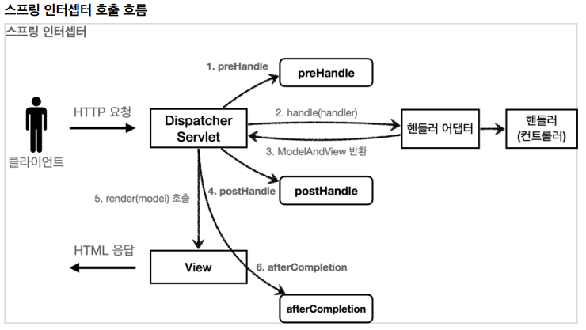

# 12. 로그인 처리 - 인터셉터

## 스프링 인터셉터 - 소개

스프링 인터셉터도 서블릿 필터와 같이 웹과 관련된 공통 관심 사항을 효과적으로 해결할 수 있는 기술이다.  
서블릿 필터가 서블릿이 제공하는 기술이라면, 스프링 인터셉터는 스프링 MVC가 제공하는 기술이다.  
둘다 웹과 관련된 공통 관심 사항을 처리하지만, 적용되는 순서와 범위, 그리고 사용방법이 다르다.

### 스프링 인터셉터 흐름
```
HTTP 요청 -> WAS -> 필터 -> 서블릿 -> 스프링 인터셉터 -> 컨트롤러
```

- 스프링 인터셉터는 디스패처 서블릿과 컨트롤러 사이에서 컨트롤러 호출 직전에 호출된다.
- 스프링 인터셉터는 스프링 MVC가 제공하는 기능이기 때문에 결국 디스패처 서블릿 이후에 등장하게 된다.

### 스프링 인터셉터 제한
```
HTTP 요청 -> WAS -> 필터 -> 서블릿 -> 스프링 인터셉터 -> 컨트롤러 // 로그인 사용자
HTTP 요청 -> WAS -> 필터 -> 서블릿 -> 스프링 인터셉터(적절하기 않은 요청이라 판단, 컨트롤러 호출X) // 비 로그인 사용자
```

### 스프링 인터셉터 체인
```
HTTP 요청 -> WAS -> 필터 -> 서블릿 -> 인터셉터1, 인터셉터2 -> 컨트롤러
```

중간에 인터셉터를 자유롭게 추가해서 로그를 남기는 인터셉터를 먼저 적용하고, 그 다음에 로그인 여부를 체크하는 인터셉터를 만들 수 있다.
 
#

### 스프링 인터셉터 인터페이스
```java
public interface HandlerInterceptor {

    default boolean preHandle(HttpServletRequest request, HttpServletResponse response, 
                            Object handler) throws Exception {}

    default void postHandle(HttpServletRequest request, HttpServletResponse response,
                            Object handler, @Nullable ModelAndView modelAndView) throws Exception {}

    default void afterCompletion(HttpServletRequest request, HttpServletResponse response,
                            Object handler, @Nullable Exception ex) throws Exception {}
}
```

- 서블릿 필터의 경우 단순히 doFilter() 하나만 제공된다.
- 인터셉터는 컨트롤러 호출 전(preHandle), 호출 후(postHandle), 요청 완료 이후(afterCompletion)와 같이 단계적으로 세분화 되어 있다.
- 서블릿 필터의 경우 request, response만 제공했지만, 인터셉터는 어떤 컨트롤러(handler)가 호출되는지 호출 정보도 받을 수 있다.
- 어떤 ModelAndView가 반환되는지 응답 정보도 받을 수 있다.

### 스프링 인터셉터 호출 흐름


### 정상 흐름
- preHandle: 컨트롤러 호출 전에 호출된다 (핸들러 어댑터 호출 전에 호출)
    - preHandle의 응답 값이 true면 다음으로 진행하고, false면 더 진행하지 않는다.
    - false인 경우 나머지 인터셉터는 물론이고, 핸들러 어댑터도 호출되지 않는다. 1번에서 끝이 나버린다.
- postHandle: 컨트롤러 호출 후에 호출된다 (핸들러 어댑터 호출 후에 호출)
- afterCompletion: 뷰가 렌더링 된 이후에 호출된다.

### 예외 발생시
- preHandle: 컨트롤러 호출 전에 호출된다.
- postHandle: 컨트롤러에서 예외가 발생하면 postHandle은 호출되지 않는다.
- afterCompletion: afterCompletion은 항상 호출된다. 이 경우 예외를 파라미터로 받아서 어떤 예외가 발생했는지 로그로 출력할 수 있다.
    - 예외가 발생하면 postHandle은 호출되지 않으므로 예외와 무관하게 공통처리를 하려면 afterCompletion을 사용해야 한다..

인터셉터는 스프링 MVC 구조에 특화된 필터 기능을 제공한다고 이해하면 된다.  
스프링 MVC를 사용하고, 특별히 필터를 꼭 사용해야 하는 상황이 아니라면 인터셉터를 사용하는 것이 더 편리하다.

---

## 스프링 인터셉터 - 요청 로그
```java
package hello.login.web.interceptor;

import lombok.extern.slf4j.Slf4j;
import org.springframework.web.method.HandlerMethod;
import org.springframework.web.servlet.HandlerInterceptor;
import org.springframework.web.servlet.ModelAndView;

import javax.servlet.http.HttpServletRequest;
import javax.servlet.http.HttpServletResponse;
import java.util.UUID;

@Slf4j
public class LogInterceptor implements HandlerInterceptor {

    public static final String LOG_ID = "logId";

    @Override
    public boolean preHandle(HttpServletRequest request, HttpServletResponse response, Object handler) throws Exception {

        String requestURI = request.getRequestURI();

        String uuid = UUID.randomUUID().toString();
        request.setAttribute(LOG_ID, uuid);

        //@RequestMapping: HandlerMethod
        //정적 리소스: ResourceHttpRequestsHandler
        if (handler instanceof HandlerMethod) {
            HandlerMethod hm = (HandlerMethod) handler; //호출할 컨트롤러 메서드의 모든 정보가 포함되어 있다.
        }

        log.info("REQUEST [{}][{}][{}]", uuid, requestURI, handler);
        return true; //false 진행X
    }

    @Override
    public void postHandle(HttpServletRequest request, HttpServletResponse response, Object handler, ModelAndView modelAndView) throws Exception {
        log.info("postHandle [{}]", modelAndView);
    }

    @Override
    public void afterCompletion(HttpServletRequest request, HttpServletResponse response, Object handler, Exception ex) throws Exception {       
        //예외가 발생해도 호출 되는 것을 보장
        
        String requestURI = request.getRequestURI();
        String logId = (String) request.getAttribute(LOG_ID);
        log.info("RESPONSE [{}][{}]", logId, requestURI);
        if (ex != null) {
            log.error("afterCompletion error!!", ex);
        }
    }
}
```

- request.setAttribute(LOG_ID, uuid)
    - 서블릿 필터의 경우 지역변수로 해결이 가능하지만, 스프링 인터셉터는 호출 시점이 완전히 분리되어있다.
    - preHandle에서 지정한 값을 postHandle, afterCompletion에서 함께 사용하려면 어딘가에 담아두어야 한다.
    - LogInterceptor도 싱글톤 처럼 사용되기 때문에 멤버변수를 사용하면 위험하다. 따라서 request에 담아두었다.
    - 이 값은 afterCompletion에서 request.getAttribute(LOG_ID)로 찾아서 사용한다.
- return true
    - true면 정상 호출이다. 다음 인터셉터나 컨트롤러가 호출된다.

```java
//@RequestMapping: HandlerMethod
//정적 리소스: ResourceHttpRequestsHandler
if (handler instanceof HandlerMethod) {
    HandlerMethod hm = (HandlerMethod) handler; //호출할 컨트롤러 메서드의 모든 정보가 포함되어 있다.
    }
```

- 핸들러 정보는 어떤 핸들러 매핑을 사용하는지에 따라 달라진다.
- 스프링을 사용하면 일반적으로 @Controller, @RequestMapping을 활용한 핸들러 매핑을 사용하는데 이 경우 핸들러 정보로 HandlerMethod가 넘어온다.
- @Controller가 아니라 /resources/static와 같은 정적 리소스가 호출 되는 경우 ResourceHttpRequestsHandler가 핸들러 정보로 넘어온다.

#

### WebConfig - 인터셉터 등록

```java
@Configuration
public class WebConfig implements WebMvcConfigurer {
    
    @Override
    public void addInterceptors(InterceptorRegistry registry) {
        registry.addInterceptor(new LogInterceptor())
                .order(1)
                .addPathPatterns("/**")
                .excludePathPatterns("/css/**", "/*.ico", "/error");
    }
}
```

WebMvcConfigurer가 제공하는 addInterceptors()를 사용해서 인터셉터를 등록한다.  
필터와 비교해보면 인터셉터는 addPathPatterns, excludePathPatterns로 매우 정밀하게 URL 패턴을 지정할 수 있다.

### PathPattern 공식 문서
```
? 한 문자 일치
* 경로(/) 안에서 0개 이상의 문자 일치
** 경로 끝까지 0개 이상의 경로(/) 일치
{spring} 경로(/)와 일치하고 spring이라는 변수로 캡처
{spring:[a-z]+} matches the regexp [a-z]+ as a path variable named "spring"
{spring:[a-z]+} regexp [a-z]+ 와 일치하고, "spring" 경로 변수로 캡처
{*spring} 경로가 끝날 때 까지 0개 이상의 경로(/)와 일치하고 spring이라는 변수로 캡처

/pages/t?st.html — matches /pages/test.html, /pages/tXst.html but not /pages/
toast.html
/resources/*.png — matches all .png files in the resources directory
/resources/** — matches all files underneath the /resources/ path, including /
resources/image.png and /resources/css/spring.css
/resources/{*path} — matches all files underneath the /resources/ path and 
captures their relative path in a variable named "path"; /resources/image.png 
will match with "path" → "/image.png", and /resources/css/spring.css will match 
with "path" → "/css/spring.css"
/resources/{filename:\\w+}.dat will match /resources/spring.dat and assign the 
value "spring" to the filename variable
```
[https://docs.spring.io/spring-framework/docs/current/javadoc-api/org/springframework/web/util/pattern/PathPattern.html](https://docs.spring.io/spring-framework/docs/current/javadoc-api/org/springframework/web/util/pattern/PathPattern.html)

---

## 스프링 인터셉터 - 인증 체크

### LoginCheckInterceptor
```java
package hello.login.web.interceptor;

import hello.login.web.SessionConst;
import lombok.extern.slf4j.Slf4j;
import org.springframework.web.servlet.HandlerInterceptor;
import org.springframework.web.servlet.ModelAndView;

import javax.servlet.http.HttpServletRequest;
import javax.servlet.http.HttpServletResponse;
import javax.servlet.http.HttpSession;

@Slf4j
public class LoginCheckInterceptor implements HandlerInterceptor {


    @Override
    public boolean preHandle(HttpServletRequest request, HttpServletResponse response, Object handler) throws Exception {

        String requestURI = request.getRequestURI();

        log.info("인증 체크 인터셉터 실행 {}", requestURI);
        HttpSession session = request.getSession();

        if (session == null || session.getAttribute(SessionConst.LOGIN_MEMBER) == null) {
            log.info("미 인증 사용차 요청");
            //로그인으로 redirect
            response.sendRedirect("/login?redirectURL=" + requestURI);
            return false;
        }
        return true;
    }
}
```

컨트롤러 호출 전에만 인증이 필요하기 때문에 preHandle만 구현했다.

### WebConfig 추가

```java
@Override
public void addInterceptors(InterceptorRegistry registry) {
    registry.addInterceptor(new LogInterceptor())
        .order(1)
        .addPathPatterns("/**")
        .excludePathPatterns("/css/**", "/*.ico", "/error");
    
    registry.addInterceptor(new LoginCheckInterceptor())
        .order(2)
        .addPathPatterns("/**")
        .excludePathPatterns("/", "/members/add", "/login", "logout",
                "/css/**", "/*.ico", "/error");
}
```

서블릿 필터와 비교해보면 excludePathPatterns와 같은 기능을 통해 매우 편리하게 적용할 수 있다는걸 느낄 수 있다.

---

## 정리

- 서블릿 필터와 스프링 인터셉터는 웹과 관련된 공통 관심사를 해결하기 위한 기술이다.
- 서블릿 필터와 비교해서 스프링 인터셉터가 개발자 입장에서 훨씬 편리하다는 걸 느낄 수 있었다.
- 특별한 문제가 없다면 인터셉터를 사용하는 것이 더 좋다.

---

### Reference
- [스프링 MVC 2편 - 백엔드 웹 개발 핵심 기술](https://www.inflearn.com/course/%EC%8A%A4%ED%94%84%EB%A7%81-mvc-2/dashboard)
