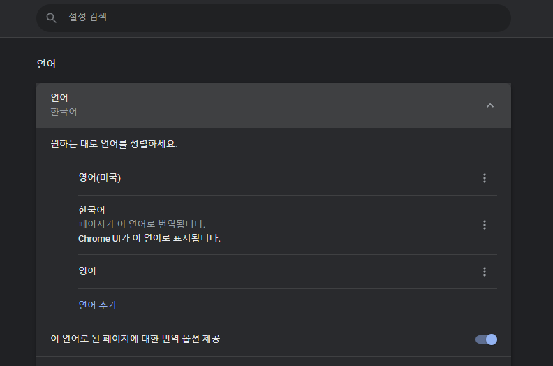
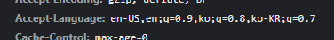
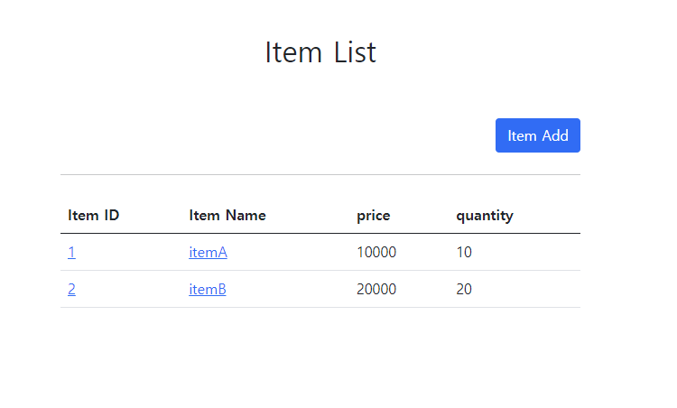

# 9. 메시지, 국제화

메시지와 국제화 기능을 직접 구현할 수도 있겠지만, 스프링은 기본적인 메시지와 국제화 기능을 모두 제공한다.  
그리고 타임리프도 스프링이 제공하는 메시지와 국제화 기능을 편리하게 통합해서 제공한다.  
지금부터 스프링이 제공하는 메시지와 국제화 기능을 알아보자.

#

## 스프링 메시지 소스 설정

스프링은 기본적인 메시지 관리 기능을 제공한다.  
  
메시지 관리 기능을 사용하려면 스프링이 제공하는 MessageSource를 스프링 빈으로 등록하면 되는데, MessageSource는 인터페이스이다.  
따라서 구현체인 ResourceBundleMessageSource를 스프링 빈으로 등록하면 된다.

### 직접 등록
```java
@Bean
public MessageSource messageSource() {
    ResourceBundleMessageSource messageSource = new ResourceBundleMessageSource();
    messageSource.setBasenames("messages", "errors");
    messageSource.setDefaultEncoding("utf-8");
    return messageSource;
}
```

- basenames: 설정 파일의 이름을 지정한다.
    - messages로 지정하면 messages.properties 파일을 읽어서 사용한다.
    - 국제화 기능을 적용하려면 messages_en.properties, message_ko.properties와 같이 파일명 마지막에 언어 정보를 주면 된다.
    - 만약 찾을 수 있는 국제화 파일이 없으면 message.properties을 기본으로 사용한다.
    - 파일의 위치는 /resources/messages.properties에 두면 된다.
    - 여러 파일을 한번에 지정할 수 있다. 여기서는 messages, errors 둘을 지정했다.
- defaultEncoding: 인코딩 정보를 지정한다. utf-8을 사용하면 된다.

#

### 스프링 부트

스프링 부트를 사용하면 다음과 같이 메시지 소스를 설정할 수 있다.

**application.properties**  
```spring.messages.basename=messages,config.i18n.messages```  

MessageSource를 스프링 빈으로 등록하지 않고, 스프링 부트와 관련된 별도의 설정을 하지 않으면 messages라는 이름으로 기본 등록된다.  
따라서 messages_en.properties, messages_ko.properties, messages.properties 파일만 등록하면 자동으로 인식된다.
```spring.messages.basename=messages```

---

## 웹 애플리케이션에 메시지 적용하기

- messages.properties: 기본 값으로 사용(한글)
- messages_en.properties: 영어 국제화 사용

/resources/messages.properties
```properties
label.item=상품
label.item.id=상품 ID
label.item.itemName=상품명
label.item.price=가격
label.item.quantity=수량

page.items=상품 목록
page.item=상품 상세
page.addItem=상품 등록
page.updateItem=상품 수정

button.save=저장
button.cancel=취소
```

### 타임리프 메시지 적용

타임리프의 메시지 표현식 #{...}를 사용하면 스프링의 메시지를 편리하게 조회할 수 있다.  
예를 들어서 방금 등록한 상품이라는 이름을 조회하려면 #{label.item}이라고 하면 된다.

**렌더링 전**
```<div th:text="#{label.item}"></h2>```

**렌더링 후**
```<div>상품</h2>```

#

**addForm.html**
```html
<!DOCTYPE HTML>
<html xmlns:th="http://www.thymeleaf.org">
<head>
    <meta charset="utf-8">
    <link th:href="@{/css/bootstrap.min.css}"
          href="../css/bootstrap.min.css" rel="stylesheet">
    <style>
        .container {
            max-width: 560px;
        }
    </style>
</head>
<body>

<div class="container">

    <div class="py-5 text-center">
        <h2 th:text="#{page.addItem}">상품 등록</h2>
    </div>

    <form action="item.html" th:action th:object="${item}" method="post">
        <div>
            <label for="itemName" th:text="#{label.item.itemName}">상품명</label>
            <input type="text" id="itemName" th:field="*{itemName}" class="form-control" placeholder="이름을 입력하세요">
        </div>
        <div>
            <label for="price" th:text="#{label.item.price}">가격</label>
            <input type="text" id="price" th:field="*{price}" class="form-control" placeholder="가격을 입력하세요">
        </div>
        <div>
            <label for="quantity" th:text="#{label.item.quantity}">수량</label>
            <input type="text" id="quantity" th:field="*{quantity}" class="form-control" placeholder="수량을 입력하세요">
        </div>

        <hr class="my-4">

        <div class="row">
            <div class="col">
                <button class="w-100 btn btn-primary btn-lg" type="submit" th:text="#{button.save}">저장</button>
            </div>
            <div class="col">
                <button class="w-100 btn btn-secondary btn-lg"
                        onclick="location.href='items.html'"
                        th:onclick="|location.href='@{/message/items}'|"
                        type="button" th:text="#{button.cancel}">취소</button>
            </div>
        </div>

    </form>

</div> <!-- /container -->
</body>
</html>
```

**페이지 이름에 적용**
- ```<h2>상품 등록 폼</h2>```
  - ```<h2 th:text="#{page.addItem}">상품 등록</h2>```
 
**레이블에 적용**
- ```<label for="itemName">상품명</label>```
  - ```<label for="itemName" th:text="#{label.item.itemName}">상품명</label>```
  - ```<label for="price" th:text="#{label.item.price}">가격</label>```
  - ```<label for="quantity" th:text="#{label.item.quantity}">수량</label>```

**버튼에 적용**
- ```<button type="submit">상품 등록</button>```
  - ```<button type="submit" th:text="#{button.save}">저장</button>```
  - ```<button type="button" th:text="#{button.cancel}">취소</button>```


  
- 참고로 파라미터는 다음과 같이 사용할 수 있다.  
```hello.name=안녕 {0}```  
```<p th:text="#{hello.name(${item.itemName})}"></p>```

---

## 웹 어플리케이션에 국제화 적용하기

/resources/messages_en.properties
```properties
label.item=Item
label.item.id=Item ID
label.item.itemName=Item Name
label.item.price=price
label.item.quantity=quantity

page.items=Item List
page.item=Item Detail
page.addItem=Item Add
page.updateItem=Item Update

button.save=Save
button.cancel=Cancel
```

사실 앞에서 템플릿 파일에 모두 #{...}를 통해서 메시지를 사용하도록 적용해두었기 떄문에  
en.properties 파일만 만들어두면 국제화 작업은 거의 끝난다.

### 웹으로 확인하기

웹 브라우저의 언어 설정 값을 변경하면서 국제화 적용을 확인해보자.
크롬 브라우저 -> 설정 -> 언어를 검색하고, 우선 순위를 변경하면 된다.  
우선 순위를 영어로 변경하고 테스트해보자.  
웹 브라우저의 언어 설정 값을 변경하면 요청시 Accept-Language의 값이 변경된다.  


  
크롬의 언어 우선순위를 영어(미국)을 1순위로 변경한다음 HTTP 요청을 확인해보면 
  


Accept-Language의 en-US의 값이 1.0으로 1순위, en이 0.9로 2순위가 된 것을 확인할 수 있다.  
  


---

### Reference
- [스프링 MVC 2편 - 백엔드 웹 개발 핵심 기술](https://www.inflearn.com/course/%EC%8A%A4%ED%94%84%EB%A7%81-mvc-2/dashboard)

