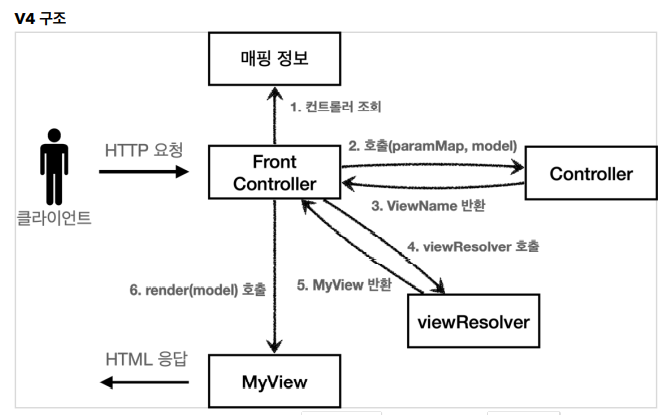

# 4. MVC Framework - FrontController(DispatcherSevlet)

## 프론트 컨트롤러 패턴의 탄생 배경

MVC 패턴을 도입한 이후, 컨트롤러와 뷰의 역할을 명확하게 구분할 수 있었다.  
관심사를 분리함으로서 개발자는 코드를 유지보수 하기 쉬워지고, 코드 생산량이 늘어나는 장점이 있었다.  

하지만 기능이 점점 늘어날 수록 컨트롤러에서 공통적으로 처리해야 하는 코드들이 늘어나고  
컨트롤러의 코드 밀도가 높아지면서 부하가 늘어나는 문제가 발생하게 되었는데  
이를 개선하기 위해 프론트 컨트롤러라는 개념이 탄생하게 된다.  

## 프론트 컨트롤러란?


각 컨트롤러마다 공통적으로 필요한 로직들이 필요했지만,  
공통의 관심사를 하나로 묶는 마치 서블릿의 역할을 하는 프론트 컨트롤러라는 개념을 도입해서  
개발자는 컨트롤러를 쉽게 관리하는 것이 가능하다.

> 서블릿이란?  
> 서블릿의 자세한 역할: https://github.com/seokmyungham/TIL/blob/main/SpringMVC/servlet.md

-  **Front Controller 패턴 특징**
  - 프론트 컨트롤러 서블릿 하나로 클라이언트의 요청을 받음
  - 프론트 컨트롤러가 요청의 맞는 컨트롤러를 찾아서 호출
  - 입구를 하나로! 공통 처리
  - 프론트 컨트롤러를 제외한 나머지 컨트롤러는 서블릿을 사용하지 않아도 된다

스프링 웹 MVC의 핵심도 바로 **FrontController**  
스프링 웹 MVC의 **DispatcherServlet**이 프론트 컨트롤러 패턴으로 구현되어 있다.

---

## 프론트 컨트롤러 - v1

프론트 컨트롤러의 역할은 명확하다.  
각 컨트롤러들이 수행해야 했던 공통로직들을 앞에서 미리 처리해주는 것  

- 기존 MVC 패턴의 dispatcher.forward를 호출해주는 일
- viewPath의 중복을 해결
- HttpServlet을 대신 상속받아서 서블릿의 역할을 대신 수행 등

위의 공통 로직들을 클라이언트와 컨트롤러 사이에서 적절히 수행하며 수문장 역할을 해주면 된다.

**v1의 구조**  
 

#

**프론트 컨트롤러 V1**

```java
@WebServlet(name = "frontControllerServletV1", urlPatterns = "/front-controller/v1/*")
public class FrontControllerServletV1 extends HttpServlet {

    private Map<String, ControllerV1> controllerMap = new HashMap<>();

    public FrontControllerServletV1() {
        controllerMap.put("/front-controller/v1/members/new-form", new MemberFormControllerV1());
        controllerMap.put("/front-controller/v1/members/save", new MemberSaveControllerV1());
        controllerMap.put("/front-controller/v1/members", new MemberListControllerV1());
    }

    @Override
    protected void service(HttpServletRequest request, HttpServletResponse response) throws ServletException, IOException {
        System.out.println("FrontControllerServletV1.service");

        String requestURI = request.getRequestURI();

        ControllerV1 controller = controllerMap.get(requestURI);
        if(controller == null) {
            response.setStatus(HttpServletResponse.SC_NOT_FOUND);
            return;
        }

        controller.process(request, response);
    }
}
```
  
> - **urlPatterns**  
    - urlPatterns을 사용함으로 모든 하위 요청은 이 서블릿에서 받아들인다.  
    - 예) /front-controller/v1, /front-controller/v1/a
> - **controllerMap**  
    - key: 매핑 URL  
    - value: 호출될 컨트롤러  
> - **service()**  
    - 먼저 requestURI를 조회해서 실제 호출할 컨트롤러를 controllerMap에서 찾는다  
    - 없다면 404(SC_NOT_FOUND) 상태 코드를 반환한다  
    - 컨트롤러를 찾고 controller.process(request, response)를 호출해서 해당 컨트롤러를 실행한다  


위 버전 1의 프론트 컨트롤러를 도입함으로서,  
모든 사용자 요청은 위의 프론트 컨트롤러에서 매핑되어 호출하게 된다. (controllerMap)

---

## View 분리 - v2

아직은 FrontController의 역할이 부족하다.  
모든 컨트롤러에서 뷰로 이동하는 부분에 중복이 발생한다.
(위 사진 참조 3. 컨트롤러에서 JSP forward)

```java
String viewPath = "/WEB-INF/views/new-form.jsp";
RequestDispatcher dispatcher = request.getRequestDispatcher(viewPath);
dispatcher.forward(request, response);
```

위와 같이 jsp를 호출하는 부분을 컨트롤러에서 깔끔하게 분리하기 위해   
별도로 뷰를 처리하는 객체가 필요하다.

**V2 구조**  


#

**MyView 도입**
```java
public class MyView {
    private String viewPath;

    public MyView(String viewPath) {
        this.viewPath = viewPath;
    }

    public void render(HttpServletRequest request, HttpServletResponse response) throws ServletException, IOException {
        RequestDispatcher dispatcher = request.getRequestDispatcher(viewPath);
        dispatcher.forward(request, response);
    }
}
```

viewPath를 넘겨받아 dispatcher.forward를 호출하는 역할을 하는 MyView를 만들어  
기존 컨트롤러의 과한 업무 비중을 축소시킬 수 있다.  
  
이렇게 관심사를 분리시키면 컨트롤러는 Myview 객체를 생성하기만 하면 되며 코드가 가벼워질 수 있다.

#

**interface controllerV2**
```java
public interface ControllerV2 {
    MyView process(HttpServletRequest request, HttpServletResponse response) throws ServletException, IOException;
}
```

**관심사가 분리된 컨트롤러**
```java
public class MemberSaveControllerV2 implements ControllerV2 {

    private MemberRepository memberRepository = MemberRepository.getInstance();

    @Override
    public MyView process(HttpServletRequest request, HttpServletResponse response) throws ServletException, IOException {
        String username = request.getParameter("username");
        int age = Integer.parseInt(request.getParameter("age"));

        Member member = new Member(username, age);
        memberRepository.save(member);

        //Model에 데이터를 보관한다.
        request.setAttribute("member", member);

        return new MyView("/WEB-INF/views/save-result.jsp");
    }
}
```

별도로 View를 처리해주는 객체 MyView를 도입한 이후로  
각 컨트롤러는 복잡한 dispatcher.forward()를 직접 생성 호출하지 않아도 된다.  
단순히 MyView 객체를 생성하고 거기에 뷰 이름만 넣고 반환하면 된다.  

#

**프론트 컨트롤러 V2**
```java
@WebServlet(name = "frontControllerServletV2", urlPatterns = "/front-controller/v2/*")
public class FrontControllerServletV2 extends HttpServlet {

    private Map<String, ControllerV2> controllerMap = new HashMap<>();

    public FrontControllerServletV2() {
        controllerMap.put("/front-controller/v2/members/new-form", new MemberFormControllerV2());
        controllerMap.put("/front-controller/v2/members/save", new MemberSaveControllerV2());
        controllerMap.put("/front-controller/v2/members", new MemberListControllerV2());
    }

    @Override
    protected void service(HttpServletRequest request, HttpServletResponse response) throws ServletException, IOException {
        String requestURI = request.getRequestURI();

        ControllerV2 controller = controllerMap.get(requestURI);
        if(controller == null) {
            response.setStatus(HttpServletResponse.SC_NOT_FOUND);
            return;
        }

        MyView view = controller.process(request, response);
        view.render(request, response);
    }
}
```

프론트 컨트롤러는 호출 결과로 MyView를 반환 받고,  
view.render()를 호출해서 중복 제거했던 forward 로직을 수행시켜 JSP를 실행한다. 
  
프론트 컨트롤러의 도입으로 MyView 객체의 render()를 호출하는 부분을 모두 일관되게 처리할 수 있다.  
각각의 컨트롤러는 MyView 객체를 생성만 해서 반환하면 된다.

---

## Model추가 - v3

### 서블릿 종속성 제거
버전2 컨트롤러의 입장에서  
서블릿 기술인 HttpServeltRequest, HttpServletResponse가 필요 없도록 변경할 수 있다.  

### 뷰 이름 중복 제거
컨트롤러에서 지정하는 뷰 이름에 중복이 있는 것을 확인할 수 있다.  
컨트롤러는 뷰의 논리 이름을 반환하고, 실제 물리 위치의 이름은 프론트 컨트롤러에서 처리하도록 단순화 할 수 있다.

- WEB-INF/views/new-form.jsp -> **new-form**
- WEB-INF/views/save-result.jsp -> **save-result**
- WEB-INF/views/members.jsp -> **members**

**V3 구조**  


#

서블릿의 종속성을 제거할 수 있도록  
Map을 파라미터로 받는 model을 도입하고, view 이름을 넘기도록 하면  
컨트롤러는 서블릿의 종속을 피할 수 있다.

**ModelView 도입**
```java
public class ModelView {
    private String viewName;
    private Map<String, Object> model = new HashMap<>();

    public ModelView(String viewName) {
        this.viewName = viewName;
    }

    public String getViewName() {
        return viewName;
    }

    public void setViewName(String viewName) {
        this.viewName = viewName;
    }

    public Map<String, Object> getModel() {
        return model;
    }

    public void setModel(Map<String, Object> model) {
        this.model = model;
    }
}
```

뷰의 이름과 뷰를 렌더링할 때 필요한 model 객체를 가지고 있다.

#

**ControllerV3**
```java
public interface ControllerV3 {

    ModelView process(Map<String, String> paramMap);
}
```

이 컨트롤러는 V1, V2와 달리 이제 서블릿 기술을 전혀 사용하지 않는다.  
HttpServletRequest가 제공하는 파라미터는 프론트 컨트롤러가 paramMap에 담아서 호출해주면 된다.  
응답 결과로 뷰 이름과 뷰에 전달할 Model 데이터를 포함하는 ModelView 객체를 반환한다.

**서블릿의 종속, view 이름 중복이 제거된 컨트롤러**
```java
public class MemberSaveControllerV3 implements ControllerV3 {

    private MemberRepository memberRepository = MemberRepository.getInstance();

    @Override
    public ModelView process(Map<String, String> paramMap) {
        String username = paramMap.get("username");
        int age = Integer.parseInt(paramMap.get("age"));

        Member member = new Member(username, age);
        memberRepository.save(member);

        ModelView mv = new ModelView("save-result");
        mv.getModel().put("member", member);
        return mv;

    }
}
```
- ModelView mv = new ModelView("save-result");
    - ModelView를 생성할 때 save-result라는 view의 논리적인 이름을 지정한다.
    - 실제 물리적인 이름은 프론트 컨트롤러에서 처리한다.
- paramMap.get("username");
    - 파라미터 정보는 map에 담겨있다. map에서 필요한 요청 파라미터를 조회하면 된다.
- mv.getModel().put("member", member);
    - 모델은 단순한 map이므로 모델과 뷰에서 필요한 member 객체를 담고 반환한다.

#

**프론트 컨트롤러 V3**
```java
@WebServlet(name = "frontControllerServletV3", urlPatterns = "/front-controller/v3/*")
public class FrontControllerServletV3 extends HttpServlet {

    private Map<String, ControllerV3> controllerMap = new HashMap<>();

    public FrontControllerServletV3() {
        controllerMap.put("/front-controller/v3/members/new-form", new MemberFormControllerV3());
        controllerMap.put("/front-controller/v3/members/save", new MemberSaveControllerV3());
        controllerMap.put("/front-controller/v3/members", new MemberListControllerV3());
    }

    @Override
    protected void service(HttpServletRequest request, HttpServletResponse response) throws ServletException, IOException {
        String requestURI = request.getRequestURI();

        ControllerV3 controller = controllerMap.get(requestURI);
        if(controller == null) {
            response.setStatus(HttpServletResponse.SC_NOT_FOUND);
            return;
        }

        //paramMap
        Map<String, String> paramMap = createParamMap(request);
        ModelView mv = controller.process(paramMap);

        String viewName = mv.getViewName();
        MyView view = viewResolver(viewName);

        view.render(mv.getModel(), request, response);
    }

    private MyView viewResolver(String viewName) {
        return new MyView("/WEB-INF/views/" + viewName + ".jsp");
    }

    private Map<String, String> createParamMap(HttpServletRequest request) {
        Map<String, String> paramMap = new HashMap<>();
        request.getParameterNames().asIterator()
                .forEachRemaining(paramName -> paramMap.put(paramName, request.getParameter(paramName)));
        return paramMap;
    }
}
```

- createParamMap()
    - HttpServletRequest에서 파라미터 정보를 꺼내서 Map으로 변환한다.
    - 해당 Map(paramMap)을 컨트롤러에 전달하면서 호출한다.

### 뷰 리졸버

```java
MyView view = viewResolver(viewName)
```
컨트롤러가 반환한 논리 뷰 이름을 실제 물리 뷰 경로로 변경한다.


```java
view.render(mv.getModel(), request, response)
```


- 뷰 객체를 통해서 HTML 화면을 렌더링 한다.
- 뷰 객체의 render()는 모델 정보도 함께 받는다.

**MyView**
```java
public class MyView {
    private String viewPath;

    public MyView(String viewPath) {
        this.viewPath = viewPath;
    }

    public void render(Map<String, Object> model, HttpServletRequest request, HttpServletResponse response) throws ServletException, IOException {
        modelToRequestArrtibute(model, request);
        RequestDispatcher dispatcher = request.getRequestDispatcher(viewPath);
        dispatcher.forward(request, response);
    }

    private void modelToRequestArrtibute(Map<String, Object> model, HttpServletRequest request) {
        model.forEach((key, value) -> request.setAttribute(key, value));
    }
}
```

- JSP는 request.getAttribute()로 데이터를 조회하기 때문에, 모델의 데이터를 꺼내서 request.setAttribute()로 담아둔다.

---

## 단순하고 실용적인 컨트롤러 - v4

서블릿 종속성을 제거하고 뷰 경로의 중복도 제거한 v3 컨트롤러에서 조금 더 개선해서  
컨트롤러에서 viewName만 반환하도록 코드를 변경할 수 있다.  

이렇게 프레임워크의 사소한 부분을 개선함으로서 개발자는 단순하고 편리하게 개발이 가능해진다.

**V4 구조**  

- 기본적인 구조는 V3과 같다. 대신 컨트롤러가 ModelView를 반환하지 않고, ViewName만 반환한다.

#

**ModelView대신 ViewName을 반환하도록 개선한 인터페이스**
```java
public interface ControllerV4 {

    /**
     * @param paramMap
     * @param model
     * @return
     */
    String process(Map<String, String> paramMap, Map<String, Object> model);
}
```

paramMap과 함께 추가로 model을 파라미터로 전달하고,  
인터페이스는 간단하게 String(viewName)을 반환하도록 개선할 수 있다.

**번거롭게 ModelView를 생성하지 않아도 되도록 개선**
```java
public class MemberSaveControllerV4 implements ControllerV4 {

    private MemberRepository memberRepository = MemberRepository.getInstance();

    @Override
    public String process(Map<String, String> paramMap, Map<String, Object> model) {
        String username = paramMap.get("username");
        int age = Integer.parseInt(paramMap.get("age"));

        Member member = new Member(username, age);
        memberRepository.save(member);

        model.put("member", member);
        return "save-result";
    }
}
```

- model.put("member", member)
    - 모델이 파라미터로 전달되기 때문에, 모델을 직접 생성하지 않아도 된다.
- 정말 단순하게 save-result 라는 뷰의 논리 이름만 반환하면 된다.
#

**프론트 컨트롤러 V4**
```java
@WebServlet(name = "frontControllerServletV4", urlPatterns = "/front-controller/v4/*")
public class FrontControllerServletV4 extends HttpServlet {

    private Map<String, ControllerV4> controllerMap = new HashMap<>();

    public FrontControllerServletV4() {
        controllerMap.put("/front-controller/v4/members/new-form", new MemberFormControllerV4());
        controllerMap.put("/front-controller/v4/members/save", new MemberSaveControllerV4());
        controllerMap.put("/front-controller/v4/members", new MemberListControllerV4());
    }

    @Override
    protected void service(HttpServletRequest request, HttpServletResponse response) throws ServletException, IOException {
        String requestURI = request.getRequestURI();

        ControllerV4 controller = controllerMap.get(requestURI);
        if(controller == null) {
            response.setStatus(HttpServletResponse.SC_NOT_FOUND);
            return;
        }

        //paramMap
        Map<String, String> paramMap = createParamMap(request);
        Map<String, Object> model = new HashMap<>(); //추가
        String viewName = controller.process(paramMap, model);

        MyView view = viewResolver(viewName);
        view.render(model, request, response);
    }

    private MyView viewResolver(String viewName) {
        return new MyView("/WEB-INF/views/" + viewName + ".jsp");
    }

    private Map<String, String> createParamMap(HttpServletRequest request) {
        Map<String, String> paramMap = new HashMap<>();
        request.getParameterNames().asIterator()
                .forEachRemaining(paramName -> paramMap.put(paramName, request.getParameter(paramName)));
        return paramMap;
    }
}
```

점점 프론트 컨트롤러의 코드 비중이 늘어나고 있는데  
이는 각 컨트롤러가 처리해야하는 부분이 줄어들고 있다는 의미이다.  
  
이렇게 프레임워크가 하는 일이 늘어날 수록 개발자가 하는 일이 줄어들게 되고  
순수하게 비즈니스 로직에만 집중할 수 있도록 되어 코드 생산량이 늘어난다.  

이게 바로 좋은 프레임 워크가 되고 있다는 증거이다!

### 모델 객체 전달
```java
Map<String, Object> model = new HashMap<>()
```
- 모델 객체를 프론트 컨트롤러에서 생성해서 넘겨준다.
- 컨트롤러에서 모델 객체에 값을 담으면 여기에 그대로 담겨있게 된다.

### 뷰의 논리 이름을 직접 반환
```java
String viewName = controller.process(paramMap, model);
MyView view = viewResolver(viewName);
```
- 컨트롤러가 직접 뷰의 논리 이름을 반환하므로 이 값을 사용해서 실제 물리 뷰를 찾을 수 있다.

---

## 정리

이번 챕터를 공부하면서 직접 프레임워크, 패턴을 점진적으로 발전시켜보았는데,  
프레임워크나 공통 기능이 수고로워야 사용하는 개발자가 편리해진다는 점을 깨달을수 있었다.  

특히 관심사의 분리를 적절하게 실현하면  
코드의 종속성도 해소될 뿐만 아니라, 코드가 명료해지고 유지보수 성능이 향상된다.  
이는 개발자가 테스트 코드를 작성 하는데에도 매우 효과적일 것이다.

---

### Reference
- [스프링 MVC 1편 - 백엔드 웹 개발 핵심 기술](https://www.inflearn.com/course/%EC%8A%A4%ED%94%84%EB%A7%81-mvc-1/dashboard)
