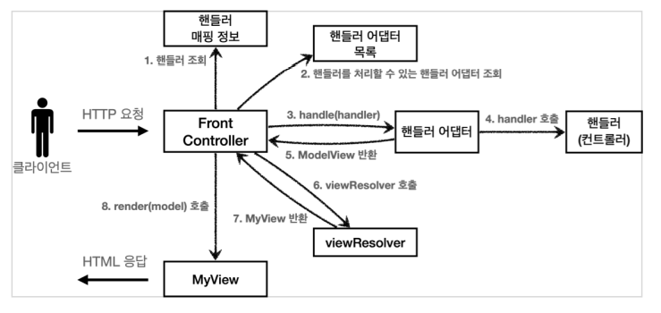

# 4. MVC 프레임워크 만들기

## 유연한 컨트롤러1 - v5

만약 어떤 개발자는 ControllerV3 방식으로 개발하고 싶고, 어떤 개발자는 ControllerV4 방식으로 개발하고 싶다면?  

```java
public interface ControllerV3 {

    ModelView process(Map<String, String> paramMap);
}
```

```java
public interface ControllerV4 {

    String process(Map<String, String> paramMap, Map<String, Object> model);
}
```
 
지금까지 우리가 개발한 프론트 컨트롤러는 한가지 방식의 컨트롤러 인터페이스만 사용할 수 있다.  
ControllerV3, ControllerV4는 완전히 다른 인터페이스이다. 따라서 호환이 불가능하다.  

#

### 어댑터 패턴

어댑터 패턴을 이용해서 프론트 컨트롤러가 다양한 방식의 컨트롤러를 처리할 수 있도록 변경해보자.

**V5 구조**  


- **핸들러 어댑터**
  - 중간에 어댑터 역할을 하는 어댑터가 추가되었는데 이름이 핸들러 어댑터이다.
  - 중간에서 어댑터 역할을 해주는 덕분에 다양한 종류의 컨트롤러를 호출할 수 있다.
- **핸들러**
  - 컨트롤러의 이름을 더 넓은 범위인 핸들러로 변경했다.
  - 이제 어댑터가 있기 때문에 꼭 컨트롤러의 개념 뿐만 아니라 어떠한 것이든 해당하는 종류의 어댑터만 있으면 다 처리할 수 있기 때문이다

**MyHandlerAdapter**
```java
package hello.servlet.web.frontcontroller.v5;

import hello.servlet.web.frontcontroller.ModelView;

import javax.servlet.ServletException;
import javax.servlet.http.HttpServletRequest;
import javax.servlet.http.HttpServletResponse;
import java.io.IOException;

public interface MyHandlerAdapter {

    boolean supports(Object handler);

    ModelView handle(HttpServletRequest request, HttpServletResponse response, Object handler) throws ServletException, IOException;
}
```

- ```boolean supports(Object handler)```
    - handler는 컨트롤러를 말한다.
    - 어댑터가 해당 컨트롤러를 처리할 수 있는지 판단하는 메서드다.
- ``` ModelView handle(HttpServletRequest request, HttpServletResponse response, Object handler)```
    - 어댑터는 실제 컨트롤러를 호출하고, 그 결과로 ModelView를 반환해야 한다.
    - 실제 컨트롤러가 ModelView를 반환하지 못하면, 어댑터가 ModelView를 직접 생성해서라도 반환해야한다.
    - 이전에는 프론트 컨트롤러가 실제 컨트롤러를 호출했지만 이제는 이 어댑터를 통해서 실제 컨트롤러가 호출된다.

실제 어댑터를 구현해보자.  
먼저 ControllerV3를 지원하는 어댑터를 구현하자.  

**ControllerV3HandlerAdapter**
```java
package hello.servlet.web.frontcontroller.v5.adapter;

import hello.servlet.web.frontcontroller.ModelView;
import hello.servlet.web.frontcontroller.v3.ControllerV3;
import hello.servlet.web.frontcontroller.v5.MyHandlerAdapter;

import javax.servlet.ServletException;
import javax.servlet.http.HttpServletRequest;
import javax.servlet.http.HttpServletResponse;
import java.io.IOException;
import java.util.HashMap;
import java.util.Map;

public class ControllerV3HandlerAdapter implements MyHandlerAdapter {

    @Override
    public boolean supports(Object handler) {
        return (handler instanceof ControllerV3);
    }

    @Override
    public ModelView handle(HttpServletRequest request, HttpServletResponse response, Object handler) throws ServletException, IOException {
        ControllerV3 controller = (ControllerV3) handler;

        Map<String, String> paramMap = createParamMap(request);
        ModelView mv = controller.process(paramMap);

        return mv;
    }

    private Map<String, String> createParamMap(HttpServletRequest request) {
        Map<String, String> paramMap = new HashMap<>();
        request.getParameterNames().asIterator()
                .forEachRemaining(paramName -> paramMap.put(paramName, request.getParameter(paramName)));
        return paramMap;
    }
}
```

- ```public boolean supports(Object handler)```
    - ContollerV3을 처리할 수 있는 어댑터인지 확인한다.
- ```ControllerV3 controller = (ControllerV3) handler;```
    - handler를 컨트롤러 V3로 변환한 다음에 V3 형식에 맞도록 호출한다.
    - supports()를 통해 ContollerV3만 지원하기 때문에 타입 변환은 걱정없이 실행해도 된다.
    - ContollerV3는 ModelView를 반호나하므로 그대로 ModelView를 반환하면 된다.

#

**FrontControllerServletV5**
```java
package hello.servlet.web.frontcontroller.v5;

import hello.servlet.web.frontcontroller.ModelView;
import hello.servlet.web.frontcontroller.MyView;
import hello.servlet.web.frontcontroller.v3.ControllerV3;
import hello.servlet.web.frontcontroller.v3.controller.MemberFormControllerV3;
import hello.servlet.web.frontcontroller.v3.controller.MemberListControllerV3;
import hello.servlet.web.frontcontroller.v3.controller.MemberSaveControllerV3;
import hello.servlet.web.frontcontroller.v5.adapter.ControllerV3HandlerAdapter;
import hello.servlet.web.frontcontroller.v5.adapter.ControllerV4HandlerAdapter;

import javax.servlet.ServletException;
import javax.servlet.annotation.WebServlet;
import javax.servlet.http.HttpServlet;
import javax.servlet.http.HttpServletRequest;
import javax.servlet.http.HttpServletResponse;
import java.io.IOException;
import java.util.ArrayList;
import java.util.HashMap;
import java.util.List;
import java.util.Map;

@WebServlet(name = "frontControllerServlet5", urlPatterns = "/front-controller/v5/*")
public class FrontControllerServletV5 extends HttpServlet {

    private final Map<String, Object> handlerMappingMap = new HashMap<>();
    private final List<MyHandlerAdapter> handlerAdapters = new ArrayList<>();

    public FrontControllerServletV5() {
        initHandlerMappingMap(); //핸들러 매핑 초기화
        initHandlerAdapters(); //어댑터 초기화
    }

    private void initHandlerMappingMap() {
        handlerMappingMap.put("/front-controller/v5/v3/members/new-form", new MemberFormControllerV3());
        handlerMappingMap.put("/front-controller/v5/v3/members/save", new MemberSaveControllerV3());
        handlerMappingMap.put("/front-controller/v5/v3/members", new MemberListControllerV3());
        }

    private void initHandlerAdapters() {
        handlerAdapters.add(new ControllerV3HandlerAdapter());
    }

    @Override
    protected void service(HttpServletRequest request, HttpServletResponse response) throws ServletException, IOException {

        Object handler = getHandler(request);

        if (handler == null) {
            response.setStatus(HttpServletResponse.SC_NOT_FOUND);
            return;
        }

        MyHandlerAdapter adapter = getHandlerAdapter(handler);
        ModelView mv = adapter.handle(request, response, handler);

        MyView view = viewResolver(viewName);
        view.render(mv.getModel(), request, response);
    }


    private Object getHandler(HttpServletRequest request) {
        String requestURI = request.getRequestURI();
        return handlerMappingMap.get(requestURI);
    }

    private MyHandlerAdapter getHandlerAdapter(Object handler) {
        for (MyHandlerAdapter adapter : handlerAdapters) {
            if(adapter.supports(handler)) {
                return adapter;
            }
        }
        throw new IllegalArgumentException("handler adapter를 찾을 수 없습니다. hander=" + handler);
    }

    private MyView viewResolver(String viewName) {
        return new MyView("/WEB-INF/views/" + viewName + ".jsp");
    }
}
```

이전에는 컨트롤러를 직접 매핑해서 사용했다. 그런데 이제는 어댑터를 사용하기 때문에, 컨트롤러 뿐만 아니라 어댑터가 지원하기만 하면,  
어떤 것이라도 URL에 매핑해서 사용할 수 있다. 그래서 이름을 컨트롤러에서 더 넓은 범위의 핸들러로 변경했다.

#

**생성자**
```java
public FrontControllerServletV5() {
    initHandlerMappingMap(); //핸들러 매핑 초기화
    initHandlerAdapters(); //어댑터 초기화
}
```
생성자는 핸들러 매핑과 어댑터를 초기화(등록)한다.

#

**매핑 정보**
```java
private final Map<String, Object> handlerMappingMap = new HashMap<>();
```
매핑 정보의 값이 ControllerV3, ControllerV4 같은 인터페이스에서 아무 값이나 받을 수 있는 Object로 변경되었다.

#

**핸들러 매핑**
```java
Object handler = getHandler(request)
```
```java
private Object getHandler(HttpServletRequest request) {
    String requestURI = request.getRequestURI();
    return handlerMappingMap.get(requestURI);
}
```
핸들러 매핑 정보인 handlerMappingMap에서 URL에 매핑된 핸들러 객체를 찾아서 반환한다.

#

**핸들러를 처리할 수 있는 어댑터 조회**
```java
MyHandlerAdapter adapter = getHandlerAdapter(handler)
```
```java
for (MyHandlerAdapter adapter : handlerAdapters) {
    if(adapter.supports(handler)) {
        return adapter;
    }
}
```
handler를 처리할 수 있는 어댑터를 adapter.supports(handler)를 통해서 찾는다.  
handler가 ControllerV3 인터페이스를 구현했다면, ControllerV3HandlerAdapter객체가 반환된다.

#

**어댑터 호출**
```java
ModelView mv = adapter.handle(request, response, handler);
```

어댑터의 handle(request, response, handler) 메서드를 통해 실제 어댑터가 호출된다.  
어댑터는 handler(컨트롤러)를 호출하고 그 결과를 어댑터에 맞추어 반환한다.  
ControllerV3HandlerAdapter의 경우 어댑터의 모양과 컨트롤러의 모양이 유사해서 변환 로직이 단순하다.

---

## 유연한 컨트롤러2 - v5

FrontControllerServletV5에 ControllerV4 기능도 추가해보자.

```java
private void initHandlerMappingMap() {
    handlerMappingMap.put("/front-controller/v5/v3/members/new-form", new MemberFormControllerV3());
    handlerMappingMap.put("/front-controller/v5/v3/members/save", new MemberSaveControllerV3());
    handlerMappingMap.put("/front-controller/v5/v3/members", new MemberListControllerV3());

    //V4
    handlerMappingMap.put("/front-controller/v5/v4/members/new-form", new MemberFormControllerV4());
    handlerMappingMap.put("/front-controller/v5/v4/members/save", new MemberSaveControllerV4());
    handlerMappingMap.put("/front-controller/v5/v4/members", new MemberListControllerV4());
}

private void initHandlerAdapters() {
    handlerAdapters.add(new ControllerV3HandlerAdapter());
    handlerAdapters.add(new ControllerV4HandlerAdapter());
}
```

handlerMappingMap에 ControllerV4를 사용하는 컨트롤러를 추가하고,  
해당 컨트롤러를 처리할 수 있는 어댑터인 ControllerV4HandlerAdapter도 추가하자.

#

**ControllerV4HandlerAdapter**
```java
package hello.servlet.web.frontcontroller.v5.adapter;

import hello.servlet.web.frontcontroller.ModelView;
import hello.servlet.web.frontcontroller.v4.ControllerV4;
import hello.servlet.web.frontcontroller.v5.MyHandlerAdapter;

import javax.servlet.ServletException;
import javax.servlet.http.HttpServletRequest;
import javax.servlet.http.HttpServletResponse;
import java.io.IOException;
import java.util.HashMap;
import java.util.Map;

public class ControllerV4HandlerAdapter implements MyHandlerAdapter {

    @Override
    public boolean supports(Object handler) {
        return (handler instanceof ControllerV4);
    }

    @Override
    public ModelView handle(HttpServletRequest request, HttpServletResponse response, Object handler) throws ServletException, IOException {
        ControllerV4 controller = (ControllerV4) handler;

        Map<String, String> paramMap = createParamMap(request);
        HashMap<String, Object> model = new HashMap<>();

        String viewName = controller.process(paramMap, model);

        ModelView mv = new ModelView(viewName);
        mv.setModel(model);

        return mv;
    }

    private Map<String, String> createParamMap(HttpServletRequest request) {
        Map<String, String> paramMap = new HashMap<>();
        request.getParameterNames().asIterator()
                .forEachRemaining(paramName -> paramMap.put(paramName, request.getParameter(paramName)));
        return paramMap;
    }
}
```

- ```public boolean supports(Object handler)```
    - handler가 ControllerV4인 경우에만 처리하는 어댑터이다.
- ```ControllerV4 controller = (ControllerV4) handler```
    - handler를 ControllerV4로 캐스팅한다
- ```String viewName = controller.process(paramMap, model)```
    - paramMap, model을 만들어서 해당 컨트롤러를 호출한다. 그리고 viewName을 반환 받는다

#

**어댑터 반환**

```java
ModelView mv = new ModelView(viewName);
mv.setModel(model);

return mv;
```
어댑터가 호출하는 ControllerV4는 뷰의 이름을 반환한다.  
그런데 어댑터는 뷰의 이름이 아니라 ModelView를 만들어서 반환해야한다. 여기서 어댑터가 꼭 필요한 이유가 나온다.  
ControllerV4는 뷰의 이름을 반환 했지만, 어댑터는 ModelView로 만들어서 형식을 맞추어 반환한다.

---

## 정리

v1부터 v5까지 점진적으로 프레임워크를 발전시켜 보았다.  
  
여기에 애노테이션을 사용해서 컨트롤러를 더 편리하게 발전시킬 수도 있다.  
만약 애노테이션을 사용해서 컨트롤러를 편리하게 사용할 수 있게 하려면 어떻게 해야할까?  
바로 애노테이션을 지원하는 어댑터를 추가하면 된다! 다형성과 어댑터 덕분에 기본 구조를 유지하면서 프레임워크의 기능을 확장할 수 있다. 

---

### Reference
- [스프링 MVC 1편 - 백엔드 웹 개발 핵심 기술](https://www.inflearn.com/course/%EC%8A%A4%ED%94%84%EB%A7%81-mvc-1/dashboard)
