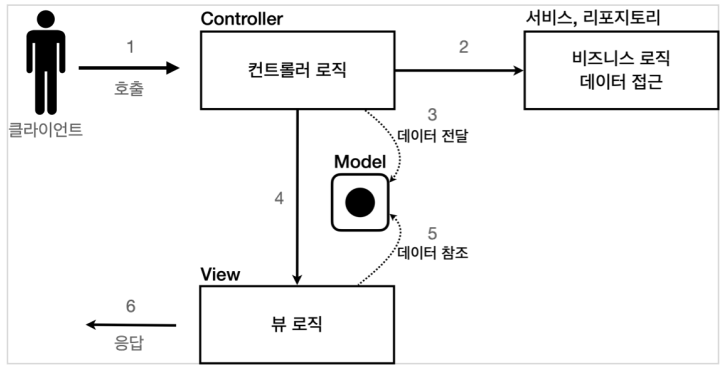

# MVC 패턴

## MVC 패턴이란?

하나의 서블릿이나, JSP로 처리하던 것들을 `컨트롤러`와 `뷰`라는 영역으로 서로 역할을 나눈 것을 말한다.  
웹 애플리케이션은 주로 이 `MVC 패턴`을 사용한다.

#

### 컨트롤러
HTTP 요청을 받아서 파라미터를 검증하고 비즈니스 로직을 실행한다.  
뷰에 전달할 결과 데이터를 조회해서 모델에 담는다

### 모델
뷰에 출력할 데이터를 담아둔다.  
  
뷰가 필요한 데이터를 모두 모델에 담아서 전달해주는 덕분에  
뷰는 비즈니스 로직이나 데이터 접근을 몰라도 되고, 화면을 렌더링 하는 일에 집중할 수 있다.

### 뷰
모델에 담겨있는 데이터를 사용해서 화면을 그리는 일에 집중한다.

#

## MVC 패턴이 탄생하게 된 이유?

### 1. 관심사의 분리 필요
하나의 서블릿이나 JSP가 각자 너무많은 역할을 담당해왔다.  
기존에는 비즈니스 로직과 UI 로직이 함께 모여있었다.  
이는 코드를 유지보수 하는데 힘들뿐만 아니라, 코드가 무슨 일에 집중해야하는지 경계를 찾기 힘들다.  

### 2. 변경의 라이프 사이클
UI를 수정하는 일과 비즈니스 로직을 수정하는 일의 라이프 사이클은 서로 다를 확률이 매우 높다.  
이렇게 라이프 사이클이 다른 부분을 하나의 코드로 관리하는 것은 유지보수 하기 좋지 않다.

### 3. 기능 특화
JSP 같은 뷰 템플릿은 화면을 렌더링 하는데 최적화 되어있기 때문에 이 부분의 업무만 담당하는 것이 효과적이다.

---
 
 ### Reference
- [스프링 MVC 1편 - 백엔드 웹 개발 핵심 기술](https://www.inflearn.com/course/%EC%8A%A4%ED%94%84%EB%A7%81-mvc-1/dashboard)
