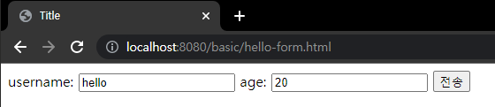

# 2. 서블릿

## 서블릿이란?

개발자가 만약 웹 애플리케이션 서버를 직접 구현해야한다면 어떤일이 벌어질까?  
> 서버 TCP/IP 연결 대기, 소켓 연결  
> HTTP 요청 메시지를 파싱해서 읽기  
> POST 방식, /save URL 인지  
> Content-Type확인  
> HTTP 메시지 바디 내용 파싱  
> 저장 프로세스 실행  
>  
> 비즈니스 로직 실행  
>  
> HTTP 응답 메시지 생성 시작  
> TCP/IP에 응답 전달, 소켓 종료  

HTTP 요청 하나가 만약 들어왔다고 가정해보면, 위에 보이는 반복적인 모든 과정을 개발자가 구현해야한다..   
모든 개발자가 위의 공통된 로직을 구현하고 있다면 그건 너무 비생산적인 일 일것이다.  
그래서 서블릿이 등장하게 된다!  

HTTP 요청 메시지를 파싱하는 것 부터 자동으로 메시지를 생성해주는 일까지  
**서블릿은 위의 비즈니스 로직을 제외한 모든 일을 자동화해준다.**

## 스프링 부트 서블릿 환경 구성

- 스프링 부트는 서블릿을 직접 등록해서 사용할 수 있도록 @ServletComponenetScan을 지원한다.

``` java
@ServletComponentScan //서블릿 자동 등록
@SpringBootApplication
public class ServletApplication {

	public static void main(String[] args) {
		SpringApplication.run(ServletApplication.class, args);
	}

}
```
#

### 서블릿 등록하기

- @WebServlet 서블릿 애노테이션
  - name: 서블릿 이름
  - urlPartterns: URL 매핑

```java
@WebServlet(name = "helloServlet", urlPatterns = "/hello")
public class HelloServlet extends HttpServlet {

    @Override
    protected void service(HttpServletRequest request, HttpServletResponse response) throws ServletException, IOException {
    ...
    }
}
```

- 개발자는 HttpServlet이란 것만 상속받으면 된다.  
- HTTP 요청을 통해 매핑된 URL이 호출되면 서블릿 코드가 실행되고 서블릿 컨테이너는 service 메소드를 실행한다.
- 이를 통해 개발자는 HTTP 스펙을 매우 편리하게 사용 가능하다.

#

### 서블릿 컨테이너 동작 방식

- 서블릿을 지원하는 WAS안에는 서블릿 컨테이너라는 것이 존재한다.  
- 서블릿 컨테이너는 서블릿을 상속받는 서블릿 객체(싱글톤)를 자동으로 생성, 호출, 생명주기를 관리해주는 역할을 한다.  

#### 내장 톰켓 서버 생성


- 스프링 부트가 실행하면서 내장 톰켓 서버를 생성해준다.
- 톰켓 서버는 내부에 서블릿 컨테이너 기능을 내장하고 있어, 컨테이너 안에 서블릿들을 자동으로 생성시켜준다.

#### 웹 어플리케이션 서버의 요청 응답 구조


- WAS 서버는 HTTP 요청이 오면, requset response 객체를 만들어서 싱클톤으로 생성되어있는 helloServlet을 호출한다.
- helloServlet 안에 있는 service 메소드를 실행시키고, 개발자가 response 데이터에 Content-Type 정보나 메시지를 넣는다.
- helloServlet이 종료되면 WAS 서버가 response 정보를 가지고 HTTP 응답 메시지를 만들어서 반환시킨다.

---
---

## 서블릿이 제공해주는 HttpServletRequest

### HttpServletRequest 역할

- HTTP요청 메시지를 개발자가 직접 파싱해서 사용해도 되지만 매우 불편하다.
- 서블릿은 개발자가 요청 메시지를 편리하게 사용할 수 있도록 개발자 대신 HTTP요청 메시지를 파싱한다.
- 파싱된 결과를 HttpServletRequest를 통하여 개발자가 편리하게 사용할 수 있다.

#

### HTTP 요청 메시지

```http
POST /save HTTP/1.1
Host: localhost:8080
Content-Type: application/x-www-form-urlencoded


username=kim&age=20
```

- START LINE
	- HTTP 메소드
	- URL
	- 쿼리 스트링
	- 스키마, 프로토콜
   	- printStartLine(request) // START LINE 정보
- 헤더
	- 헤더 조회
   	- printHeaders(request) // Header 정보
- 바디
	- form 파라미터 형식 조회
	- message body 데이터 직접 조회

HttpServletRequest 객체는 추가로 여러가지 부가기능도 함께 제공한다.
- 해당 HTTP 요청이 시작부터 끝날 때 까지 유지되는 임시 저장소 기능
	- 저장: ```request.setAttribute(name, value)```
	- 조회: ```request.getAttribute(name)```
- 세션 관리 기능
	- ```request.getSession(create: true)```

---

### HTTP 요청 데이터 형식

HTTP 요청 메시지를 통해 클라이언트에서 서버로 데이터를 전달하는 방법 3가지

- GET - 쿼리 파라미터
	- /url?username=hello&age=20
	- 메시지 바디 없이, URL의 쿼리 파라미터에 데이터를 포함해서 전달
	- 검색, 필터, 페이징등에서 많이 사용하는 방식
- POST - HTML Form
	- content-type: application/x-www-form-urlencoded
	- 메시지 바디에 쿼리 파라미터 형식으로 전달 username=hello&age=20
	- 회원 가입, 상품 주문, HTML Form 사용
- HTTP message body에 데이터를 직접 담아서 요청
	- HTTP API에서 주로 사용, JSON, XML, TEXT
	- POST, PUT, PATCH
---

### HttpServletRequest로 편리하게 조회 - GET 쿼리 파라미터

메시지 바디 없이 URL의 쿼리 파라미터를 사용해서 데이터를 전달 할 때  
- http://localhost:8080/request-param?username=hello&age=20  
- http://localhost:8080/request-param?username=hello&username=kim&age=20

서버에서는 HttpServletRequest가 제공하는 다음 메서드를 통해 쿼리 파라미터를 편리하게 조회할 수 있다.

```java
String username = request.getParameter("username") //단일 파라미터 조회
Enumeration<String> parameterNames = request.getParameterNames(); //파라미터 이름들 모두 조회
Map<String, String[]> parameterMap = request.getParameterMap(); //파라미터를 Map으로 모두 조회
String[] usernames = request.getParameterValues("username"); //복수 파라미터 조회
```

#

### HttpServletRequest로 편리하게 조회 - POST HTML Form

HTML의 Form을 사용해서 클라이언트에서 서버로 데이터를 전송 할 때
주로 회원가입, 상품 주문 등에서 사용하는 방식이다.

- content-type: application/x-www-form-urlencoded
- **메시지 바디에 쿼리 파라미터 형식**으로 데이터를 전달한다. username=hello&age=20

```java
<form action="/request-param" method="post">
```


POST의 HTML Form을 전송하면 웹 브라우저는 다음 형식으로 HTTP 메시지를 만든다.
- 요청 URL: http://localhost:8080/request-param
- content-type: applicaion/x-www-form-urlencoded
- message body: username=hello&age=20

applicaion/x-www-form-urlencoded 형식은 앞서 GET에서 살펴본 쿼리 파라미터 형식과 같다.  
따라서 **쿼리파라미터 조회 메서드를 그대로 사용**하면 된다.

클라이언트(웹 브라우저) 입장에서는 두 방식에 차이가 있지만, **서버 입장에서는 둘의 형식이 동일**하므로,  
request.getParameter()로 편리하게 구분없이 조회할 수 있다.
 
 #
 
 ### HttpServletRequest로 편리하게 조회 - API 메시지 바디 - 단순 텍스트
 
 - **HTTP message body**에 데이터를 직접 담아서 요청
 - HTTP API에서 주로 사용. JSON, XML, TEXT
 - 데이터 형식은 주로 JSON 사용
 - POST, PUT, PATCH

```java
@Override
 protected void service(HttpServletRequest request, HttpServletResponse response) throws ServletException, IOException {
 
 ServletInputStream inputStream = request.getInputStream();
 String messageBody = StreamUtils.copyToString(inputStream, StandardCharsets.UTF_8);

}
```

- getInputStream() 메소드로 메시지의 내용을 바이트코드로 얻을 수 있다.
- 바이트코드를 String형식으로 바꾸기만 하면 끝.

#

### HttpServletRequest로 편리하게 조회 - API 메시지 바디 - JSON

```java
 ServletInputStream inputStream = request.getInputStream();
 String messageBody = StreamUtils.copyToString(inputStream, StandardCharsets.UTF_8);
```

 JSON 결과를 얻는 방법은 위의 단순 텍스트를 조회하는 방법과 완전히 일치한다.  

  >여기서 추가로  
 >JSON 결과를 파싱해서 사용할 수 있는 자바 객체로 변환하려면, Jackson, Gson 같은 JSON 변환 라이브러리를 사용하면 된다.  
 >스프링 부트로 Spring MVC를 선택하면 기본으로 Jackson 라이브러리 (ObjectMapper)를 함께 제공한다.
  
```java
 private ObjectMapper objectMapper = new ObjectMapper(); 
 HelloData helloData = objectMapper.readValue(messageBody, HelloData.class);
```
 
 ---
 
 ## HttpServletResponse - 기본 사용법
 
 ### HttpServletResponse 역할
 
 - HTTP 응답 메시지 생성
 - HTTP 응답 코드 지정
 - 헤더 생성
 - 바디 생성
 - Content-Type, 쿠키, Redirect를 편리하게 지정할 수 있는 편의기능 제공

 ```java
 //[응답 상태 설정]
 response.setStatus(HttpServletResponse.SC_OK); //200
  
 //[response-headers]
 response.setHeader("Content-Type", "text/plain;charset=utf-8");
 response.setHeader("Cache-Control", "no-cache, no-store, mustrevalidate");
 response.setHeader("Pragma", "no-cache");
 response.setHeader("my-header","hello");

 //[message body]
 PrintWriter writer = response.getWriter();
 writer.println("ok");
 ```
---

### HttpServletResponse로 편리하게 응답 - 단순 텍스트, HTML

HTTP 응답 메시지는 주로 다음 내용을 담아서 전달한다.

- 단순 텍스트 응답
	- writer.println("ok");
- HTML 응답
- HTTP API - MessageBody JSON 응답

HttpServletResponse - HTML 응답

```java

response.setContentType("text/html");
response.setCharacterEncoding("utf-8");
 
PrintWriter writer = response.getWriter();

writer.println("<html>");
writer.println("<body>");
writer.println(" <div>안녕?</div>");
writer.println("</body>");
writer.println("</html>");
```

#

### HttpServletResponse로 편리하게 응답 - API JSON

```java
private ObjectMapper objectMapper = new ObjectMapper();

@Override
protected void service(HttpServletRequest request, HttpServletResponse response) throws ServletException {

	//Content-Type: application/json
	response.setHeader("content-type", "application/json");
	response.setCharacterEncoding("utf-8");
 
	HelloData data = new HelloData();
	data.setUsername("kim");
	data.setAge(20);
 
	//{"username":"kim","age":20}
	String result = objectMapper.writeValueAsString(data);
	response.getWriter().write(result);
}
 ```
 
 HTTP응답으로 JSON을 반환할 때는 content-type을 application/json으로 지정해야 한다.  
 Jackson 라이브러리가 제공하는 objectMapper.writeValueAsString()을 사용하면 객체를 JSON 문자로 변경할 수 있다.  
 
 ---
 
 ### Reference
- [스프링 MVC 1편 - 백엔드 웹 개발 핵심 기술](https://www.inflearn.com/course/%EC%8A%A4%ED%94%84%EB%A7%81-mvc-1/dashboard)
