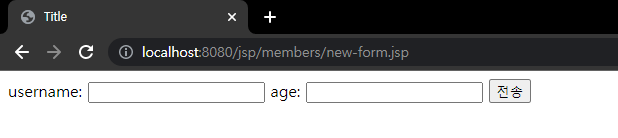

# 3. 서블릿, JSP, MVC패턴

지금까지 서블릿과 자바 코드만으로 HTML을 만들어보았다.  
서블릿 덕분에 동적으로 HTML을 마음껏 만들 수 있었지만 코드에서 보듯이 매우 복잡하고 비효율 적이었다.  
자바 코드로 HTML을 만드는 것 보다, HTML 문서에 동적으로 변경해야 하는 부분만 자바 코드를 넣을 수 있다면 더 편할 것이다.  
이것이 바로 템플릿 엔진이 나온 이유이다.  
  
**템플릿 엔진을 사용하면 HTML문서에서 필요한 곳만 코드를 적용해서 동적으로 변경할 수 있다.**  
템플릿 엔진에는 JSP, Thymeleaf, Freemarker, Velocity등이 있는데 그 중에서  
우선 먼저 JSP를 잠깐 공부해보고, 나중에 스프링과 잘 통합되는 Thymeleaf를 자세히 공부해보자. 

#

## JSP로 회원 관리 웹 어플리케이션 만들기

### JSP 라이브러리 추가

```java
implementation 'org.apache.tomcat.embed:tomcat-embed-jasper'
implementation 'javax.servlet:jstl'
```

#

### 회원 등록 폼 JSP

```jsp
<%@ page contentType="text/html;charset=UTF-8" language="java" %>
<html>
<head>
    <title>Title</title>
</head>
<body>
<form action="/jsp/members/save.jsp" method="post">
    username: <input type="text" name="username" />
    age: <input type="text" name="age" />
    <button type="submit">전송</button>
</form>
</body>
</html>
```

```jsp
<%@ page contentType="text/html;charset=UTF-8" language="java" %>
```

JSP는 첫 줄에 위 코드를 추가해주어야한다.

- 회원 등록 폼 JSP를 보면 첫 줄을 제외하고는 완전히 HTML과 똑같다
- JSP는 서버 내부에서 서블릿으로 변환되는데, 우리가 만들었던 MemberFormServlet과 거의 비슷한 모습으로 변환된다.



#


### 회원 저장 JSP

```jsp
<%@ page import="hello.servlet.domain.member.Member" %>
<%@ page import="hello.servlet.domain.member.MemberRepository" %>
<%@ page contentType="text/html;charset=UTF-8" language="java" %>
<%
    //request, response는 사용 가능
    MemberRepository memberRepository = MemberRepository.getInstance();

    System.out.println("MemberSaveServlet.service");
    String username = request.getParameter("username");
    int age = Integer.parseInt(request.getParameter("age"));

    Member member = new Member(username, age);
    memberRepository.save(member);
%>
<html>
<head>
    <title>Title</title>
</head>
<body>
성공
<ul>
    <li>id=<%=member.getId()%></li>
    <li>username=<%=member.getUsername()%></li>
    <li>age=<%=member.getAge()%></li>
</ul>
<a href="/index.html">메인</a>
</body>
</html>
```

JSP는 자바 코드를 그대로 다 사용할 수 있다.
- <%@ page import="hello.servlet.domain.member.MemberRepository" %>
  - 자바의 import문과 같다
- <% ~~ %>
  - 이 부분에는 자바 코드를 입력할 수 있다.
- <%= ~~ %>
  - 이 부분에는 자바 코드를 출력할 수 있다.

이 전에 공부했던 서블릿 코드와 JSP 코드가 다른 점이 있다면, JSP 코드는 HTML을 중심으로 하고,  
자바 코드를 부분부분 입력해주었다. <% ~ %>를 사용해서 HTML 중간에 자바 코드를 출력하고 있다.

#

### 회원 목록 JSP

```jsp
<%@ page import="hello.servlet.domain.member.Member" %>
<%@ page import="java.util.List" %>
<%@ page import="hello.servlet.domain.member.MemberRepository" %>
<%@ page contentType="text/html;charset=UTF-8" language="java" %>
<%
    MemberRepository memberRepository = MemberRepository.getInstance();
    List<Member> members = memberRepository.findAll();
%>
<html>
<head>
    <meta charset="UTF-8">
    <title>Title</title>
</head>
<body>
<a href="/index.html">메인</a>
<table>
    <thead>
    <th>id</th>
    <th>username</th>
    <th>age</th>
    </thead>
    <tbody>
    <%
        for (Member member : members) {
            out.write(" <tr>");
            out.write(" <td>" + member.getId() + "</td>");
            out.write(" <td>" + member.getUsername() + "</td>");
            out.write(" <td>" + member.getAge() + "</td>");
            out.write(" </tr>");
        }
    %>
    </tbody>
</table>
</body>
</html>
```

#

### Reference
- [스프링 MVC 1편 - 백엔드 웹 개발 핵심 기술](https://www.inflearn.com/course/%EC%8A%A4%ED%94%84%EB%A7%81-mvc-1/dashboard) 
