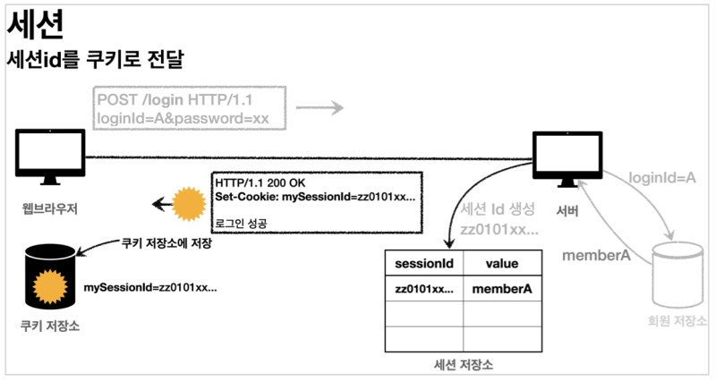

# 로그인 - 세션(Session)

`쿠키(Cookie)`는 웹 브라우저에서 사용자의 상태를 유지하기 위해 사용되는 작은 데이터 조각이다.  
주로 클라이언트에 저장되어 서버에 요청할 때 마다 함께 전송되는 특징이 있었다.  
- [TIL: 쿠키(Cookie)](https://github.com/seokmyungham/TIL/blob/main/Http/cookie.md)
  
`쿠키만 사용`해서 로그인 프로세스를 구현할 할 수도 있지만, 이는 `심각한 보안 문제`를 초래한다.  
  
`쿠키`는 클라이언트에 정보가 저장되기 때문에 임의로 값을 변경되어 요청할 수 있다.  
또한 따로 `암호화 되지 않은 정보`이기 때문에 보안에 취약하며, 해커는 `쿠키를 탈취하여 악의적인 요청`을 무제한 시도할 수 있다.

따라서 로그인 프로세스를 구현할 때는 중요한 정보는 서버에 저장하고  
클라이언트와 서버를 연결하는 값은 추정 불가능한 임의의 식별자를 사용해야 한다.  

#



`세션(Session)`은 `쿠키`와 마찬가지로 사용자의 상태를 유지하는 기술이다.  
다만 `세션`은 `세션ID`라는 고유한 식별자를 사용하여 사용자를 식별하고, 사용자의 정보를 서버에 저장한다.  

`쿠키`에 사용되는 정보를 `세션ID`로 대체하고, 클라이언트는 요청시 `세션ID` 쿠키를 전달한다.  
`암호화된 식별자를 사용해서 서버에서 사용자를 매칭`하기 때문에 비교적 보안에 더 안전하다는 장점이 있다.

---

## 세션 - 직접 구현

### 세션 생성
```java
@Component
public class SessionManager {
    public static final String SESSION_COOKIE_NAME = "mySessionId";

    private Map<String, Object> sessionStore = new ConcurrentHashMap<>();

    public void createSession(Object value, HttpServletResponse response) {
        //세션 id를 생성하고, 세션 id와 유저 정보를 저장
        String sessionId = UUID.randomUUID().toString();
        sessionStore.put(sessionId, value);

        //쿠키를 생성해서 세션id를 전달
        Cookie mySessionCookie = new Cookie(SESSION_COOKIE_NAME, sessionId);
        response.addCookie(mySessionCookie);
    }
}
```

### 세션 조회
```java
@Component
public class SessionManager {
    public static final String SESSION_COOKIE_NAME = "mySessionId";

    private Map<String, Object> sessionStore = new ConcurrentHashMap<>();

    public Object getSession(HttpServletRequest request) {
        Cookie sessionCookie = findCookie(request, SESSION_COOKIE_NAME);
        if (sessionCookie == null) {
            return null;
        }
        //세션id로 유저를 조회
        return sessionStore.get(sessionCookie.getValue());
    }

    private Cookie findCookie(HttpServletRequest request, String cookieName) {
        //HTTP 요청 쿠키가 없다면 null 반환
        if (request.getCookies() == null) {
            return null;
        }
        return Arrays.stream(request.getCookies())
                .filter(cookie -> cookie.getName().equals(cookieName))
                .findAny()
                .orElse(null);
    }
}
```

### 세션 만료
```java
@Component
public class SessionManager {
    public static final String SESSION_COOKIE_NAME = "mySessionId";

    private Map<String, Object> sessionStore = new ConcurrentHashMap<>();

    public void expire(HttpServletRequest request) {
        //HTTP 요청 쿠키를 조회하고 저장소에서 유저 정보를 삭제
        Cookie sessionCookie = findCookie(request, SESSION_COOKIE_NAME);
        if (sessionCookie != null) {
            sessionStore.remove(sessionCookie.getValue());
        }-
    }
}
```

`sessionId : 유저 정보`로 이루어진 세션 저장소를 생성하고  
로그인 시 클라이언트에게 `sessionId`가 담긴 쿠키를 발급하여 사용자의 상태를 유지한다.  

이후 세션 저장소에 회원 정보가 없다면, 쿠키나 세션이 없는 것 이므로 로그인 되지 않은 것으로 처리한다.  

---

### Reference
- [스프링 MVC 2편 - 백엔드 웹 개발 핵심 기술](https://www.inflearn.com/course/%EC%8A%A4%ED%94%84%EB%A7%81-mvc-2/dashboard)
