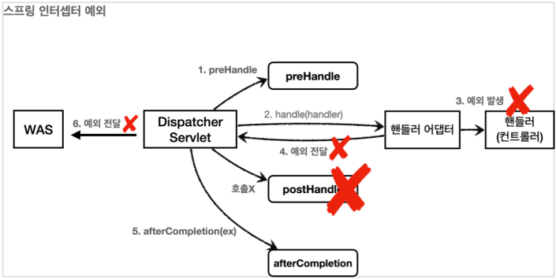

# 스프링 인터셉터

`스프링 인터셉터`는 `서블릿 필터`와 마찬가지로 웹 애플리케이션에서 `요청, 응답과 관련된 공통 관심 사항`을 처리할 수 있는 기술이다.  
  
차이점이 있다면 `서블릿 필터`는 서블릿이 제공하는 기술이고,  
`스프링 인터셉터`는 스프링 MVC가 제공하며, 스프링의 빈 관리와 밀접하게 통합되어 `더 많은 확장성과 유연성`을 제공한다.  

#
  
```ruby
HTTP 요청 -> WAS -> 필터 -> 서블릿 -> [스프링 인터셉터 1] -> [스프링 인터셉터 2] -> 컨트롤러
```
```ruby
HTTP 요청 -> WAS -> 필터 -> 서블릿 -> [스프링 인터셉터](적절하지 않은 요청이라 판단되면 컨트롤러 호출 X)
```

적용되는 순서 또한 `스프링 인터셉터`는 `디스패처 서블릿` 이후 `컨트롤러 호출 직전`에 호출된다.  

#

```java
public interface HandlerInterceptor {
    default boolean preHandle(HttpServletRequest request, HttpServletResponse response, Object handler)
            throws Exception {
    }

    default void postHandle(HttpServletRequest request, HttpServletResponse response, Object handler,
            @Nullable ModelAndView modelAndView) throws Exception {
    }

    default void afterCompletion(HttpServletRequest request, HttpServletResponse response, Object handler,
            @Nullable Exception ex) throws Exception {
    }
}
```

`스프링 인터셉터`를 사용하기 위해서는 `HandlerIntercpetor`를 구현해야 한다.  
`서블릿 필터`의 경우 단순히 `doFilter()` 하나만 제공되었지만, 인터셉터는 `preHandle`, `postHandle`, `afterCompletion` 3가지 메서드로 호출 분기가 세분화되어 있다.  

- `preHandle()`
    - 컨트롤러(핸들러 어댑터) `호출 전`에 호출된다.
    - return 값이 `true`면 다음 호출 단계로 진행하고, `false`면 더이상 진행하지 않는다.
    - 파라미터로 `handler`의 정보를 전달 받는다.
- `postHandle()`
    - 컨트롤러(핸들러 어댑터) `호출 후`에 호출된다.
    - 파라미터로 `handler`와 `ModelAndView`를 함께 전달 받는다.
- `afterCompletion()`
    - 뷰 렌더링 이후 호출된다.
    - 파라미터로 `handler`의 정보와 `예외 정보`를 전달 받는다.
 
#
 
여기서 중요한 점은 `예외가 발생했을 시`에 인터셉터 호출 흐름이다.  



`preHandle` 호출 이후 만약 핸들러에서 예외가 발생하면  
`postHandle`는 호출되지 않고, `디스패처 서블릿`에서 `afterCompletion`을 호출하며 `예외 정보와 핸들러 정보`를 함께 전달한다.  

`postHandle`과 다르게 `afterCompletion`은 예외와 무관하게 항상 호출되는 메서드이므로  
예외와 무관하게 어떠한 공통 처리를 하려면 `postHandle`이 아닌 `afterCompletion`을 사용해야 한다.

#

### 인터셉터 예시: 요청 로깅

```java
@Slf4j
public class LogInterceptor implements HandlerInterceptor {

    public static final String LOD_ID = "lodId";

    @Override
    public boolean preHandle(HttpServletRequest request, HttpServletResponse response, Object handler)
            throws Exception {
        String requestURI = request.getRequestURI();
        String uuid = UUID.randomUUID().toString();
        request.setAttribute(LOD_ID, uuid);

        //HandlerMethod: @Controller, @RequestMapping 
        //ResourceHttpRequestHandler: 정적 리소스
        if (handler instanceof HandlerMethod) {
            HandlerMethod hm = (HandlerMethod) handler;
        }

        log.info("REQUEST [{}][{}][{}]", uuid, requestURI, handler);
        return true;
    }

    @Override
    public void postHandle(HttpServletRequest request, HttpServletResponse response, Object handler,
                           ModelAndView modelAndView) throws Exception {
        log.info("postHandler [{}]", modelAndView);
    }

    @Override
    public void afterCompletion(HttpServletRequest request, HttpServletResponse response, Object handler, Exception ex)
            throws Exception {
        String requestURI = request.getRequestURI();
        String uuid = (String) request.getAttribute(LOD_ID);
        log.info("RESPONSE [{}][{}]", uuid, requestURI);
        if (ex != null) {
            log.error("afterCompletion error!!", ex);
        }
    }
}
```

`스프링 인터셉터`의 특징은 위와 같이 컨트롤러 직전 단계에서  
`HttpServletRequest`, `HttpServletResponse` 내부 데이터를 조작하고 컨트롤러로 전달할 수 있다는 점이다.  

또한 `preHandle` 단계에서 호출할 핸들러의 정보도 받아서 확인할 수 있다.  

#

### 인터셉터 등록

```java
@Configuration
public class WebConfig implements WebMvcConfigurer {
    @Override
    public void addInterceptors(InterceptorRegistry registry) {
        registry.addInterceptor(new LogInterceptor())
                .order(1)
                .addPathPatterns("/**")
                .excludePathPatterns("/css/**", "/*.ico", "/error");

        registry.addInterceptor(new LoginCheckInterceptor())
                .order(2)
                .addPathPatterns("/**")
                .excludePathPatterns("/", "/members/add", "/login", "/logout",
                        "/css/**", "/*.ico", "/error");
    }
}
```

인터셉터를 등록할 때는 `addInterceptors()`를 사용해서 등록한다.  
필터와는 달리 매우 정교하게 URL 패턴을 지정하는 것이 가능하다.


---

### Reference
- [스프링 MVC 2편 - 백엔드 웹 개발 핵심 기술](https://www.inflearn.com/course/%EC%8A%A4%ED%94%84%EB%A7%81-mvc-2/dashboard)
