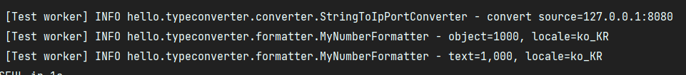

# 15. 스프링 타입 컨버터

HTTP 요청 파라미터는 모두 문자로 처리된다.  
따라서 요청 파라미터를 자바에서 다른 타입으로 변환해서 사용하고 싶으면 타입 변환 과정을 거쳐야 한다.
```java
String data = request.getParameter("data");
Integer intValue = Integer.valueOf(data);
```

### 스프링의 타입 변환 적용 예
- 스프링 MVC 요청 파라미터
    - @RequestParam, @ModelAttribute, @PathVariable
- @Value등으로 YML 정보 읽기
- XML에 넣은 스프링 빈 정보를 반환
- 뷰를 렌더링 할 때

타입을 변환해야 하는 경우는 상당히 많은데, 개발자가 직접 하나하나 타입 변환을 해야 한다면, 생각만 해도 괴로울 것이다.  
스프링이 중간에 타입 변환기를 사용해서 변환 해준 덕분에, 개발자는 해당 타입을 편리하게 바로 받을 수 있다.  
  
그런데 만약 개발자가 새로운 타입을 만들어서 변환하고 싶으면 어떻게 해야 할까?

---

## 타입 컨버터의 이해

타입 컨버터를 사용하려면 org.springframework.core.convert.converter.Converter 인터페이스를 구현하면 된다.

```java
package org.springframework.core.convert.converter;


public interface Converter<S, T> {
    T convert(S source);
}
```

스프링은 확장 가능한 컨버터 인터페이스를 제공한다.  
개발자는 스프링에 추가적인 타입 변환이 필요하면 이 컨버터 인터페이스를 구현해서 등록하면 된다.  
이 컨버터 인터페이스는 모든 타입에 적용할 수 있다.

### 사용자 정의 타입 컨버터

127.0.0.1:8080 과 같은 IP, PORT를 입력하면 IpPort 객체로 변환하는 컨버터를 만들어본다.

### IpPort
```java
package hello.typeconverter.type;

import lombok.EqualsAndHashCode;
import lombok.Getter;

@Getter
@EqualsAndHashCode
public class IpPort {

    private String ip;
    private int port;

    public IpPort(String ip, int port) {
        this.ip = ip;
        this.port = port;
    }
}
```

롬복의 @EqualAndHashCode를 넣으면 모든 필드를 사용해서, equals(), hashcode()를 생성한다.  
따라서 모든 필드의 값이 같다면 a.equals(b)의 결과가 참이 된다.

### StringToIpPortConverter
```java
package hello.typeconverter.converter;

import hello.typeconverter.type.IpPort;
import lombok.extern.slf4j.Slf4j;
import org.springframework.core.convert.converter.Converter;

@Slf4j
public class StringToIpPortConverter implements Converter<String, IpPort> {

    @Override
    public IpPort convert(String source) {
        log.info("convert source={}", source);
        String[] split = source.split(":");
        String ip = split[0];
        int port = Integer.parseInt(split[1]);

        return new IpPort(ip, port);
    }
}
```

### IpPortToStringConverter
```java
package hello.typeconverter.converter;

import hello.typeconverter.type.IpPort;
import lombok.extern.slf4j.Slf4j;
import org.springframework.core.convert.converter.Converter;

@Slf4j
public class IpPortToStringConverter implements Converter<IpPort, String> {

    @Override
    public String convert(IpPort source) {
        log.info("convert source={}", source);
        return source.getIp() + ":" + source.getPort();
    }
}
```

각각 String(127.0.0.1:8080) 에서 IpPort 객체로, IpPort 객체에서 String(127.0.0.1:8080) 으로 반환하는 컨버터를 만들었다.

### ConvereterTest - IpPort
```java
@Test
void stringToIpPort() {
    StringToIpPortConverter converter = new StringToIpPortConverter();
    String source = "127.0.0.1:8080";
    IpPort result = converter.convert(source);
    assertThat(result).isEqualTo(new IpPort("127.0.0.1", 8080));
}

@Test
void ipPortToString() {
    IpPortToStringConverter converter = new IpPortToStringConverter();
    IpPort source = new IpPort("127.0.0.1", 8080);
    String result = converter.convert(source);
    assertThat(result).isEqualTo("127.0.0.1:8080");
}
```

#

스프링은 용도에 따라 다양한 방식의 타입 컨버터를 제공한다.  

Converter -> 기본 타입 컨버터  
ConverterFactory -> 전체 클래스 계층 구조가 필요할 때  
GenericConverter -> 정교한 구현, 대상 필드의 애노테이션 정보 사용 가능  
ConditionalGenericConverter -> 특정 조건이 참인 경우에만 실행  

공식 문서:  
https://docs.spring.io/spring-framework/docs/current/reference/html/core.html#core-convert

---

## 컨버전 서비스 - ConversionService

타입 컨버터를 하나하나 직접 찾아서 타입 변환에 사용하는 것은 매우 불편하기 때문에,  
스프링은 개별 컨버터를 모아두고 그것들을 묶어서 편리하게 사용할 수 있는 기능을 제공한다.  

### ConversionService 인터페이스
```java
package org.springframework.core.convert;

import org.springframework.lang.Nullable;

public interface ConversionService {
    boolean canConvert(@Nullable Class<?> sourceType, Class<?> targetType);
    boolean canConvert(@Nullable TypeDescriptor sourceType, TypeDescriptor targetType);

    <T> T convert(@Nullable Object source, Class<T> targetType);
    Object convert(@Nullable Object source, @Nullable TypeDescriptor sourceType, TypeDescriptor targetType);
}
```

컨버전 서비스 인터페이스는 단순히 컨버팅이 가능한지 확인하는 기능과, 컨버팅 기능을 제공한다.

### ConversionServiceTest

```java
package hello.typeconverter.converter;

import hello.typeconverter.type.IpPort;
import org.assertj.core.api.Assertions;
import org.junit.jupiter.api.Test;
import org.springframework.core.convert.support.DefaultConversionService;

import static org.assertj.core.api.Assertions.*;

public class ConversionServiceTest {

    @Test
    void conversionTest() {
        //등록
        DefaultConversionService conversionService = new DefaultConversionService();
        conversionService.addConverter(new StringToIntegerConverter());
        conversionService.addConverter(new IntegerToStringConverter());
        conversionService.addConverter(new StringToIpPortConverter());
        conversionService.addConverter(new IpPortToStringConverter());

        //사용
        assertThat(conversionService.convert("10", Integer.class));
        assertThat(conversionService.convert(10, String.class));

        IpPort ipPort = conversionService.convert("127.0.0.1:8080", IpPort.class);
        assertThat(ipPort).isEqualTo(new IpPort("127.0.0.1", 8080));

        String ipPortString = conversionService.convert(new IpPort("127.0.0.1", 8080), String.class);
        assertThat(ipPortString).isEqualTo("127.0.0.1:8080");
    }
}
```

### 등록과 사용 분리
컨버터를 등록할 때는 StringToIntegerConverter 같은 타입 컨버터를 명확하게 알아야 한다.  
반면 컨버터를 사용하는 입장에서는 타입 컨버터를 전혀 몰라도 된다. 타입 컨버터들은 모두 컨버전 서비스 내부에 숨어서 제공된다.  
  
따라서 타입 변환을 원하는 사용자는 컨버전 서비스 인터페이스에만 의존하면 된다.  
물론 컨버전 서비스를 등록하는 부분과 사용하는 부분을 분리하고 의존관계 주입을 사용해야 한다.

#

### 인터페이스 분리 원칙 - ISP(Interface Segregation Principal)
인터페이스 분리 원칙은 클라이언트가 자신이 이용하지 않는 메서드에 의존하지 않아야 한다.

- DefaultConversionService는 다음 두 인터페이스를 구현했다.
    - ConversionService: 컨버터 사용에 초점
    - ConverterRegistry: 컨버터 등록에 초점

이렇게 인터페이스를 분리하면 컨버터를 사용하는 클라이언트와  
컨버터를 등록하고 관리하는 클라이언트의 관심사를 명확하게 분리할 수 있다.  
  
특히 컨버터를 사용하는 클라이언트는 ConversionService만 의존하면 되므로,  
컨버터를 어떻게 등록하고 관리하는지는 전혀 몰라도 된다.  
  
결과적으로 컨버터를 사용하는 클라이언트는 꼭 필요한 메서드만 알게된다.  
이렇게 인터페이스를 분리하는 것을 ISP라 한다.

---

## 스프링에 Converter 적용하기

### WebConfig
```java
package hello.typeconverter;

import hello.typeconverter.converter.IntegerToStringConverter;
import hello.typeconverter.converter.IpPortToStringConverter;
import hello.typeconverter.converter.StringToIntegerConverter;
import hello.typeconverter.converter.StringToIpPortConverter;
import org.springframework.context.annotation.Configuration;
import org.springframework.format.FormatterRegistry;
import org.springframework.web.servlet.config.annotation.WebMvcConfigurer;

@Configuration
public class WebConfig implements WebMvcConfigurer {

    @Override
    public void addFormatters(FormatterRegistry registry) {
        registry.addConverter(new StringToIntegerConverter());
        registry.addConverter(new IntegerToStringConverter());
        registry.addConverter(new StringToIpPortConverter());
        registry.addConverter(new IpPortToStringConverter());
    }
}
```

스프링은 내부에서 ConversionService를 제공한다.  
우리는 WebMvcConfigurer가 제공하는 addFormatters()를 사용해서 추가하고 싶은 컨버터를 등록하면 된다.  
이렇게 하면 스프링은 내부에서 사용하는 ConversionService에 컨버터를 추가해준다.

#

### HelloController
```java
@GetMapping("/ip-port")
public String ipPort(@RequestParam IpPort ipPort) {
    System.out.println("ipPort Ip = " + ipPort.getIp());
    System.out.println("ipPort PORT = " + ipPort.getPort());
    return "ok";
}
```

http://localhost:8080/ip-port?ipPort=127.0.0.1:8080  


직접 만들었던 StringToIpPortConverter가 동작하면서 ?ipPort=127.0.0.1:8080 쿼리 스트링이  
ipPort 객체 타입으로 잘 변환 된 것을 확인할 수 있다.

---

## 뷰 템플릿에 컨버터 적용하기

타임리프는 렌더링 시에 컨버터를 적용해서 렌더링 하는 방법을 편리하게 지원한다. (객체를 문자로 변환)

### ConverterController
```java
package hello.typeconverter.controller;

import hello.typeconverter.type.IpPort;
import org.springframework.stereotype.Controller;
import org.springframework.ui.Model;
import org.springframework.web.bind.annotation.GetMapping;

@Controller
public class ConverterController {

    @GetMapping("/converter-view")
    public String converterView(Model model) {
        model.addAttribute("number", 10000);
        model.addAttribute("ipPort", new IpPort("127.0.0.1", 8080));
        return "converter-view";
    }
}
```

Model에 숫자 10000과, ipPort 객체를 담아서 "converter-view" 뷰 템플릿으로 전달한다.

### converter-view
```html
<!DOCTYPE html>
<html xmlns:th="http://www.thyemleaf.org">
<head>
    <meta charset="UTF-8">
    <title>Title</title>
</head>
<body>
<ul>
    <li>${number}: <span th:text="${number}"></span></li>
    <li>${{number}}: <span th:text="${{number}}"></span></li>
    <li>${ipPort}: <span th:text="${ipPort}"></span></li>
    <li>${{ipPort}}: <span th:text="${{ipPort}}"></span></li>
</ul>

</body>
</html>
```

  
  


타임리프는 ${{...}}를 사용하면 ConversionService를 사용해서 변환된 결과를 출력해준다.  

- 변수 표현식: ${...}
- 컨버전 서비스 적용: ${{...}}

#

### 컨버터를 폼에 적용하기
```java
package hello.typeconverter.controller;

import hello.typeconverter.type.IpPort;
import lombok.Data;
import org.springframework.stereotype.Controller;
import org.springframework.ui.Model;
import org.springframework.web.bind.annotation.GetMapping;
import org.springframework.web.bind.annotation.ModelAttribute;
import org.springframework.web.bind.annotation.PostMapping;

@Controller
public class ConverterController {

    @GetMapping("/converter-view")
    public String converterView(Model model) {
        model.addAttribute("number", 10000);
        model.addAttribute("ipPort", new IpPort("127.0.0.1", 8080));
        return "converter-view";
    }

    @GetMapping("/converter/edit")
    public String converterForm(Model model) {

        IpPort ipPort = new IpPort("127.0.0.1", 8080);
        Form form = new Form(ipPort);

        model.addAttribute("form", form);
        return "converter-form";
    }

    @PostMapping("/converter/edit")
    public String converterEdit(@ModelAttribute Form form, Model model) {
        IpPort ipPort = form.getIpPort();
        model.addAttribute("ipPort", ipPort);
        return "converter-view";
    }


    @Data
    static class Form {
        private IpPort ipPort;

        public Form(IpPort ipPort) {
            this.ipPort = ipPort;
        }
    }
}
```

Form 객체를 데이터를 전달하는 폼 객체로 사용한다.

### converter-form
```html
<!DOCTYPE html>
<html xmlns:th="http://www.thymeleaf.org">
<head>
    <meta charset="UTF-8">
    <title>Title</title>
</head>
<body>

<form th:object="${form}" th:method="post">
    th:field <input type="text" th:field="*{ipPort}"><br/>
    th:value <input type="text" th:value="*{ipPort}">(보여주기 용도)<br/>
    <input type="submit">
</form>

</body>
</html>
```

  

타임리프의 th:field는 id, name을 출력하는 다양한 기능 뿐만 아니라, 컨버전 서비스도 함께 적용된다.  
  
- GET /converter/edit
    - th:field가 자동으로 ConversionService를 적용해서 ${{ipPort}} 처럼 적용이 되었다.
    - 따라서 IpPort -> String으로 변환된다.
- POST /converter/edit
    - @ModelAttribute를 사용해서 String -> IpPort로 변환된다.

---

## 포맷터 - Formatter

Converter는 입력과 출력 타입에 제한이 없는, 범용 타입 변환 기능을 제공한다.  
일반적인 웹 애플리케이션 환경에서는, 불린 타입을 숫자로 바꾸는 것 같은 범용 기능 보다,  
문자를 다른 타입으로 변환하거나, 다른 타입을 문자로 변환하는 상황이 대부분이다.

- 화면에 숫자를 출력해야 할 때, Integer -> String 출력 시점
    - 숫자 1000 -> 문자 "1,000" / 문자 "1,000" -> 숫자 1000
- 날짜 객체를 문자인 "2021-01-01 10:50:11" 와 같이 출력하거나 또는 그 반대의 상황

### Cnverter vs Formatter
- Converter는 범용(객체 -> 객체)
- Formatter는 문자에 특화(객체 -> 문자, 문자 -> 객체) + 현지화(Locale)
    - Converter의 특별한 버전

#

### Formatter 인터페이스
```java
public interface Printer<T> {
    String print(T object, Locale locale);
}

public interface Parser<T> {
    T parse(String text, Locale locale) throws ParseException;
}

public interface Formatter<T> extends Printer<T>, Parser<T> {
}
```

- String print(T object, Locale locale): 객체를 문자로 변경한다.
- T parse(String text, Locale locale): 문자를 객체로 변환한다.

### MyNumberFormatter
```java
package hello.typeconverter.formatter;

import lombok.extern.slf4j.Slf4j;
import org.springframework.format.Formatter;

import java.text.NumberFormat;
import java.text.ParseException;
import java.util.Locale;

@Slf4j
public class MyNumberFormatter implements Formatter<Number> {

    @Override
    public Number parse(String text, Locale locale) throws ParseException {
        log.info("text={}, locale={}", text, locale);
        NumberFormat format = NumberFormat.getInstance(locale);
        return format.parse(text);
    }

    @Override
    public String print(Number object, Locale locale) {
        log.info("object={}, locale={}", object, locale);
        return NumberFormat.getInstance(locale).format(object);
    }
}
```

"1,000" 처럼 숫자 중간의 쉼표를 적용하려면 자바가 기본으로 제공하는 NumberFormat 객체를 사용하면 된다.  
이 객체는 Locale 정보를 활용해서 나라별로 다른 숫자 포맷을 만들어준다.  
  
parse()를 사용해서 문자를 숫자로 변환한다.  
Number 타입은 Integer, Long과 같은 숫자 타입의 부모 클래스이다.  
  
print()를 사용해서 객체를 문자로 변환한다.

---

## 포맷터를 지원하는 컨버전 서비스

컨버전 서비스에는 컨버터만 등록할 수 있고, 포맷터를 등록할 수 는 없다.  
그런데 포맷터를 지원하는 컨버전 서비스를 사용하면 컨버전 서비스에 포맷터를 추가 할 수 있다.  
내부에서 어댑터 패턴을 사용해서 Formatter가 Converter처럼 동작하도록 지원한다.

### FormattingConversionService - DefaultFormattingConversionService
```java
package hello.typeconverter.formatter;

import hello.typeconverter.converter.IpPortToStringConverter;
import hello.typeconverter.converter.StringToIpPortConverter;
import hello.typeconverter.type.IpPort;
import org.assertj.core.api.Assertions;
import org.junit.jupiter.api.Test;
import org.springframework.format.support.DefaultFormattingConversionService;

import static org.assertj.core.api.Assertions.*;

public class FormattingConversionServiceTest {

    @Test
    void formattingConversionService() {

        DefaultFormattingConversionService conversionService =
                new DefaultFormattingConversionService();

        //컨버터 등록
        conversionService.addConverter(new StringToIpPortConverter());
        conversionService.addConverter(new IpPortToStringConverter());
        //포맷터 등록
        conversionService.addFormatter(new MyNumberFormatter());

        //컨버터 사용
        IpPort ipPort = conversionService.convert("127.0.0.1:8080", IpPort.class);
        assertThat(ipPort).isEqualTo(new IpPort("127.0.0.1", 8080));
        //포맷터 사용
        assertThat(conversionService.convert(1000, String.class)).isEqualTo("1,000");
        assertThat(conversionService.convert("1,000", Long.class)).isEqualTo(1000L);
    }
}
```

DefaultFormattingConversionService는 FormattingConversionService에 기본적인 통화, 숫자 관련 몇가지 기본 포맷터를 추가해서 제공한다.  



#

### WebConfig에 포맷터 적용
```java
package hello.typeconverter;

import hello.typeconverter.converter.IntegerToStringConverter;
import hello.typeconverter.converter.IpPortToStringConverter;
import hello.typeconverter.converter.StringToIntegerConverter;
import hello.typeconverter.converter.StringToIpPortConverter;
import hello.typeconverter.formatter.MyNumberFormatter;
import org.springframework.context.annotation.Configuration;
import org.springframework.format.FormatterRegistry;
import org.springframework.web.servlet.config.annotation.WebMvcConfigurer;

@Configuration
public class WebConfig implements WebMvcConfigurer {

    @Override
    public void addFormatters(FormatterRegistry registry) {
        //우선순위는 컨버터가 포맷터보다 우선이다.
        //registry.addConverter(new StringToIntegerConverter());
        //registry.addConverter(new IntegerToStringConverter());
        
        registry.addConverter(new StringToIpPortConverter());
        registry.addConverter(new IpPortToStringConverter());

        //추가
        registry.addFormatter(new MyNumberFormatter());
    }
}
```

### formatter - 객체 -> 문자
http://localhost:8080/converter-view  


model에 숫자 10000이 넘어가면, MyNumberFormatter가 적용되어서 문자 10,000이 출력된다.

### formatter - 문자 -> 객체
http://localhost:8080/hello-v2?data=10,000


"10,000"이라는 포맷팅 된 문자가 Interger 타입의 숫자 10000으로 정상 변환 된 것을 확인할 수 있다.

---

## 스프링이 제공하는 기본 포맷터

스프링은 자바에서 기본으로 제공하는 타입들에 대해 수 많은 포맷터를 기본으로 제공한다.
그런데 포맷터는 기본 형식이 지정되어 있기 때문에, 객체의 각 필드마다 다른 형식으로 포맷을 지정하기는 어렵다.  
  
스프링은 이런 문제를 해결하기 위해 애노테이션 기반으로 원하는 형식을 지정해서 사용할 수 있는  
매우 유용한 포맷터 두 가지를 기본으로 제공한다.

- @NumberFormat: 숫자 관련 형식 지정 포맷터, NumberFormatAnnotationFormatterFactory
- @DateTimeFormat: 날짜 관련 형식 지정 포맷터, Jsr310DateTimeFormatAnnotationFormatterFactory

### FormatterController
```java
package hello.typeconverter.controller;

import lombok.Data;
import org.springframework.format.annotation.DateTimeFormat;
import org.springframework.format.annotation.NumberFormat;
import org.springframework.stereotype.Controller;
import org.springframework.ui.Model;
import org.springframework.web.bind.annotation.GetMapping;
import org.springframework.web.bind.annotation.ModelAttribute;
import org.springframework.web.bind.annotation.PostMapping;

import java.time.LocalDateTime;

@Controller
public class FormatterConverter {

    @GetMapping("/formatter/edit")
    public String formatterForm(Model model) {
        Form form = new Form();
        form.setNumber(10000);
        form.setLocalDateTime(LocalDateTime.now());

        model.addAttribute("form", form);
        return "formatter-form";
    }

    @PostMapping("/formatter/edit")
    public String formatterEdit(@ModelAttribute Form form) {
        return "formatter-view";
    }

    @Data
    static class Form {

        @NumberFormat(pattern = "###, ###")
        private Integer number;

        @DateTimeFormat(pattern = "yyy-MM-dd HH:mm:ss")
        private LocalDateTime localDateTime;
    }
}
```

### formatter-form.html
```html
<!DOCTYPE html>
<html xmlns:th="http://www.thymeleaf.org">
<head>
    <meta charset="UTF-8">
    <title>Title</title>
</head>
<body>
<form th:object="${form}" th:method="post">
    number <input type="text" th:field="*{number}"><br/>
    localDateTime <input type="text" th:field="*{localDateTime}"><br/>
    <input type="submit"/>
</form>
</body>
</html>
```

### formatter-view.html
```html
<!DOCTYPE html>
<html xmlns:th="http://www.thymeleaf.org">
<head>
  <meta charset="UTF-8">
  <title>Title</title>
</head>
<body>
<ul>
  <li>${form.number}: <span th:text="${form.number}" ></span></li>
  <li>${{form.number}}: <span th:text="${{form.number}}" ></span></li>
  <li>${form.localDateTime}: <span th:text="${form.localDateTime}" ></span></
  li>
  <li>${{form.localDateTime}}: <span th:text="${{form.localDateTime}}" ></
    span></li>
</ul>
</body>
</html>
```

  


컨버터를 사용하든, 포맷터를 사용하든 등록 방법은 다르지만,  
사용할 때는 컨버전 서비스를 통해서 일관성 있게 사용할 수 있다.

---

### Reference
- [스프링 MVC 2편 - 백엔드 웹 개발 핵심 기술](https://www.inflearn.com/course/%EC%8A%A4%ED%94%84%EB%A7%81-mvc-2/dashboard)

