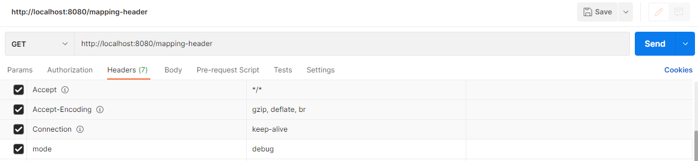

# 스프링 MVC - 기본 기능

## 요청 매핑

`요청 매핑(Request Mapping)`은 스프링 MVC에서 클라이언트의 HTTP 요청이 특정 핸들러 메서드에 매핑되는 방법을 정의한다.  
이를 통해 어떤 요청이 어떤 핸들러로 라우팅되는지 결정할 수 있다.

#

```java
@RestController
public class MappingController {
    private Logger log = LoggerFactory.getLogger(getClass());
    /**
    * 기본 요청
    * 둘다 허용 /hello-basic, /hello-basic/
    * HTTP 메서드 모두 허용 GET, HEAD, POST, PUT, PATCH, DELETE
    */
    @RequestMapping("/hello-basic")
    public String helloBasic() {
        log.info("helloBasic");
        return "ok";
    }
}
```

- `@RestController`
    - `@Controller`는 반환 값이 String이면 뷰 이름으로 인식된다. 그래서 뷰를 찾고 뷰가 랜더링 된다.
    - `@RestController`는 반환 값으로 뷰를 찾는 것이 아니라, HTTP 메시지 바디에 바로 입력한다.
- `@RequestMapping`에 HTTP 메서드 속성을 지정하지 않으면 HTTP 메서드와 무관하게 호출된다.
    - GET, HEAD, POST, PUT, PATCH, DELETE가 모두 허용될 수 있다.

#

### HTTP 메서드 매핑 축약

스프링 MVC는 요청 매핑과 HTTP 메서드를 축약한 편리한 어노테이션들을 제공한다.

```java
/**
 * @GetMapping 
 * @PostMapping
 * @PutMapping
 * @DeleteMapping
 * @PatchMapping
 */

//축약 전
@RequestMapping("/mapping-get-v2", method = RequestMethod.GET)

//축약 후
@GetMapping("/mapping-get-v2")
public String mappingGetV2() {
    log.info("mapping-get-v2");
    return "ok";
}
```

HTTP 메서드를 축약한 어노테이션을 사용하는 것이 가독성이 좋고 더 직관적인 것을 알 수 있다.

#

### PathVariable(경로 변수) 사용

최근 HTTP API는 리소스 경로에 식별자를 넣는 스타일을 선호한다

- /mapping/`userA`
- /users/`1`

`@RequestMapping`은 URL 경로를 템플릿화 할 수 있는데 `@PathVariable`을 사용하면 매칭 되는 부분을 편리하게 조회할 수 있다.

```java
/**
 * PathVariable 사용
 * 변수명이 같으면 생략 가능
 * @PathVariable("userId") String userId -> @PathVariable userId
 */
@GetMapping("/mapping/{userId}")
public String mappingPath(@PathVariable("userId") String data) {
    log.info("mappingPath userId={}", data);
    return "ok";
}
```

```java
/**
 * PathVariable 다중 사용
 */
@GetMapping("/mapping/users/{userId}/orders/{orderId}")
public String mappingPath(@PathVariable("userId") String userId, @PathVariable("orderId") Long orderId) {
    log.info("mappingPath userId={}, orderId={}", userId, orderId);
    return "ok";
}
```

위 코드같은 경우 호출되는 URL 경로 예시는 아래와 같다
- /mapping/users/`유저의 ID`/orders/`주문번호`
- /mapping/users/`ham`/orders/`1`

#

### 조건 매핑

스프링 MVC는 다양한 추가 조건에 따라 요청 매핑을 수행할 수 있도록 지원한다.  
대표적으로 지원하는 추가 조건은 다음과 같다

- 특정 파라미터 조건 매핑
- 특정 헤더 조건 매핑
- 미디어 타입 조건 매핑 - Content-Type
- 미디어 타입 조건 매핑 - Accept

### 특정 파라미터 조건 매핑

```java
/**
 * 파라미터로 추가 매핑
 * params="mode",
 * params="!mode"
 * params="mode=debug"
 * params="mode!=debug" (! = )
 * params = {"mode=debug","data=good"}
 */
@GetMapping(value = "/mapping-param", params = "mode=debug")
public String mappingParam() {
    log.info("mappingParam");
    return "ok";
}
```
- /mapping-param?mode=debug

위의 코드는 해당 URL 요청이 mode=debug 라는 파라미터를 가지고 있어야만 매핑이 이루어지는 예시이다.  
params를 활용하여 특정 파라미터가 있을 경우에만 매핑이 되도록 하는 조건을 사용할 수 있다.  
  
그러나 잘 사용하지는 않고, 경로 변수를 활용하는 스타일이 더 많이 선호된다.

#

### 특정 헤더 조건 매핑

```java
/**
 * 특정 헤더로 추가 매핑
 * headers="mode",
 * headers="!mode"
 * headers="mode=debug"
 * headers="mode!=debug" (! = )
 */
@GetMapping(value = "/mapping-header", headers = "mode=debug")
public String mappingHeader() {
    log.info("mappingHeader");
    return "ok";
}
```

파라미터 매핑과 비슷하게 HTTP 헤더 조건을 사용해서 매핑을 하는 방법이다.  

  

위와 같이 HTTP 요청 헤더의 값과 내가 작성한 조건이 일치하면 매핑이 이루어진다.

#

### 미디어 타입 조건 매핑 - Content-Type, consume

HTTP 요청의 Content-Type 헤더를 기반으로 미디어 타입으로 매핑하는 방법이다.  
  
다양한 Content-Type(json, text, xml..)에 따라 매핑을 다르게 하고싶으면 이 방법을 사용하면 된다.  
```java
/**
 * Content-Type 헤더 기반 추가 매핑 Media Type
 * consumes="application/json"
 * consumes="!application/json"
 * consumes="application/*"
 * consumes="*\/*"
 * MediaType.APPLICATION_JSON_VALUE
 */
@PostMapping(value = "/mapping-consume", consumes = "application/json")
public String mappingConsumes() {
    log.info("mappingConsumes");
    return "ok";
}
```

위 코드의 경우 요청 헤더의 Content-Type이 json인 경우에만 매핑이 이루어지게 된다.  

#

### 미디어 타입 조건 매핑 - Accept, produce

HTTP 요청의 Accept 헤더를 기반으로 미디어 타입으로 매핑하는 방법이다.  

> Accept 헤더란?  
> 클라이언트가 웹서버로 요청할 때 헤더에 추가하는 것으로,  
> 클라이언트 입장에서 수용 가능한 메시지 형태가 무엇인지 정의한 헤더를 말한다.
>
> 즉 클라이언트가 HTTP 요청의 Accept 헤더를 application/json로 설정해서 전송했다면,
> "나는 json 형식의 데이터만 처리할 수 있으니 응답 데이터를 json 으로 전송해줘" 라는 말과 같다.

```java
/**
 * Accept 헤더 기반 Media Type
 * produces = "text/html"
 * produces = "!text/html"
 * produces = "text/*"
 * produces = "*\/*"
 */
@PostMapping(value = "/mapping-produce", produces = "text/html")
public String mappingProduces() {
    log.info("mappingProduces");
    return "ok";
}
```

위 코드의 경우 요청 헤더의 Accept값이 text/html인 경우에만 매핑이 이루어지게 된다.  
만약 일치하지 않으면 HTTP 406 상태코드(Not Acceptable)을 반환한다.
