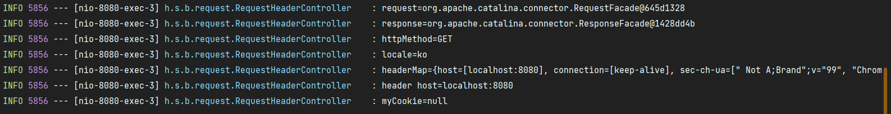
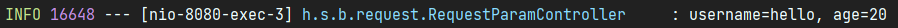

# 6. 스프링 MVC - 기본 기능

## 요청 매핑 - API 예시

회원 관리를 HTTP API로 만든다 생각하고 매핑을 어떻게 하는지 알아보자

- 회원 목록 조회: GET
  - /users
- 회원 등록: POST
  - /users
- 회원 조회: GET
  - /users/{userId}
- 회원 수정: PATCH
  - /users/{userId}
- 회원 삭제: DELETE
  - /users/{userId}

```java
package hello.springmvc.basic.requestmapping;

import org.springframework.web.bind.annotation.*;

@RestController
@RequestMapping("/mapping/users")
public class MappingClassController {
    /**
     * 회원 목록 조회: GET /mapping/users
     * 회원 등록: POST /mapping/users
     * 회원 조회: GET /mapping/users/{userId}
     * 회원 수정: PATCH /mapping/users/{userId}
     * 회원 삭제: DELETE /mapping/users/{userId}
     */

    @GetMapping
    public String user() {
        return "get users";
    }

    @PostMapping
    public String addUser() {
        return "post user";
    }

    @GetMapping("/{userId}")
    public String findUser(@PathVariable String userId) {
        return "get userId=" + userId;
    }

    @PatchMapping("/{userId}")
    public String updateUser(@PathVariable String userId) {
        return "update userId=" + userId;
    }

    @DeleteMapping("/{userId}")
    public String deleteUser(@PathVariable String userId) {
        return "delete userId=" + userId;
    }
}
```

- @RequestMapping("/mapping/users")
  - 클래스 레벨에 매핑 정보를 두면 메서드 레벨에서 해당 정보를 조합해서 사용한다.

---

## HTTP 요청 - 기본, 헤더 조회

애노테이션 기반의 스프링 컨트롤러는 다양한 파리미터를 지원한다.  
HTTP 헤더 정보를 조회하는 방법을 알아보자

```java
package hello.springmvc.basic.request;

import lombok.extern.slf4j.Slf4j;
import org.springframework.http.HttpMethod;
import org.springframework.util.MultiValueMap;
import org.springframework.web.bind.annotation.CookieValue;
import org.springframework.web.bind.annotation.RequestHeader;
import org.springframework.web.bind.annotation.RequestMapping;
import org.springframework.web.bind.annotation.RestController;

import javax.servlet.http.HttpServletRequest;
import javax.servlet.http.HttpServletResponse;
import java.util.Locale;

@Slf4j // log
@RestController // return view가 아니라 문자 그대로
public class RequestHeaderController {

    @RequestMapping("/headers")
    public String headers(HttpServletRequest request,
                          HttpServletResponse response,
                          HttpMethod httpMethod,
                          Locale locale,
                          @RequestHeader MultiValueMap<String, String> headerMap,
                          @RequestHeader("host") String host,
                          @CookieValue(value = "myCookie", required = false) String cookie) {

        log.info("request={}", request);
        log.info("response={}", response);
        log.info("httpMethod={}", httpMethod);
        log.info("locale={}", locale);
        log.info("headerMap={}", headerMap);
        log.info("header host={}", host);
        log.info("myCookie={}", cookie);

        return "ok";
    }
}
```

- HttpServletRequest
- HttpServletResponse
- HttpMethod: HTTP 메서드를 조회, org.springframework.http.HttpMethod
- Locale: Locale 정보를 조회한다.
- @RequestHeader MultiValueMap<String, String> headerMap
    - 모든 HTTP 헤더를 MultiValueMap 형식으로 조회한다.
- @RequestHeader("host") String host
    - 특정 HTTP 헤더를 조회한다.
    - 필수 값 여부: required / 기본 값 속성: defaultValue
- @CookieValue(value = "myCookie", required = false) String cookie
    - 특정 쿠키를 조회한다.
    - 필수 값 여부: required / 기본 값: defaultValue



- MultiValueMap
    - MAP과 유사한데, 하나의 키에 여러 값을 받을 수 있다.
    - HTTP header, HTTP 쿼리 파라미터와 같이 하나의 키에 여러 값을 받을 때 사용한다.
```java
MultiValueMap<String, String> map = new LinkedMultiValueMap();
map.add("keyA", "value1");
map.add("keyA", "value2");

//[value1,value2]
List<String> values = map.get("keyA");
```

@Controller의 사용 가능한 파라미터 목록은 다음 공식 메뉴얼에서 확인할 수 있다.  
[https://docs.spring.io/spring-framework/docs/current/reference/html/web.html#mvc-ann-arguments](https://docs.spring.io/spring-framework/docs/current/reference/html/web.html#mvc-ann-arguments)

@Controller의 사용 가능한 응답 값 목록은 다음 공식 메뉴얼에서 확인할 수 있다.  
[https://docs.spring.io/spring-framework/docs/current/reference/html/web.html#mvc-ann-return-types](https://docs.spring.io/spring-framework/docs/current/reference/html/web.html#mvc-ann-return-types)

---

## HTTP 요청 파라미터 - 쿼리 파라미터, HTML Form


### HTTP 요청 데이터 조회

서블릿에서 학습했던 HTTP 요청 데이터를 조회하는 방법들

- GET - 쿼리 파라미터
    - /url?username=hello&age=20
    - 메시지 바디 없이, URL의 쿼리 파라미터에 데이터를 포함해서 전달
    - 예)검색, 필터, 페이징
- POST - HTML Form
    - content-type: application/x-www-form-urlencoded
    - 메시지 바디에 쿼리 파라미터 형식으로 전달 username=hello&age=20
    - 예)회원 가입, 상품 주문, HTML Form
- HTTP message body에 데이터를 직접 담아서 요청
    - HTTP API에서 주로 사용, JSON, XML, TEXT
    - 데이터 형식은 주로 JSON 사용
    - POST, PUT, PATCH


#

### 요청 파라미터 - 쿼리 파라미터, HTML Form

이제 스프링으로 요청 파라미터를 조회하는 방법을 단계적으로 알아보자.

```java
@Slf4j
@Controller
public class RequestParamController {

    @RequestMapping("/request-param-v1")
    public void requestParamV1(HttpServletRequest request, HttpServletResponse response) throws IOException {
        String username = request.getParameter("username");
        int age = Integer.parseInt(request.getParameter("age"));
        log.info("username={}, age={}", username, age);

        response.getWriter().write("ok");
    }
}
```

단순히 HttpServletRequest가 제공하는 방식으로 요청 파라미터를 조회하는 방법이다.

## HTTP 요청 파라미터 - @RequestParam

스프링이 제공하는 @RequestParam을 사용하면 요청 파라미터를 매우 편리하게 사용할 수 있다.

### requestParamV2

```java
@ResponseBody
@RequestMapping("/request-param-v2")
public String requestParamV2(@RequestParam("username") String memberName,
                             @RequestParam("age") int memberAge) {

    log.info("username={}, age={}", memberName, memberAge);
    return "ok";
}
```

- @RequestParam: 파라미터 이름으로 바인딩
- @ResponseBody: View 조회를 무시하고, HTTP message body에 직접 해당 내용 입력

@RequestParam("username") String memberName  
-> request.getParameter("username")

### requestParamV3

```java
@ResponseBody // RestController와 같은 효과
@RequestMapping("/request-param-v3")
public String requestParamV3(@RequestParam String username,
                             @RequestParam int age) {

    log.info("username={}, age={}", username, age);
    return "ok";
}
```

HTTP 파라미터 이름이 변수 이름과 같으면 @RequestParam(name="xx")을 생략 가능하다.

### requestParamV4

```java
@ResponseBody // RestController와 같은 효과
@RequestMapping("/request-param-v4")
public String requestParamV4(String username, int age) {

    log.info("username={}, age={}", username, age);
    return "ok";
}
```

String, int, Integer 등의 단순 타입이면 @RequestParam도 생략 가능하다.  
@RequestParam 애노테이션을 생략하면 스프링 MVC는 내부에서 required=false를 적용한다.

#

### 파라미터 필수 여부 - requestParamRequired

```java
@ResponseBody // RestController와 같은 효과
@RequestMapping("/request-param-required")
public String requestParamRequired(
    @RequestParam(required = true) String username, //required = true 일시 이 파라미터가 안들어오면 오류발생 Bad Request, status=400
    @RequestParam(required = false) Integer age) { // age를 false로 설정하고 age값을 안보내도 오류가 발생한다 status = 500
    // 그 이유는 null을 int에 입력하는게 불가능하기 때문이다. 오류를 피하려면 Integer로 바꿔줘야한다.

    log.info("username={}, age={}", username, age);
    return "ok";
}
```

- @RequestParam.required
    - 파라미터 필수 여부
    - 기본값이 파라미터 필수(true)이다.
- /request-param 요청
    - username이 없으므로 400 예외가 발생한다.

**주의 - 파라미터 이름만 사용**
- /request-param?username=  
- 파라미터 이름만 있고 값이 없는 경우 -> 빈문자로 통과

**주의 - 기본형에 null 입력**
- /request-param 요청
- @RequestParam(required = false) int age

null을 int에 입력하는 것은 불가능(500 예외 발생)  
따라서 null을 받을 수 있는 Integer로 변경하거나, defaultValue 사용

### 기본 값 적용 - requestParamDefault

```java
@ResponseBody // RestController와 같은 효과
@RequestMapping("/request-param-default")
public String requestParamDefault(
        @RequestParam(required = true, defaultValue = "guest") String username, // 디폴트밸류를 설정해서 값이 안 넘어왔을때 이 값으로 넘어오게끔 설정
        @RequestParam(required = false, defaultValue = "-1") Integer age) { // 그래서 디폴트밸류를 사용하면 리콰이어드가 있든없든 상관이없게된다.

    log.info("username={}, age={}", username, age);
    return "ok";
}
```

파라미터에 값이 없는 경우 defaultValue를 사용하면 기본 값을 적용할 수 있다.  
이미 기본 값이 있기 때문에 required는 의미가 없다.  
  
defaultValue는 빈 문자의 경우에도 설정한 기본 값이 적용된다. /request-param?username=

### 파라미터를 Map으로 조회하기 - requestParamMap

```java
@ResponseBody
@RequestMapping("/request-param-map")
public String requestParamMap(@RequestParam Map<String, Object> paramMap) {
    log.info("username={}, age={}", paramMap.get("username"), paramMap.get("age"));
    return "ok";
}
```

파라미터를 Map, MultiValueMap으로 조회할 수 있다.

- @RequestParam Map
    - Map(key=value)
- @RequestParam MultiValueMap
    - MultiValueMap(key=\[value1, value2, ...] ex) (key=userIds, value=\[id1, id2])

파라미터의 값이 1개가 확실하다면 Map을 사용해도 되지만, 그렇지 않다면 MultiValueMap을 사용하자.

---

## HTTP 요청 파라미터 - @ModelAttribute

실제 개발을 하면 요청 파라미터를 받아서 필요한 객체를 만들고 그 객체에 값을 넣어주어야 한다.  
스프링은 이 과정을 완전히 자동화해주는 @ModelAttribute 기능을 제공한다.

### HelloData
```java
package hello.springmvc.basic;

import lombok.Data;

@Data
public class HelloData {
    private String username;
    private int age;
}
```

요청 파라미터를 바인딩 받을 객체

- 롬복 @Data
  - @Getter, @Setter, @ToString, @EqualsAndHashCode, @RequiredArgsConstructor

#

### ModelAttribute 적용 - modelAttributeV1
```java
@ResponseBody
@RequestMapping("/model-attribute-v1")
public String modelAttributeV1(@ModelAttribute HelloData helloData) {
    log.info("username={}, age={}", helloData.getUsername(), helloData.getAge());
    return "ok";
}
```

[http://localhost:8080/model-attribute-v1?username=hello&age=20](http://localhost:8080/model-attribute-v1?username=hello&age=20)



스프링MVC는 @ModelAttribute가 있으면 다음을 실행한다.
- HelloData 객체를 생성한다.
- 요청 파라미터의 이름으로 HelloData 객체의 프로퍼티를 찾는다 그리고 해당 프로퍼티의 setter를 호출해서 파라미터의 값을 바인딩한다.
- 파라미터의 이름이 username이면 setUsername() 메서드를 찾아서 호출하면서 값을 입력한다.

**바인딩 오류**  
age=abc 처럼 숫자가 들어가야 할 곳에 문자를 넣으면 BindException이 발생한다.  
이런 바인딩 오류를 처리하는 방법은 나중 검증 부분에서 다룬다.

### ModelAttribute 생략 - modelAttributeV2
```java
@ResponseBody
@RequestMapping("/model-attribute-v2")
public String modelAttributeV2(HelloData helloData) { //@ModelAttribute도 생략가능
    log.info("username={}, age={}", helloData.getUsername(), helloData.getAge());
    return "ok";
}
```

@ModelAttribute는 생략할 수 있다. 그런데 @RequestParam도 생략할 수 있으니 혼란이 발생할 수 있다.

스프링은 해당 생략시 다음과 같은 규칙을 적용한다.
- String, int, Integer 같은 단순 타입 = @RequestParam
- 나머지 = @ModelAttribute

---

## HTTP 요청 메시지 - 단순 텍스트

요청 파라미터와 다르게 HTTP 메시지 바디를 통해 데이터가 직접 넘어오는 경우는 @RequestParam, @ModelAttribute를 사용할 수 없다.

### RequestBodyStringController

```java
@Slf4j
@Controller
public class RequestBodyStringController {

    @PostMapping("/request-body-string-v1")
    public void requestBodyString(HttpServletRequest request, HttpServletResponse response) throws IOException {
        ServletInputStream inputStream = request.getInputStream();
        String messageBody = StreamUtils.copyToString(inputStream, StandardCharsets.UTF_8);

        log.info("messageBody={}", messageBody);
        response.getWriter().write("ok");
    }
```

HTTP 메시지 바디의 데이터를 InputStream을 사용해서 직접 읽을 수 있다.

### Input, Output 스트림, Reader - requestBodyStringV2

```java
@PostMapping("/request-body-string-v2")
public void requestBodyStringV2(InputStream inputStream, Writer responseWriter) throws IOException {
    String messageBody = StreamUtils.copyToString(inputStream, StandardCharsets.UTF_8);

    log.info("messageBody={}", messageBody);
    responseWriter.write("ok");
}
```

스프링 MVC는 다음 파라미터를 지원한다.
- InputStream(Reader): HTTP 요청 메시지 바디의 내용을 직접 조회
- OutputStream(Writer): HTTP 응답 메시지의 바디에 직접 결과 출력

### HttpEntity - requestBodyStringV3

```java
@PostMapping("/request-body-string-v3")
public HttpEntity<String> requestBodyStringV3(HttpEntity<String> httpEntity) throws IOException {
    String messageBody = httpEntity.getBody();
    log.info("messageBody={}", messageBody);

    return new HttpEntity<>("ok");
}
```

스프링 MVC는 다음 파라미터를 지원한다.
- HttpEntity: HTTP header, body 정보를 편리하게 조회
    - 메시지 바디 정보를 직접 조회
    - 요청 파라미터를 조회하는 기능과 관계없음
- HttpEntity는 응답에도 사용 가능
    - 메시지 바디 정보 직접 반환
    - 헤더 정보 포함 가능
    - view 조회X

HttpEntity를 상속받은 다음 객체들도 같은 기능을 제공한다.  

- RequestEntity
    - HttpMethod, url 정보가 추가, 요청에서 사용
- ResponseEntity
    - HTTP 상태 코드 설정 가능, 응답에서 사용
    - return new ResponseEntity\<String>("Hello World", responseHeaders, HttpStatus.CREATED)
    
### @RequestBody - requestBodyStringV4

```java
@ResponseBody
@PostMapping("/request-body-string-v4")
public String requestBodyStringV4(@RequestBody String messageBody) throws IOException {
    log.info("messageBody={}", messageBody);
    return "ok";
}
```

**@RequestBody**를 사용하면 HTTP 메시지 바디 정보를 편리하게 조회할 수 있다.  
헤더 정보가 필요하다면 HttpEntity를 사용하거나 @RequestHeader를 사용하면 된다.  
이렇게 메시지 바디를 직접 조회하는 기능은 요청 파라미터를 조회하는 @RequestParam, @ModelAttribute와는 전혀 관계가 없다.
  
- 요청 파라미터를 조회하는 기능: @RequestParam, @ModelAttribute
- HTTP 메시지 바디를 직접 조회하는 기능: @RequestBody

**@ResponseBody**를 사용하면 응답 결과를 HTTP 메시지 바디에 직접 담아서 전달할 수 있다.  
물론 이 경우에도 view를 사용하지 않는다.

---

## HTTP 요청 메시지 - JSON

HTTP API에서 주로 사용하는 JSON 데이터 형식

### RequestBodyJsonController

```java
package hello.springmvc.basic.request;

import com.fasterxml.jackson.databind.ObjectMapper;
import hello.springmvc.basic.HelloData;
import lombok.extern.slf4j.Slf4j;
import org.springframework.http.HttpEntity;
import org.springframework.stereotype.Controller;
import org.springframework.util.StreamUtils;
import org.springframework.web.bind.annotation.PostMapping;
import org.springframework.web.bind.annotation.RequestBody;
import org.springframework.web.bind.annotation.ResponseBody;

import javax.servlet.ServletInputStream;
import javax.servlet.http.HttpServletRequest;
import javax.servlet.http.HttpServletResponse;
import java.io.IOException;
import java.nio.charset.StandardCharsets;

/**
 * {"username":"hello", "age":20}
 * content-type: application/json
 */
@Slf4j
@Controller
public class RequestBodyJsonController {

    private ObjectMapper objectMapper = new ObjectMapper();

    @PostMapping("/request-body-json-v1")
    public void requestBodyJsonV1(HttpServletRequest request, HttpServletResponse response) throws IOException {
    
        ServletInputStream inputStream = request.getInputStream();
        String messageBody = StreamUtils.copyToString(inputStream, StandardCharsets.UTF_8);

        log.info("messageBody={}", messageBody);
        HelloData helloData = objectMapper.readValue(messageBody, HelloData.class);
        log.info("username={}, age={}", helloData.getUsername(), helloData.getAge());

        response.getWriter().write("ok");
    }
}
```

기존 서블릿에서 사용했던 방식이다.

- HttpServletRequest를 사용해서 직접 HTTP 메시지 바디에서 데이터를 읽어와서, 문자로 변환한다.
- 문자로 된 JSON 데이터를 Jackson 라이브러리인 objectMapper를 사용해서 자바 객체로 변환한다.

### requestBodyJsonV2 - @RequestBody 문자 변환

```java
@ResponseBody
@PostMapping("/request-body-json-v2")
public String requestBodyJsonV2(@RequestBody String messageBody) throws IOException {

    log.info("messageBody={}", messageBody);
    HelloData helloData = objectMapper.readValue(messageBody, HelloData.class);
    log.info("username={}, age={}", helloData.getUsername(), helloData.getAge());

    return "ok";
}
```

- 이전에 학습했던 @RequestBody를 사용해서 HTTP 메시지에서 데이터를 꺼내고 messageBody에 저장한다.
- 문자로 된 JSON 데이터인 messageBody를 objectMapper를 통해서 자바 객체로 변환한다.

### requestBodyJsonV3 - @RequestBody 객체 변환

```java
@ResponseBody
@PostMapping("/request-body-json-v3")
public String requestBodyJsonV3(@RequestBody HelloData data) throws IOException {
    log.info("username={}, age={}", data.getUsername(), data.getAge());
    return "ok";
}
```

- @RequestBody HelloData data
- @RequestBody에 직접 만든 객체를 지정할 수 있다.

HttpEntity, @RequestBody를 사용하면 HTTP 메시지 컨버터가 HTTP 메시지 바디의 내용을 우리가 원하는 문자나 객체로 변환해준다.  
HTTP 메시지 컨버터는 문자 뿐만 아니라 JSON도 객체로 변환해주는데, 방금 V2에서 했던 작업을 대신 처리해준다.

**@RequestBody는 생략 불가능**

스프링은 @ModelAttribute, @RequestParam 생략시 다음과 같은 규칙을 적용한다.
- String, int, Integer 같은 단순 타입 = @RequestParam
- 나머지 = @ModelAttribute

따라서 이 경우 HelloData에 @RequestBody를 생략하면 @ModelAttribute가 적용되어버린다.  
생략하면 HTTP 메시지 바디가 아니라 요청 파라미터를 처리하게 된다.

### requestBodyJsonV4 - HttpEntity

```java
@ResponseBody
@PostMapping("/request-body-json-v4")
public String requestBodyJsonV4(HttpEntity<HelloData> httpEntity) throws IOException {
    HelloData data = httpEntity.getBody();
    log.info("username={}, age={}", data.getUsername(), data.getAge());
    return "ok";
}
```

### requestBodyJsonV5

```java
@ResponseBody
@PostMapping("/request-body-json-v5")
public HelloData requestBodyJsonV5(@RequestBody HelloData data) throws IOException {
    log.info("username={}, age={}", data.getUsername(), data.getAge());
    return data;
}
```

응답의 경우에도 @ResponseBody를 사용하면 해당 객체를 HTTP 메시지 바디에 직접 넣어줄 수 있다.  
물론 이 경우에도 HttpEntity를 사용해도 된다.

- @RequestBody 요청
    - JSON 요청 - HTTP 메시지 컨버터 - 객체
- @ResponseBody 응답
    - 객체 - HTTP 메시지 컨버터 - JSON 응답

---

## 정리

- HTTP 헤더 정보를 조회하는 기능: @RequestHeader
- HttpEntity: HTTP header, body 정보를 편리하게 조회하고 메시지 바디 정보 직접 반환가능
- 요청 파라미터를 조회하는 기능: @RequestParam, @ModelAttribute
- HTTP 메시지 바디를 직접 조회하는 기능: @RequestBody
- 응답 결과를 HTTP 메시지 바디에 직접 담아서 전달: @ResponseBody

---

### Reference
- [스프링 MVC 1편 - 백엔드 웹 개발 핵심 기술](https://www.inflearn.com/course/%EC%8A%A4%ED%94%84%EB%A7%81-mvc-1/dashboard)
