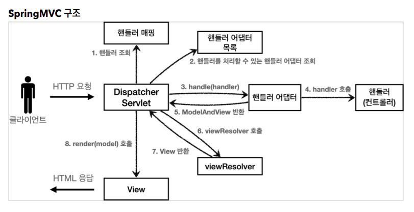
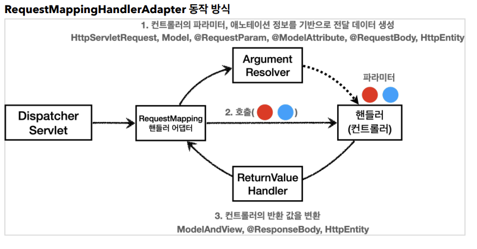
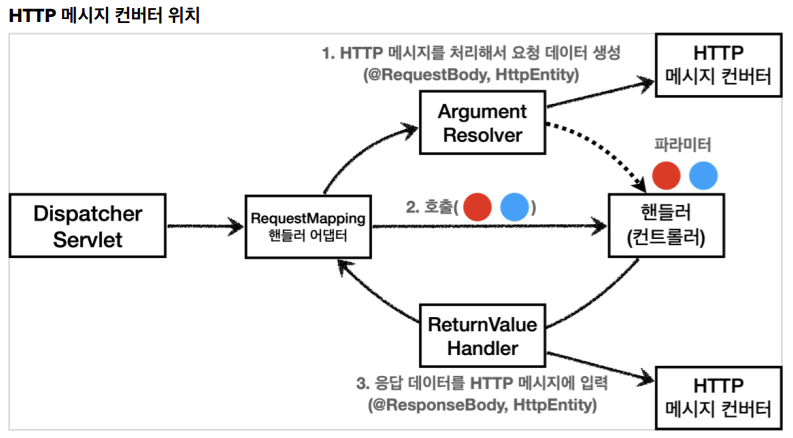

# 6. 스프링 MVC - 기본 기능

## HTTP 응답 - 정적 리소스, 뷰 템플릿

스프링(서버)에서 응답 데이터를 만드는 방법은 크게 3가지이다.

- 정적 리소스
    - 예) 웹 브라우저에 정적인 HTML, css, js를 제공할 때는, 정적 리소스를 사용한다.
- 뷰 템플릿
    - 예) 웹 브라우저에 동적인 HTML을 제공할 때는 뷰 템플릿을 사용한다.
- HTTP 메시지 사용
    - HTTP API를 제공하는 경우에는 HTML이 아니라 데이터를 전달해야 하므로, HTTP 메시지 바디에 JSON 같은 형식으로 데이터를 실어 보낸다

#

### 정적 리소스

스프링 부트는 클래스패스의 다음 디렉토리에 있는 정적 리소스를 제공한다.  
/static, /public, /resources, /META-INF/resources  
  
src/main/resources는 리소스를 보관하는 곳이고, 또 클래스패스의 시작 경로이다.  
따라서 다음 디렉토리에 리소스를 넣어두면 스프링 부트가 정적 리소스로 서비스를 제공한다.  
  
src/main/resources/static/basic/hello-form.html 과 같은 경로에 파일이 들어있으면  
웹 브라우저에서 http\://localhost:8080/basic/hello-form.html 과 같이 실행하면 된다.  
  
정적 리소스는 해당 파일을 변경 없이 그대로 서비스하는 것이다.

#
 
### 뷰 템플릿

뷰 템플릿을 거쳐서 HMTL이 생성되고, 뷰가 응답을 만들어서 전달한다.  
일반적으로 HTML을 동적으로 생성하는 용도로 사용하지만, 다른 것들도 가능하다. 뷰 템플릿이 만들 수 있는 것이라면 뭐든지 가능하다.  
  
스프링 부트는 기본 뷰 템플릿 경로를 제공한다.  
  
뷰 템플릿 경로: src/main/resources/templates  
뷰 템플릿 생성: src/main/resources/templates/response/hello.html

### 뷰 템플릿을 호출하는 컨트롤러
```java
package hello.springmvc.basic.response;

import org.springframework.stereotype.Controller;
import org.springframework.ui.Model;
import org.springframework.web.bind.annotation.RequestMapping;
import org.springframework.web.servlet.ModelAndView;

@Controller
public class ResponseViewController {

    @RequestMapping("/response-view-v1")
    public ModelAndView responseViewV1() {
        ModelAndView mav = new ModelAndView("response/hello")
                .addObject("data", "hello!");

        return mav;
    }

    @RequestMapping("/response-view-v2")
    public String responseViewV2(Model model) {
        model.addAttribute("data", "hello!");
        return "response/hello";
    }

    @RequestMapping("/response/hello") //권장x
    public void responseViewV3(Model model) {
        model.addAttribute("data", "hello!");
    }

}
```

**String을 반환하는 경우 - View or HTTP 메시지**
- @ResponseBody가 없으면 response/hello로 뷰 리졸버가 실행되어서 뷰를 찾고, 렌더링 한다.
- @ResponseBody가 있으면 뷰 리졸버를 실행하지 않고, HTTP 메시지 바디에 직접 response/hello라는 문자가 입력된다.

**Void를 반환하는 경우**
- @Controller를 사용하고, HttpServletResponse, OutputStream(Writer) 같은 HTTP 메시지 바디를 처리하는 파라미터가 없으면 요청 URL을 참고해서 논리 뷰 이름으로 사용
    - 요청 URL: /response/hello
    - 실행: templates/response/hello.html
- 이 방식은 명시성이 너무 떨어지고 이렇게 딱 맞는 경우도 많이 없어서, 권장하지 않는다.

**HTTP 메시지**
- @ResponseBody, HttpEntity를 사용하면, 뷰 템플릿을 사용하는 것이 아니라, HTTP 메시지 바디에 직접 응답 데이터를 출력할 수 있다.

---

## HTTP 응답 - HTTP API, 메시지 바디에 직접 입력

HTTP API를 제공하는 경우에는 HTML이 아니라 데이터를 전달해야 하므로, HTTP 메시지 바디에 JSON 같은 형식으로 데이터를 실어 보낸다.

### ResponseBodyController
```java
package hello.springmvc.basic.response;

import hello.springmvc.basic.HelloData;
import lombok.extern.slf4j.Slf4j;
import org.apache.coyote.Response;
import org.springframework.http.HttpStatus;
import org.springframework.http.ResponseEntity;
import org.springframework.stereotype.Controller;
import org.springframework.web.bind.annotation.GetMapping;
import org.springframework.web.bind.annotation.ResponseBody;
import org.springframework.web.bind.annotation.ResponseStatus;
import org.springframework.web.bind.annotation.RestController;

import javax.servlet.http.HttpServletResponse;
import java.io.IOException;

@Slf4j
@Controller
//@RestController
public class ResponseBodyController {

    @GetMapping("/response-body-string-v1")
    public void responseBodyV1(HttpServletResponse response) throws IOException {
        response.getWriter().write("ok");
    }

    @GetMapping("/response-body-string-v2")
    public ResponseEntity<String> responseBodyV2() {
        return new ResponseEntity<>("ok", HttpStatus.OK);
    }

    @ResponseBody
    @GetMapping("/response-body-string-v3")
    public String responseBodyV3() {
        return "ok";
    }

    @ResponseBody
    @GetMapping("/response-body-json-v1")
    public ResponseEntity<HelloData> responseBodyJsonV1() {
        HelloData helloData = new HelloData();
        helloData.setUsername("userA");
        helloData.setAge(20);
        return new ResponseEntity<>(helloData, HttpStatus.CREATED);
    }

    @ResponseStatus(HttpStatus.OK)
    @ResponseBody
    @GetMapping("/response-body-json-v2")
    public HelloData responseBodyJsonV2() {
        HelloData helloData = new HelloData();
        helloData.setUsername("userA");
        helloData.setAge(20);
        return helloData;
    }
}
```

### responseBodyV1
서블릿을 직접 다룰 때 처럼 HttpServletResponse 객체를 통해서 HTTP 메시지 바디에 직접 ok 응답 메시지를 전달한다.  
```response.getWriter().write("ok")```
  
### responseBodyV2
ResponseEntity 엔티티는 HttpEntity를 상속 받았는데, HttpEntity는 HTTP 메시지의 헤더, 바디 정보를 가지고 있다.  
ResponseEntity는 여기에 더해서 HTTP 응답 코드를 설정할 수 있다.  
  
HttpStatus.CREATED 로 변경하면 201 응답이 나가는 것을 확인할 수 있다.

### responseBodyV3
@ResponseBody를 사용하면 view를 사용하지 않고, HTTP 메시지 컨버터를 통해서 HTTP 메시지를 직접 입력할 수 있다.  
ResponseEntity도 동일한 방식으로 동작한다.

### responseBodyJsonV1
ResponseEntity를 반환한다. HTTP 메시지 컨버터를 통해서 JSON 형식으로 변환되어서 반환된다.

### responseBodyJson2
ResponseEntity는 HTTP 응답 코드를 설정할 수 있는데, @ResponseBody를 사용하면 이런 것을 설정하기 까다롭다.  
@ResponseStatus(HttpStatus.OK) 애노테이션을 사용하면 응답 코드도 설정할 수 있다.

### @RestController
@Controller 대신에 @RestController 애노테이션을 사용하면, 해당 컨트롤러에 모두 @ResponseBody가 적용되는 효과가 있다.  
@ResponseBody가 적용되는 효과가 있다. 따라서 뷰 템플릿 사용하는 것이 아니라, HTTP 메시지 바디에 직접 데이터를 입력한다.  
이름 그대로 Rest API(HTTP API)를 만들 때 사용하는 컨트롤러이다.  
  
@ResponseBody는 클래스 레벨에 두면 전체 메서드에 적용되는데, @RestController 애노테이션 안에 @ResponseBodt가 적용되어 있다.

---

## HTTP 메시지 컨버터

뷰 템플릿으로 HTML을 생성해서 응답하는 것이 아니라,  
HTTP API처럼 JSON 데이터를 HTTP 메시지 바디에서 직접 읽거나 쓰는 경우 HTTP 메시지 컨버터를 사용하면 편리하다.
  
스프링 MVC는 다음의 경우에 HTTP 메시지 컨버터를 적용한다.
- HTTP 요청: @RequestBody, HttpEntity(RequestEntity)
- HTTP 응답: @ResponseBody, HttpEntity(ResponseEntity)

### 스프링 부트 기본 메시지 컨버터 (일부 생략)

- 0 = ByteArrayHttpMessageConverter
- 1 = StringHttpMessageConverter
- 2 = MappingJackson2HttpMessageConverter

스프링 부트는 다양한 메시지 컨버터를 제공하는데, 대상 클래스 타입과 미디어 타입 둘을 체크해서 사용여부를 결정한다.  

- ByteArrayHttpMassageConverter: byte[] 데이터를 처리한다.
    - 클래스 타입: byte[], 미디어 타입: */*,
    - 요청 예) @RequestBody byte[] data
    - 응답 예) @ResponseBody return byte[] 쓰기 미디어 타입 application/octet-stream
- StringHttpMessageConverter: String 문자로 데이터를 처리한다.
    - 클래스 타입: String, 미디어 타입: */*
    - 요청 예) @RequestBody String data
    - 응답 예) @ResponseBody return "ok" 쓰기 미디어 타입 text/plain
- MappingJackson2HttpMessageConverter: application/json
    - 클래스타입: 객체 또는 HashMap, 미디어 타입: application/json 관련
    - 요청 예) @RequestBody HelloData data
    - 응답 예) @ResponseBody return helloData 쓰기 미디어 타입 application/json 관련

### HTTP 메시지 컨버터 언터페이스

```java
package org.springframework.http.converter;

public interface HttpMessageConverter<T> {

    boolean canRead(Class<?> clazz, @Nullable MediaType mediaType);
    boolean canWrite(Class<?> clazz, @Nullable MediaType mediaType);

    List<MediaType> getSupportedMediaTypes();

    T read(Class<? extends T> clazz, HttpInputMessage inputMessage) throws IOException, HttpMessageNotReadableException;

    void write(T t, @Nullable MediaType contentType, HttpOutputMessage outputMessage)
        throws IOException, HttpMessageNotWritableException;
}
```

**HTTP 요청 데이터 읽기**
- HTTP 요청이 오고, 컨트롤러에서 @RequestBody, HttpEntity 파라미터를 사용한다.
- 메시지 컨버터가 메시지를 읽을 수 있는지 확인하기 위해 canRead()를 호출한다.
    - 대상 클래스 타입을 지원하는가.
    - HTTP 요청의 Content-Type 미디어 타입을 지원하는가.
- canRead() 조건을 만족하면 read()를 호출해서 객체 생성하고, 반환한다.

**HTTP 응답 데이터 생성**
- 컨트롤러에서 @ResponseBody, HttpEntity로 값이 반환된다.
- 메시지 컨버터가 메시지를 쓸 수 있는지 확인하기 위해 canWrite()를 호출한다.
    - 대상 클래스 타입을 지원하는가.
    - HTTP 요청의 Accept 미디어 타입을 지원하는가.
- canWrite() 조건을 만족하면 write()를 호출해서 HTTP 응답 메시지 바디에 데이터를 생성한다.

---

## 요청 매핑 핸들러 어댑터 구조


## ArgumentResolver


애노테이션 기반의 컨트롤러는 매우 다양한 파라미터를 사용할 수 있었다.  
HttpServletRequest, Model은 물론이고, @RequestParam, @ModelAttribute같은 애노테이션 
그리고 @RequestBody, HttpEntity같은 HTTP 메시지를 처리하는 부분까지 매우 큰 유연함을 보여주었다.  
  
이렇게 파라미터를 유연하게 처리할 수 있는 이유가 바로 ArgumentResolver 덕분이다.  
  
애노테이션 기반 컨트롤러를 처리하는 RequestMappingHandlerAdapter는 바로 이 ArgumentResolver를 호출해서  
컨트롤러가 필요로 하는 다양한 파라미터의 값을 생성한다. 그리고 파라미터의 값이 모두 준비되면 컨트롤러를 호출하면서 값을 넘겨준다.

```java
public interface HandlerMethodArgumentResolver {
    boolean supportsParameter(MethodParameter parameter);

    @Nullable
    Object resolveArgument(MethodParameter parameter, @Nullable
        ModelAndViewContainer mavContainer, NativeWebRequest webRequest, @Nullable WebDataBinderFactory 
        binderFactory) throws Exception;
}
```

ArgumentResolver의 supportsParameter()를 호출해서 해당 파라미터를 지원하는지 체크하고,  
지원하면 resolveArgument()를 호출해서 실제 객체를 생성한다. 그리고 이렇게 생성된 객체가 컨트롤러 호출시 넘어가는 것이다.

#

### HTTP 메시지 컨버터 위치


ArgumentResolver들 중에서 @RequestBody, HttpEntity를 처리해야 하는 ArgumentResolver들 한에서 HTTP 메시지 컨버터의 도움을 받는다.  
@ResponseBody, HttpEntity도 마찬가지이다.

**요청**  
@RequestBody를 처리하는 ArgumentResolver가 있고, HttpEntity를 처리하는 ArgumentResolver가 있다.  
이 ArgumentResolver들이 HTTP 메시지 컨버터를 사용해서 필요한 객체를 생성하는 것이다.

**응답**  
@ResponseBody와 HttpEntity를 처리하는 ReturnValueHandler가 있다.  
그리고 여기에서 HTTP 메시지 컨버터를 호출해서 응답 결과를 만든다.

---

### Reference
- [스프링 MVC 1편 - 백엔드 웹 개발 핵심 기술](https://www.inflearn.com/course/%EC%8A%A4%ED%94%84%EB%A7%81-mvc-1/dashboard)
