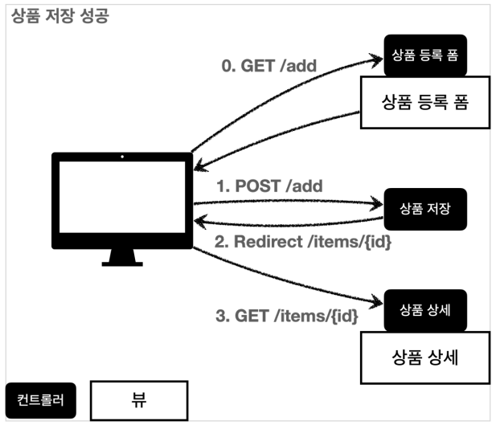
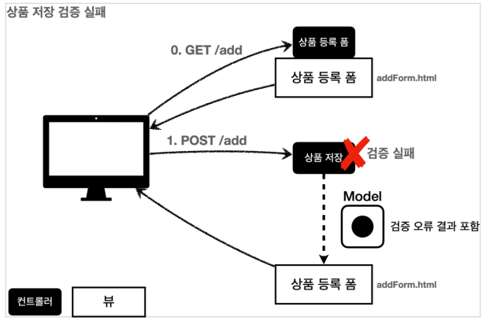
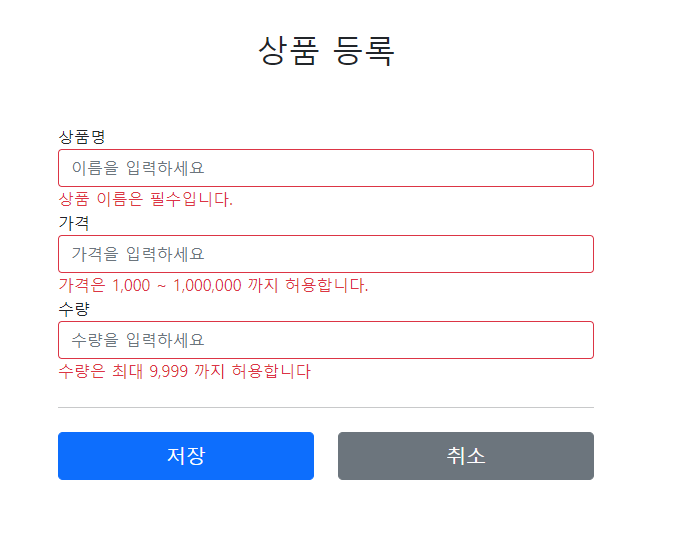
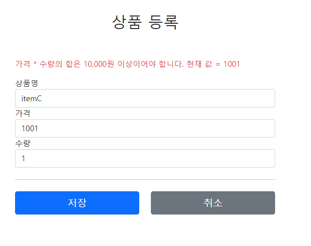

# 10. 검증1 - Validation

## 검증 요구사항

지금까지 만들었던 상품 관리 시스템에 새로운 로직을 추가한다.

### 요구사항: 검증 로직 추가
- 타입 검증
    - 가격, 수량에 문자가 들어가면 검증 오류 처리
- 필드 검증
    - 상품명: 필수, 공백X
    - 가격: 1000원 이상, 1백만원 이하
    - 수량: 최대 9999
- 특정 필드의 범위를 넘어서는 검증
    - 가격 * 수량의 합은 10,000원 이상

지금까지 만든 웹 어플리케이션은 폼 입력시 숫자를 문자로 작성하거나해서 검증 오류가 발생하면 오류 화면으로 바로 이동한다.  


웹 서비스는 폼 입력시 오류가 발생하면, 고객이 입력한 데이터를 유지한 상태로 어떤 오류가 발생했는지 친절하게 알려주어야 한다.

## 참고
- 클라이언트 검증은 조작할 수 있으므로 보안에 취약하다.
- 서버만으로 검증하면, 즉각적인 고객 사용성이 부족하다.
- 둘을 적절히 섞어서 사용하되, 최종적으로 서버 검증은 필수다.
- API 방식을 사용하면 API 스펙을 잘 정의해서 검증 오류를 API 응답 결과를 잘 남겨주어야 한다.

---

## 검증 직접 처리 - 소개

**상품 저장 성공**  


사용자가 상품 등록 폼에서 정상 범위의 데이터를 입력하면,  
서버에서는 검증 로직이 통과하고, 상품을 저장하고, 상품 상세화면으로 redirect한다.

**상품 저장 검증 실패**  


서버 검증 로직에 실패했을 경우 고객에게 다시 상품 등록 폼을 보여주고, 어떤 값을 잘못 입력했는지 친절하게 알려주어야 한다.

---

## 검증 직접 처리 - 개발

### 상품 등록 검증

**ValidationItemControllerV1 - addItem() 수정**
```java
@PostMapping("/add")
public String addItem(@ModelAttribute Item item, RedirectAttributes redirectAttributes, Model model) {

    //검증 오류 결과를 보관
    Map<String, String> errors = new HashMap<>();

    //검증 로직
    if (!StringUtils.hasText(item.getItemName())) {
        errors.put("itemName", "상품 이름은 필수입니다.");
    }
    if (item.getPrice() == null || item.getPrice() < 1000 || item.getPrice() > 1000000) {
        errors.put("price", "가격은 1,000 ~ 1,000,000 까지 허용합니다.");
    }
    if (item.getQuantity() == null || item.getQuantity() >= 9999) {
        errors.put("quantity", "수량은 최대 9,999 까지 허용합니다");
    }

    //특정 필드가 아닌 복합 룰 검증
    if (item.getPrice() != null && item.getQuantity() != null) {
        int resultPrice = item.getPrice() * item.getQuantity();
        if (resultPrice < 10000) {
            errors.put("globalError", "가격 * 수량의 합은 10,000원 이상이어야 합니다. 현재 값 = " + resultPrice);
        }
    }

    //검증에 실패하면 다시 입력 폼으로
    if (!errors.isEmpty()) {
        model.addAttribute("errors", errors);
        return "validation/v1/addForm";
    }

    //성공 로직
    Item savedItem = itemRepository.save(item);
    redirectAttributes.addAttribute("itemId", savedItem.getId());
    redirectAttributes.addAttribute("status", true);
    return "redirect:/validation/v1/items/{itemId}";
}
```

검증시 오류가 발생하면 Map errors에 담아둔다. 이때 어떤 필드에서 오류가 발생했는지 구분하기 위해 오류가 발생한 필드명을 key로 사용한다.  
이후 뷰에서 이 데이터를 사용해서 고객에게 친절한 오류 메시지를 출력할 수 있다.

```java
//특정 필드가 아닌 복합 룰 검증
if (item.getPrice() != null && item.getQuantity() != null) {
    int resultPrice = item.getPrice() * item.getQuantity();
    if (resultPrice < 10000) {
        errors.put("globalError", "가격 * 수량의 합은 10,000원 이상이어야 합니다. 현재 값 = " + resultPrice);
    }
}
```

특정 필드를 넘어서는 오류를 처리해야 할 수도 있다.  
이 대는 필드 이름을 넣을 수 없으므로 globalError라는 key를 사용한다.

```java
//검증에 실패하면 다시 입력 폼으로
if (!errors.isEmpty()) {
    model.addAttribute("errors", errors);
    return "validation/v1/addForm";
}
```

만약 검증에서 오류 메시지가 하나라도 있으면 오류 메시지를 출력하기 위해 model, errors를 담고, 입력 폼이 있는 뷰 템플릿으로 보낸다.

#

**addForm.html**
```html
<!DOCTYPE HTML>
<html xmlns:th="http://www.thymeleaf.org">
<head>
    <meta charset="utf-8">
    <link th:href="@{/css/bootstrap.min.css}"
          href="../css/bootstrap.min.css" rel="stylesheet">
    <style>
        .container {
            max-width: 560px;
        }
        .field-error {
            border-color: #dc3545;
            color: #dc3545;
        }
    </style>
</head>
<body>

<div class="container">

    <div class="py-5 text-center">
        <h2 th:text="#{page.addItem}">상품 등록</h2>
    </div>

    <form action="item.html" th:action th:object="${item}" method="post">
        <div th:if="${errors?.containsKey('globalError')}">
            <p class="field-error" th:text="${errors['globalError']}">전체 오류 메시지</p>
        </div>

        <div>
            <label for="itemName" th:text="#{label.item.itemName}">상품명</label>
            <input type="text" id="itemName" th:field="*{itemName}"
                   th:classappend="${errors?.containsKey('itemName')} ? 'field-error' : _"
                   class="form-control" placeholder="이름을 입력하세요">
            <div class="field-error" th:if="${errors?.containsKey('itemName')}" th:text="${errors['itemName']}">
                상품명 오류
            </div>
        </div>
        <div>
            <label for="price" th:text="#{label.item.price}">가격</label>
            <input type="text" id="price" th:field="*{price}"
                   th:classappend="${errors?.containsKey('price')} ? 'field-error' : _"
                   class="form-control" placeholder="가격을 입력하세요">
            <div class="field-error" th:if="${errors?.containsKey('price')}" th:text="${errors['price']}">
                가격 오류
            </div>
        </div>
        <div>
            <label for="quantity" th:text="#{label.item.quantity}">수량</label>
            <input type="text" id="quantity" th:field="*{quantity}"
                   th:classappend="${errors?.containsKey('quantity')} ? 'field-error' : _"
                   class="form-control" placeholder="수량을 입력하세요">
            <div class="field-error" th:if="${errors?.containsKey('quantity')}" th:text="${errors['quantity']}">
                수량 오류
            </div>
        </div>

        <hr class="my-4">

        <div class="row">
            <div class="col">
                <button class="w-100 btn btn-primary btn-lg" type="submit" th:text="#{button.save}">상품 등록</button>
            </div>
            <div class="col">
                <button class="w-100 btn btn-secondary btn-lg"
                        onclick="location.href='items.html'"
                        th:onclick="|location.href='@{/validation/v1/items}'|"
                        type="button" th:text="#{button.cancel}">취소</button>
            </div>
        </div>

    </form>

</div> <!-- /container -->
</body>
</html>
```

**css 추가**
```html
.field-error {
    border-color: #dc3545;
    color: #dc3545;
}
```

**글로벌 오류 메시지**
```html
<div th:if="${errors?.containsKey('globalError')}">
    <p class="field-error" th:text="${errors['globalError']}">전체 오류 메시지</p>
</div>
```
오류 메시지는 errors에 내용이 있을 때만 출력하면 된다. 타임리프의 th:if를 사용하면 조건에 만족할 때만 HTML태그를 출력할 수 있다.  



**필드 오류 처리**
```html
<input type="text" id="quantity" th:field="*{quantity}"
                   th:classappend="${errors?.containsKey('quantity')} ? 'field-error' : _"
                   class="form-control" placeholder="수량을 입력하세요">
```

classappend를 사용해서 해당 필드에 오류가 있으면 field-error라는 클래스 정보를 더해서 폼의 색깔을 빨간색으로 강조한다  
만약 없으면 \_(No-Operation)을 사용해서 아무것도 하지 않는다.

**필드 오류 처리-메시지**
```html
<div class="field-error" th:if="${errors?.containsKey('itemName')}" th:text="${errors['itemName']}">
    상품명 오류
</div>
```


### 핵심
- 만약 검증 오류가 발생하면 입력 폼을 다시 보여준다.
- 검증 오류들을 고객에게 친절하게 안내해서 다시 입력할 수 있게 한다.
- 검증 오류가 발생해도 고객이 입력한 데이터가 유지된다.

---

### Reference
- [스프링 MVC 2편 - 백엔드 웹 개발 핵심 기술](https://www.inflearn.com/course/%EC%8A%A4%ED%94%84%EB%A7%81-mvc-2/dashboard)


