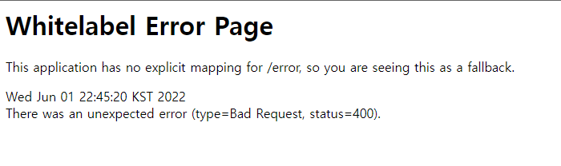

# Validation



웹 서비스는 고객이 잘못된 데이터를 전송하거나 오류가 발생하면  
`고객이 입력한 데이터를 유지`한 상태로 `친절한 오류 메시지`를 고객에게 보여줄 수 있어야 한다.

### 서버와 클라이언트 모두 데이터 검증을 해야 하는 이유

- 클라이언트 검증은 데이터를 조작할 수 있으므로 보안에 취약하다.
- 서버에서만 검증하면, 즉각적인 고객 사용성이 부족하다.
- 둘을 적절히 섞어서 사용하되, 최종적으로 서버 검증은 필수다.
- API 방식을 사용하면, API 스펙을 잘 정의해서 오류 정보를 API 응답 결과에 잘 넘겨주어야 한다.

---

## 로직 흐름

### 상품 저장 성공


사용자가 상품 등록 폼에서 정상 데이터를 입력하면  
서버에서는 검증 로직이 통과하고 상품을 저장, 상품 상세화면으로 redirect한다.

### 상품 저장 검증 실패


서버 검증 로직에 실패했을 경우   
`검증 오류 정보`와 `고객이 입력한 데이터`를 모델에 담아서  
어떤 값을 잘못 입력했는지 친절한 오류 메시지를 상품 등록 폼과 함께 고객에게 다시 보여준다.  

---

## 검증 직접 구현

### 상품 등록 검증

**ValidationItemControllerV1 - addItem() 수정**
```java
@PostMapping("/add")
public String addItem(@ModelAttribute Item item, RedirectAttributes redirectAttributes, Model model) {

    //검증 오류 결과를 보관
    Map<String, String> errors = new HashMap<>();

    //검증 로직
    if (!StringUtils.hasText(item.getItemName())) {
        errors.put("itemName", "상품 이름은 필수입니다.");
    }
    if (item.getPrice() == null || item.getPrice() < 1000 || item.getPrice() > 1000000) {
        errors.put("price", "가격은 1,000 ~ 1,000,000 까지 허용합니다.");
    }
    if (item.getQuantity() == null || item.getQuantity() >= 9999) {
        errors.put("quantity", "수량은 최대 9,999 까지 허용합니다");
    }

    //특정 필드가 아닌 복합 룰 검증
    if (item.getPrice() != null && item.getQuantity() != null) {
        int resultPrice = item.getPrice() * item.getQuantity();
        if (resultPrice < 10000) {
            errors.put("globalError", "가격 * 수량의 합은 10,000원 이상이어야 합니다. 현재 값 = " + resultPrice);
        }
    }

    //검증에 실패하면 다시 입력 폼으로
    if (!errors.isEmpty()) {
        model.addAttribute("errors", errors);
        return "validation/v1/addForm";
    }

    //성공 로직
    Item savedItem = itemRepository.save(item);
    redirectAttributes.addAttribute("itemId", savedItem.getId());
    redirectAttributes.addAttribute("status", true);
    return "redirect:/validation/v1/items/{itemId}";
}
```

검증 오류 정보를 Map에 보관한다.  
`@ModelAttribute` 어노테이션 덕분에 사용자가 입력한 데이터 Item은 자동으로 모델에 담긴다.  

만약 검증에 하나라도 실패해서 Map이 비어있지 않다면  
모델에 Map을 담고 상품 등록 폼에 `사용자가 입력한 데이터와 오류 검증 정보를 함께 전달`한다.

#  

### 필드 오류 처리


```html
<div>
    <label for="quantity" th:text="#{label.item.quantity}">수량</label>
    <input type="text" id="quantity" th:field="*{quantity}"
        th:class="${errors?.containsKey('quantity')} ? 'form-control field-error' : 'form-control'"
        class="form-control" placeholder="수량을 입력하세요">

        <div class="field-error" th:if="${errors?.containsKey('quantity')}" th:text="${errors['quantity']}">
            수량 오류
        </div>
</div>
```

뷰에서 모델에 담긴 검증 오류 정보 Map을 사용할 수 있다.    
`${errors?.containsKey('quantity')}`만족하는 오류가 있다면 해당하는 오류 메시지 HTML 태그를 출력하면 된다.

### 글로벌 오류 메시지


```html
<div th:if="${errors?.containsKey('globalError')}">
    <p class="field-error" th:text="${errors['globalError']}">전체 오류 메시지</p>
</div>
```

오류 메시지는 errors에 내용이 있을 때만 출력하면 된다. `th:if`를 사용해서 조건에 만족할 때만 HTML태그를 출력할 수 있다.

---

### Reference
- [스프링 MVC 2편 - 백엔드 웹 개발 핵심 기술](https://www.inflearn.com/course/%EC%8A%A4%ED%94%84%EB%A7%81-mvc-2/dashboard)
