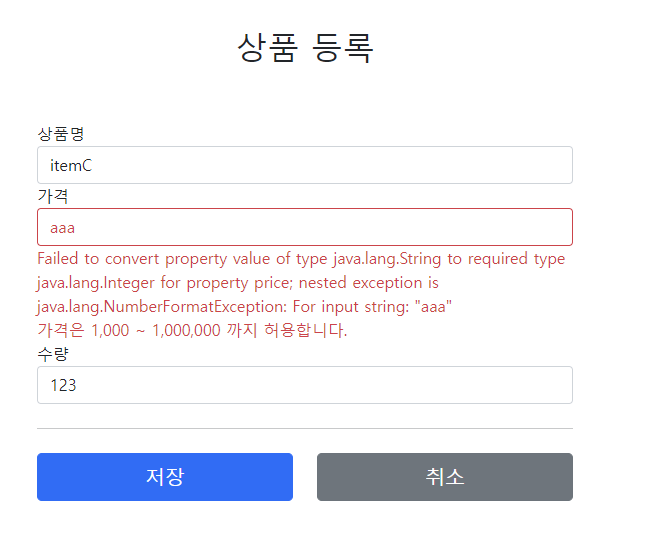

# Validation

[TIL: Validation - 직접 구현](https://github.com/seokmyungham/TIL/blob/main/SpringMVC/validation_01.md)

검증 로직을 직접 구현할 시 여러가지 불편함이 존재한다.  
  
`@ModelAttribute` 바인딩 과정에서 타입 오류가 발생하면  
`컨트롤러에 진입하기도 전에 예외가 발생`하기 때문에 컨트롤러가 호출되지 않아서 검증을 제대로 다루기가 어렵다.  

또한 바인딩 자체가 불가능하기 때문에 오류가 발생했을 때  
`고객의 데이터를 보관할 수 없고` 고객은 본인이 어떤 내용을 잘못 입력했는지 확인을 할 수 없다.  

따라서 고객이 잘못 입력한 값도 어딘가에 별도로 관리 되어야 할 필요가 있다.

---

## BindingResult

```java
@PostMapping("/add")
public String addItemV2(@ModelAttribute Item item, BindingResult bindingResult, RedirectAttributes redirectAttributes) {

    if (!StringUtils.hasText(item.getItemName())) {
        bindingResult.addError(new FieldError("item", "itemName", item.getItemName(), false, null, null, "상품 이름은 필수입니다."));
    }
    if (item.getPrice() == null || item.getPrice() < 1000 || item.getPrice() > 1000000) {
        bindingResult.addError(new FieldError("item", "price", item.getPrice(), false, null, null, "가격은 1,000 ~ 1,000,000 까지 허용합니다."));
    }
    if (item.getQuantity() == null || item.getQuantity() >= 9999) {
        bindingResult.addError(new FieldError("item", "quantity", item.getQuantity(), false, null, null, "수량은 최대 9,999 까지 허용합니다."));
    }
        
    if (item.getPrice() != null && item.getQuantity() != null) {
        int resultPrice = item.getPrice() * item.getQuantity();
        if (resultPrice < 10000) {
            bindingResult.addError(new ObjectError("item", null, null, "가격 * 수량의 합은 10,000원 이상이어야 합니다. 현재 값 = " + resultPrice));
        }
    }

    //모델에 BindingResult 자동 추가
    if (bindingResult.hasErrors()) {
        log.info("errors={}", bindingResult);
        return "validation/v2/addForm";
    }

    //성공 로직
    Item savedItem = itemRepository.save(item);
    redirectAttributes.addAttribute("itemId", savedItem.getId());
    redirectAttributes.addAttribute("status", true);
    return "redirect:/validation/v2/items/{itemId}";
}
```

스프링은 오류 처리 방법으로 `BindingResult` 인터페이스를 제공한다.  
`BindingResult`는 `Errors` 인터페이스를 상속 받고 있으며 실제 구현체는 `BeanPropertyBindingResult`이다.  
`Errors` 인터페이스는 단순한 기능만 제공하기 때문에, 주로 관례상 `BindingResult`를 많이 사용한다.  
  
`BindingResult`를 사용하면 `@ModelAttribute` 데이터 바인딩 시 오류가 발생해도 컨트롤러가 호출된다.  
  
또한 객체 타입 오류 등으로 바인딩에 실패할 경우 스프링은 자동으로 `BindingResult`에 에러를 생성해서 넣어준다.  
따라서 개발자는 단순 데이터 검증과 비즈니스 검증 중에 위 코드와 같이 비즈니스 검증에 더 집중할 수 있다.

**BindingResult 파라미터의 위치는 @ModelAttribute Item item 다음에 와야 한다.**
 
#

### FieldError 생성자
```java
public FieldError(String objectName, String field, String defaultMessage);
public FieldError(String objectName, String field, @Nullable Object 
rejectedValue, boolean bindingFailure, @Nullable String[] codes, @Nullable
Object[] arguments, @Nullable String defaultMessage)
```

`FieldError`는 두 가지 생성자를 제공한다.  

- `objectName`: @ModelAttribute 이름, 오류가 발생한 객체 이름
- `field`: 오류가 발생한 필드
- `rejectedValue`: 검증에 실패한 값
- `bindingFailure`: 바인딩 실패인지, 비즈니스 검증 실패인지 구분 T/F
- `codes`: 메시지 코드
- `arguments`: 메시지에서 사용하는 인자
- `defaultMessage`: 오류 기본 메시지

위 파라미터 중 `rejectedValue`가 검증 실패시 사용자 입력 값을 저장하는 역할을 한다.  
`rejectedValue` 덕분에 바인딩에 실패하거나 비즈니스 검증에 실패할 경우 사용자 입력 값을 보관했다가 화면에 출력할 수 있다.  
  
스프링은 바인딩에 실패할 경우  
자동으로 사용자 입력 값과 `bindingFailure`가 True인 FieldError를 생성해서 `bindingResult`에 담아준다.

#

### ObjectError 생성자
```java
public ObjectError(String objectName, String defaultMessage);
public ObjectError(String objectName, @Nullable String[] codes, @Nullable
Object[] arguments, @Nullable String defaultMessage)
```

특정 필드를 넘어서는 오류가 있으면 ObjectError 객체를 생성해서 bindingResult에 담으면 된다.
- `objectName`: @ModelAttribute 이름
- `codes`: 메시지 코드
- `arguments`: 메시지에서 사용하는 인자
- `defaultMessage`: 오류 기본 메시지

---
 
### 글로벌 오류 처리

타임리프는 스프링의 `BindingResult`를 를 활용해서 편리하게 검증 오류를 표헌할 수 있도록 기능을 제공한다.

```html
<div th:if="${#fields.hasGlobalErrors()}">
    <p class="field-error" th:each="err : ${#fields.globalErrors()}" th:text="${err}">전체 오류 메시지</p>
</div>
```

`#fields`를 사용해서 `BindingResult`가 제공하는 검증 오류에 접근할 수 있다.  
`th:each`를 사용해서 글로벌 오류가 여러개일 경우 오류에 순차적으로 접근해서 모두 출력한다.

#

### 필드 오류 처리



```html
<input type="text" id="itemName" th:field="*{itemName}"
    th:errorclass="field-error" class="form-control" placeholder="이름을 입력하세요">
<div class="field-error" th:errors="*{itemName}">
    상품명 오류
</div>
```

`th:field`는 정상 상황일 시 모델 객체의 값을 사용하고 오류가 발생하면 `FieldError`에서 보관한 값을 사용해서 값을 출력한다.  
  
`th:errors`를 사용해서 해당 필드에 오류가 있는 경우 태그를 출력한다.  
`th:errorsclass`는 `th:field`에서 지정한 필드에 오류가 있으면 class 정보를 추가한다.

---

### Reference
- [스프링 MVC 2편 - 백엔드 웹 개발 핵심 기술](https://www.inflearn.com/course/%EC%8A%A4%ED%94%84%EB%A7%81-mvc-2/dashboard)
