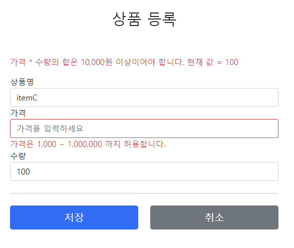

# 10.검증1 - Validation

앞에서 만들었던 검증 시스템은 몇 가지 문제점이 존재한다.  
- 뷰 템플릿에서 중복처리가 너무 많다.
- 타입 오류 처리가 안된다. Item의 price, quantity같은 숫자 필드는 타입이 Integer이므로 문자 타입으로 설정하는 것이 불가능하다.
- Item의 price에 문자를 입력하는 것 처럼 타입 오류가 발생해도 고객이 입력한 문자를 화면에 남겨야 한다.

이 문제점들을 해결해보면서 스프링이 제공하는 검증 방법을 하나씩 알아보자.

---

## BindingResult 1

스프링이 제공하는 검증 오류 처리방법을 알아보자. 여기서 핵심은 BindingResult이다.

```java
@PostMapping("/add")
public String addItemV1(@ModelAttribute Item item, BindingResult bindingResult, RedirectAttributes redirectAttributes) {

    if (!StringUtils.hasText(item.getItemName())) {
        bindingResult.addError(new FieldError("item", "itemName", "상품 이름은 필수입니다."));
    }
    if (item.getPrice() == null || item.getPrice() < 1000 || item.getPrice() > 1000000) {
        bindingResult.addError(new FieldError("item", "price", "가격은 1,000 ~ 1,000,000 까지 허용합니다."));
    }
    if (item.getQuantity() == null || item.getQuantity() >= 9999) {
        bindingResult.addError(new FieldError("item", "quantity", "수량은 최대 9,999 까지 허용합니다."));
    }
        
    if (item.getPrice() != null && item.getQuantity() != null) {
        int resultPrice = item.getPrice() * item.getQuantity();
        if (resultPrice < 10000) {
            bindingResult.addError(new ObjectError("item", "가격 * 수량의 합은 10,000원 이상이어야 합니다. 현재 값 = " + resultPrice));
        }
    }

    if (bindingResult.hasErrors()) {
        log.info("errors={}", bindingResult);
        return "validation/v2/addForm";
    }

    //성공 로직
    Item savedItem = itemRepository.save(item);
    redirectAttributes.addAttribute("itemId", savedItem.getId());
    redirectAttributes.addAttribute("status", true);
    return "redirect:/validation/v2/items/{itemId}";
}
```

BindingResult bindingResult 파라미터의 위치는 @ModelAttribute Item item 다음에 와야 한다.
 
#

### FieldError 생성자
```java
public FieldError(String objectName, String field, String defaultMessage) {}
```

필드에 오류가 있으면 FieldError 객체를 생성해서 bindingResult 에 담아두면 된다.
- objectName: @ModelAttribute 이름
- field: 오류가 발생한 필드 이름
- defaultMessage: 오류 기본 메시지

#

### ObjectError 생성자
```java
public ObjectError(String objectName, String defaultMessage) {}
```

특정 필드를 넘어서는 오류가 있으면 ObjectError 객체를 생성해서 bindingResult 에 담아두면 된다
- objectName: @ModelAttribute 이름
- defaultMessage: 오류 기본 메시지

#

### addForm 수정

```html
<form action="item.html" th:action th:object="${item}" method="post">
    
        <div th:if="${#fields.hasGlobalErrors()}">
            <p class="field-error" th:each="err : ${#fields.globalErrors()}"
            th:text="${err}">전체 오류 메시지</p>
        </div>

        <div>
            <label for="itemName" th:text="#{label.item.itemName}">상품명</label>
            <input type="text" id="itemName" th:field="*{itemName}"
                   th:errorclass="field-error" class="form-control"
                   placeholder="이름을 입력하세요">
            <div class="field-error" th:errors="*{itemName}">
                상품명 오류
            </div>
        </div>
        <div>
            <label for="price" th:text="#{label.item.price}">가격</label>
            <input type="text" id="price" th:field="*{price}"
                   th:errorclass="field-error" class="form-control"
                   placeholder="가격을 입력하세요">
            <div class="field-error" th:error="*{price}">
                가격 오류
            </div>
        </div>
        <div>
            <label for="quantity" th:text="#{label.item.quantity}">수량</label>
            <input type="text" id="quantity" th:field="*{quantity}"
                   th:errorclass="field-error" class="form-control"
                   placeholder="수량을 입력하세요">
            <div class="field-error" th:error="*{quantity}">
                수량 오류
            </div>
        </div>
```

### 타임리프 스프링 검증 오류 통합 기능
타임리프는 스프링의 BindingResult를 활용해서 편리하게 검증 오류를 표현하는 기능을 제공한다.
- #fields: #fields로 BindingResult가 제공하는 검증 오류에 접근할 수 있다.
- th:errors: 해당 필드에 오류가 있는 경우에 태그를 출력한다. th:if의 편의 버전이다.
- th:errorclass: th:field에서 지정한 필드에 오류가 있으면 class정보를 추가한다.

#

- 검증과 오류 메시지 공식 메뉴얼
    - [https://www.thymeleaf.org/doc/tutorials/3.0/thymeleafspring.html#validation-and-error-messages](https://www.thymeleaf.org/doc/tutorials/3.0/thymeleafspring.html#validation-and-error-messages)

---

## BindingResult 2

스프링이 제공하는 검증 오류를 보관하는 객체이다. 검증 오류가 발생하면 여기에 보관하면 된다.  
BindingResult가 있으면 @ModelAttribute에 데이터 바인딩 시 오류가 발생해도 컨트롤러가 호출된다.

### @ModelAttribute에 바인딩 시 타입 오류가 발생하면?
- BindingResult가 없으면 -> 400 오류가 발생하면서 컨트롤러가 호출되지 않고, 오류 페이지로 이동한다.
- BindingResult가 있으면 -> 오류 정보(FieldError)를 BindingResult에 담아서 컨트롤러를 정상 호출한다.

숫자가 입력되어야 할 곳에 문자를 입력해서 타입을 다르게해서 BindingResult를 호출하고 bindingResult의 값을 확인해보자  


**주의**
- BindingResult는 검증할 대상 바로 다음에 와야한다.
- BindingResult는 Model에 자동으로 포함된다.

---

## FieldError, ObjectError

  
현재 오류가 발생하는 경우 고객이 입력한 내용이 모두 사라진다. 이 문제도 해결해보자

### addItemV2

```java
@PostMapping("/add")
public String addItemV2(@ModelAttribute Item item, BindingResult bindingResult, RedirectAttributes redirectAttributes) {

    if (!StringUtils.hasText(item.getItemName())) {
        bindingResult.addError(new FieldError("item", "itemName", item.getItemName(), false, null, null, "상품 이름은 필수입니다."));
    }

    if (item.getPrice() == null || item.getPrice() < 1000 || item.getPrice() > 1000000) {
        bindingResult.addError(new FieldError("item", "price", item.getPrice(), false, null, null, "가격은 1,000 ~ 1,000,000 까지 허용합니다."));
    }

    if (item.getQuantity() == null || item.getQuantity() > 10000) {
        bindingResult.addError(new FieldError("item", "quantity", item.getQuantity(), false, null, null, "수량은 최대 9,999 까지 허용합니다."));
    }

    if (item.getPrice() != null && item.getQuantity() != null) {
        int resultPrice = item.getPrice() * item.getQuantity();
        if (resultPrice < 10000) {
            bindingResult.addError(new ObjectError("item", null, null, "가격 * 수량의 합은 10,000원 이상이어야 합니다. 현재 값 = " + resultPrice));
        }
    }

    if (bindingResult.hasErrors()) {
        log.info("errors={}", bindingResult);
        return "validation/v2/addForm";
    }

    Item savedItem = itemRepository.save(item);
    redirectAttributes.addAttribute("itemId", savedItem.getId());
    redirectAttributes.addAttribute("status", true);
    return "redirect:/validation/v2/items/{itemId}";
}
```

### FieldError 생성자

FieldError는 두 가지 생성자를 제공한다.

```java
public FieldError(String objectName, String field, String defaultMessage);

public FieldError(String objectName, String field, @Nullable Object rejectedValue,
                  boolean bindingFailure, @Nullable String[] codes, @Nullable Object[] arguments, @Nullable String defaultMessage)
```

파라미터 목록
- objectName: 오류가 발생한 객체 이름
- field: 오류 필드
- rejectedValue: 사용자가 입력한 값(거절된 값)
- bindingFailure: 타입 오류 같은 바인딩 실패인지, 검증 실패인지 구분 값
- codes: 메시지 코드
- arguments: 메시지에서 사용하는 인자
- defaultMessage: 기본 오류 메시지

#

### 오류 발생시 사용자 입력 값 유지

가격에 숫자가 아닌 문자가 입력된다면 가격은 Integer 타입이므로 입력한 문자를 보관할 수 있는 방법이 없다.  
그래서 오류가 발생한 경우 사용자 입력 값을 보관하는 별도의 방법이 필요하다.  
FieldError는 오류 발생시 사용자 입력 값을 저장하는 기능을 제공한다.  
  
파라미터 중 rejectedValue가 바로 오류 발생시 사용자 입력 값을 저장하는 필드다.  
bindingFailure는 타입 오류 같은 바인딩이 실패했는지 여부를 적어주면 된다. 여기서는 바인딩이 실패한 것은 아니기 때문에 false를 사용한다.

### 타임리프의 사용자 입력 값 유지
```html
th:field="*{price}"
```
타임리프의 th:field는 매우 똑똑하게 동작하는데, 정상 상황에는 모델 객체의 값을 사용하지만,  
오류가 발생하면 FieldError에서 보관한 값을 사용해서 값을 출력한다.

### 스프링의 바인딩 오류 처리

타입 오류로 바인딩에 실패하면 스프링은 FieldError를 생성하면서 사용자가 입력한 값을 넣어둔다.  
그리고 해당 오류를 BindingResult에 담아서 컨트롤러를 호출한다.  
따라서 타입 오류 같은 바인딩 실패시에도 사용자의 오류 메시지를 정상 출력할 수 있다.

---

### Reference
- [스프링 MVC 2편 - 백엔드 웹 개발 핵심 기술](https://www.inflearn.com/course/%EC%8A%A4%ED%94%84%EB%A7%81-mvc-2/dashboard)
