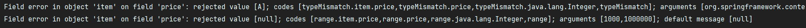
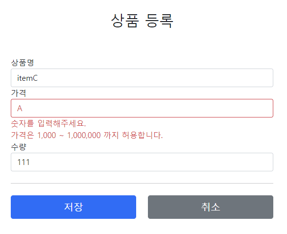

# Validation

스프링은 오류 코드로 메시지 코드를 선택할 때 일련의 규칙을 사용한다.  
이 규칙은 `MessageCodesResolver` 인터페이스를 통해 이루어지며 개발자는 메시지 공통 전략을 편리하게 도입할 수 있다.

---

## MessageCodesResolver

```java
public class MessageCodesResolverTest {
    MessageCodesResolver codesResolver = new DefaultMessageCodesResolver();
    
    @Test
    void messageCodesResolverObject() {
        String[] messageCodes = codesResolver.resolveMessageCodes("required", "item");
        assertThat(messageCodes).containsExactly("required.item", "required");
    }

    @Test
    void messageCodesResolverField() {
        String[] messageCodes = codesResolver.resolveMessageCodes("required", "item", "itemName", String.class);
        assertThat(messageCodes).containsExactly(
                "required.item.itemName",
                "required.itemName",
                "required.java.lang.String",
                "required"
        );
    }
}
```

인터페이스 `MessageCodesResolver`는 기본 구현체로  
`DefaultMessageCodesResolver`를 사용하고 주어진 오류 코드, 오브젝트 이름, 필드 이름 및 기타 정보를 기반으로 실제 메시지 코드를 생성한다.  

위 테스트 코드를 보면 `MessageCodesResolver`는 `required` 오류 코드와 `item` 객체 이름을 기반으로  
`required.item`, `required` 오류 코드를 생성하는 것을 알 수 있고, 필드 오류도 마찬가지로 구체적인 오류 코드에서 덜 구체적인 오류 코드를 생성하는 것을 알 수 있다.  

`rejectValue()`, `reject()` 내부에서 `MessageCodesResolver`를 사용하여 오류 코드를 생성하고  
이렇게 생성된 오류 코드를 `FieldError`, `ObjectError`에서 보관한다.

#

### 메시지 생성 규칙

- 객체 오류의 경우 다음 순서로 2가지 생성
    - 1: `code + "." + object name`
    - 2: `code`
- 필드 오류의 경우 다음 순서로 4가지 메시지 코드 생성
    - 1: `code + "." + object name + "." + field`
    - 2: `code + "." + field`
    - 3: `code + "." + field type`
    - 4: `code`

핵심은 구체적인 것에서 덜 구체적인 것으로 오류 코드가 생성되고 관리된다는 것이다.  

#

검증 오류 코드 중 스프링이 직접 추가한 오류 코드도 존재한다. 
바로 `typeMismatch`와 같은 경우인데, 바인딩 과정에서 자료형이 일치하지 않을 경우 스프링은 `typeMismatch` 검증 오류 코드들을 생성한다.  
그리고 오류 메시지가 정의되어 있지 않으면 스프링이 생성한 기본 메시지를 출력한다.  

Integer `price` 필드에 문자를 입력하고 로그를 확인해보면 
`BindingResult`에 `FieldError`가 담겨있고, 다음과 같은 메시지 코드들이 생성된 것을 확인할 수 있다.



- `typeMismatch.item.price`
- `typeMismatch.price`
- `typeMismatch.java.lang.Integer`
- `typeMismatch`
  
error.properties에 typeMismatch에 관한 메시지 코드를 추가해서 원하는 메시지를 사용할 수 있다.

```properties
typeMismatch.java.lang.Integer=숫자를 입력해주세요.
typeMismatch=타입 오류입니다.
```



#

### 오류 코드 관리 전략

모든 오류 코드에 대해 메시지를 각각 다 정의하면 관리하기 힘들어진다.  
크게 중요하지 않은 메시지는 `required`, `range` 같은 범용성 있는 메시지로 끝내고  
`고객에게 알려야 하는 중요한 메시지는 구체적`으로 적어서 사용하는 방식이 가장 효과적이다.  

```properties
#==ObjectError==
#Level1
totalPriceMin.item=상품의 가격 * 수량의 합은 {0}원 이상이어야 합니다. 현재 값 = {1}

#Level2
totalPriceMin=전체 가격은 {0}원 이상이어야 합니다. 현재 값 = {1}


#==FieldError==
#Level1
required.item.itemName=상품 이름은 필수입니다.
range.item.price=가격은 {0} ~ {1} 까지 허용합니다.
max.item.quantity=수량은 최대 {0}까지 허용합니다.

#Level2 - 생략

#Level3
required.java.lang.String = 필수 문자입니다.
required.java.lang.Integer = 필수 숫자입니다.
min.java.lang.String = {0} 이상의 문자를 입력해주세요.
min.java.lang.Integer = {0} 이상의 숫자를 입력해주세요.
range.java.lang.String = {0} ~ {1} 까지의 문자를 입력해주세요.
range.java.lang.Integer = {0} ~ {1} 까지의 숫자를 입력해주세요.
max.java.lang.String = {0} 까지의 문자를 허용합니다.
max.java.lang.Integer = {0} 까지의 숫자를 허용합니다.

#Level4
required = 필수 값 입니다.
min = {0} 이상이어야 합니다.
range = {0} ~ {1} 범위를 허용합니다.
max = {0} 까지 허용합니다.

typeMismatch.java.lang.Integer=숫자를 입력해주세요.
typeMismatch=타입 오류입니다.
```

이렇게 오류 코드와 메시지를 단계별로 체계적으로 관리하면  
오류 메시지를 변경해야 할 경우, 수 십개의 비즈니스 오류 코드 로직을 변경하지 않고 해당 메시지만 변경할 수 있다.  
  
또한 범용성을 고려하여 구체적인 오류 메시지와 덜 구체적인 오류 메시지를 효율적으로 사용하는 것이 중요하다.

---

### Reference
- [스프링 MVC 2편 - 백엔드 웹 개발 핵심 기술](https://www.inflearn.com/course/%EC%8A%A4%ED%94%84%EB%A7%81-mvc-2/dashboard)
