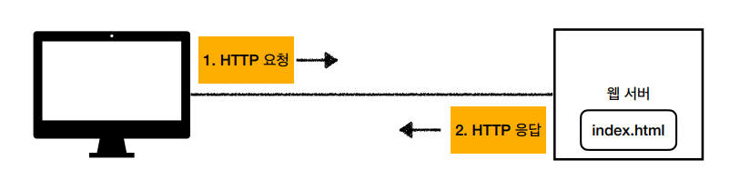
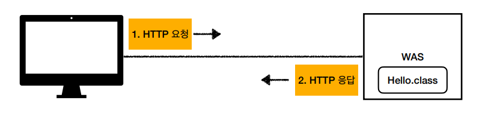
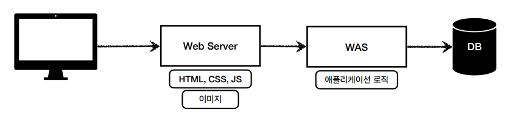
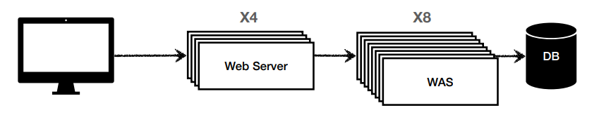

# 웹 애플리케이션 이해

## 웹 서버, 웹 애플리케이션 서버

클라이언트와 서버는 인터넷을 통해 정보를 주고 받는데  
이 과정에서 클라이언트는 서버에게 정보를 요청하고, 서버는 클라이언트의 요청에 대해 응답을 반환한다.  

이러한 모든 상호작용은 HTTP 프로토콜을 통해 이루어지며  
요청과 응답 데이터 모두 HTTP 메시지를 이용하여 효율적으로 이동하게 된다.  

[HTTP에 대한 자세한 설명](https://github.com/seokmyungham/TIL/blob/main/Http/http_basic.md)

### 웹 서버 (Web Server)

웹 서버란 HTTP를 기반으로 동작하는 서버를 말한다.  
HTML, CSS, JS, IMG, VIDEO 같은 정적 리소스를 서빙하고 기타 부가기능을 제공한다.  
> NGINX, APACHE

#

### 웹 애플리케이션 서버 (Web Application Server)

웹 애플리케이션 서버란 웹 서버에 추가로 프로그램 코드를 실행해서 애플리케이션 로직을 수행하는 기능을 포함한다.  
서블릿, JSP, 스프링 MVC가 이러한 WAS 안에서 동작한다.  
> 톰캣, Jetty, Undertow  

#

### 웹 시스템 구성

`WAS`는 정적 리소스, 애플리케이션 로직까지 모두 제공하기 때문에 `WAS`, `DB` 만으로도 시스템을 구성할 수 있다.  
    
하지만 `WAS`가 너무 많은 일을 담당하게 되면 여러가지 부작용이 존재한다.  
- 서버 과부하 우려
- 가장 값비싼 애플리케이션 로직이 정적 리소스 때문에 수행이 어려울 가능성
- WAS 장애시 오류 화면 노출 불가

위와 같은 단점들 때문에 현재 웹 시스템 구성은  
정적 리소스를 앞 단에서 미리 처리도록 `Web Server`를 두는 형태를 많이 채택한다.  

`웹 서버`는 로직 수행과 같은 동적인 처리가 필요하면 `WAS`에 요청을 위임하고  
`WAS`는 가장 핵심인 애플리케이션 로직 처리만을 전담한다.  

그리고 `WAS`, `DB`에 장애가 발생해서 오류가 발생하게 되면 `웹 서버`가 제공하는 오류 화면을 사용자에게 보여줄 수 있다.

이러한 시스템 구성은 효율적인 리소스 관리를 하는데도 매우 유용하다.  
정적 리소스가 많이 사용되는 서비스의 경우 `웹 서버`를 증설하고, 애플리케이션 리소스가 많이 사용되면 `WAS 서버`를 늘리면 된다.

---
 
### Reference
- [스프링 MVC 1편 - 백엔드 웹 개발 핵심 기술](https://www.inflearn.com/course/%EC%8A%A4%ED%94%84%EB%A7%81-mvc-1/dashboard) 
