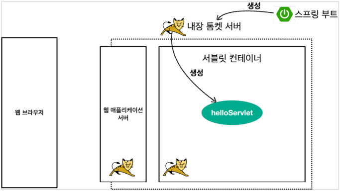
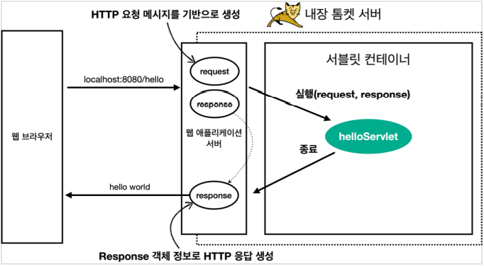

# 서블릿

## 서블릿이란?

개발자가 만약 웹 애플리케이션 서버를 직접 구현해야한다면 어떤일이 벌어질까?  
> 서버 TCP/IP 연결 대기, 소켓 연결  
> HTTP 요청 메시지를 파싱해서 읽기  
> POST 방식, /save URL 인지  
> Content-Type확인  
> HTTP 메시지 바디 내용 파싱  
> 저장 프로세스 실행  
>
> `비즈니스 로직 실행`  
>  
> HTTP 응답 메시지 생성 시작  
> TCP/IP에 응답 전달, 소켓 종료  

HTTP 요청 하나가 만약 들어왔다고 가정해보면, 위에 보이는 반복적인 모든 과정을 개발자가 구현해야한다.  
모든 개발자가 위의 공통된 로직을 구현하고 있다면 그건 너무 비생산적인 일 일것이다.  
그래서 `서블릿`이 등장하게 된다.  

HTTP 요청 메시지를 파싱하는 것 부터 자동으로 메시지를 생성해주는 일까지  
**서블릿은 위의 비즈니스 로직을 제외한 모든 일을 자동화해준다.**

#

## Spring Boot 서블릿 환경 구성

스프링 부트는 서블릿을 직접 등록해서 사용할 수 있도록 `@ServletComponenetScan`을 지원한다.

``` java
@ServletComponentScan //서블릿 자동 등록
@SpringBootApplication
public class ServletApplication {

	public static void main(String[] args) {
		SpringApplication.run(ServletApplication.class, args);
	}

}
```

### 서블릿 등록

```java
@WebServlet(name = "helloServlet", urlPatterns = "/hello")
public class HelloServlet extends HttpServlet {

    @Override
    protected void service(HttpServletRequest request, HttpServletResponse response) throws ServletException, IOException {
    ...
    }
}
```

`HttpServlet` 클래스를 상속받아서 서블릿을 만들 수 있다.  
  
HTTP 요청을 통해 매핑된 URL이 호출되면 서블릿 코드가 실행되고 서블릿 컨테이너는 service 메소드를 실행한다.  
이를 통해 HTTP 스펙을 매우 편리하게 사용할 수 있다.

#

### 서블릿 컨테이너란?

`서블릿`을 지원하는 `WAS`안에는 `서블릿 컨테이너`라는 것이 존재한다.  
`서블릿 컨테이너`는 서블릿을 상속받는 서블릿 객체를 `싱글톤`으로 자동 생성, 호출, 생명주기를 관리해주는 역할을 한다.  
  
> 일반적인 요청, 응답같은 경우, 고객마다 요청 응답이 다르기 때문에 항상 새로 생성해야 하는 것이 맞다.  
> 하지만 `서블릿`의 경우 고객의 요청이 올때마다 새로 생성할 필요가 있을까? 이는 매우 비효율 적일 것이다.  
> 
> 그래서 서블릿 컨테이너는 서블릿 객체를 최초 로딩 시점에 미리 싱글톤으로 만들어두고 재사용하는 방식을 사용한다.  
> 그리고 모든 고객의 요청은 동일한 서블릿 객체 인스턴스에 접근하고, 서블릿 객체는 서블릿 컨테이너 종료시 함께 종료된다.  
>
> 그래서 `공유 변수를 사용하지 않도록 주의`해야 한다.

#### 내장 톰켓 서버 생성


스프링 부트는 실행되면서 `내장 톰켓 서버`를 생성한다.  
톰켓 서버는 내부에 `서블릿 컨테이너` 기능을 내장하고 있고 컨테이너 안에 `서블릿들을 자동으로 생성`한다.    

#### 웹 어플리케이션 서버의 요청 응답 구조


`WAS 서버`는 HTTP 요청이 오면 `requset`, `response` 객체를 만들어서 `싱글톤으로 생성되어있는 hello서블릿을 호출`한다.  
hello서블릿 안에 있는 `service 메소드를 실행`시키고, 개발자는 response 에 Content-Type 정보나 메시지, 원하는 데이터를 저장한다.  
hello서블릿이 종료되면 `WAS 서버`가 `response 정보를 가지고 HTTP 응답 메시지를 만들어서 반환`시킨다.

---
 
 ### Reference
- [스프링 MVC 1편 - 백엔드 웹 개발 핵심 기술](https://www.inflearn.com/course/%EC%8A%A4%ED%94%84%EB%A7%81-mvc-1/dashboard)
